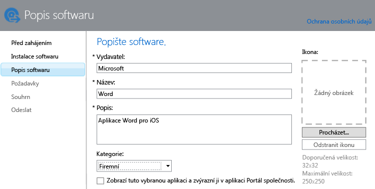

# Přidávání aplikací pro zaregistrovaná zařízení do Intune

Než budete moci aplikaci nasadit nebo spravovat, je třeba přidat ji do Microsoft Intune. V tomto tématu je uveden postup při přidávání aplikací pro zaregistrovaná zařízení.

> [!IMPORTANT]
> Informace uvedené v tomto tématu vám pomůžou při přidávání aplikací, které chcete nasadit, do zaregistrovaných zařízení a zaregistrovaných počítačů s Windows. Pokud chcete přidat aplikace pro počítače s Windows, které spravujete pomocí klientského softwaru Intune, projděte si téma [Přidání aplikací pro počítače s Windows v Microsoft Intune](add-apps-for-windows-pcs-in-microsoft-intune.md).

## Přidání aplikace
Pomocí Vydavatele softwaru Microsoft Intune nakonfigurujete vlastnosti aplikace, a pokud je to potřeba, odešlete ji do svého cloudového úložiště. K tomu slouží tento postup:

1.  V [konzole pro správu Microsoft Intune](https://manage.microsoft.com) vyberte **Aplikace** &gt; **Přidat aplikace**. Spustí se Vydavatel softwaru Intune.

    > [!TIP]
    > Před spuštěním vydavatele softwaru možná budete muset zadat svoje uživatelské jméno a heslo k Intune.

2.  Na stránce **Instalace softwaru** ve Vydavateli softwaru vyberte u položky **Vyberte, jakým způsobem má být tento software zpřístupněn pro zařízení** jednu z těchto možností:
    - **Instalační program softwaru** – u aplikací s příponou **.msi** nebo **.exe** určete tyto možnosti:
        - **Vyberte typ souboru instalačního programu softwaru** – udává typ softwaru, který chcete nasadit. Pokud třeba chcete instalovat aplikaci pro iOS, zvolte **Balíček aplikace pro systém iOS (soubor &#42;.ipa)**.
        - **Zadejte umístění instalačních souborů softwaru** – Zadejte umístění instalačních souborů nebo zvolte **Procházet** a vyberte umístění v seznamu.
        - **Zahrnout další soubory a podsložky ze stejné složky** – jenom v případě typu souboru **Instalační služba systému Windows**. Software, který používá Instalační službu systému Windows, někdy potřebuje podpůrné soubory. Ty se většinou nacházejí ve stejné složce jako instalační soubory. Tuto možnost vyberte, když chcete tyto soubory i nasadit. U tohoto typu instalace se využívá část prostoru cloudového úložiště.

  -   **Externí odkaz** – u aplikací, které chcete vytvořit zadáním odkazu na obchod s aplikacemi, zadejte tyto možnosti:

        - **Zadejte adresu URL** – zadejte některou z těchto adres URL:
            - Adresa URL obchodu s aplikacemi obsahujícího aplikaci, kterou chcete nasadit. Pokud třeba chcete nasadit aplikaci Vzdálená plocha od Microsoftu pro Android, zadejte **https://play.google.com/store/apps/details?id=com.microsoft.rdc.android**. Pokud chcete vyhledat adresu URL aplikace, pomocí vyhledávacího webu najděte stránku obchodu obsahující aplikaci. Pokud budete chtít najít třeba aplikaci Vzdálená plocha, můžete vyhledat výraz **Microsoft Vzdálená plocha Android**.
            - Adresa webové stránky. Intune nasadí na zařízení ikonu zástupce odkazující na daný web.
            - Aplikace na webu. Intune nasadí na zařízení ikonu zástupce odkazující na danou aplikaci.
        - **K otevření tohoto odkazu se vyžaduje spravovaný prohlížeč (jenom Android a iOS)** – když nasadíte pro uživatele odkaz na webovou stránku nebo webovou aplikaci, budou ji moct otevřít jenom ve spravovaném prohlížeči Intune, který musí mít nainstalovaný na svém zařízení. Další podrobnosti o spravovaném prohlížeči najdete v tématu [Správa přístupu k internetu pomocí zásad spravovaného prohlížeče v Microsoft Intune](manage-internet-access-using-managed-browser-policies.md). U tohoto typu instalace se nepoužívá žádný prostor cloudového úložiště.

  -   **Spravovaná aplikace pro iOS z App Storu** – u bezplatných aplikací z obchodu iTunes, které chcete spravovat pomocí zásad MAM, zadejte tyto položky:

        - **Zadejte adresu URL** – zadejte adresu URL obchodu s aplikacemi obsahujícího aplikaci, kterou chcete nasadit. Pokud třeba chcete nasadit aplikaci Pracovní složky pro iOS od Microsoftu, zadejte adresu **https://itunes.apple.com/us/app/work-folders/id950878067?mt=8**. U tohoto typu instalace se nepoužívá žádný prostor cloudového úložiště.

        Pokud třeba chcete nasadit na zařízení aplikaci Microsoft Word z obchodu iTunes, stránka bude vypadat takto:
        
        

3.  Na stránce **Popis softwaru** nakonfigurujte následující nastavení:

    > [!TIP]
    > Některé hodnoty můžou být vyplněné automaticky v závislosti na používaném typu instalačního programu.

    - **Vydavatel** – zadejte název vydavatele aplikace.
    - **Název** – zadejte název aplikace, který se zobrazí na portálu společnosti. Ověřte, že názvy všech aplikací jsou jedinečné. Pokud stejný název aplikace existuje dvakrát, zobrazí se na portálu společnosti uživatelům jenom jedna z aplikací.
    - **Popis** – zadejte popis aplikace. Zobrazí se uživatelům na portálu společnosti.
    - **Adresa URL informací o softwaru** – dostupné jenom v případě, že jste vybrali **Instalační program softwaru**. Volitelně můžete zadat adresu URL webu, který obsahuje informace o této aplikaci. Adresa URL se zobrazí uživatelům na portálu společnosti.
    - **Adresa URL zásad ochrany osobních údajů** – dostupné jenom v případě, že jste vybrali **Instalační program softwaru**. Volitelně můžete zadat adresu URL webu, který obsahuje informace o ochraně osobních údajů v této aplikaci. Adresa URL se zobrazí uživatelům na portálu společnosti.
    - **Kategorie** – (volitelné) vyberte některou z kategorií integrovaných v aplikaci. Uživatelé ji budou moct při procházení portálu snáz najít.
    - **Zobrazí tuto vybranou aplikaci a zvýrazní ji v aplikaci Portál společnosti** – aplikace se bude zřetelně zobrazovat na hlavní stránce portálu společnosti, když uživatelé vyhledávají aplikace.
    - **Ikona** – (volitelné) odešlete ikonu, která bude k aplikaci přidružená. Tato ikona se u aplikace zobrazí, když uživatelé procházejí portál společnosti.

        V tomto příkladu jste nakonfigurovali popis aplikace Microsoft Word pro iOS:

        

4.  Na stránce **Požadavky** vyberte požadavky, které je potřeba splnit, aby bylo možné aplikaci na zařízení nainstalovat. Například pro balíček aplikace pro iOS můžete vybrat minimální požadovanou verzi iOS a požadovaný typ zařízení, jako je iPhone nebo iPad.

    > [!TIP]
    > Stránka **Požadavky** se nezobrazuje u všech typů aplikací.

5.  Další stránky průvodce se zobrazí, pokud zvolíte typ souboru **Instalační služba systému Windows**. Tento typ souboru se používá, když nasazujete software do počítačů s Windows 10 nebo novějším systémem, které jsou zaregistrované v Intune.

6.  Na stránce **Shrnutí** zkontrolujte zadané informace. Až budete připravení, zvolte **Odeslat**.

7.  Postup dokončíte výběrem možnosti **Zavřít**.

Aplikace se zobrazí v uzlu **Aplikace** v pracovním prostoru **Aplikace**.

## Příklady

### Nasazení aplikací MSI v zařízeních s Windows 10
V tomto čtyřminutovém videu získáte informace o postupu při nasazování aplikací Microsoft Installer (msi) v zaregistrovaných zařízeních s Windows 10.  

<iframe src="https://channel9.msdn.com/Series/How-to-Control-the-Uncontrolled/6--How-to-Deploy-MSI-Applications-to-Windows-10-Using-Intune-and-Mobile-Device-Management-MDM/player" width="640" height="360" allowFullScreen frameBorder="0"></iframe>

## Další kroky

Dalším krokem po vytvoření aplikace je její nasazení. Další informace najdete v tématu [Nasazení aplikací v Microsoft Intune](deploy-apps.md)

<!--HONumber=Jun16_HO4-->

