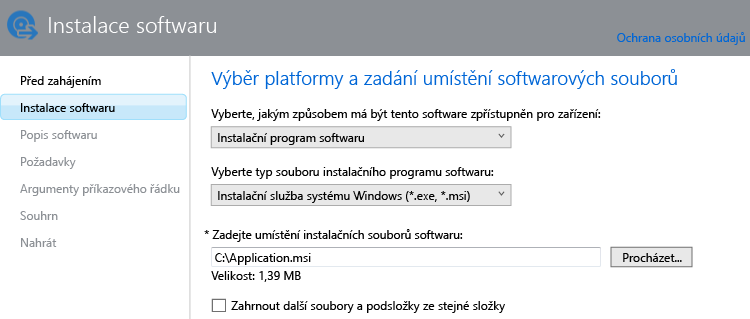

---
# required metadata

title: Přidání aplikací do počítačů s Windows | Microsoft Intune
description:
keywords:
author: robstackmsft
manager: jeffgilb
ms.date: 04/28/2016
ms.topic: article
ms.prod:
ms.service: microsoft-intune
ms.technology:
ms.assetid: bc8c8be9-7f4f-4891-9224-55fc40703f0b

# optional metadata

#ROBOTS:
#audience:
#ms.devlang:
ms.reviewer: owenyen
ms.suite: ems
#ms.tgt_pltfrm:
#ms.custom:

---

# Přidání aplikací do počítačů s Windows v Microsoft Intune

V tomto tématu se dozvíte, jak přidat do Intune aplikace před tím, než je nasadíte.

> [!IMPORTANT]
> Informace v tomto tématu vám pomůžou přidat aplikace do počítačů s Windows, které spravujete pomocí klientského počítačového softwaru Intune. Pokud chcete aplikace přidávat do zaregistrovaných počítačů s Windows nebo do jiných mobilních zařízení, přečtěte si téma [Přidání aplikací pro mobilní zařízení v Microsoft Intune](add-apps-for-mobile-devices-in-microsoft-intune.md).

## Přidání aplikace
Pomocí Vydavatele softwaru Microsoft Intune nakonfigurujete vlastnosti aplikace a odešlete ji do svého cloudového úložiště. K tomu slouží tento postup:

1.  V [konzole pro správu Microsoft Intune](https://manage.microsoft.com) vyberte **Aplikace** &gt; **Přidat aplikace**. Spustí se Vydavatel softwaru Intune.

    > [!TIP] Před spuštěním vydavatele softwaru možná budete muset zadat svoje uživatelské jméno a heslo k Intune.

2.  Ve vydavateli softwaru nakonfigurujte na stránce **Instalace softwaru** následující údaje:

    **Vyberte, jakým způsobem má být tento software zpřístupněn pro zařízení** – Vyberte **Instalační program softwaru** a potom zadejte:

    - **Vyberte typ souboru instalačního programu softwaru** – udává typ softwaru, který chcete nasadit. U počítačů s Windows zvolte **Instalační služba systému Windows**.
    - **Zadejte umístění instalačních souborů softwaru** – Zadejte umístění instalačních souborů nebo zvolte **Procházet** a vyberte umístění v seznamu.
    - **Zahrnout další soubory a podsložky ze stejné složky** – Software, který používá Instalační službu systému Windows, někdy potřebuje podpůrné soubory. Ty se většinou nacházejí ve stejné složce jako instalační soubory. Tuto možnost vyberte, když chcete nasadit i podpůrné soubory.

    Pokud třeba chcete publikovat aplikaci s názvem Application.msi do Intune, stránka bude vypadat takto: 

   U tohoto typu instalace se využívá část prostoru cloudového úložiště.

3.  Na stránce **Popis softwaru** nakonfigurujte následující nastavení:

    Některé hodnoty můžou být vyplněné automaticky nebo se nemusí zobrazit. Záleží na používaném instalačním souboru.

    - **Vydavatel** – zadejte název vydavatele aplikace.
    - **Název** – Zadejte název aplikace, který se zobrazí na portálu společnosti.  Ověřte, že názvy všech aplikací jsou jedinečné. Pokud stejný název aplikace existuje dvakrát, zobrazí se na portálu společnosti uživatelům jenom jedna z aplikací.
    - **Popis** – zadejte popis aplikace. Zobrazí se uživatelům na portálu společnosti.
    - **Adresa URL informací o softwaru** (volitelné) – Zadejte adresu URL webu, který obsahuje informace o této aplikaci. Adresa URL se zobrazí uživatelům na portálu společnosti.
    - **Adresa URL zásad ochrany osobních údajů** (volitelné) – Zadejte adresu URL webu, který obsahuje informace o ochraně osobních údajů v této aplikaci. Adresa URL se zobrazí uživatelům na portálu společnosti.
    - **Kategorie** (volitelné) – Vyberte některou z kategorií integrovaných v aplikaci. Uživatelé ji budou moct při procházení portálu snáz najít.
    - **Ikona** – (volitelné) odešlete ikonu, která bude k aplikaci přidružená. Tato ikona se u aplikace zobrazí, když uživatelé procházejí portál společnosti.

4.  Na stránce **Požadavky** vyberte požadavky, které je potřeba splnit, aby bylo možné aplikaci do zařízení nainstalovat. Vyberte z možností: **Architektura** – Vyberte, do jakých systémů je možné aplikaci instalovat: 32bitové, 64bitové, nebo obojí. **Operační systém** – Vyberte minimální verzi operačního systému, který umožňuje aplikaci nainstalovat.

5.  Na stránce **Pravidla detekce** můžete nakonfigurovat pravidla, která zjistí, jestli už je konfigurovaná aplikace na počítači nainstalovaná. Nebo můžete použít výchozí pravidla detekce k automatickému přepsání dříve nainstalovaných verzí aplikace. Tato možnost se týká Instalační služby systému Windows (jenom soubory .exe).
6.  
    Jaká pravidla můžete konfigurovat:
    - **Soubor existuje** – Zadejte cestu k souboru, který chcete zjistit. Můžete hledat ve složce **%ProgramFiles%** (prohledá složku **Program Files**\*&lt;cesta&gt;* a **Program Files (x86)**\*&lt;cesta&gt;*) na počítači nebo ve složce **%SystemDrive%** (prohledá kořenovou jednotku počítače, většinou je to jednotka C:).
    - **Kód produktu MSI existuje** – Pokud chcete vybrat soubor Instalační služby systému Windows (msi), který chcete detekovat, vyberte **Procházet**. 
    - **Klíč registru existuje** – Zadejte klíč registru, který začíná **HKEY_LOCAL_MACHINE\**. Prohledají se 32bitové i 64bitové cesty registru. Pokud zadaný klíč v některém umístění existuje, pravidlo detekce je splněné.

    Pokud aplikace odpovídá některému z nakonfigurovaných pravidel, nebude se instalovat.

7.  Platí jen pro typ souboru **Instalační služba systému Windows** (msi a exe): Na stránce **Argumenty příkazového řádku** můžete vybrat, jestli chcete instalačnímu programu poskytnout volitelné argumenty příkazového řádku. Některé instalační programy můžou například podporovat argument **/q** pro tichou instalaci bez zásahu uživatele.

8.  Platí jen pro typ souboru **Instalační služba systému Windows** (jenom exe): Na stránce **Návratové kódy** můžete přidat nové chybové kódy, které Intune dokáže interpretovat při instalaci aplikace na spravovaný počítač s Windows.
    Ve výchozím nastavení Intune používá standardní návratové kódy, kterými oznamuje úspěch nebo selhání instalace balíčku aplikace: **0** – úspěch nebo **3010** – úspěch s restartem. Do seznamu taky můžete přidat vlastní návratové kódy. Pokud zadáte seznam návratových kódů a instalace aplikace vrátí kód, který v seznamu není, interpretuje se to jako selhání instalace.

9.  Na stránce **Shrnutí** zkontrolujte zadané informace. Až budete připravení, zvolte **Odeslat**.

10. Postup dokončíte výběrem možnosti **Zavřít**.

Aplikace se zobrazí v uzlu **Aplikace** v pracovním prostoru **Aplikace**.

## Další kroky

Dalším krokem po vytvoření aplikace je její nasazení. Další informace najdete v tématu [Nasazení aplikací v Microsoft Intune](deploy-apps.md)

<!--HONumber=Jun16_HO2-->

