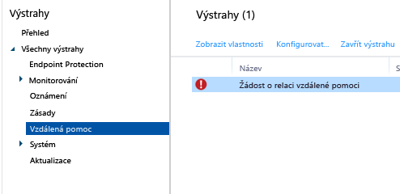

# Běžné úlohy správy počítačů s Windows pomocí počítačového klienta Microsoft Intune
Když si přečtete informace uvedené v tomto tématu, dozvíte se, jak spravovat počítače, na kterých běží software počítačového klienta Intune. Pokud jste ještě na svých počítačích klienta nenainstalovali, přečtěte si téma [Instalace klienta na počítači s Windows pomocí Microsoft Intune](install-the-windows-pc-client-with-microsoft-intune.md).

## Použití zásad ke zjednodušení správy počítačů
### Správa brány Windows Firewall
Zásady zjednodušují správu nastavení brány Windows Firewall na spravovaných počítačích. Podrobné informace najdete v tématu [Pomoc při ochraně počítačů s Windows pomocí zásad brány Windows Firewall v Microsoft Intune](help-protect-windows-pcs-using-windows-firewall-policies-in-microsoft-intune.md).

### Správa centra Microsoft Intune Center
Microsoft Intune Center uživatelům umožňuje:

-   Získávat aplikace z portálu společnosti

-   Kontrolovat aktualizace

-   Spravovat Microsoft Intune Endpoint Protection

-  Žádat o vzdálenou pomoc

Microsoft Intune Center se nainstaluje na všech spravovaných počítačích. V zásadách Intune můžete nakonfigurovat následující nastavení, která se uživatelům zobrazí v centru Microsoft Intune Center:

|Nastavení zásad|Podrobnosti|
|------------------|--------------------|
|**Název**|Jméno správce, který spravuje příslušný počítač  Maximální délka: 40 znaků|
|**Telefonní číslo**|Telefonní číslo správce, který spravuje příslušný počítač  Maximální délka: 20 znaků|
|**E-mailová adresa**|Emailová adresa správce, který spravuje příslušný počítač  Maximální délka: 40 znaků|
|**Název webu**|Název vašeho webu pro podporu uživatelů  Maximální délka: 40 znaků|
|**Adresa URL webu**|Adresa URL vašeho webu podpory  Maximální délka: 150 znaků|
|**Poznámky**|Poznámka, která se zobrazuje uživatelům  Maximální délka: 120 znaků|

### Správa nastavení aktualizací softwaru
Pomocí zásad můžete nakonfigurovat nastavení, která budou spravované počítače používat k hledání a stahování aktualizací softwaru od Microsoftu i jiných výrobců. Další informace najdete v tématu [Udržování počítačů s Windows v aktuálním stavu díky softwarovým aktualizacím v Microsoft Intune](keep-windows-pcs-up-to-date-with-software-updates-in-microsoft-intune.md).

### Správa nastavení služby Endpoint Protection
Pomocí zásad můžete nakonfigurovat nastavení pro službu Endpoint Protection a potom je můžete nasadit na spravované počítače. Můžou to být třeba plány kontrol, akce, které se mají udělat v případě detekce malwaru, a další věci. Další informace najdete v tématu [Pomoc se zabezpečením počítačů s Windows pomocí služby Endpoint Protection pro Microsoft Intune](help-secure-windows-pcs-with-endpoint-protection-for-microsoft-intune.md).

## Zobrazení inventáře hardwaru a softwaru
Intune shromažďuje podrobné informace o hardwaru a softwaru spravovaných počítačů. V následujících postupech se dozvíte toto:

-   Jak vytvořit sestavu s informacemi o hardwarových možnostech vašich počítačů

-   Jak vytvořit sestavu se seznamem softwaru nainstalovaného na jednotlivých počítačích

-   Jak aktualizovat inventář počítačů, abyste měli jistotu, že jsou data v sestavě aktuální

### Zobrazení informací o počítačích

1.  V [konzole pro správu Microsoft Intune](https://manage.microsoft.com/) klikněte na **Sestavy** &gt; **Sestavy inventáře počítače**.

2.  Na stránce **Vytvořit novou sestavu** přijměte výchozí hodnoty, případně je upravte, aby se vyfiltrovaly výsledky, které bude sestava obsahovat. Můžete třeba vybrat, aby se v sestavě zobrazily jenom počítače, na kterých běží Windows 8.1.

3.  Kliknutím na **Zobrazit sestavu** otevřete **sestavu inventáře počítače** v novém okně.

    Když vyberete záhlaví příslušných sloupců, jako je třeba **Název**, **Typ skříně** nebo **Výrobce**, můžete sestavu podle těchto sloupců seřadit.

### Zobrazení softwaru nainstalovaného na počítačích

1.  V [konzole pro správu Microsoft Intune](https://manage.microsoft.com/) zvolte **Sestavy** &gt; **Zjištěné zprávy o softwaru**.

2.  Na stránce **Vytvořit novou sestavu** přijměte výchozí hodnoty, případně je upravte, aby se vyfiltrovaly výsledky, které bude sestava obsahovat. Můžete třeba vybrat, aby se v sestavě zobrazil jenom software publikovaný Microsoftem.

3.  Zvolte **Zobrazit sestavu**. **Sestav rozpoznaného softwaru** se otevře v novém okně.

    Když vyberete záhlaví příslušných sloupců, jako je třeba **Název**, **Vydavatel** nebo **Kategorie** , můžete sestavu podle těchto sloupců seřadit. Zvolením směrové šipky vedle položky seznamu můžete aktualizace v seznamu rozbalit a zobrazit tak další podrobnosti (třeba počítače, na kterých jsou nainstalované).

### Aktualizace inventáře počítače, abyste měli jistotu, že je aktuální

1.  V [konzole pro správu Microsoft Intune](https://manage.microsoft.com/) zvolte **Skupiny** &gt; **Všechna zařízení** (nebo na jinou skupinu obsahující počítač, pro který chcete inventář aktualizovat).

2.  Vyberte počítač. Nebo když stisknete a podržíte **Ctrl** , můžete vybrat víc počítačů.

3.  Na hlavním panelu zvolte **Vzdálené úlohy** &gt; **Obnovit inventář**.

4.  Pokud chcete zobrazit stav úlohy, v pravém dolním rohu stránky zvolte **Vzdálené úlohy**.

    V dialogovém okně **Stav úlohy** se zobrazí aktuální vzdálené úlohy, stav úloh, název zařízení, všechny hlášené chyby a odkaz na informace o odstraňování problémů.

## Vzdálené restartování počítače s Windows

1.  V [konzole pro správu Microsoft Intune](https://manage.microsoft.com/) zvolte **Skupiny** &gt; **Všechna zařízení** (nebo na jinou skupinu obsahující počítač, který chcete restartovat).

2.  Vyberte jeden nebo víc počítačů a potom zvolte **Vzdálené úlohy** &gt; **Restartovat počítač**.

3.  Pokud chcete zobrazit stav úlohy, v pravém dolním rohu stránky zvolte **Vzdálené úlohy**.

4.  V dialogovém okně **Stav úlohy** se můžete podívat na aktuální vzdálené úlohy, stav úloh, název zařízení a všechny hlášené chyby.

## Vyřazení počítače

1.  V [konzole pro správu Microsoft Intune](https://manage.microsoft.com/) zvolte **Skupiny** &gt; **Všechna zařízení** (nebo na jinou skupinu obsahující počítač, který chcete vyřadit).

2.  Vyberte zařízení, která chcete vyřadit, a potom zvolte **Vyřadit z provozu či vymazat**.

Když budete chtít počítač do služby Intune znovu zaregistrovat, přeinstalujte na počítači klientský software, a to podle informací uvedených v tématu [Instalace klienta na počítači s Windows pomocí Microsoft Intune](install-the-windows-pc-client-with-microsoft-intune.md).

Když se nějaký počítač nemůže k Intune připojit, v pracovním prostoru **Řídicí panel** se zobrazí zpráva.

Při vyřazení počítače s stane toto:

-   Počítač se odebere z inventáře Intune a licence, které jsou k němu přiřazené, se uvolní pro nové použití.

-   Jeho stav se už nebude zobrazovat v konzole Intune.

-   Intune odebere z počítače klientský software. Pokud počítač není ke službě Intune připojený, klientský software se odebere, až se počítač zase připojí.

-   Z počítače se odebere Microsoft Intune Endpoint Protection. Pokud je na počítači nainstalovaná jiná aplikace ochrany koncových bodů a je zakázaná, může se tato aplikace po odebrání služby Intune zase povolit, aby se zajistila ochrana vašich počítačů.

-   Z počítače se odeberou všechny zásady a změní se hodnoty nastavené těmito zásadami.

-   Počítač už nebude od služby Intune dostávat aktualizace softwaru ani aktualizace definic malwaru.

-   Podle toho, jak jsou vyřazené počítače nakonfigurované, můžou dál dostávat aktualizace pomocí služeb Windows Server Update Services, Windows Update nebo Microsoft Update.

    > [!IMPORTANT]
    > Když byl klientský software nainstalován pomocí objektu zásad skupiny, musíte tento objekt před odebráním klientského softwaru odebrat, abyste zabránili přeinstalaci softwaru.

    Pokud se odinstalace klienta nepovede, najdete další pomoc v tématu [Řešení potíží se službou Endpoint Protection](/intune/troubleshoot/troubleshoot-endpoint-protection-in-microsoft-intune).

## Správa propojení zařízení s uživatelem
Abyste mohli nasadit software pro uživatele, musíte uživatele propojit s počítačem. Uživatele můžete propojit s několika počítači, ale každý počítač může být propojený jenom s jedním uživatelem. Uživatelé jsou automaticky propojení se všemi počítači, které si přes portál společnosti zaregistrovali v Intune.

### Propojení uživatele s počítačem

1.  V [konzole pro správu Microsoft Intune](https://manage.microsoft.com/) zvolte **Skupiny** &gt; **Všechna zařízení** (nebo na jinou skupinu obsahující počítač, který chcete propojit s uživatelem).

2.  Vyberte počítač, který chcete propojit s uživatelem, a potom zvolte **Propojit uživatele**.

    V dialogovém okně **Propojit uživatele** se zobrazí seznam dostupných uživatelů včetně jejich zobrazovaného jména, ID a počtu počítačů, se kterými jsou aktuálně propojení. Pokud je s vybraným počítačem už nějaký uživatel propojený, je v části **Aktuální uživatel**zobrazené jeho jméno a ID. Když počítač není propojený s žádným uživatelem, tak se v části **Aktuální uživatel** zobrazuje **Žádný uživatel**.

3.  Udělejte jednu z těchto věcí:

    -   Pokud chcete nechat počítač propojený s aktuálním uživatelem, klikněte na **Zrušit**.

    -   Pokud chcete propojení s aktuálním uživatelem odebrat, zvolte **Odebrat odkaz **&gt; **OK**.

    -   Pokud chcete propojit počítač s novým uživatelem, vyberte uživatele v seznamu **Všichni uživatelé** . Potvrďte správnost údajů o uživateli a potom zvolte **OK**.

> [!TIP]
> Když chcete koncovým uživatelům omezit schopnosti propojení vlastních účtů s počítači, povolte možnost **Omezit schopnosti uživatelů propojit s počítači vlastní účet** v zásadách **Nastavení agenta Microsoft Intune**.

## Vyžádání a poskytnutí vzdálené pomoci počítačům s Windows, které využívají klientský software Intune

Microsoft Intune může využívat software [TeamViewer](https://www.teamviewer.com), který umožní uživatelům počítačů s klientským softwarem Intune, aby od vás získali vzdálenou pomoc. Když si uživatel vyžádá pomoc od centra Microsoft Intune Center, budete o tom informováni prostřednictvím výstrahy. Můžete tuto žádost přijmout a potom poskytnout pomoc.
Tato funkce nahrazuje stávající funkci Vzdálená pomoc pro Windows v Intune.

### Než začnete

Než začnete reagovat na požadavky na vzdálenou pomoc, je nutné zajistit splnění těchto požadavků:

- Musíte mít [zaregistrovaný účet TeamViewer](https://login.teamviewer.com/LogOn#register) pro přihlášení k webu TeamViewer.
- Počítač s Windows, které chcete spravovat, musí být [spravovaný prostřednictvím klienta na počítači s Windows](manage-windows-pcs-with-microsoft-intune.md).
- Spravovat je možné všechny operační systémy Windows pro počítače, které Intune podporuje.

### Konfigurace Konektoru pro TeamViewer

1. V [konzole pro správu Microsoft Intune](https://manage.microsoft.com) zvolte **Správce**.
2. V pracovním prostoru **Správa** zvolte **TeamViewer**.
3. Na stránce **TeamViewer** vyberte v části **Konektor pro TeamViewer** možnost **Povolit**.
4. V dialogovém okně **Povolit TeamViewer** si přečtěte licenční podmínky a potom je **přijměte**. Pokud ještě nemáte licenci TeamVieweru, zvolte **Koupit licenci na TeamViewer**.
5. Když se otevře okno prohlížeče TeamViewer, přihlaste se k tomuto webu pomocí svých přihlašovacích údajů pro TeamViewer.
6. Na webu TeamVieweru si přečtěte a potom přijměte možnosti, které službě Intune umožňují připojit se k TeamVieweru.
7. V konzole Intune ověřte, že se položka **Konektor pro TeamViewer** zobrazuje jako **povolená**.

### Otevření žádosti o vzdálenou pomoc (koncový uživatel)

1. Na klientském počítači s Windows otevřete **Microsoft Intune Center**.
2. V části **Vzdálená pomoc** zvolte **Požádat o vzdálenou pomoc**.
3. Jakmile žádost schválíte (viz níže), na klientovi se otevře TeamViewer. Uživatel musí přijmout všechny zprávy informující o tom, že se webový prohlížeč pokouší otevřít aplikaci TeamViewer.
4. Uživateli se zobrazí zpráva s dotazem, jestli můžete převzít kontrolu nad jeho počítačem. Tuto zprávu musí přijmout, aby bylo možné pokračovat.
5. Během relace vzdálené pomoci se uživateli zobrazí okno, které ukazuje, že jste připojeni. Pokud toto okno zavře, vzdálená relace se ukončí.

### Odpověď na žádost o vzdálenou pomoc

1. Když uživatel odešle žádost o vzdálenou pomoc, můžete ji zobrazit v pracovním prostoru **Výstrahy** v části **Monitorování** > **Vzdálená pomoc**. Například:
> 

 Pokud žádost zůstane nezodpovězená víc než 4 hodiny, odebere se.
2. Pokud chcete žádost přijmout, zvolte **Schválit požadavek a spustit vzdálenou pomoc**.
3. V dialogovém okně **Nová žádost o vzdálenou pomoc čeká na vyřízení** zvolte **Žádost o vzdálenou pomoc přijměte**. TeamViewer nainstaluje na váš počítač všechny nezbytné aplikace, pokud ještě nejsou nainstalované.
4. TeamViewer potom upozorní koncového uživatele, že chcete převzít kontrolu nad jeho počítačem. Když uživatel tuto žádost přijme, otevře se okno TeamViewer a máte kontrolu nad jeho počítačem.

Během relace vzdálené pomoci můžete k řízení vzdáleného počítače využívat všechny dostupné příkazy TeamVieweru. Pokud s těmito příkazy potřebujete pomoci, stáhněte si [příručku pro vzdálené řízení](http://www.teamviewer.com/en/support/documents/) z webu TeamVieweru.

### Zavření relace vzdálené pomoci

V nabídce **Akce** v okně **TeamViewer** zvolte **Ukončit relaci**.

<!--HONumber=Aug16_HO1-->

