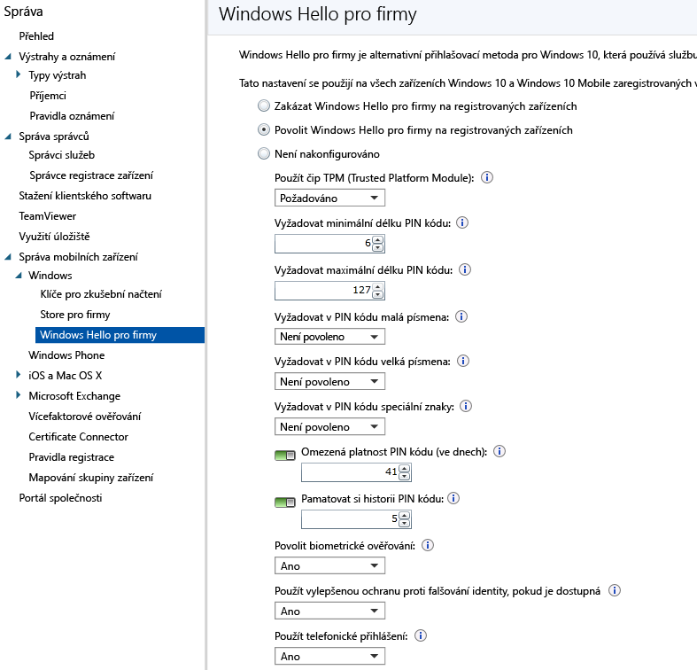

# Kontrola nastavení Microsoft Passportu v zařízeních s Microsoft Intune
Microsoft Intune umožňuje integraci se službou **Microsoft Passport for Work**. Je to alternativní metoda pro přihlašování pomocí účtu služby Active Directory nebo Azure Active Directory, která může nahradit hesla, čipové karty a virtuální čipové karty.

Služba Passport umožňuje používat k přihlášení **gesto uživatele** místo hesla. Gesto uživatele může být jednoduchý PIN kód, biometrické ověřování jako třeba Windows Hello nebo externí zařízení, jako je třeba čtečka otisků prstů.

>[!TIP]
>Microsoft Passport pro Work teď znáte jako Windows Hello pro firmy. Konzola Intune se v budoucí aktualizaci upraví tak, aby odrážela tuto změnu.

Intune se integruje se službou Passport for Work dvěma způsoby:

-   Můžete pomocí zásady Intune řídit, která gesta uživatel může nebo nemůže používat k přihlášení.

-   Můžete uložit ověřovací certifikáty ve zprostředkovateli úložiště klíčů (KSP) služby Passport for Work. Další informace najdete v tématu [Zabezpečení přístupu k prostředkům pomocí profilů certifikátů v Microsoft Intune](secure-resource-access-with-certificate-profiles.md).

## Vytvoření zásady služby Passport for Work

1.  V [konzole pro správu Microsoft Intune](https://manage.microsoft.com) klikněte na **Správa** &gt; **Správa mobilních zařízení** &gt; **Windows** &gt; **Passport for Work**. Otevře se stránka Passport for Work jako na obrázku níž.

    

2.  Zvolte jedno z těchto nastavení:
    - **Zakázat Passport for Work v zaregistrovaných zařízeních** – Toto nastavení použijte, pokud nechcete Passport for Work použít v zařízeních s Windows 10. Všechna nastavení na obrazovce jsou zakázaná.
    - **Povolit Passport for Work v zaregistrovaných zařízeních** – Toto nastavení použijte, pokud chcete nakonfigurovat nastavení Passport for Work ve všech zařízeních s Windows 10.
    - **Není nakonfigurováno** – Toto nastavení vyberte, pokud pro kontrolu nastavení Passport for Work nechcete použít Intune. Stávající nastavení Passport for Work v zařízeních s Windows 10 se nezmění. Všechna nastavení na obrazovce jsou zakázaná.
3.  Pokud jste vybrali **Povolit Passport for Work v zaregistrovaných zařízeních**, nakonfigurujte požadovaná nastavení, která se použijí pro všechny zaregistrovaná zařízení s Windows 10 a Windows 10 Mobile.
3.  Po dokončení klikněte na **Uložit**.

## Passport for Work: Nastavení kódu PIN

  
- **Vyžadovat minimální délku PIN kódu**/**Vyžadovat maximální délku PIN kódu** – Konfiguruje zařízení, aby k zajištění bezpečného přihlášení vyžadovala minimální a maximální délky kódu PIN. Výchozí délka kódu PIN je 6 znaků, ale můžete vynutit minimální délku 4 znaky. Maximální délka kódu PIN je 127 znaků.
- **Vyžadovat v PIN kódu malá písmena**/**Vyžadovat v PIN kódu velká písmena**/**Vyžadovat v PIN kódu speciální znaky** – Kromě toho můžete vynutit silnější kódy PIN tím, že se v nich bude vyžadovat použití velkých a malých písmen a speciálních znaků. Vybírejte z těchto možností:
    - **Povolené** – Uživatelé můžou tyto typy znaků ve svých kódech PIN použít, ale není to povinné.
    - **Požadované** – Uživatelé musí ve svém kódu PIN použít aspoň jeden z těchto typů znaků. Běžnou praxí třeba je vyžadovat použití nejméně jednoho velkého písmena, jednoho malého písmena a je noho speciálního znaku.
    - **Není povolené** (výchozí) – Uživatelé nesmí tyto typy znaků ve svém kódu PIN používat (toto chování se taky použije, když toto nastavení není nakonfigurované).
    > [!TIP]
    > Mezi speciální znaky patří: **! " # $ % &amp; ' ( ) &#42; + , - . / : ; &lt; = &gt; ? @ [ \ ] ^ _ &#96; { &#124; } ~**.
- **Doba platnosti kódu PIN (dny)** – Je dobrým zvykem zadat pro kód PIN dobu platnosti, po jejímž uplynutí ho koncový uživatel musí změnit. Výchozí hodnota je 41 dnů. 
- **Pamatovat si historii kódů PIN** – Pomocí tohoto nastavení můžete zabránit opakovanému použití předchozích kódů PIN. Ve výchozím nastavení se nesmí znovu použít posledních 5 kódů PIN.

## Passport for Work: Další nastavení

- **Použít čip TPM (Trusted Platform Module)** – Čip TPM (Trusted Platform Module) poskytuje další úroveň zabezpečení dat. Vyberte jednu z těchto hodnot:
    - **Požadované** (výchozí) – Passport for Work můžou zřídit jenom zařízení s přístupným čipem TPM.
    - **Preferované** – Zařízení se nejdřív pokusí použít čip TPM. Pokud není dostupný, můžou použít softwarové šifrování.
- **Povolit biometrické ověřování** – Jako alternativu ke kódu PIN pro Passport for Work umožňuje biometrické ověřování, jako je rozpoznávání obličeje nebo otisky prstů. Uživatelé ale stejně musí nakonfigurovat pracovní PIN kód pro případ, že se biometrické ověření nepovede. Vybírejte z těchto možností:
    - **Ano** – Passport for Work povoluje biometrické ověřování.
    - **Ne** – Passport for Work neumožňuje biometrické ověřování (pro všechny typy účtů).
- **Použít vylepšenou ochranu proti falšování identity, pokud je dostupná** – Konfiguruje, jestli se v zařízení použijí funkce ochrany proti falšování identity Windows Hello, pokud je zařízení podporuje (třeba rozpoznání fotografie tváře místo skutečné tváře). Pokud je nastavená hodnota **Ano**, Windows vyžaduje, aby všichni uživatelé používali pro funkce rozpoznávání obličeje ochranu proti falšování, pokud je podporovaná.
- **Používat vzdálený Passport** – Pokud je tato možnost nastavená na **Ano**, uživatelé můžou použít vzdálený Passport, který bude sloužit jako doprovodné přenosné zařízení pro ověřování stolního počítače. Stolní počítač musí být připojený ke službě Azure Active Directory a v doprovodném zařízení musí být nakonfigurovaný PIN kód služby Passport for Work.

## Další informace
Další informace o službě Microsoft Passport najdete v [příručce](https://technet.microsoft.com/library/mt589441.aspx) v dokumentaci k Windows 10.

<!--HONumber=Jul16_HO4-->

