---
# required metadata

title: Vytvoření a nasazení zásad MAM | Microsoft Intune
description:
keywords:
author: karthikaraman
manager: jeffgilb
ms.date: 04/28/2016
ms.topic: article
ms.prod:
ms.service: microsoft-intune
ms.technology:
ms.assetid: c1b9a343-1737-4a65-a9c6-aca48acad11c

# optional metadata

#ROBOTS:
#audience:
#ms.devlang:
ms.reviewer: joglocke
ms.suite: ems
#ms.tgt_pltfrm:
#ms.custom:

---

# Vytvoření a nasazení zásad správy mobilních aplikací pomocí Microsoft Intune
Na aplikace běžící na zařízení, které můžou nebo nemusí být spravovaná přes Intune, je možné aplikovat zásady správy mobilních aplikací (MAM). Podrobnější popis toho, jak zásady MAM fungují, a scénáře podporované zásadami MAM služby Intune najdete v tématu věnovaném [ochraně dat aplikací pomocí zásad správy mobilních aplikací](protect-app-data-using-mobile-app-management-policies-with-microsoft-intune.md).

Toto téma popisuje proces vytváření zásad MAM na **Portálu Azure**. Portál Azure je nová konzola pro správu, která slouží k vytváření zásad MAM, a doporučujeme tento portál při vytváření zásad MAM používat. Portál Azure podporuje následující scénáře MAM:
- Zařízení zaregistrovaná v Intune
- Zařízení spravovaná řešením MDM třetí strany
- Zařízení, která nejsou spravována žádným řešením MDM (BYOD).

Pokud teď ke správě svých zařízení používáte **konzolu pro správu Intune**, můžete zásadu MAM podporující aplikace pro zařízení zaregistrovaná v Intune vytvořit pomocí [konzoly pro správu Intune](configure-and-deploy-mobile-application-management-policies-in-the-microsoft-intune-console.md).
>[!IMPORTANT]
> V Konzole správce Intune nemusíte vidět všechna nastavení zásad MAM. Na Portálu Azure najdete novou konzolu pro správu, kterou je možné používat pro vytváření zásad MAM. Pokud vytváříte zásady MAM v konzole pro správu Intune i na portálu Azure, pro aplikace se použije a pro uživatele se nasadí zásada na portálu Azure.

Pokud chcete zobrazit seznam nastavení zásad, která jsou podporována pro platformy Android a iOS, vyberte jednu z následujících možností:

> [!div class="op_single_selector"]
- [Zásady pro iOS](ios-mam-policy-settings.md)
- [Zásady pro Android](android-mam-policy-settings.md)

##  Vytvoření zásady MAM
Před vytvořením zásady MAM si projděte informace o [požadavcích a podpoře](get-ready-to-configure-mobile-app-management-policies-with-microsoft-intune.md).
1.  Kliknutím na **Správa mobilních aplikací Intune &gt; Nastavení** otevřete okno **Nastavení**.

    

    > [!TIP] Pokud portál Azure používáte poprvé, přečtěte si článek [Portál Azure pro zásady Microsoft Intune MAM](azure-portal-for-microsoft-intune-mam-policies.md) a seznamte se s tím, jak portál funguje.

2.  V okně **Nastavení** zvolte **Zásady aplikací**.  Otevře se okno **Zásady aplikací** , kde můžete vytvářet nové zásady a upravovat zásady, které už existují.

    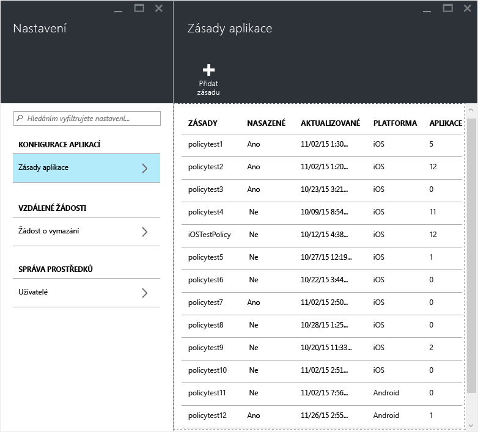

3.  Zvolte **Přidat zásadu**.

    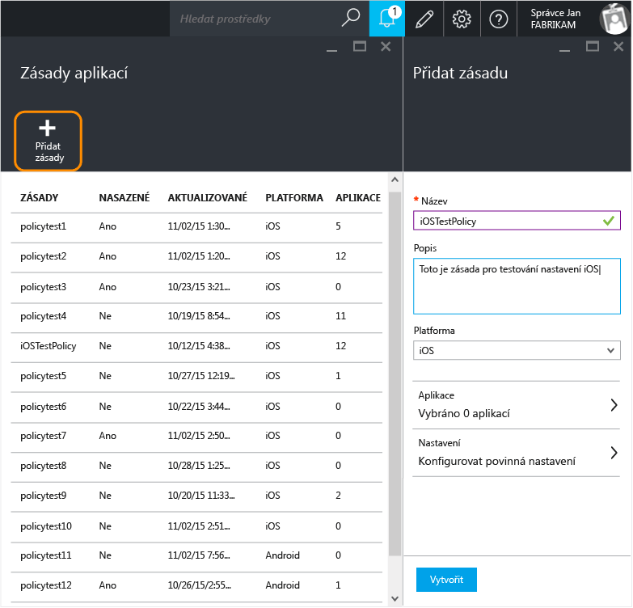

4.  Zadejte název zásady, přidejte stručný popis a vyberte, jestli se má zásada vytvořit pro platformu iOS nebo Android.  Pro každou platformu můžete vytvořit několik zásad.

    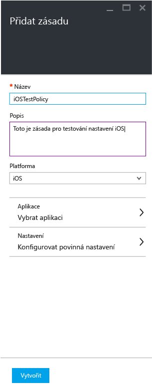

5.  Zvolením možnosti **Aplikace** otevřete **okno Aplikace**, kde se zobrazí seznam dostupných aplikací. Ze seznamu můžete vybrat jednu nebo několik aplikací a přidružit je k zásadě, kterou vytváříte. Jakmile vyberete aplikace, uložte svůj výběr zvolením tlačítka **Vybrat** v dolní části okna **Aplikace**.

    > [!IMPORTANT] Při vytváření zásady musíte vybrat aspoň jednu aplikaci.

6.  V **okně Přidat zásadu** zvolte **Konfigurovat požadované nastavení**. Otevře se okno nastavení zásad.

    Existují dvě kategorie nastavení zásad, **Přemístění dat** a **Přístup**.  Zásady přemístění dat platí pro přesun dat do aplikace a z aplikace, zatímco zásady přístupu určují, jak koncový uživatel přistupuje k aplikaci v pracovním kontextu.
    Nastavením zásad jsou pro začátek přiřazené výchozí hodnoty.  Pokud tyto výchozí hodnoty splňují vaše požadavky, nemusíte nic měnit.

    > [!TIP]
    > Tato nastavení zásad se vynutí jenom při použití aplikace v pracovním kontextu.  Když uživatel použije aplikaci k provedení osobní úlohy, tyto zásady ho neovlivní.

    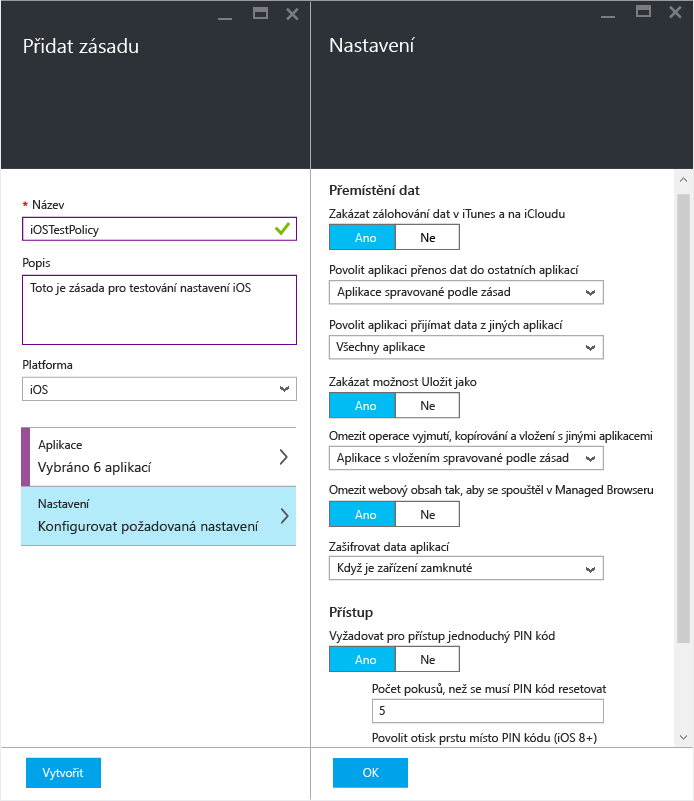

7.  Tuto konfiguraci uložíte zvolením tlačítka **OK**.  A jste zpátky v okně **Přidat zásadu**. Zvolením možnosti **Vytvořit** vytvoříte zásadu a uložíte své nastavení.

    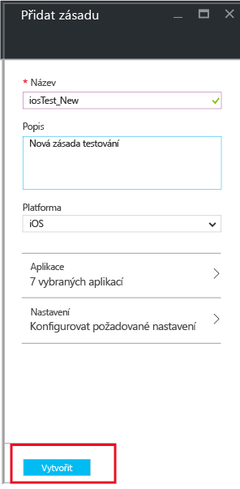

    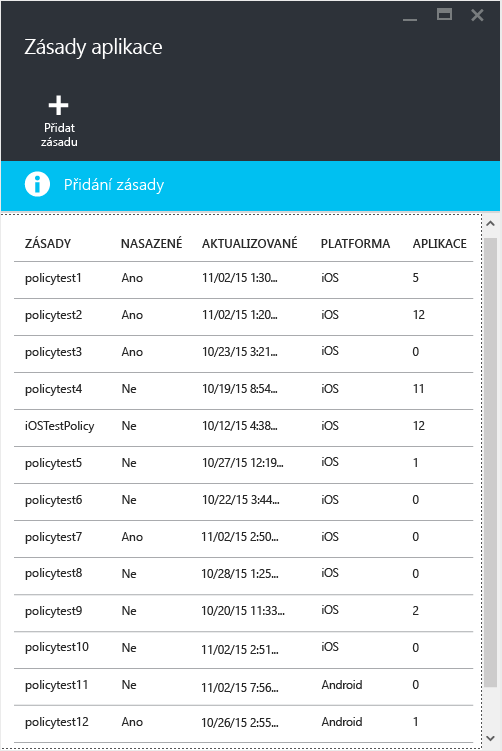

Zásada není po vytvoření pomocí výš uvedeného postupu nasazená pro žádného uživatele.  Pokud ji chcete nasadit, použijte následující postup.

> [!IMPORTANT]
> Pokud jste zásadu správy mobilních aplikací (MAM) vytvořili jak pomocí Konzoly správce Intune, tak pomocí Portálu Azure, dostane přednost zásada vytvořená na Portálu Azure. Při generování sestav v konzole Configuration Manageru nebo Intune se ale použijí nastavení zásad vytvořená na portálu Azure. Například:
>
> -   V konzole správy Intune jste vytvořili zásadu správy mobilních aplikací, která blokuje kopírování z aplikace.
> -   V konzole Azure jste vytvořili zásadu správy mobilních aplikací, která umožňuje kopírování z aplikace.
> -   Obě tyto zásady jste přidružili ke stejné aplikaci.
> -   Výsledkem je, že bude mít přednost zásada vytvořená pomocí konzoly Azure a kopírování bude povolené.
> -   Stav a sestavy v konzole Intune budou ale nesprávně indikovat, že kopírování je blokované.

## Nasazení zásady pro uživatele

1.  V okně **Zásada** zvolte **Skupiny uživatelů**. Otevře se okno **Skupiny uživatelů**. Zvolením možnosti **Přidat skupinu uživatelů** v okně **Skupiny uživatelů** otevřete okno **Přidat skupinu uživatelů**.

    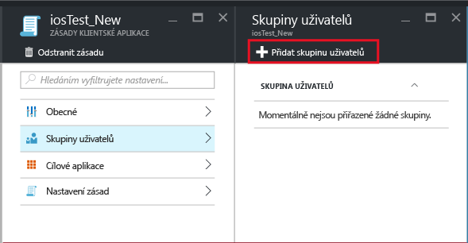

2.  V okně **Přidat skupinu uživatelů** se zobrazí seznam skupin uživatelů. Je to seznam všech skupin zabezpečení v **Azure Active Directory**.  Můžete vybrat skupiny uživatelů, pro které chcete tuto zásadu použít, a pak zvolit **Vybrat**. Zvolením možnosti **Vybrat** nasadíte tuto zásadu uživatelům.

    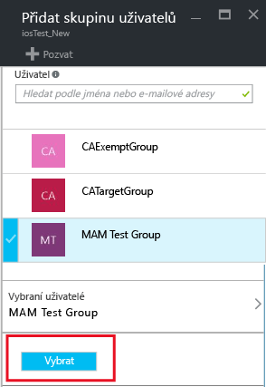

    Teď je zásada vytvořená a nasazená uživatelům.

Tyto zásady ovlivní jen uživatele, kteří mají přiřazené licence [!INCLUDE[wit_nextref](../includes/wit_nextref_md.md)].  Uživatele, kteří jsou ve skupinách zabezpečení, které jste vybrali, a kteří nemají přiřazenou licenci [!INCLUDE[wit_nextref](../includes/wit_nextref_md.md)], tyto zásady neovlivní.

Pokud ke správě zařízení s iOS a Androidem používáte Intune s Configuration Managerem, zásady se použijí jenom pro uživatele přímo ve skupinách, které jste vybrali.  Členy podřízených skupin vnořených ve skupinách, které jste vybrali, tyto zásady neovlivní.

Koncoví uživatelé můžou stahovat aplikace z App Storu nebo Google Play. Podrobně vás tím, jak MAM chrání data společnosti na zařízení, provede téma [Činnost koncového uživatele v aplikacích s podporou správy mobilních aplikací (MAM)](end-user-experience-for-mam-enabled-apps-with-microsoft-intune.md).

##  Změna existujících zásad
Podle potřeby můžete upravit existující zásady a použít je pro cílové uživatele. Když ale změníte existující zásady, změny se uživatelům, kteří se už přihlásili k aplikacím, po dobu 8 hodin nezobrazí.

Pokud koncový uživatel chcete, aby se změny zásady projevily hned, musí se odhlásit od aplikace a pak se k ní zase přihlásit.

### Změna seznamu aplikací přidružených k zásadě

1.  V okně **Zásady aplikací** zvolte zásadu, kterou chcete změnit. Otevře se speciální okno pro právě vybranou zásadu.

    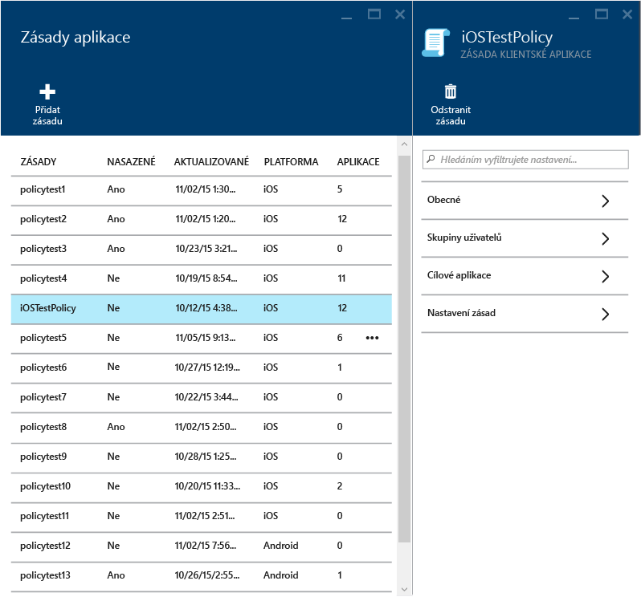

2.  V okně zásady zvolte **Cílené aplikace**. Otevře se seznam aplikací.

3.  V seznamu odeberte nebo přidejte aplikace a zvolením **ikony Uložit** uložte změny, které jste provedli.

### Změna seznamu skupin uživatelů

1.  V okně **Zásady aplikací** zvolte zásadu, kterou chcete změnit. Otevře se speciální okno pro právě vybranou zásadu.

2.  V okně zásady zvolte **Skupiny uživatelů**. Otevře se okno **Skupiny uživatelů**, ve kterém se zobrazí seznam aktuálních skupin uživatelů s touto zásadou.

3.  Pokud chcete k zásadě **přidat novou skupinu uživatelů**, zvolte **Přidat skupinu uživatelů** a vyberte skupinu uživatelů. Zvolením možnosti **Vybrat** nasadíte zásadu do skupiny uživatelů, kterou jste vybrali.

    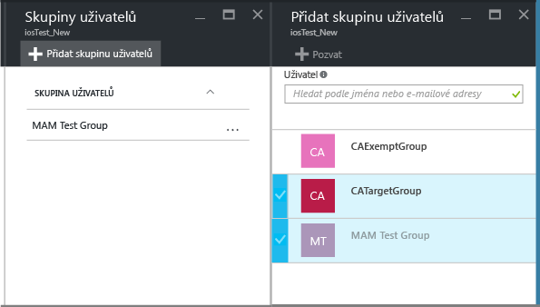

4.  Pokud chcete **odstranit skupinu uživatelů**, zvýrazněte skupinu uživatelů, kterou chcete odebrat, zvolte tlačítko se třemi tečkami (…) a pak skupinu odeberte zvolením možnosti **Odstranit**.

    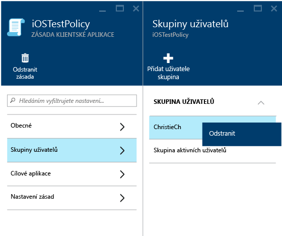

### Změna nastavení zásad

1.  V okně **Zásady aplikací** klikněte na zásadu, kterou chcete změnit. Otevře se speciální okno pro právě vybranou zásadu.

    

2.  Zvolením možnosti **Nastavení zásad** otevřete okno **Nastavení zásad**.

3.  Změňte nastavení a pak změny uložte zvolením **ikony Uložit**.

    

## Nastavení zásad
Pokud chcete zobrazit úplný seznam nastavení zásad pro iOS a Android, vyberte jednu z následujících možností:

> [!div class="op_single_selector"]
  - [Zásady pro iOS](ios-mam-policy-settings.md)
  - [Zásady pro Android](android-mam-policy-settings.md)

## Další kroky
[Monitorování stavu dodržování předpisů a uživatele](monitor-mobile-app-management-policies-with-microsoft-intune.md)

### Související témata
[Činnost koncového uživatele v aplikacích s podporou správy mobilních aplikací (MAM)](end-user-experience-for-mam-enabled-apps-with-microsoft-intune.md)

<!--HONumber=Jun16_HO2-->

