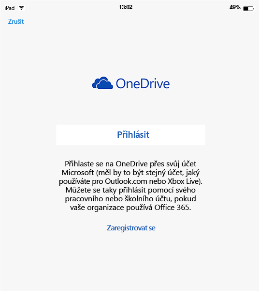
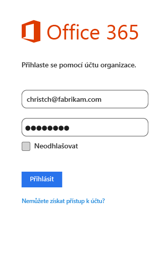

# Činnost koncového uživatele v aplikacích s podporou správy mobilních aplikací (MAM) v Microsoft Intune
Zásady správy mobilních aplikací (MAM) se použijí jenom v případě, že se aplikace používají k práci.  Následující scénáře vám pomůžou pochopit, jak fungují spravované aplikace.
##  Přístup k OneDrivu na zařízení se systémem iOS

1.  Spuštěním aplikace  **OneDrive** otevřete přihlašovací stránku.

    

    > [!NOTE]
    > Na osobním zařízení by běžně stahoval aplikaci koncový uživatel.  Když je zařízení spravované řešením MDM, můžete aplikaci nasadit do zařízení.

2.  Zadejte uživatelské jméno pracovního účtu. Budete přesměrování na stránku **Ověřování O365** , kde zadáte pracovní přihlašovací údaje.

    

3.  Po úspěšném ověření přihlašovacích údajů Azure AD se použijí zásady MAM a budete požádáni o restartování aplikace **OneDrive** .
  >[POZNÁMKA!] Dialogové okno s informacemi o vyžadovaném restartování se zobrazí pouze na zařízeních, která nejsou zaregistrovaná v Intune.

    

4.  Při opětovném spuštění aplikace **OneDrive** se aplikace spustí se zapnutými zásadami MAM. Nyní budete vyzváni k nastavení kódu **PIN** pro aplikaci. (Pokud jste tak nakonfigurovali zásady.)

    

5.  Po nastavení a potvrzení kódu PIN získáte přístup k souborům **OneDrive pro firmy**.

    

    > [!NOTE] Pokud změníte nasazené zásady, změny se použijí při příštím otevření aplikace.

##  Přístup k OneDrivu na zařízení se systémem Android

1.  Spuštěním aplikace OneDrive otevřete přihlašovací stránku.

    > [!NOTE]
    > Na osobním zařízení by běžně stahoval aplikaci koncový uživatel.  Když je zařízení spravované řešením MDM, můžete aplikaci nasadit do zařízení.

2.  Zadejte uživatelské jméno pracovního účtu. Budete přesměrování na stránku **Ověřování O365** , kde zadáte pracovní přihlašovací údaje.

    

3.  Po úspěšném ověření přihlašovacích údajů **Azure AD**by se měla zobrazit zpráva s pokyny k instalaci aplikace portálu společnosti, pokud ještě není na zařízení nainstalovaná.  Chcete-li pokračovat, klepněte na volbu **Získat aplikaci** .

>[!NOTE]
>Všechny aplikace přidružené k zásadám MAM na zařízeních se systémem Android vyžadují aplikaci Portál společnosti. U zařízení nezaregistrovaných v Intune je potřeba aplikaci nainstalovat, ale není potřeba ji spouštět nebo se do ní přihlašovat.  

  

4.  Nyní jste na webu **Google Play** , kde si můžete stáhnout a nainstalovat aplikaci **portálu společnosti** .

    Aplikace portálu společnosti vám pomůže uchovávat data v bezpečí.

    

5.  Po dokončení instalace přijměte podmínky zvolením **Přijmout** .

6.  Aplikace **OneDrive** se spustí automaticky.

7.  Při dalším otevření aplikace OneDrive se zobrazí výzva k nastavení kódu **PIN**, pokud jsou nastavení zásad nastavena tak, aby se k přístupu k aplikaci **OneDrive** vyžadoval kód PIN.

    

8.  Po nastavení a potvrzení kódu PIN můžete pokračovat pomocí aplikace **OneDrive**, kterou nyní spravují zásady aplikací.

##  Použití aplikací s podporou víc identit
Jako příklad se v tomto scénáři používá Microsoft Word.

1.  Otevřete na svém zařízení aplikaci **Word** . K ilustraci kroků používáme zařízení se systémem iOS.

2.  Klepnutím na volbu **Nový** vytvoříte nový textový dokument aplikace Word.

    

3.  Zadejte větu podle vlastního výběru.  Při pokusu o uložení tohoto dokumentu se jako možnost k uložení právě vytvořeného dokumentu zobrazí pracovní i osobní umístění.  V této fázi zatím nejsou použité zásady aplikací, protože zatím nebyl určen pracovní/osobní kontext.

4.  Uložte dokument do umístění OneDrive pro firmy. Data se nyní označí jako data společnosti a použijí se omezení zásad.

    

5.  Otevřete dokument, který jste uložili do pracovního umístění.  Zkopírujte text, otevřete svůj osobní účet na **Facebooku** a pokuste se vložit zkopírovaný text.  Obsah by do nového příspěvku na Facebooku neměl jít vložit. Možnost vložení není šedá, ale při stisknutí volby **Vložit**se nic nestane.

    

    

6.  Teď zopakujte kroky 2 a 3 a vytvořte další nový dokument. Zadejte další větu podle vlastního výběru, tentokrát ji ale namísto pracovního umístění uložte do osobního umístění, jako je **OneDrive – osobní**.

    

7.  Otevřete uložený osobní dokument.  Zkopírujte text, otevřete aplikaci **Facebook** a pokuste se vložit zkopírovaný text. Uvidíte, že obsah můžete vložit do příspěvku na Facebooku.

    

##  Správa uživatelských účtů

Intune podporuje nasazení zásad MAM jenom na jeden uživatelský účet v každém zařízení. Pokud zařízení obsahuje víc pracovních účtů, jenom jeden z nich je spravovaný zásadami MAM.

V závislosti na aplikaci, kterou používáte, může být druhý uživatel v zařízení blokovaný (ale nemusí). Ve všech případech ale zásady ovlivňují jenom prvního uživatele, který získá zásady MAM.

Pokud zařízení obsahuje před nasazením zásad MAM víc uživatelských účtů, bude zásadami MAM služby Intune spravovaný ten účet, do kterého se zásady MAM nasadí dřív.

Aplikace **Microsoft Word**, **Excel** a **PowerPoint** druhý uživatelský účet neblokují, ale na tento druhý uživatelský účet nemají zásady MAM vliv.  

U aplikací **OneDrive a Outlook** smíte používat jenom jeden pracovní účet.  Přidávání více pracovních účtů se v těchto aplikacích blokuje.  Na zařízení ale můžete odebrat uživatele a přidat jiného uživatele.

Přečtěte si níže uvedený ukázkový scénář, abyste lépe pochopili, jak se pracuje s několika uživatelskými účty.

Uživatel A pracuje ve dvou společnostech, **společnosti X** a **společnosti Y**. Uživatel A má pro každou společnost pracovní účet a obě společnosti používají Intune k nasazení zásad MAM. **Společnost X** nasadí zásady MAM **dřív než** **společnost Y**. Účet přidružený ke **společnosti X** získá zásady MAM, ale účet přidružený ke společnosti Y ne. Pokud chcete, aby byl účet přidružený ke společnosti Y spravovaný pomocí zásad MAM, musíte odebrat uživatelský účet přidružený ke společnosti X.
### Přidání druhého účtu
#### iOS
Pokud používáte zařízení se systémem iOS, při pokusu o přidání druhého pracovního účtu na stejném zařízení se může zobrazit zpráva o blokování.  Taky se zobrazí možnost odebrat existující účet a přidat nový. To můžete provést zvolením **Ano**.

####  Android
Pokud používáte zařízení se systémem Android, může se zobrazit zpráva o blokování s pokyny k odstranění existujícího účtu a přidání nového účtu.  Když chcete na zařízení se systémem Android odebrat existující účet, přejděte na **Nastavení &gt; Obecné &gt; Správce aplikací &gt; Portál společnosti a vyberte Vymazat data**.

##  Zobrazení mediálních souborů pomocí aplikace pro sdílení obsahu Rights Management
Pokud chcete na zařízení se systémem Android zobrazit podnikové audiovizuální a obrázkové soubory nebo soubory PDF, použijte [aplikaci pro sdílení obsahu Microsoft Rights Management (RMS)](https://play.google.com/store/apps/details?id=com.microsoft.ipviewer)

Tuto aplikaci si můžete stáhnout z obchodu Google Play.  Jakmile se aplikace nainstaluje do zařízení, spusťte ji a proveďte ověření pomocí svých podnikových přihlašovacích údajů. Teď byste měli být schopní zobrazit nechráněné i chráněné soubory z jiných aplikací spravovaných zásadami.

Podporovány jsou následující typy souborů:

* **Zvuk:** AAC LC, HE-AACv1 (AAC+), HE-AACv2 (rozšířené AAC+), AAC ELD (rozšířené AAC s malým zpožděním), AMR-NB, AMR-WB, FLAC, MP3, MIDI, Vorbis, PCM/WAVE.
* **Video:** H.263, H.264 AVC, MPEG-4 SP, VP8.
* **Obrázky:** jpg, pjpg, png, ppng, bmp, pbmp, gif, pgif, jpeg, pjpeg.
* PDF, PPDF

------------
|**pfile**|**text**|
|----|----|
|Pfile je obecný „obálkový“ formát pro chráněné soubory, který zapouzdřuje šifrovaný obsah a licence služby RMS a lze jej použít pro ochranu libovolného typu souboru.|Textové soubory včetně souborů XML, CSV atd. lze otevřít pro zobrazení v aplikaci, i když jsou chráněny. Typy souborů: txt, ptxt, csv, pcsv, log, plog, xml, pxml.|
---------------
**Zařízení se systémem Android, která nejsou zaregistrovaná v Intune**

Než budete moct využít aplikaci Sdílení RMS k zobrazení souborů z jiných aplikací spravovaných pomocí Intune, spusťte aplikaci RMS proveďte ověření pomocí svého pracovního účtu.  Když se přihlásíte, následující zpráva se zobrazí, **jenom pokud nemáte licenci RMS**:

**Ověření bylo úspěšné. Teď můžete zobrazit firemní soubory, ale nastavení vaší organizace vám neumožňuje chránit soubory. Se žádostí o další informace se obraťte na správce IT.**

To vám nebrání využívat aplikaci Sdílení RMS k zobrazení firemních souborů. Firemní soubory můžete i nadále otvírat a zobrazovat z jiných aplikací spravovaných pomocí Intune a zásady MAM se uplatňují.  Tato zpráva vlastně říká, že nebudete moct přidat další možnosti ochrany, které poskytuje aplikace Sdílení RMS.  Pokud chcete svoje soubory chránit, musíte mít licenci RMS. Další informace o možnostech ochrany souborů RMS najdete v tématech [Ochrana souboru na zařízení](https://docs.microsoft.com/en-us/rights-management/rms-client/sharing-app-protect-in-place) a [Ochrana souboru sdíleného e-mailem](https://docs.microsoft.com/en-us/rights-management/rms-client/sharing-app-protect-by-email).

### Související témata
[Vytvoření a nasazení zásad správy mobilních aplikací pomocí Microsoft Intune](create-and-deploy-mobile-app-management-policies-with-microsoft-intune.md)

<!--HONumber=Jun16_HO3-->

