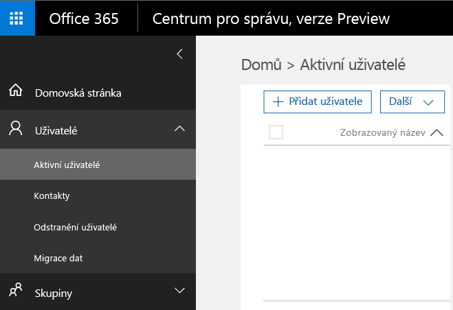
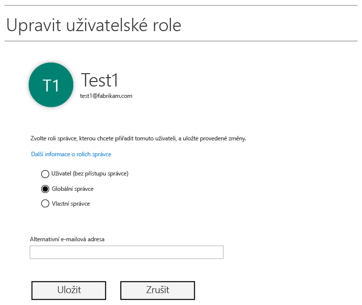
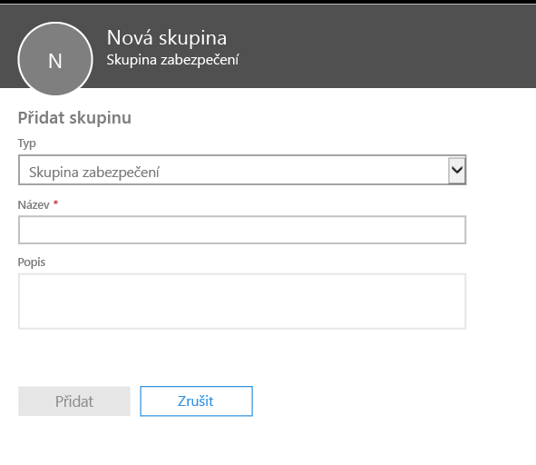
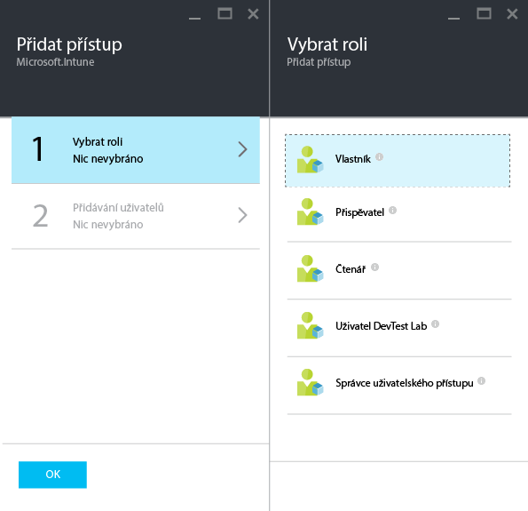
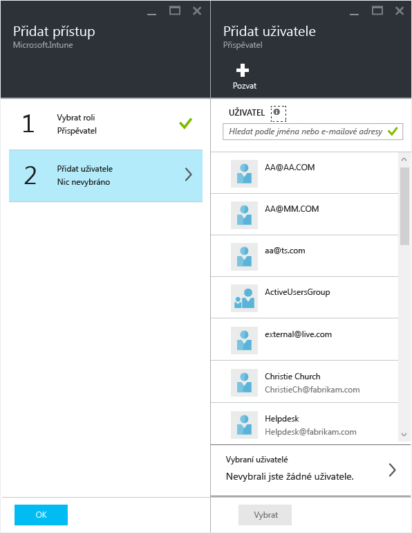

---
# required metadata

title: Příprava před konfigurací zásad správy mobilních aplikací | Microsoft Intune
description:
keywords:
author: karthikaraman
manager: jeffgilb
ms.date: 04/28/2016
ms.topic: article
ms.prod:
ms.service: microsoft-intune
ms.technology:
ms.assetid: 7e6a85e7-e007-41b6-9034-64d77f547b87

# optional metadata

#ROBOTS:
#audience:
#ms.devlang:
ms.reviewer: jeffgilb
ms.suite: ems
#ms.tgt_pltfrm:
#ms.custom:

---

# Příprava před konfigurací zásad správy mobilních aplikací pomocí Microsoft Intune
Toto téma popisuje, co je třeba provést před vytvořením zásad správy mobilních aplikací (MAM) na portálu Azure.
Pokud aktuálně ke správě svých zařízení používáte **Konzolu správce Intune**, můžete zásadu MAM podporující aplikace pro zařízení zaregistrovaná v Intune vytvořit pomocí [Konzoly správce Intune](configure-and-deploy-mobile-application-management-policies-in-the-microsoft-intune-console.md)..
>[!IMPORTANT]
> V Konzole správce Intune nemusíte vidět všechna nastavení zásad MAM. Portál Azure je nová konzola správce pro vytváření zásad MAM.

##  Podporované platformy
- iOS 8.1 nebo novější

- Android 4 nebo novější

##  Podporované aplikace
Úplný seznam podporovaných aplikací najdete v galerii mobilních aplikací Microsoft Intune na stránce [aplikací pro Microsoft Intune od partnerů](https://www.microsoft.com/en-us/server-cloud/products/microsoft-intune/partners.aspx).
Pokud kliknete na aplikaci, můžete zjistit podporované scénáře, platformy a to, jestli aplikace podporuje víc identit.

**Předtím**, než můžete nakonfigurovat zásady MAM, potřebujete následující:

-   **Předplatné Microsoft Intune**.    Koncoví uživatelé potřebují licence [!INCLUDE[wit_nextref](../includes/wit_nextref_md.md)] k získání aplikací se zásadami MAM.

-   **Autoritu pro správu mobilních zařízení** je potřeba nastavit buď na **Intune**, nebo **Configuration Manager**, a to v závislosti na tom, jestli ke správě mobilních zařízení používáte jen Intune, nebo Configuration Manager integrovaný s Intune. Pokud používáte správu mobilních zařízení integrovanou v O365, musíte koupit předplatné Intune a [nastavit autoritu pro správu mobilních zařízení na Intune](get-ready-to-enroll-devices-in-microsoft-intune.md#set-mobile-device-management-authority)..
-   Předplatné **Office 365 (O365)**, které je vyžadováno pro následující:
  - Chcete-li zásady MAM použít pro aplikace s podporou víc identit.
  - Chcete-li vytvořit pracovní účty SharePoint Online a Exchange Online. Místní Exchange a místní SharePoint nejsou podporovány.

- **Azure Active Directory (Azure AD)** pro vytváření uživatelů. Služba Azure AD ověřuje uživatele při spuštění aplikace a zadání přihlašovacích údajů.

    > [!NOTE]
    > Pokud nastavujete uživatele pomocí konzoly [!INCLUDE[wit_nextref](../includes/wit_nextref_md.md)], uvědomte si, že konfigurace zásad MAM se od nynějška přesouvá na portál Azure. Chcete-li používat tento portál, je nutné nastavit skupiny uživatelů Azure AD pomocí portálu Office 365.

## Vytvoření uživatelů a přiřazení licencí Microsoft Intune

1. Potřebujete předplatné Intune: Pokud používáte [!INCLUDE[wit_nextref](../includes/wit_nextref_md.md)] ke správě svých zařízení, již předplatné [!INCLUDE[wit_nextref](../includes/wit_nextref_md.md)] máte.  Pokud jste zakoupili licenci EMS, předplatné [!INCLUDE[wit_nextref](../includes/wit_nextref_md.md)] již také máte. Pokud zkoušíte [!INCLUDE[wit_nextref](../includes/wit_nextref_md.md)], abyste se seznámili s funkcemi MAM, můžete [tady](http://www.microsoft.com/en-us/server-cloud/products/microsoft-intune/) získat zkušební účet..

    Chcete-li ověřit, zda předplatné [!INCLUDE[wit_nextref](../includes/wit_nextref_md.md)] máte, přejděte na portálu Office na stránku Fakturace.  Předplatné služby [!INCLUDE[wit_nextref](../includes/wit_nextref_md.md)] by mělo být označené jako **Aktivní**.

2.  Přihlaste se na   [portál Office](http://portal.office.com) pomocí svých přihlašovacích údajů správce.

3.  Chcete-li přidat uživatele a přiřadit licence [!INCLUDE[wit_nextref](../includes/wit_nextref_md.md)], přejděte na stránku **Aktivní uživatelé**.

    

4.  Pokud chcete, aby uživatel měl přístup na portály Office, Azure AD a Azure, přiřaďte mu **roli globálního správce**.

    

5.  Zásady MAM jsou nasazené pro skupiny uživatelů ve službě Azure Active Directory. Chcete-li vytvořit skupiny uživatelů v souladu se zásadami MAM, přejděte na stránku **Skupiny** na **portálu Office** a kliknutím na ikonu **+** vytvořte novou skupinu zabezpečení.  Zadejte název a popis a klikněte na **Vytvořit**. Do vytvořené skupiny můžete přidávat uživatele kliknutím na volbu **Upravit členy** v nově vytvořené skupině zabezpečení. Skupina zabezpečení je vytvořená ve službě Azure Active Directory.

    

V následující tabulce naleznete přehled rolí a oprávnění, které můžete přiřazovat správcům.

|||
|--|----|
|**Role**|**Oprávnění**|
|Globální správce (portál O365)|Přístup k portálu O365 a portálu Azure AD  Přístup k portálu Azure (může provádět úkoly správy rolí i správy mobilních aplikací).|
|Role Vlastník (portál Azure)|Přístup k portálu Azure (může provádět úkoly správy rolí i správy mobilních aplikací).|
|Role Přispěvatel (portál Azure)|Přístup k portálu Azure (může provádět jenom úkoly správy mobilních aplikací).|

## Přiřazení role Přispěvatel uživateli

**Globální správci** mají přístup k portálu Azure.  Chcete-li, aby ostatní správci mohli konfigurovat zásady a provádět i další úkoly správy mobilních aplikací, můžete jim přiřadit **roli přispěvatele** podle pokynů níže:

1.  V okně **Nastavení** v části **Správa prostředků** klikněte na **Uživatelé**..

    

2.  Kliknutím na **Přidat** otevřete okno **Přidat přístup** .

3.  Klikněte na **Vybrat roli** a poté na **Role Přispěvatel**..

    

4.  Jakmile vyberete roli, klikněte na volbu **Přidat uživatele**a vyhledejte uživatele pomocí uživatelského jména nebo e-mailové adresy. V tomto seznamu se zobrazí prvních 1000 uživatelů, které jste vytvořili ve službě Azure AD pomocí portálu Office. Kliknutím na **OK** v okně **Přidat přístup** uložíte a přiřadíte uživateli roli.

    

    > [!IMPORTANT]
    > Pokud vyberete uživatele, který nemá přiřazenou licenci [!INCLUDE[wit_nextref](../includes/wit_nextref_md.md)], nebude moci získat přístup k portálu.

## Další kroky
[Vytvoření a nasazení zásad správy mobilních aplikací pomocí Microsoft Intune](create-and-deploy-mobile-app-management-policies-with-microsoft-intune.md)

<!--HONumber=May16_HO1-->

