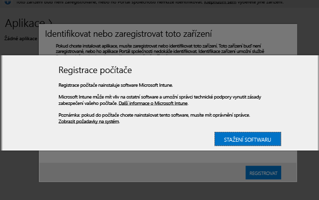

# Instalace klientského softwaru Intune na počítače se systémem Windows
Počítače se systémem Windows se dají zaregistrovat přes klientský software Intune. Klientský software Intune se dá nainstalovat jedním z následujících způsobů:

- Ruční instalace
- Instalace pomocí zásad skupiny
- Zahrnutí do bitové kopie disku
- Instalace uživateli

## Stažení klientského softwaru Intune

Všechny metody kromě těch, kdy si uživatelé nainstalují klientský software Intune sami, vyžadují stažení softwaru, aby mohl být nasazen.

1.  V [konzole pro správu Microsoft Intune](https://manage.microsoft.com/) klikněte na **Správce** &gt; **Stažení klientského softwaru**.

  

2.  Na stránce **Stažení klientského softwaru** klikněte na **Stáhnout klientský software** a uložte balíček **Microsoft_Intune_Setup.zip** obsahující software do zabezpečeného umístění v síti.

    > [!NOTE]
    > Instalační balíček klientského softwaru Intune obsahuje informace o vašem účtu. Pokud k instalačnímu balíčku získají přístup neoprávnění uživatelé, můžou zaregistrovat počítače k účtu, který je zastoupený svým vloženým certifikátem.

3.  Extrahujte obsah instalačního balíčku do zabezpečeného umístění v síti.

    > [!IMPORTANT]
    > Soubor **ACCOUNTCERT**, který se extrahuje, nepřejmenovávejte ani neodebírejte, jinak se instalace klientského softwaru nezdaří.

## Ruční nasazení

1.  Na počítači přejděte do složky, kde se nacházejí instalační soubory klientského softwaru, a spuštěním souboru **Microsoft_Intune_Setup.exe** klientský software nainstalujte.

    > [!NOTE]
    > Stav instalace se zobrazí, když ukazatel myši přesunete na ikonu v oznamovací oblasti v klientském počítači.

## Nasazení pomocí zásad skupiny

1.  Ve složce, která obsahuje soubory **Microsoft_Intune_Setup.exe** a **MicrosoftIntune.accountcert**, spusťte následující příkaz k extrakci instalačních programů založených na Instalační službě systému Windows pro 32bitové a 64bitové počítače:

    ```
    Microsoft_Intune_Setup.exe/Extract <destination folder>
    ```

2.  Zkopírujte soubory **Microsoft_Intune_x86.msi**, **Microsoft_Intune_x64.msi** a **MicrosoftIntune.accountcert** do umístění v síti, ke kterému mají přístup všechny počítače, na které se má klientský software nainstalovat.

    > [!IMPORTANT]
    > Soubory od sebe neoddělujte ani nepřejmenovávejte, jinak se instalace klientského softwaru nezdaří.

3.  Pomocí zásad skupiny nasaďte software do počítačů v síti.

    Další informace o tom, jak automaticky nasadit software pomocí zásad skupiny, najdete v dokumentaci k Windows Serveru.

## Instalace v rámci image
Klientský software Intune můžete do počítačů nasadit v rámci bitové kopie operačního systému. Jako příklad poslouží tento základní postup:

1.  Zkopírujte instalační soubory klienta, **Microsoft_Intune_Setup.exe** a **MicrosoftIntune.accountcert**, do složky **%Systemdrive%\Temp\Microsoft_Intune_Setup** na referenčním počítači.

2.  Vytvořte položku registru **WindowsIntuneEnrollPending** přidáním následujícího příkazu do skriptu **SetupComplete.cmd** :

    ```
    %windir%\system32\reg.exe add HKEY_LOCAL_MACHINE\Software\Microsoft\Onlinemanagement\Deployment /v
    WindowsIntuneEnrollPending /t REG_DWORD /d 1
    ```

3.  Přidáním následujícího příkazu do skriptu **setupcomplete.cmd** spusťte registrační balíček s argumentem příkazového řádku /PrepareEnroll:

    ```
    %systemdrive%\temp\Microsoft_Intune_Setup\Microsoft_Intune_Setup.exe /PrepareEnroll
    ```
    > [!TIP]
    > Skript **SetupComplete.cmd** umožňuje, aby instalační program systému Windows provedl změny systému před přihlášením uživatele. Argument příkazového řádku **/PrepareEnroll** připraví cílový počítač, aby se po dokončení instalačního programu systému Windows automaticky zaregistroval v Intune.

4.  Skript **SetupComplete.cmd** umístěte do složky **%Windir%\Setup\Scripts** na referenčním počítači.

5.  Vytvořte bitovou kopii referenčního počítače a pak ji nasaďte do cílových počítačů.

Když se cílový počítač po dokončení instalačního programu systému Windows restartuje, vytvoří se klíč registru **WindowsIntuneEnrollPending** . Registrační balíček ověří, jestli je počítač zaregistrovaný. Pokud je počítač zaregistrovaný, neprovede se žádná další akce. Pokud není počítač registrovaný, registrační balíček vytvoří úlohu automatické registrace Microsoft Intune.

Když je úloha automatické registrace spuštěná v příští naplánovanou dobu, zkontroluje existenci hodnoty registru **WindowsIntuneEnrollPending** a pokusí se registrovat cílový počítač v Intune. Pokud se registrace z jakéhokoli důvodu nezdaří, při dalším spuštění úlohy se pokus o registraci opakuje. Opakované pokusy pokračují po dobu jednoho měsíce.

Úloha automatické registrace Intune, úloha registru **WindowsIntuneEnrollPending** a certifikát účtu se po úspěšné registraci nebo jednom měsíci vymažou z cílového počítače.

## Pokyny pro uživatele, jak se zaregistrovat sami

Uživatelé mohou nainstalovat klientský software Intune, pokud přejdou na [http://portal.manage.microsoft.com](http://portal..manage.microsoft.com). Pokud webový portál dokáže zařízení identifikovat jako počítač se systémem Windows, požádá o registraci prostřednictvím stažení klientského softwaru Intune. Po stažení mohou uživatelé software nainstalovat a zahrnout tak své počítače do správy.



## Sledování a ověření úspěšného nasazení klienta
Pomocí některého z následujících postupů můžete sledovat a ověřit úspěšné nasazení klienta.

### Ověření instalace klientského softwaru v konzole správce Microsoft Intune

1.  V [konzole pro správu Microsoft Intune](https://manage.microsoft.com/) klikněte na **Skupiny** &gt; **Všechna zařízení** &gt; **Všechny počítače**.

2.  Projděte dolů seznam a vyhledejte spravované počítače, které komunikují s Intune, nebo konkrétní spravované počítač zadáním názvu počítače nebo libovolné části názvu do pole **Hledat zařízení**.

3.  Ve spodním podokně konzole zkontrolujte stav počítače a vyřešte případné chyby.

### Vytvoření sestavy inventáře počítače pro zobrazení všech zaregistrovaných počítačů

1.  V [konzole pro správu Microsoft Intune](https://manage.microsoft.com/) klikněte na **Sestavy** &gt; **Sestavy inventáře počítače**.

2.  Na stránce **Vytvořit novou sestavu** nechte ve všech polích výchozí hodnoty (pokud nechcete použít filtry) a klikněte na **Zobrazit sestavu**.

3.  Stránka **Sestava inventáře počítače** se otevře v novém okně s uvedením všech počítačů, které jsou úspěšně zaregistrované v Intune.

    > [!TIP]
    > Kliknutím na záhlaví libovolného sloupce v sestavě seřadíte seznam podle obsahu sloupce.


### Viz také
[Správa počítačů s Windows pomocí Intune](manage-windows-pcs-with-microsoft-intune.md)
[Řešení potíží s instalací klientů](../troubleshoot/troubleshoot-client-setup-in-microsoft-intune.md)


<!--HONumber=Sep16_HO4-->


