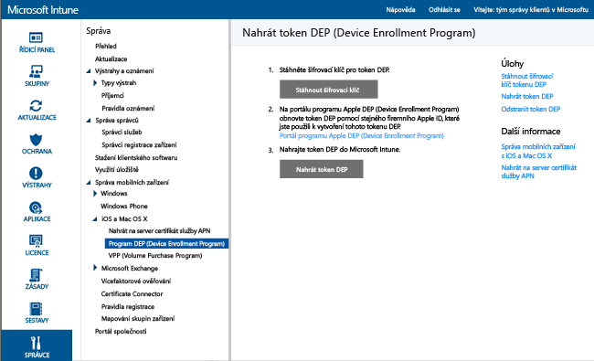
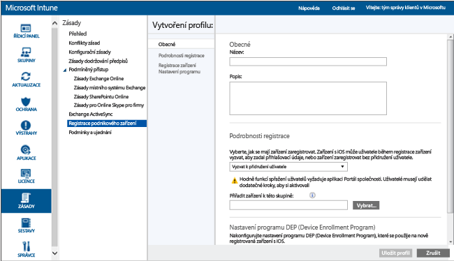

# Registrace zařízení s iOS vlastněných společností do programu DEP (Device Enrollment Program)
Microsoft Intune umožňuje nasadit profil registrace, který „vzduchem“ zaregistruje zařízení s iOS zakoupená prostřednictvím programu DEP (Device Enrollment Program). Registrační balíček může zahrnovat možnosti Pomocníka s nastavením pro zařízení. U zařízení zaregistrovaných v programu DEP uživatelé nemůžou registraci zrušit.

## Správa Apple DEP pro zařízení s iOS pomocí Microsoft Intune
Aby vaše společnost mohla pomocí programu Apple DEP (Device Enrollment Program) spravovat zařízení s iOS, která sama vlastní, musí se do tohoto programu zapojit a musí prostřednictvím něj získat zařízení. Podrobnosti o tomto procesu najdete na  [https://deploy.apple.com](https://deploy.apple.com). K výhodám tohoto programu patří bezobslužné nastavení zařízení, kdy jednotlivá zařízení není potřeba připojovat k počítači pomocí USB.

Abyste mohli v programu DEP registrovat zařízení iOS vlastněná společností, potřebujete od společnosti Apple token DEP. Token umožňuje Intune synchronizovat informace o zařízeních vlastněných společností, která se účastní programu DEP. Token taky umožňuje Intune odesílat společnosti Apple registrační profil a přiřazovat k těmto profilům zařízení.

1.  **Zahájení správy zařízení se systémem iOS v Microsoft Intune** Před registrací zařízení do programu iOS Device Enrollment Program (DEP) musíte pro službu Intune povolit správu zařízení iOS.

2.  **Získání šifrovacího klíče** Jako uživatel s oprávněním správce otevřete [konzolu pro správu Microsoft Intune](http://manage.microsoft.com), přejděte na **Správce** &gt; **Správa mobilních zařízení** &gt; **iOS** &gt; **Program DEP (Device Enrollment Program)** a klikněte na **Stáhnout šifrovací klíč**. Uložte soubor šifrovacího klíče (.pem) místně. Soubor .pem slouží k vyžádání certifikátu vztahu důvěryhodnosti z portálu Apple Device Enrollment Program.

      

3.  **Získání tokenu DEP (Device Enrollment Program)** Přejděte na [portál programu Device Enrollment Program](https://deploy.apple.com) (https://deploy.apple.com) a přihlaste se pomocí firemního Apple ID. Toto Apple ID musíte v budoucnosti použít k obnovení tokenu DEP.

    1.  Na [portálu programu Device Enrollment Program](https://deploy.apple.com) přejděte na **Device Enrollment Program** &gt; **Spravovat servery** a potom klikněte na **Přidat server MDM**.

    2.  Zadejte **název serveru MDM** a potom klikněte na **Další**. Název serveru slouží pro vaši informaci, abyste dokázali server MDM identifikovat. Není to název nebo adresa URL serveru Microsoft Intune.

    3.  Otevře se dialog **Přidat server &lt;název_serveru&gt;**. Klikněte na **Zvolit soubor…** a zvolte soubor .pem. Potom klikněte na **Další**.

    4.  V dialogovém okně **Přidat server &lt;název_serveru&gt;** se zobrazí odkaz s **vaším tokenem serveru**. Stáhněte si soubor tokenu serveru (.p7m) do počítače a potom klikněte na **Hotovo**.

    Soubor certifikátu (.p7m) se používá k navázání vztahu důvěryhodnosti mezi serverem Intune a serverem programu DEP (Device Enrollment Program) společnosti Apple.

4.  **Přidání tokenu DEP do Intune** V [konzole pro správu Microsoft Intune](http://manage.microsoft.com) přejděte na **Správa** &gt; **Správa mobilních zařízení** &gt; **iOS** &gt; **Device Enrollment Program** a klikněte na **Nahrát token DEP**. **Vyhledejte** soubor certifikátu (.p7m), zadejte své **Apple ID**a klikněte na **Nahrát**.

5.  **Přidání zásad registrace podnikových zařízení** V [konzole pro správu Microsoft Intune](http://manage.microsoft.com) přejděte na **Zásady** &gt; **Registrace podnikového zařízení** a potom klikněte na **Přidat**.

    Zadejte **obecné** podrobnosti, včetně **názvu** a **popisu**, a určete, jestli mají zařízení přiřazená k profilu uživatele přidružení uživatele, nebo jestli patří do skupiny.
      - **Vyzvat k přidružení uživatele**: Při počátečním nastavení je možné zařízení spojit s uživatelem a potom mu umožnit přístup k firemním datům a e-mailu.  Pro zařízení spravovaná pomocí programu DEP, která patří uživatelům a potřebují používat portál společnosti (tj. instalovat aplikace), by se mělo nakonfigurovat **přidružení uživatele**.
      - **Bez přidružení uživatele**: K zařízení není přidružený žádný uživatel. Toto spřažení použijte u zařízení určených k plnění úkolů, u kterých není potřeba přístup k místním uživatelským datům. Aplikace, které vyžadují přidružení uživatele, včetně aplikace Portál společnosti používané k instalaci obchodních aplikací, nebudou fungovat.

    Můžete také vybrat možnost **Přiřadit zařízení k této skupině**. Klikněte na **Vybrat** a zvolte skupinu.

    >[!Important]
    >Přiřazení skupiny způsobí přesun z Intune do Azure Active Directory. [Další informace](#changes-to-intune-group-assignments)

    Dál povolte nastavení **Nakonfigurujte nastavení DEP (Device Enrollment Program) pro tuto zásadu**, které zajistí podporu programu DEP.

      

     Pro zařízení spravovaná pomocí programu DEP jsou dostupná následující nastavení:

     - **Oddělení** – Zobrazí se, když uživatel během aktivace klepne na odkaz „O konfiguraci“.
     - **Telefonní číslo podpory** – Zobrazí se, když uživatel při aktivaci klikne na tlačítko **Potřebujete pomoc?**.
     - **Režim přípravy** – Tento stav je nastavený při aktivaci a bez obnovení továrního nastavení zařízení se nedá změnit:
        - **Bez dohledu** – Omezené možnosti správy.
        - **Pod dohledem** – Nabízí víc možností správy a ve výchozím nastavení má zakázaný zámek aktivace.
     - **Uzamknout registrační profil k zařízení** – Tento stav je nastavený při aktivaci a bez obnovení továrního nastavení se nedá změnit.
        - **Zakázat** – Umožňuje odebrání profilu správy z nabídky **Nastavení**.
        - **Povolit** (vyžaduje nastavení **Režim přípravy**  =  **Pod dohledem**) – Zakáže nastavení iOS, které by mohlo povolovat odebrání profilu správy.
     - **Možnosti Pomocníka s nastavením** – Toto nastavení je volitelné a dá se později nastavit v nabídce **Nastavení** systému iOS.
        - **Heslo** – Při aktivaci se zobrazí výzva k zadání hesla. Vždy vyžadujte zadání hesla, pokud zařízení nebude zabezpečené nebo nebude mít řízený přístup jiným způsobem (třeba pomocí beznabídkového režimu, který omezuje zařízení na jednu aplikaci).
        - **Zjišťování polohy** – Pokud je toto nastavení povolené, Pomocník s nastavením zobrazí při aktivaci výzvu služby.
        - **Obnovit** – Pokud je toto nastavení povolené, Pomocník s nastavením zobrazí při aktivaci výzvu k zálohování do úložiště iCloud.
        - **Apple ID** – Ke stahování aplikací z iOS App Storu, včetně aplikací instalovaných Intune, je potřeba Apple ID. Pokud je povolené, při pokusu Intune o instalaci aplikace bez ID zobrazí iOS uživatelům výzvu k zadání Apple ID.
        - **Podmínky a ujednání** – V případě povolení Pomocník nastavení vyzve uživatele k přijetí podmínek a ujednání společnosti Apple během aktivace.
        - **Dotykový identifikátor** – V případě povolení Pomocník s nastavením zobrazí během aktivace výzvu pro tuto službu.
        - **Dotykový identifikátor** – V případě povolení Pomocník s nastavením zobrazí během aktivace výzvu pro tuto službu.
        - **Zvětšení** – V případě povolení Pomocník s nastavením zobrazí během aktivace výzvu pro tuto službu.
        - **Siri** – V případě povolení Pomocník s nastavením zobrazí během aktivace výzvu pro tuto službu.
        - **Posílat diagnostická data do Applu** – V případě povolení Pomocník s nastavením zobrazí během aktivace výzvu pro tuto službu.
     -  **Povolí podrobnější správu přes Apple Configurator** –Nastavení možnosti **Zakázat** zabrání synchronizaci souborů s iTunes nebo správu přes Apple Configurator. Společnost Microsoft doporučuje nepoužívat toto nastavení k povolení ručního nasazení s certifikátem nebo bez něj a místo toho nastavit možnost **Zakázat**, exportovat případnou další konfiguraci z Apple Configuratoru a potom ji nasadit jako vlastní profil konfigurace pro iOS prostřednictvím Intune.
        - **Zakázat** –Brání zařízení v komunikaci přes USB (zakáže párování).
        - **Povolit** – Povoluje komunikaci zařízení prostřednictvím připojení USB pro kterýkoli počítač PC nebo Mac.
        - **Vyžadovat certifikát** – Umožňuje párování s počítačem Mac s certifikátem importovaným do profilu registrace.

6.  **Přiřazení zařízení DEP pro správu** Přejděte na [portál programu Device Enrollment Program](https://deploy.apple.com) (https://deploy.apple.com) a přihlaste se pomocí firemního Apple ID. Přejděte na **Program nasazení** &gt; **Device Enrollment Program** &gt; **Spravovat zařízení**. Zadejte, jak budete **volit zařízení**a zadejte podrobné informace o zařízení: **Sériové číslo**, **Číslo objednávky**nebo **Nahrát soubor CSV**. Potom vyberte **Přiřadit k serveru** a vyberte &lt;název_serveru&gt; zadaný pro Microsoft Intune. Potom klikněte na **OK**.

7.  **Synchronizace zařízení spravovaných programem DEP** Přihlaste se jako uživatel s oprávněními správce a otevřete [konzolu pro správu Microsoft Intune](http://manage.microsoft.com). Přejděte na **Správa** &gt; **Správa mobilních zařízení** &gt; **iOS** &gt; **Device Enrollment Program** a klikněte na **Synchronizovat**. Žádost o synchronizaci se pošle společnosti Apple. Pokud chcete po synchronizaci zobrazit zařízení spravovaná programem DEP, přejděte v [konzole pro správu Microsoft Intune](http://manage.microsoft.com) na **Skupiny** &gt; **Všechna zařízení ve vlastnictví firmy**. V pracovním prostoru **Všechna zařízení ve vlastnictví firmy** mají spravovaná zařízení u položky **Stav** nastavení „Nekontaktované“, dokud se zařízení nezapne a nespustí se Pomocník s nastavením pro registraci zařízení.

    Pro dosažení souladu s podmínkami společnosti Apple pro přijatelné přenosy v rámci DEP platí v Intune následující omezení:
     -  Úplná synchronizace DEP může být spuštěna maximálně jednou za 7 dní. Během úplné synchronizace Intune aktualizuje všechna sériová čísla, která společnost Apple přiřadila Intune, bez ohledu na to, jestli už byla dříve synchronizovaná. Pokud dojde k pokusu o úplnou synchronizaci do 7 dnů od předchozí úplné synchronizace, aktualizuje Intune jenom sériová čísla, která ještě nejsou uvedená v Intune.
     -  Jakékoli žádosti o synchronizaci se přiřadí 10 minut na dokončení. Během této doby nebo do vykonání požadavku je tlačítko Synchronizovat neaktivní.

8.  **Distribuování zařízení uživatelům** Zařízení vlastněná vaší společností se teď dají distribuovat uživatelům. Pokud je zařízení s iOS zapnuté, zaregistruje se jeho správa službou Intune.

## Změny v přiřazení skupiny pro Intune

Od září se správa skupin zařízení přesune do služby Azure Active Directory. Po přechodu na skupiny Azure Active Directory se už přiřazení skupin nebude zobrazovat mezi možnostmi v části **Podnikový profil zápisu**. Jelikož se tato změna bude zavádět několik měsíců, je možné, že ji nezaznamenáte okamžitě. Brzy zveřejníme další podrobnosti.

### Související témata
[Příprava registrace zařízení](get-ready-to-enroll-devices-in-microsoft-intune.md)

<!--HONumber=Jul16_HO1-->

