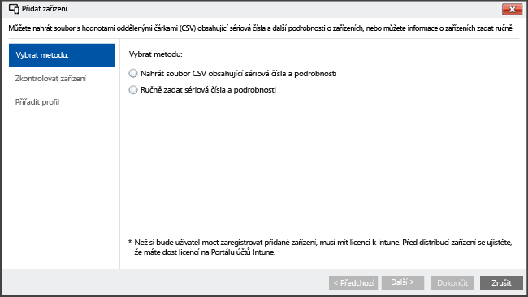

# <a name="enroll-ios-devices-with-apple-configurator-by-using-setup-assistant"></a>Použití průvodce nastavením k registraci zařízení s iOSem v Apple Configuratoru
Intune podporuje registraci zařízení s iOSem patřících společnosti pomocí [Apple Configuratoru](http://go.microsoft.com/fwlink/?LinkId=518017) spuštěného na počítači Mac. Tento postup obnoví tovární nastavení zařízení a připraví ho ke spuštění průvodce nastavením a k instalaci zásad společnosti pro nového uživatele.

## <a name="setup-assistant-enrollment-for-ios-devices-with-microsoft-intune"></a>Registrace Pomocníka s nastavením pro zařízení s iOS v Microsoft Intune
Apple Configurator umožňuje obnovit na zařízení s iOSem tovární nastavení a připravit ho k nastavení pro nového uživatele. U tohoto způsobu je potřeba zařízení s iOSem připojit k počítači Mac přes USB, aby bylo možné nastavit firemní registraci. Předpokládá se použití Apple Configuratoru 2.0. K povolení aplikace Portál společnosti služby Intune většina scénářů vyžaduje, aby zásady použité na zařízení s iOS zahrnovaly **přidružení uživatele**.

**Požadavky**
* [Registrace iOS povolená](set-up-ios-and-mac-management-with-microsoft-intune.md) nainstalováním certifikátu služby APN
* Fyzický přístup k zařízením s iOSem – zařízení musí být obnovená do továrního nastavení, kdy nejsou chráněná heslem
* Sériová čísla zařízení – viz článek [Zjištění sériového čísla zařízení s iOSem](https://support.apple.com/en-us/HT204308)
* Propojovací kabely USB
* Počítač Mac s [Apple Configuratorem 2.0](https://itunes.apple.com/us/app/apple-configurator-2/id1037126344?mt=12)


1.  **Vytvořte skupiny mobilních zařízení** (volitelné).
    Jestli podnik potřebuje ke správě zařízení skupiny mobilních zařízení, vytvořte je. Další informace najdete v tématu [Použití skupin pro správu uživatelů a zařízení v Microsoft Intune](use-groups-to-manage-users-and-devices-with-microsoft-intune.md).

2.  **Vytvořte profil zařízení.**
    Profil registrace zařízení definuje nastavení, která se použijí pro skupinu zařízení. Následující postup ukazuje, jak vytvořit profil registrace zařízení s iOSem zaregistrovaného v Apple Configuratoru.

    1.  V [konzole pro správu Microsoft Intune](http://manage.microsoft.com) přejděte na **Zásady** &gt; **Registrace podnikového zařízení** a zvolte **Přidat**.
    

    2.  Zadejte podrobnosti profilů zařízení:

        -   **Název** – název profilu registrace zařízení (uživatelé ho nevidí).

        -   **Popis:** – popis profilu registrace zařízení (uživatelé ho nevidí).

        -   **Podrobnosti registrace** – určuje způsob registrace zařízení.

            -   **Vyzvat k přidružení uživatele** – při počátečním nastavení musí mít zařízení přiřazeného uživatele, aby umožňovalo přístup k datům a e-mailu společnosti. **Přidružení uživatele** – je potřeba nastavit pro zařízení spravovaná v programu DEP, která patří uživatelům a potřebují používat portál společnosti kvůli službám, jako je instalace aplikací.

            -   **Bez přidružení uživatele** – zařízení nemá přidruženého uživatele. Toto spřažení použijte u zařízení určených k plnění úkolů, u kterých není potřeba přístup k místním uživatelským datům. Aplikace, které vyžadují přidruženého uživatele (včetně aplikace Portál společnosti používané k instalaci obchodních aplikací), nebudou fungovat.

        -   **Předběžné přiřazení skupiny zařízení** – na začátku patří do této skupiny všechna zařízení nasazená s tímto profilem. Po registraci můžete zařízení přiřadit někomu jinému.

            [!INCLUDE[groups deprecated](../includes/group-deprecation.md)]

        -  **Program DEP (Device Enrollment Program)** – tento program se nedá použít při registraci pomocí průvodce nastavením. Zkontrolujte, že je přepínač nastavený do polohy **Vypnuto**.

    3.  Profil přidáte kliknutím na **Uložit profil**.

3.  **Přidejte zařízení s iOSem, která chcete zaregistrovat pomocí průvodce nastavením.**
    V [konzole pro správu Microsoft Intune](http://manage.microsoft.com) přejděte na **Skupiny** &gt; **Všechna zařízení** &gt; **Všechna zařízení ve vlastnictví firmy** &gt; **Všechna zařízení** a zvolte **Přidat zařízení**. Zařízení můžete přidat dvěma způsoby:

    

    -   **Odesláním souboru CSV se sériovými čísly** – vytvořte seznam oddělený čárkami (.csv), který bude bez záhlaví a bude mít dva sloupce. Soubor může obsahovat maximálně 5000 zařízení, ale nesmí být větší než 5 MB.

        |||
        |-|-|
        |&lt;Sériové č. 1&gt;|&lt;Podrobnosti o zařízení č. 1&gt;|
        |&lt;Sériové č. 2&gt;|&lt;Podrobnosti o zařízení č. 2&gt;|
        Soubor .csv v textovém editoru:

        ```
        0000000,PO 1234
        111111111,PO 1234
        ```

    -   **Ručním přidáním podrobností o zařízeních** – zadejte sériové číslo a podrobnosti až o pěti zařízeních.

    > [!NOTE]
    > Pokud později musíte zařízení vlastněná firmou ze správy pomocí služby Intune odebrat, může být potřeba odebrat sériové číslo zařízení z Intune ve skupině zařízení **Podle sériového čísla iOS** v části **Firemní předregistrovaná zařízení** a deaktivovat tak registraci zařízení. Pokud Intune provádí postup zotavení po havárii přibližně v době odebrání sériových čísel, bude potřeba ověřit, že jsou ve skupině jenom sériová čísla aktivních zařízení.

    Vyberte **Další**.

4.  **Vyberte zařízení k registraci.**
    Potvrďte zařízení k registraci. Sériová čísla, která jsou zaregistrovaná nebo byla zaregistrovaná jiným způsobem, nejdou importovat. Pokračujte výběrem položky **Další**.

5.  **Přiřaďte profil.**
    V seznamu dostupných profilů vyberte profil, který se přiřadí přidaným zařízením. Zkontrolujte **podrobnosti registračního profilu** a zvolte **Dokončit**. Ručně přidaným zařízením můžete přiřadit libovolný registrační profil.

6.  **Exportujte profil, který se nasadí na zařízení s iOSem.**
    V [konzole pro správu Microsoft Intune](http://manage.microsoft.com) přejděte na **Zásady** &gt; **Registrace podnikového zařízení** a vyberte profil zařízení nasazovaný u mobilních zařízení. Na hlavním panelu zvolte **Exportovat**. Zkopírujte a uložte **URL profilu**. Později URL odešlete do Apple Configuratoru, abyste definovali profil Intune používaný zařízeními iOS.
    Podpora Apple Configuratoru 2 vyžaduje úpravu adresy URL profilu 2.0. Uděláte to tak, že tento kód:
    ```
    https://manage.microsoft.com/EnrollmentServer/Discovery.svc/iOS/ESProxy?id=
    ```
    Nahradíte tímto kódem:

    ```
    https://appleconfigurator2.manage.microsoft.com/MDMServiceConfig?id=
    ```

   V následujícím postupu odešlete tuto adresu URL profilu do služby Apple DEP pomocí Apple Configuratoru, abyste definovali profil Intune používaný zařízeními s iOS.


7.  **Připravte zařízení v Apple Configuratoru.**
    Zařízení iOS jsou připojená k počítači Mac a zaregistrovaná do systému správy mobilních zařízení.

    1.  Na počítači Mac otevřete **Apple Configurator 2**. V panelu nabídek vyberte **Apple Configurator 2** a potom **Předvolby**.

         > [!WARNING]
         > V průběhu registrace bude v zařízeních obnovená tovární konfigurace. Doporučuje se zařízení resetovat a zapnout ho. Zařízení by při připojení měla mít nastavenou **úvodní obrazovku**.

    2. V podokně předvoleb vyberte **Servery** a znaménkem plus (+) spusťte průvodce serveru MDM. Vyberte **Další**.

    3. Zadejte **název** a **adresu URL pro registraci** serveru MDM z 6. kroku – Registrace Pomocníka s nastavením pro zařízení s iOSem v Microsoft Intune. Jako adresu URL pro registraci zadejte adresu URL profilu pro registraci exportovanou z Intune. Vyberte **Další**.  

       Upozornění na neověřenou adresu URL serveru můžete ignorovat. Vyberte **Další** a pokračujte až do konce průvodce.

    4.  Mobilní zařízení s iOSem připojte kabelem USB k počítači Mac.

        > [!WARNING]
        > V průběhu registrace bude v zařízeních obnovená tovární konfigurace. Doporučuje se zařízení resetovat a zapnout ho. Při spuštění průvodce nastavením by zařízení měla mít nastavenou **úvodní obrazovku**.

    5.  Vyberte **Připravit**. V podokně přípravy zařízení s iOSem vyberte **Ručně** a pak zvolte **Další**.

    6. V podokně registrace na serveru MDM vyberte název vytvořeného serveru a zvolte **Další**.

    7. V podokně dohledu nad zařízeními vyberte úroveň dohledu a zvolte **Další**.

    8. V podokně vytvoření organizace zvolte **Organizace** nebo vytvořte novou organizaci a zvolte **Další**.

    9. V podokně konfigurace průvodce nastavením iOS vyberte kroky, které se budou zobrazovat uživateli, a zvolte **Připravit**. Pokud se zobrazí výzva, proveďte ověření, aby se aktualizovalo nastavení důvěry.  

    10. Až se dokončí příprava zařízení s iOSem, můžete odpojit kabel USB.  

8.  **Distribuujte zařízení.**
    Zařízení jsou připravená na registraci ve společnosti. Vypněte zařízení a rozdejte je uživatelům. Když uživatelé zařízení zapnou, spustí se průvodce nastavením.


### <a name="see-also"></a>Související témata
[Předpoklady registrace zařízení](prerequisites-for-enrollment.md)


<!--HONumber=Nov16_HO1-->


