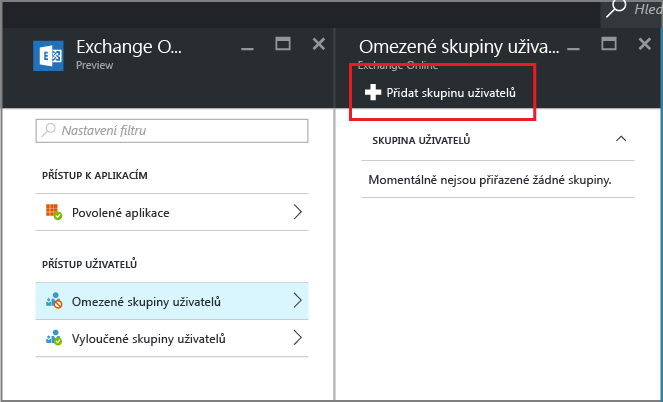

# Povolení přístupu jenom aplikacím s podporou MAM vytvořením podmíněného přístupu pro Exchange Online
Toto téma obsahuje podrobný postup, jak nastavením podmíněného přístupu pro Exchange Online povolíte jenom mobilní aplikace, které podporují zásady správy mobilních aplikací (MAM) v Intune.

## Vytvoření zásady pro Exchange Online
1.  Přihlaste se na [Azure Portal](portal.azure.com), který obsahuje funkci přístupu aplikací. Pokud Azure Portal ještě neznáte, přečtěte si téma [Azure Portal pro zásady MAM](azure-portal-for-microsoft-intune-mam-policies.md).

2.  Zvolte **Procházet > Intune > okno Správa mobilních aplikací Intune > Nastavení** a v sekci **Podmíněný přístup** zvolte **Exchange Online**.

  

3.  V okně **Povolené aplikace** zvolte možnost **Povolit aplikace, které podporují zásady aplikací Intune**. Tím umožníte, aby přístup k Exchangi Online měly jenom aplikace podporované zásadami MAM Intune. Při výběru této možnosti se zobrazí seznam podporovaných aplikací.

  >[!NOTE]
  >Všem poštovním klientům Exchange Active Sync, včetně integrovaných poštovních klientů v iOS a Androidu, kteří se připojují k Exchangi Online, se zakáže odesílání a příjem e-mailů. Místo toho uživatelé dostanou e-mail, který je informuje o tom, že musí použít poštovní aplikaci Outlook. 
4.   Pokud tuto zásadu chcete uplatnit na uživatele, otevřete okno **Omezené skupiny uživatelů** a zvolte **Přidat skupinu uživatelů**. Vyberte skupiny uživatelů, které by tuto zásadu měly obdržet.

  

5.  Můžete chtít, aby pro některé uživatele ve skupině uživatelů, kterou jste vybrali v předchozím kroku, tato zásada neplatila. V takovém případě přidejte skupinu uživatelů do seznamu vyloučených skupin uživatelů. V okně **Exchange Online** zvolte **Vyloučené skupiny uživatelů**. Zvolením možnosti **Přidat skupinu uživatelů** otevřete seznam skupin uživatelů. Vyberte skupiny, které chcete z této zásady vyloučit.  

## Úprava existující zásady
### Přidání nebo odstranění skupin uživatelů

Pokud chcete **odstranit skupinu uživatelů** ze seznamu **omezených skupin uživatelů**, otevřete okno **Omezené skupiny uživatelů**, zvýrazněte skupinu uživatelů, kterou chcete odstranit, a kliknutím na **tři tečky (...)** zobrazte možnost **Odstranit**. Volbou možnosti **Odstranit** odeberte tuto skupinu uživatelů ze seznamu. Stejným postupem můžete odebrat skupinu uživatelů ze seznamu **vyloučených skupin uživatelů**.

## Další kroky
[Blokování aplikací, které nepoužívají moderní ověřování](block-apps-with-no-modern-authentication.md)
### Viz taky
[Ochrana dat aplikací pomocí zásad MAM](protect-app-data-using-mobile-app-management-policies-with-microsoft-intune.md)

<!--HONumber=Oct16_HO2-->

