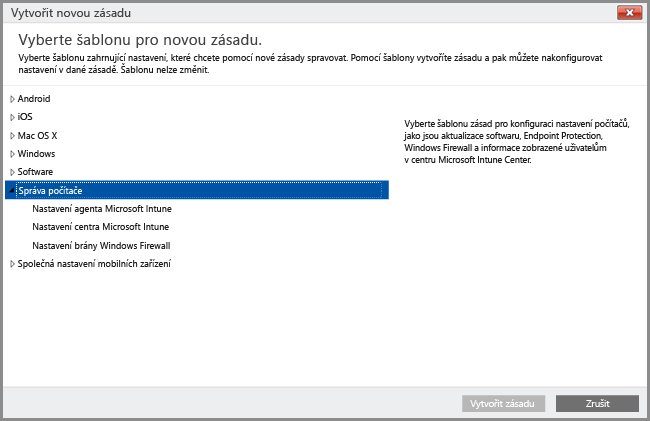

# Správa počítačů s Windows pomocí klientského počítačového softwaru Intune
Namísto [registrace počítačů s Windows jako mobilních zařízení](set-up-windows-device-management-with-microsoft-intune.md) můžete počítače s Windows registrovat a spravovat pomocí instalace klientského softwaru Intune.

Intune spravuje počítače s Windows pomocí zásad podobně jako objekty zásad skupiny (GPO) služby AD DS (Active Directory Domain Services) Windows Serveru. Pokud budete počítače připojené k doméně Active Directory spravovat pomocí Intune, měli byste [ověřit, že zásady Intune nejsou v konfliktu se žádnými objekty zásad skupiny](resolve-gpo-and-microsoft-intune-policy-conflicts.md), které jsou nastavené pro vaši organizaci.

I když softwarový klient Intune podporuje [zásady, které pomáhají chránit počítače](policies-to-protect-windows-pcs-in-microsoft-intune.md) pomocí správy aktualizací softwaru, brány Windows Firewall a služby Endpoint Protection, počítače spravované pomocí klienta Intune nemůžou být cílem dalších zásad Intune, včetně nastavení zásad **Windows**, která jsou specifická pro správu mobilních zařízení.

> [!NOTE]
> Zařízení se systémem Windows 8.1 nebo novějším můžete spravovat pomocí klienta Intune nebo je můžete zaregistrovat jako mobilní zařízení. Níže uvedené informace platí pro počítače, které používají klienta Intune. Instalace počítačového klienta Intune současně s registrací zařízení s Windows ke správě mobilních zařízení není podporována.

## Požadavky na správu počítačového klienta Intune

**Hardware**: Toto jsou minimální požadavky na hardware pro instalaci klienta Intune:

|Požadavek|Další informace|
|---------------|--------------------|
|Síť|Klient vyžaduje, aby byl počítač připojený k Internetu.|
|Procesor a paměť|Viz požadavky na procesor a paměť RAM pro operační systém počítače.|
|Místo na disku|200 MB volného místa na disku před instalací klientského softwaru.|

**Software**: Toto jsou požadavky na software pro instalaci klienta:

|Požadavek|Další informace|
|---------------|--------------------|
|Operační systém | Zařízení s Windows se systémem Windows 7 nebo novějším. |
|Oprávnění správce|Účet, který instaluje klientský software, musí mít oprávnění místního správce pro toto zařízení.|
|Instalační služba systému Windows verze 3.1|Na počítači musí být Instalační služba systému Windows minimálně verze 3.1.  Pokud chcete zobrazit verzi Instalační služby systému Windows na počítači:  -   Na počítači klikněte pravým tlačítkem na **%windir%\System32\msiexec.exe** a potom klikněte na **Vlastnosti**.  Nejnovější verzi Instalační služby systému Windows můžete stáhnout ze stránky [Windows Installer Redistributables](http://go.microsoft.com/fwlink/?LinkID=234258) na webu Microsoft Developer Network.|
|Odebrání nekompatibilního klientského softwaru|Před instalací klientského softwaru Intune musíte z daného počítače odinstalovat veškerý klientský software Configuration Manageru a System Management Serveru.|

## Instalace počítačového klienta Intune
Klientský software Intune lze nainstalovat jedním z následujících způsobů:

-  [Ruční nasazení klientského softwaru Microsoft Intune](install-the-windows-pc-client-with-microsoft-intune.md#to-manually-deploy-the-client-software) U tohoto typu nasazení správce stáhne klientský software Intune a ručně ho nainstaluje do všech počítačů.

  Pokud chcete stáhnout klientský software Intune, otevřete [konzolu správy Intune](https://manage.microsoft.com), zvolte **Správce**  >  **Stažení klientského softwaru** a klikněte na **Stáhnout klientský software**.

-  Stejné soubory, které jste stáhli pro ruční instalaci klientského softwaru Intune, můžete použít pro [nasazení klienta do počítačů připojených k doméně pomocí objektů zásad skupiny Active Directory](install-the-windows-pc-client-with-microsoft-intune.md#to-automatically-deploy-the-client-software-by-using-group-policy).

-  Klientský software Intune nasaďte do počítačů jako součást [nasazení operačního systému](install-the-windows-pc-client-with-microsoft-intune.md#install-the-microsoft-intune-client-software-as-part-of-an-image).

-  Odešlete uživatelům pokyny s adresou URL pro Portál společnosti Intune, [https://portal.manage.microsoft.com](http://go.microsoft.com/fwlink/?LinkId=825632). Když uživatel otevře Portál společnosti, zobrazí se výzva, aby si stažením a instalací klientského softwaru Intune zaregistroval svůj počítač.

## Správa počítačů pomocí počítačového klienta Intune
Po dokončení instalace klientský software Intune povolí několik funkcí správy počítačů, včetně [správy aplikací](deploy-apps-in-microsoft-intune.md), služby Endpoint Protection, inventáře softwaru a hardwaru, vzdáleného řízení (prostřednictvím žádostí o vzdálenou pomoc), aktualizací softwaru a vytváření sestav nastavení dodržování předpisů.

Některé úlohy správy počítačů povolené počítačovým klientem se spravují pomocí zásad Intune, jako třeba:

-   Konfigurace [nastavení brány Windows Firewall](help-protect-windows-pcs-using-windows-firewall-policies-in-microsoft-intune.md) ve spravovaných počítačích.

-   Konfigurace [nastavení aktualizací softwaru](keep-windows-pcs-up-to-date-with-software-updates-in-microsoft-intune.md) , které mají spravované počítače kontrolovat, a stažení požadovaných aktualizací softwaru.

-   Pomoc při zabezpečení spravovaných počítačů před potenciálními hrozbami a škodlivým softwarem pomocí správy [monitorování v reálném čase a Endpoint Protection](help-secure-windows-pcs-with-endpoint-protection-for-microsoft-intune.md).

Kromě akcí klientského agenta Intune prováděných lokálně v jednotlivých počítačích je možné konzolu správce Intune využít taky k dalším [běžným úlohám správy](common-windows-pc-management-tasks-with-the-microsoft-intune-computer-client.md) u počítačů s Windows s nainstalovaným klientem:

-   Zobrazení informací o inventáři hardwaru a softwaru pro spravované počítače

-   Vzdálené restartování počítače

-   Vyřazení počítače pro odinstalaci klientského softwaru a jeho odebrání ze správy pomocí Intune

-   Propojení uživatelů ke konkrétním spravovaným počítačům

-   Odpověď na žádosti o vzdálenou pomoc

Klientský agent Intune obvykle běží tiše na pozadí a nevyžaduje skoro žádnou interakci ze strany uživatele ani řešení potíží. Pokud byste ale potřebovali pomoc při řešení potíží se správou počítačů, je k dispozici několik [prostředků, které vám je pomůžou vyřešit](/intune/troubleshoot/troubleshoot-client-setup-in-microsoft-intune).

<!--HONumber=Aug16_HO4-->

