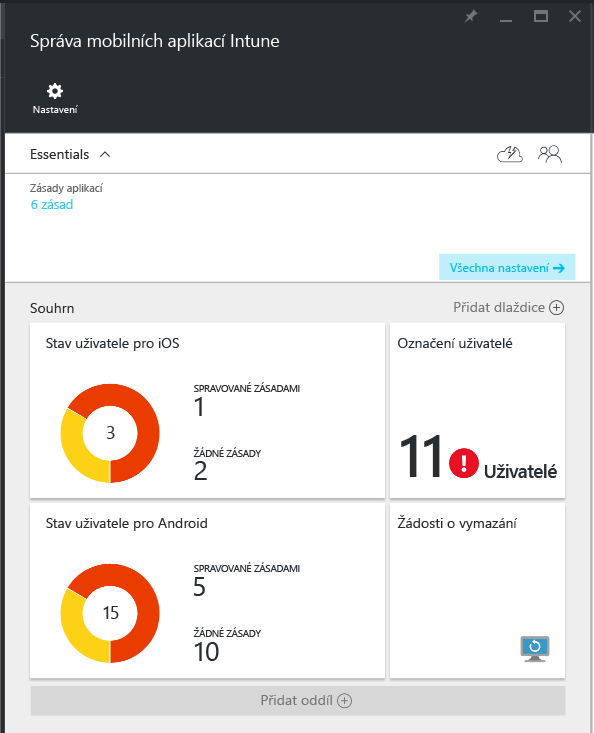
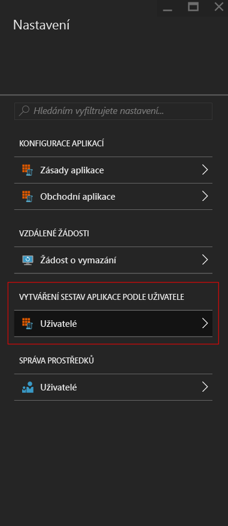
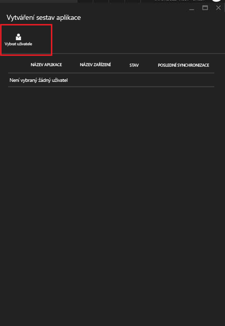
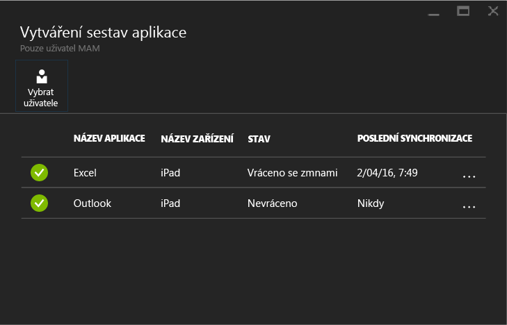

# Monitorování zásad správy mobilních aplikací s Microsoft Intune
Jakmile nakonfigurujete zásadu MAM a použijete ji pro uživatele, můžete na [portálu Azure](https://portal.azure.com) monitorovat stav dodržování předpisů. Portál Azure obsahuje informace o uživatelích ovlivněných zásadou, stav dodržování předpisů a veškeré problémy, se kterými se mohou vaši koncoví uživatelé setkat.
## Souhrnné zobrazení
Níže se dozvíte, jak můžete v okně **Správa mobilních aplikací Intune** zobrazit souhrn stavu dodržování předpisů:

-   **UŽIVATELÉ:** Celkový počet uživatelů ve vaší společnosti, kteří používají aplikace přidružené k zásadě.

-   **SPRAVOVANÉ ZÁSADOU:** Počet uživatelů, kteří použili aspoň jednu z aplikací v pracovním kontextu.

-   **ŽÁDNÉ ZÁSADY:** Počet uživatelů, kteří používají aplikace přidružené k zásadě, ale nejsou cílem vaší zásady.  Zvažte přidání těchto uživatelů do vaší zásady.

- **Uživatelé označení příznakem:** Počet uživatelů, kteří mají problémy. Aktuálně jsou v části **Uživatelé označení příznakem** uvedení jenom uživatelé se zařízením s jailbreakem.

## Podrobné zobrazení
Můžete získat podrobné zobrazení souhrnu kliknutím na dlaždici **Stav uživatele** a dlaždici **Uživatelé označení příznakem**.

### Stav uživatele
Můžete vyhledat jednoho uživatele a podívat se na stav dodržování předpisů pro tohoto uživatele. Okno **Vytváření sestav aplikace** zobrazuje pro vybraného uživatele následující informace:
- Zařízení, která jsou přidružená k účtu uživatele
- Aplikace se zásadou MAM na zařízení
- Stav:

  **Zaregistrováno:** Znamená, že byla zásada nasazena uživateli a aplikace se aspoň jednou použila v pracovním kontextu.

  **Není zaregistrováno:** Znamená, že došlo k nasazení zásady pro uživatele, ale aplikace se od té doby nepoužila v pracovním kontextu.

>[!NOTE]
> Pokud uživatel, kterého jste hledali, nemá nasazené zásady MAM, zobrazí se zpráva oznamující, že uživatel není cílem žádné zásady pro aplikace.

Pokud chcete zobrazit vytváření sestav pro uživatele, postupujte takto:

**Krok 1:** Pokud chcete vybrat uživatele, klikněte na dlaždici souhrnu nebo zvolte možnost **VYTVÁŘENÍ SESTAV APLIKACE UŽIVATELEM** v okně **Nastavení**, jak je uvedeno níže:

**Krok 2:** Otevře se okno **Vytváření sestav aplikace**. Zvolte **Vybrat uživatele** a vyhledejte uživatele služby Azure Active Directory.

**Krok 3:** Po výběru uživatele ze seznamu se zobrazí podrobnosti o stavu dodržování předpisů pro tohoto uživatele.

### Uživatelé označení příznakem
V podrobném zobrazení se zobrazí chybová zpráva, aplikace, ke které se přistupovalo, když chyba nastala, platforma zařízení a časové razítko.  

### Viz taky
[Správa přenosu dat mezi aplikacemi pro iOS](manage-data-transfer-between-ios-apps-with-microsoft-intune.md)

[Činnost koncového uživatele v aplikacích s podporou správy mobilních aplikací (MAM)](end-user-experience-for-mam-enabled-apps-with-microsoft-intune.md)

<!--HONumber=Jul16_HO4-->

