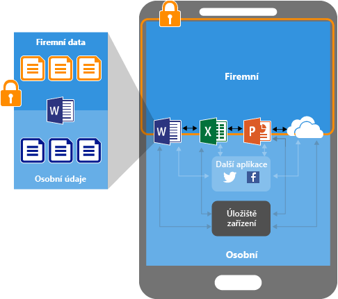
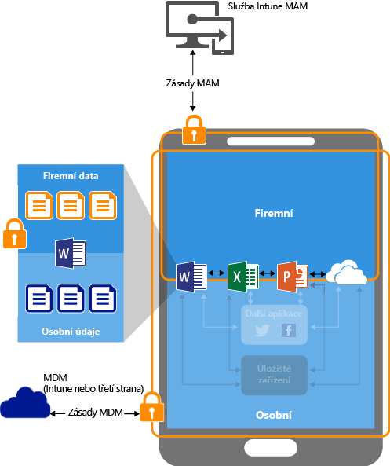
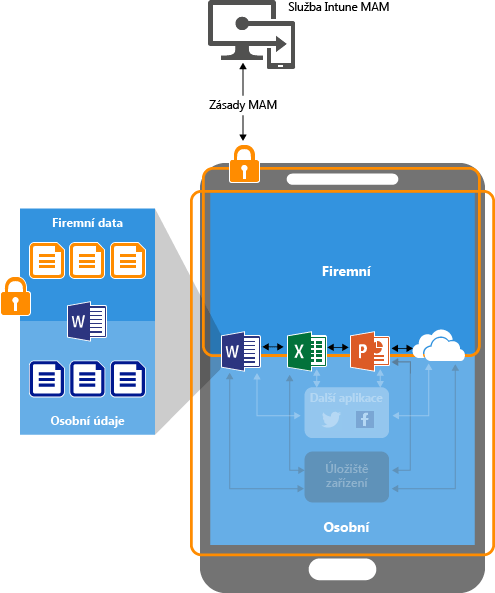

---
# required metadata

title: Ochrana aplikačních dat pomocí zásad správy mobilních aplikací | Microsoft Intune
description:
keywords:
author: karthikaraman
manager: jeffgilb
ms.date: 04/28/2016
ms.topic: article
ms.prod:
ms.service: microsoft-intune
ms.technology:
ms.assetid: ab6cd622-b738-4a63-9c91-56044aaafa6d

# optional metadata

#ROBOTS:
#audience:
#ms.devlang:
ms.reviewer: joglocke
ms.suite: ems
#ms.tgt_pltfrm:
#ms.custom:

---

# Ochrana aplikačních dat pomocí zásad správy mobilních aplikací v Microsoft Intune

## Způsob ochrany dat aplikací
Vaši zaměstnanci používají mobilní zařízení pro osobní a pracovní úkoly.  Chcete, aby vaši zaměstnanci byli produktivní, ale také chcete zabránit případným záměrným či neúmyslným ztrátám dat.  Kromě toho chcete mít možnost chránit firemní data při přístupu pomocí zařízení i v případě, že tato zařízení nespravujete.

Zásady správy mobilních aplikací (MAM) služby Intune vám pomohou vaše firemní data ochránit. Protože se zásady MAM Intune dají používat nezávisle na řešení správy mobilních zařízení (MDM), můžete je použít k ochraně firemních dat i bez registrace zařízení do řešení správy zařízení. Implementací **zásad na úrovni aplikace** můžete omezit přístup k prostředkům společnosti a ponechat data v kompetenci IT oddělení.

Zásady MAM podporují aplikace běžící na:

-   **Zařízení, která jsou spravovaná a zaregistrovaná** ve službě [!INCLUDE[wit_nextref](../includes/wit_nextref_md.md)]. Do této kategorie obvykle spadají podniková zařízení.

  > [!IMPORTANT]
  > Pokud používáte Intune ke správě zařízení se systémem iOS a Android, můžete vytvořit zásady správy mobilních aplikací pro mobilní aplikace Office, které se připojují ke službám Office 365. Zásady MAM se nepodporují pro aplikace, které se připojují k místním službám Exchange nebo SharePoint.

-   **Zařízení, která jsou spravovaná a zaregistrovaná do řešení správy mobilních zařízení třetích stran**.   Do této kategorie obvykle spadají podniková zařízení.

  > [!NOTE] Zásady správy mobilních aplikací není vhodné používat s řešeními pro správu mobilních aplikací třetích stran nebo zabezpečeného kontejneru.

-   **Zařízení, která nejsou spravovaná**.  Do této kategorie obvykle spadají zařízení vlastněná zaměstnanci,která nejsou spravovaná ani zaregistrovaná v Intune nebo jiných řešeních MDM.

**Důležité výhody použití zásad MAM:**

-   Ochrana podnikových dat na úrovni aplikace.  Protože správa mobilních aplikací nevyžaduje správu zařízení, můžete firemní data chránit na spravovaných i nespravovaných zařízeních. Správa je zaměřená na identitu uživatele, odpadá tedy požadavek na správu zařízení.

-   Produktivita koncového uživatele není ovlivněná a při použití aplikace pro osobní účely se zásady neaplikují.  Zásady se použijí jenom v pracovním kontextu, což umožňuje chránit firemní data bez zásahu do osobních dat.

Použití MDM se zásadami MAM přináší i další výhody. Firmy mohou současně využívat řešení MDM se zásadami MAM i bez nich. Zaměstnanci mohou například používat podnikový telefon i vlastní tablet.  V takovém případě je podnikový telefon zaregistrovaný do řešení MDM a chráněný zásadami MAM, zatímco vlastní zařízení zaměstnance je jenom chráněné zásadami MAM.

- **Řešení MDM zajišťuje ochranu zařízení**.  Můžete například přístup do zařízení zabezpečit kódem PIN nebo do zařízení nasadit spravované aplikace. Do zařízení můžete aplikace nasadit také pomocí řešení MDM, čímž získáte větší kontrolu nad správou aplikací.

- **Zásady MAM zajišťují, že se použije ochrana aplikační vrstvy**. Otevírání aplikací v pracovním kontextu, sdílení dat mezi dvěma aplikacemi nebo ukládání firemních dat na soukromá úložiště můžete například zabezpečit pomocí kódu PIN.

### Zásady MAM se aktuálně podporují v těchto systémech:
-   iOS 8.1 nebo novější

-   Android 4 nebo novější

V současné době není dostupná podpora zařízení s Windows.
##  Jak zásady MAM chrání data aplikací

####  Aplikace bez zásad MAM:

Pokud se aplikace používají bez omezení, můžou se osobní a firemní data prolínat.  Firemní data můžou být uložená v osobním úložišti nebo přenesená do aplikací mimo váš dosah, a může tím dojít ke ztrátě dat. Šipky v diagramu znázorňují neomezený přesun dat mezi aplikacemi (podnikovými a osobními) a úložišti.

### Ochrana dat pomocí zásad MAM:

Pomocí zásad MAM můžete zabránit ukládání firemních dat do místního úložiště na zařízení a omezit přesun dat do jiných aplikací, které nejsou chráněné zásadami MAM. Nastavení zásad MAM zahrnuje tyto položky:
- Zásady přemístění dat, jako je **Zakázat možnost Uložit jako**, **Omezit vyjmutí, zkopírování a vložení**.
- Nastavení zásad přístupu, jako je **Vyžadovat pro přístup jednoduchý PIN kód**, **Blokovat spouštění spravovaných aplikací na zařízeních s jailbreakem nebo rootem**.

### Ochrana dat na zařízeních spravovaných řešeními MDM pomocí zásad MAM:

**Zařízení zaregistrovaná v řešení MDM**-

Obrázek výš ukazuje vrstvy ochrany, které zásady MDM a MAM společně nabízejí.

Řešení MDM:

-   Zaregistruje zařízení.

-   Na zařízení nasadí aplikace.

-   Zajišťuje neustálé dodržování předpisů a správu zařízení.

**Zásady MAM navíc pomáhají:**

-   Chránit před únikem firemních dat v uživatelských aplikacích a službách

-   Aplikovat omezení (Uložit jako, schránka, kód PIN atd.) pro mobilní aplikace

-   Vymazat firemní data z aplikací bez nutnosti tyto aplikace ze zařízení odebrat

### Ochrana dat pro zařízení bez registrace pomocí zásad MAM

Diagram výš ukazuje, jak fungují zásady ochrany dat na úrovni aplikace bez správy mobilních zařízení.

V případě vlastních zařízení uživatelů nezaregistrovaných do řešení MDM můžou zásady MAM pomoct chránit firemní data na úrovni aplikace.
Je ale potřeba mít na paměti některá omezení, jako například:

-   Aplikace nejde do zařízení nasadit.  Koncový uživatel musí aplikace sám nainstalovat.

-   V těchto zařízeních nejde zřídit profily certifikátů.

-   V těchto zařízeních nejde zřídit firemní sítě Wi-Fi a nastavit síť VPN.

## Víc identit

Aplikace, které podporují víc identit, umožňují pro přístup používat různé účty (pracovní a osobní). Zásady MAM se použijí, když jsou aplikace použité v pracovním kontextu.  

Pokud třeba koncový uživatel spustí aplikaci OneDrive pomocí svého pracovního účtu, nemůže přesunout soubory do svého osobního úložiště. Pokud ale koncový uživatel použije OneDrive se svým osobním účtem, může kopírovat a přesouvat data ze svého osobního OneDrivu bez omezení.  

Podrobné vysvětlení postupu při použití aplikací, které jsou přidružené k zásadám MAM, a to, jakým způsobem aplikace s podporou víc identit umožňují uplatnění zásad MAM jenom v pracovním kontextu, najdete v tématu věnovaném [použití aplikací s podporou víc identit](end-user-experience-for-mam-enabled-apps-with-microsoft-intune.md#using-apps-with-multi-identity-support).

Všechny mobilní aplikace Office podporují více identit.

##  Další kroky
[Příprava před konfigurací zásad správy mobilních aplikací](get-ready-to-configure-mobile-app-management-policies-with-microsoft-intune.md)

[Vytvoření a nasazení zásad správy mobilních aplikací pomocí Microsoft Intune](create-and-deploy-mobile-app-management-policies-with-microsoft-intune.md)

<!--HONumber=Jun16_HO2-->

