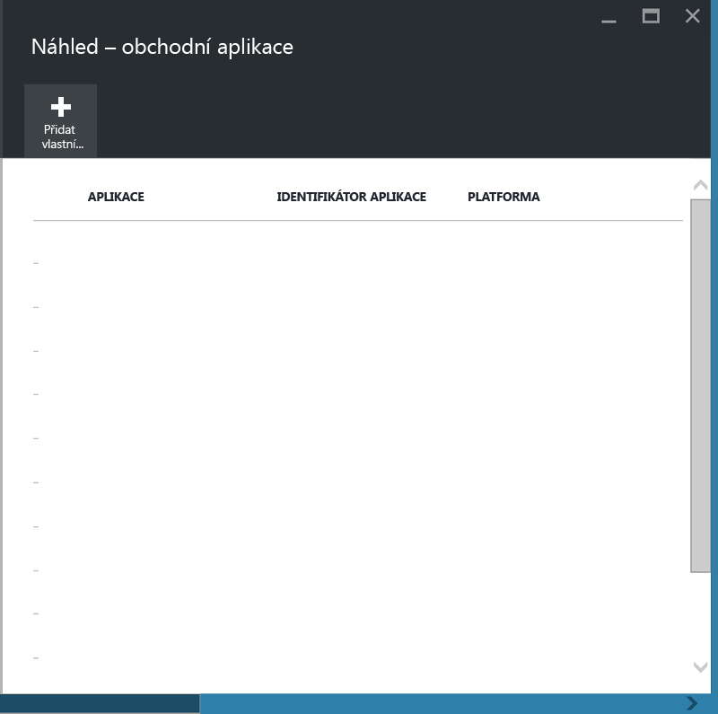
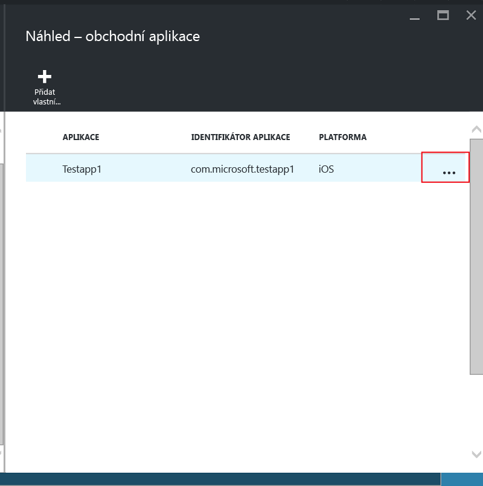

# Ochrana obchodních aplikací a dat na zařízeních, která nejsou zaregistrovaná v Microsoft Intune

Zásady správy mobilních aplikací (MAM) pomáhají chránit data společnosti tím, že omezují akce, které by mohly způsobit únik těchto dat, a vynucují požadavky pro přístup k datům, jako je například PIN aplikace. Pokud chcete zásady MAM použít u obchodních aplikací pro iOS nebo Android, musíte aplikace nejdřív zabalit pomocí nástroje Microsoft Intune App Wrapping.  Zabalení je proces, při kterém se pro aplikaci nastaví vrstva správy, aniž by bylo potřeba příslušnou aplikaci změnit.  Jakmile je aplikace zabalená, můžete pro ni nastavit zásady MAM a distribuovat ji koncovým uživatelům.  

Toto téma vysvětluje kroky nutné k použití zásad MAM pro aplikace, které jsou přístupné na **vlastních zařízení zaměstnanců, která nejsou spravovaná**, a na zařízeních, která jsou spravovaná pomocí **řešení správy mobilních zařízení (MAM) jiného výrobce**.  Příprava obchodních aplikací, které běží na **zařízeních zaregistrovaných v MDM Intune**, je popsaná v tématu [Rozhodování o způsobu přípravy aplikací na správu mobilních aplikací v Microsoft Intune](decide-how-to-prepare-apps-for-mobile-application-management-with-microsoft-intune.md).

##  Krok 1: Příprava aplikace
Před nasazením zásad MAM musíte aplikaci nejdřív zabalit pomocí nástroje Microsoft Intune App Wrapping.  Pokyny pro stažení a používání nástroje pro balení aplikací najdete na následujících stránkách:

- [Příprava aplikací pro iOS na správu mobilních aplikací pomocí nástroje Intune App Wrapping Tool](prepare-ios-apps-for-mobile-application-management-with-the-microsoft-intune-app-wrapping-tool.md) 
- [Příprava aplikací pro Android na správu mobilních aplikací pomocí nástroje Intune App Wrapping Tool](prepare-android-apps-for-mobile-application-management-with-the-microsoft-intune-app-wrapping-tool)

>[!IMPORTANT]  
>Tato verze nástroje pro balení aplikací s podporou zařízení, která nejsou zaregistrovaná v Intune, je podporovaná pro iOS a ve veřejné verzi Preview pro Android. Nástroj pro iOS si můžete stáhnout [z tohoto úložiště GitHub](https://github.com/msintuneappsdk/intune-app-wrapping-tool-ios) a pro Android [z tohoto úložiště GitHub](https://github.com/msintuneappsdk/intune-app-wrapper-android-preview).

## Krok 2: Přidání aplikace

Pokud chcete ke svým obchodním aplikacím přidružit zásady MAM, musíte do předplatného nebo tenanta Intune přidat informace o aplikaci, a to pomocí následujících kroků:

1. Na [portálu Azure](https://portal.azure.com/) přejděte na **Správa mobilních aplikací Intune > Nastavení** a zvolte **Obchodní aplikace**.

  

2. V okně **Obchodní aplikace** zvolte **Přidat vlastní aplikaci**.

  
3.  Zadejte název aplikace, identifikátor balíku (do pole Identifikátor aplikace) a platformu (iOS nebo Android).

   Tento krok vám pomůže vytvořit jedinečný popis aplikace.  Aplikace se také zobrazí v seznamu Cílové aplikace pro zásady MAM pro vašeho tenanta,jak popisuje následující krok.

## Krok 3: Použití zásad MAM
Jakmile se metadata aplikace odešlou do služby, aplikace se zobrazí v seznamu aplikací.  Nyní můžete [vytvořit novou zásadu nebo vzít už existující](create-and-deploy-mobile-app-management-policies-with-microsoft-intune.md) a použít ji pro obchodní aplikaci, kterou jste přidali v kroku 2.

>[!IMPORTANT]
>Zásady MAM je potřeba cílit na uživatele, kteří budou zabalenou aplikaci používat.  Uživatelé, kteří tuto zásadu nemají nasazenou, nebudou moct aplikaci používat.

  
## Krok 4: Distribuce aplikace
Aplikace můžete koncovým uživatelům nasadit následujícími způsoby:
* V případě zařízení zaregistrovaných v řešení MAM jiného výrobce můžete k distribuci aplikací využít toto řešení MDM.
* Pro zařízení nespravovaná žádným řešením MDM budete potřebovat vlastní řešení. Koncoví uživatelé si musí aplikaci stáhnout a nainstalovat do svého zařízení.

## Změna metadat
Pokud potřebujete změnit podrobnosti o aplikaci, jako je třeba název aplikace nebo identifikátor balíku, musíte [aplikaci odebrat](#remove-apps) a [přidat ji](#step-2-add-the-app) s novými metadaty.

##  Odebrání aplikací
Obchodní aplikaci můžete ze seznamu aplikací odebrat.  Tato operace odebere aplikaci ze seznamu a odebere přidružení se zásadami MAM. ale nezpůsobí odebrání nebo odinstalaci aplikace ze zařízení koncového uživatele.  

1.  Na [portálu Azure](https://portal.azure.com/) přejděte na **Správa mobilních aplikací Intune > Nastavení**.  V okně **Nastavení** zvolte **Obchodní**. Otevře se seznam stávajících aplikací.  
2.  Vyberte aplikaci, kterou chcete odebrat, a zvolte **kontextovou nabídku (…)**.

  
3.  Pokud chcete aplikaci odstranit, zvolte **Odstranit aplikaci**.

  

  Tato akce odebere aplikaci ze seznamu obchodních aplikací a ze seznamu cílových aplikací v zásadách MAM.

<!--HONumber=Sep16_HO4-->

