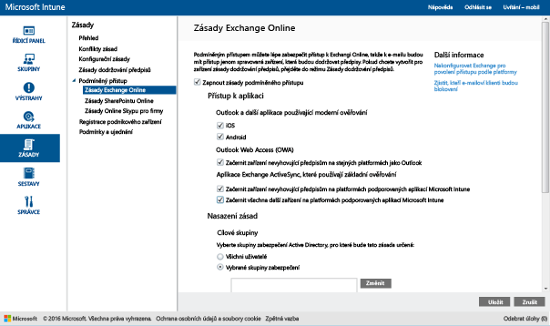

# Omezení přístupu k Exchangi Online a novému vyhrazeném prostředí Exchange Online s Intune

Pokud máte vyhrazené prostředí Exchange Online a potřebujete zjistit, jestli má novou, nebo starší verzi konfigurace, obraťte se prosím na správce svého účtu.

Pokud chcete řídit přístup k e-mailům na Exchangi Online nebo v novém vyhrazeném prostředí Exchange Online, nakonfigurujte v Intune podmíněný přístup k Exchangi Online.
Další informace o tom, jak podmíněný přístup funguje, najdete v článku o [omezení přístupu k e-mailu, O365 a dalším službám](restrict-access-to-email-and-o365-services-with-microsoft-intune.md).

**Než** nakonfigurujete podmíněný přístup:

-   Musíte mít **předplatné Office 365, které zahrnuje Exchange Online (třeba E3)**, a uživatelé musí mít licenci Exchange Online.

- Mít **předplatné Azure Active Directory Premium nebo Enterprise Mobility + Security** a uživatelé musí být licencovaní pro EMS nebo Azure AD. Další informace najdete na [stránce s cenami služby Enterprise Mobility](https://www.microsoft.com/en-us/cloud-platform/enterprise-mobility-pricing) nebo na [stránce s cenami služby Azure Active Directory](https://azure.microsoft.com/en-us/pricing/details/active-directory/).

-  Zvažte nakonfigurování nepovinného **konektoru Service to Service Connector Microsoft Intune**, který bude zajišťovat připojení [!INCLUDE[wit_nextref](../includes/wit_nextref_md.md)] k Microsoft Exchangi Online a prostřednictvím konzoly [!INCLUDE[wit_nextref](../includes/wit_nextref_md.md)] vám pomůže se správou informací o zařízení. K používání zásad dodržování předpisů nebo zásad podmíněného přístupu tento konektor potřeba není, vyžaduje se ale ke spouštění sestav, které pomáhají hodnotit dopad podmíněného přístupu.

   > [!NOTE]
   > Pokud chcete používat podmíněný přístup pro Exchange Online i místní Exchange, konektor Service to Service Connector nekonfigurujte.

   Pokyny ke konfiguraci konektoru naleznete v tématu věnovaném [konektoru Service to Service Connector služby Intune](intune-service-to-service-exchange-connector.md).

Pokud jsou pro určitého uživatele nakonfigurované zásady podmíněného přístupu, může se tento uživatel připojit k e-mailu teprve tehdy, když jeho **zařízení** splňuje tyto požadavky:

-   Musí být **zaregistrované** ve službě [!INCLUDE[wit_nextref](../includes/wit_nextref_md.md)] nebo v počítači připojeném k doméně.

-  **Musí být zaregistrované v Azure Active Directory**. K tomu automaticky dojde při registraci zařízení ve službě [!INCLUDE[wit_nextref](../includes/wit_nextref_md.md)]. Kromě toho musí být ve službě Azure Active Directory zaregistrované ID protokolu Exchange ActiveSync klienta.

  Pro zákazníky Intune a Office 365 je služba AAD DRS aktivovaná automaticky. Zákazníci, kteří už mají nasazenou službu AD FS Device Registration Service, registrovaná zařízení ve svojí místní službě Active Directory neuvidí.

-   Musí být **v souladu** s jakoukoli zásadou dodržování předpisů [!INCLUDE[wit_nextref](../includes/wit_nextref_md.md)] nasazenou na toto zařízení nebo připojené k místní doméně.

Pokud se nevyhoví některé zásadě podmíněného přístupu, zobrazí se uživateli při přihlášení jedna z následujících zpráv:

- Pokud není zařízení zaregistrované v [!INCLUDE[wit_nextref](../includes/wit_nextref_md.md)] nebo v Azure Active Directory, zobrazí se zpráva s pokyny k instalaci aplikace Portál společnosti, registraci zařízení a aktivaci e-mailu. Tento proces také přidruží ID protokolu Exchange ActiveSync zařízení k záznamu v Azure Active Directory.

-   Pokud není zařízení vyhodnoceno jako zařízení vyhovující pravidlům zásad dodržování předpisů, je koncový uživatel přesměrován na web Portál společnosti služby [!INCLUDE[wit_nextref](../includes/wit_nextref_md.md)] nebo na aplikaci Portál společnosti, kde může najít informace o problému a jeho řešení.

Následující diagram znázorňuje tok používaný v rámci zásad podmíněného přístupu pro Exchange Online.

## Podpora mobilních zařízení
Můžete omezit přístup k e-mailům na Exchangi Online z **Outlooku** a dalších **aplikací, které využívají moderní ověřování**:-

- Android 4.0 a novější, Samsung Knox Standard 4.0 a novější a Android for Work
- iOS 8.0 a novější
- Windows Phone 8.1 nebo novější

[!INCLUDE[wit_nextref](../includes/afw_rollout_disclaimer.md)]

**Moderní ověřování** integruje do klientů Microsoft Office přihlašování založené na knihovně ADAL (Active Directory Authentication Library).

-   Ověřování na základě knihovny ADAL umožňuje pro klienty Office používat ověřování založené na prohlížeči (označuje se také jako pasivní ověřování).  Aby bylo možné uživatele ověřit, uživatel se přesměruje na přihlašovací webovou stránku. Tato nová metoda přihlašování umožňuje využívat lepší způsoby zabezpečení, jako je **vícefaktorové ověření** a **ověřování na základě certifikátu**.
Tento [článek](https://support.office.com/en-US/article/How-modern-authentication-works-for-Office-2013-and-Office-2016-client-apps-e4c45989-4b1a-462e-a81b-2a13191cf517) obsahuje podrobnější informace o tom, jak moderní ověřování funguje.
Instalační ADFS nastavuje pravidla pro blokování jiných než moderních ověřovacích protokolů. Podrobné pokyny jsou uvedené ve scénáři 3 – [Blokování veškerého přístupu k O365 kromě aplikací využívajících prohlížeč](https://technet.microsoft.com/library/dn592182.aspx).

Můžete omezit přístup k aplikaci **Outlook Web Access (OWA)** v Exchange Online při přístupu z prohlížeče v zařízení s **iOS** a **Androidem**.  Přístup bude povolen pouze z podporovaných prohlížečů ve vyhovujících zařízeních:

* Safari (iOS)
* Chrome (Android)
* Managed Browser (iOS a Android 5.0 nebo novější)

**Nepodporované prohlížeče budou zablokovány**.

**Aplikaci OWA pro iOS a Android je možné upravit tak, aby nepoužívala moderní ověřování, a proto není podporovaná.  Přístup z aplikace OWA je potřeba zablokovat pravidly deklarace identity ADFS.**

Přístup k e-mailu na Exchangi můžete omezit z integrovaného **e-mailového klienta Exchange ActiveSync** na následujících platformách:

- Android 4.0 nebo novější, Samsung Knox Standard 4.0 nebo novější

- iOS 8.0 a novější

- Windows Phone 8.1 nebo novější

## Podpora počítačů

Podmíněný přístup se dá nastavit pro počítače, které používají desktopové aplikace Office pro přístup k **Exchangi Online** a **SharePointu Online** a splňují následující požadavky:

-   V počítači musí být systém Windows 7.0, Windows 8.1 nebo Windows 10.

  >[!NOTE]
  > Pokud chcete použít podmíněný přístup u počítačů s Windows 10, musíte je aktualizovat na verzi Windows 10 Anniversary Update.

  Počítač musí být buď připojený k doméně, nebo musí splňovat pravidla zásad dodržování předpisů.

  Počítač splňuje požadavky tehdy, když je zaregistrovaný ve službě [!INCLUDE[wit_nextref](../includes/wit_nextref_md.md)] a je v souladu se zásadami.

  V případě počítačů připojených k doméně musíte zařízení nastavit tak, aby se [zařízení automaticky zaregistrovalo](https://azure.microsoft.com/documentation/articles/active-directory-conditional-access-automatic-device-registration/) do služby Azure Active Directory.

  >[!NOTE]
    >Podmíněný přístup není podporován na počítačích, ve kterých běží klient Intune pro počítače.

-   [Musí být povolené moderní ověřování Office 365](https://support.office.com/en-US/article/Using-Office-365-modern-authentication-with-Office-clients-776c0036-66fd-41cb-8928-5495c0f9168a) a musí být dostupné nejnovější aktualizace Office.

    Moderní ověřování poskytuje klientům Office 2013 Windows přihlašování založené na ADAL (Active Directory Authentication Library) a umožňuje lepší zabezpečení, jako je **vícefaktorové ověřování** a **ověřování prostřednictvím certifikátu**.

-   Nastavte pravidla deklarací služby AD FS pro blokování jiných než moderních ověřovacích protokolů. Podrobné pokyny jsou uvedené ve scénáři 3 – [Blokování veškerého přístupu k O365 kromě aplikací využívajících prohlížeč](https://technet.microsoft.com/library/dn592182.aspx).

## Konfigurace podmíněného přístupu
### Krok 1: Konfigurace a nasazení zásad dodržování předpisů
Zajistěte, aby byly pro skupiny uživatelů, které získají zásady podmíněného přístupu, [vytvořeny](create-a-device-compliance-policy-in-microsoft-intune.md) a [nasazeny](deploy-and-monitor-a-device-compliance-policy-in-microsoft-intune.md) zásady dodržování předpisů.

> [!IMPORTANT]
> Pokud jste zásady dodržování předpisů nenasadili, budou se zařízení považovat za zařízení v souladu s předpisy a bude jim povolen přístup k Exchangi.

### Krok 2: Vyhodnoťte efekt zásad podmíněného přístupu.
Pomocí **Sestav inventáře mobilních zařízení** můžete identifikovat zařízení, která mohou mít po nakonfigurování zásad podmíněného přístupu blokovaný přístup k Exchangi.

Pokud to budete chtít provést, nakonfigurujte připojení mezi [!INCLUDE[wit_nextref](../includes/wit_nextref_md.md)] a Exchangem pomocí [konektoru Service to Service služby Microsoft Intune](intune-service-to-service-exchange-connector.md).
1.  Přejděte na **Sestavy -> Sestavy inventáře mobilních zařízení**.

2.  V parametrech sestavy vyberte skupinu [!INCLUDE[wit_nextref](../includes/wit_nextref_md.md)], kterou chcete vyhodnotit, a v případě potřeby platformy zařízení, na které se zásady budou vztahovat.
3.  Po dokončení výběru kritérií vyhovujících potřebám vaší organizace vyberte **Zobrazit sestavu**.
Prohlížeč sestav se otevře v novém okně.

Po spuštění sestavy zkontrolujte tyto čtyři sloupce, abyste zjistili, jestli bude uživatel blokovaný:

-   **Kanál pro správu** – Určuje, jestli se zařízení spravuje ve službě Intune, Exchange ActiveSync, nebo v obou.

-   **Zaregistrováno v AAD** – Určuje, jestli je zařízení zaregistrované v Azure Active Directory (označuje se jako připojení pracovního místa).

-   **Vyhovuje** – Určuje, jestli zařízení splňuje vámi nasazené zásady dodržování předpisů.

-   **ID protokolu Exchange ActiveSync** – U zařízení s iOS a Androidem se vyžaduje, aby měla ID protokolu Exchange ActiveSync přidružené záznamy registrace zařízení v Azure Active Directory. K tomu dojde, když uživatel vybere odkaz **Aktivace e-mailu** v e-mailu s oznámením o umístění do karantény.

    > [!NOTE]
    > Zařízení Windows Phone v tomto sloupci vždycky zobrazí hodnotu.

Zařízením, která jsou součástí cílové skupiny, se bude blokovat přístup k Exchangi, pokud se hodnoty ve sloupcích nebudou shodovat s hodnotami uvedenými v této tabulce:

--------------------------
|Kanál pro správu|Zaregistrováno v AAD|Vyhovuje|ID protokolu Exchange ActiveSync|Výsledná akce|
|----------------------|------------------|-------------|--------------------------|--------------------|
|**Spravuje se v Microsoft Intune a Exchange ActiveSync**|Ano|Ano|Je zobrazená hodnota|Přístup k e-mailu je povolený|
|Jakákoli jiná hodnota|Ne|Ne|Není zobrazená žádná hodnota|Přístup k e-mailu je blokovaný|
----------------------
Obsah sestavy můžete vyexportovat a použít sloupec **E-mailová adresa** k informování uživatelů o tom, že budou blokovaní.

### Krok 3: Nakonfigurujte skupiny uživatelů pro zásady podmíněného přístupu.
Zásady podmíněného přístupu jsou cíleny na různé skupiny uživatelů, které jsou skupinami zabezpečení Azure Active Directory. Z této zásady také můžete určité skupiny uživatelů vyloučit.  Pokud je uživatel cílem zásady, musí každé jím používané zařízení splňovat zásady, aby měl přístup k e-mailu.

Tyto skupiny můžete nakonfigurovat v **Centru pro správu Office 365**nebo na **Portálu účtů Intune**.

V každé zásadě můžete určit dva typy skupin:

-   **Cílové skupiny** – skupiny uživatelů, pro které zásady platí

-   **Vyloučené skupiny** – skupiny uživatelů, kteří jsou ze zásad vyloučení (volitelné)

Pokud je uživatel v obou skupinách, bude ze zásad vyloučený.

Vyhodnocují se jenom skupiny, které jsou cílem zásad podmíněného přístupu.

### Krok 4: Konfigurace zásad podmíněného přístupu

>[!NOTE]
> Zásady podmíněného přístupu můžete vytvořit i v konzole pro správu Azure AD. Přes konzolu pro správu Azure AD můžete vytvářet i zásady podmíněného přístupu pro zařízení Intune (v Azure AD označované jako **zásady podmíněného přístupu založené na zařízení**), kromě jiných zásad podmíněného přístupu, jako je například vícefaktorové ověřování.  Taky můžete nastavit zásady podmíněného přístupu pro podnikové aplikace třetích stran, jako je například Salesforce nebo Box, které služba Azure AD podporuje. Další informace najdete v tématu [Jak ve službě Azure Active Directory nastavit zásady podmíněného přístupu založené na zařízení a získat tak kontrolu přístupu do aplikací napojených na službu Azure Active Directory](https://azure.microsoft.com/en-us/documentation/articles/active-directory-conditional-access-policy-connected-applications/).

1.  V [konzole pro správu Microsoft Intune](https://manage.microsoft.com) vyberte **Zásady** > **Podmíněný přístup** > **Zásady pro Exchange Online**.

2.  Na stránce **Zásady Exchange Online** vyberte možnost **Zapnout zásady podmíněného přístupu pro Exchange Online**.

    > [!NOTE]
    > Pokud jste zásady dodržování předpisů nenasadili, jsou zařízení považována za zařízení vyhovující zásadám dodržování předpisů.
    >
    > Bez ohledu na stav dodržování předpisů se u všech uživatelů, na které jsou zásady zacílené, bude vyžadovat, aby svá zařízení zaregistrovali ve službě [!INCLUDE[wit_nextref](../includes/wit_nextref_md.md)].

3.  V části **Přístup k aplikaci** máte pro aplikace, které využívají moderní ověřování, dva způsoby volby platforem, pro které mají zásady platit. Podporovány jsou mimo jiné následující platformy: Android, iOS, Windows a Windows Phone.

    -   **Všechny platformy**

        To vyžaduje, aby každé zařízení používané k přístupu k **Exchangi Online** bylo registrované v Intune a dodržovalo tyto zásady.  Každá klientská aplikace používající **moderní ověřování** je předmětem zásad podmíněného přístupu a pokud platforma není aktuálně podporovaná Intune, přístup k **Exchangi Online** je blokovaný.

        Výběr volby **Všechny platformy** způsobí, že Azure Active Directory uplatní tyto zásady na všechny požadavky na ověření bez ohledu na platformu, která je ohlášena klientskou aplikací.  Pro všechny platformy bude vyžadována registrace a shoda s výjimkou následujících bodů:
        *   Zařízení s Windows budou muset být zaregistrovaná a vyhovující, doména bude muset být spojena s místním Active Directory nebo obojí
        * Nepodporované platformy jako Mac OS.  Aplikace používající moderní ověřování pocházející z těchto platforem však budou i nadále zablokovány.

    -   **Specifické platformy**

         Zásady podmíněného přístupu se použijí na každou klientskou aplikaci, která na platformách zařízení, které určíte, používá **moderní ověřování**.

4. V části **Outlook Web Access (OWA)** můžete zvolit povolení přístupu k Exchange Online pouze prostřednictvím podporovaných prohlížečích: Safari (iOS) a Chrome (Android). Přístup z jiných prohlížečů bude blokován. Omezení platformy, která jste vybrali pro přístup z aplikace pro Outlook, budou použita i zde.

  V zařízeních s **Androidem** musí uživatelé povolit přístup pro prohlížeč.  Při tomto postupu musí koncový uživatel povolit možnost „Povolit přístup z prohlížeče“ v zaregistrovaném zařízení následujícím způsobem:
  1.    Spusťte **aplikaci Portál společnosti**.
  2.    Přejděte na stránku **Nastavení** stránku prostřednictvím tlačítka se třemi tečkami (...) nebo hardwarového tlačítka nabídky.
  3.    Stiskněte tlačítko **Povolit přístup z prohlížeče**.
  4.    V prohlížeči Chrome se odhlaste z Office 365 a znovu spusťte Chrome.

  Na platformách **iOS a Android**: Kvůli identifikaci zařízení použitého pro přístup ke službě vydá Azure Active Directory pro příslušné zařízení certifikát TLS (Transport Layer Security).  Zařízení zobrazí certifikát s výzvou pro koncového uživatele k výběru certifikát, jak je vidět na následujících snímcích obrazovky. Předtím, než bude moci pokračovat v používání prohlížeče, musí koncový uživatel vybrat certifikát.

  **iOS**

  

  **Androidemem**

  

5.  V části **Aplikace Exchange ActiveSync** se můžete rozhodnout blokovat zařízením, která nesplňují zásady dodržování předpisů, přístup na Exchange Online. Můžete také zvolit, jestli chcete povolit nebo blokovat přístup k e-mailu, pokud zařízení neběží na podporované platformě. Podporovány jsou mimo jiné následující platformy: Android, iOS, Windows a Windows Phone.

 Zařízení s **Androidem for Work** s aplikacemi Exchange Active Sync:
 -  Na zařízeních s Androidem for Work se v **pracovním profilu** podporují jenom aplikace **Gmail** a **Nine Work**. Aby na zařízeních s Androidem for Work fungoval podmíněný přístup, musíte nasadit e-mailový profil pro aplikaci Gmail nebo Nine Work a zároveň ji nasadit jako **požadovanou** instalaci.

6.  V části **Cílové skupiny**vyberte skupiny zabezpečení Active Directory uživatelů, na které se zásady vztahují. Můžete cílit na všechny uživatele nebo vybraný seznam skupin uživatelů.

    > [!NOTE]
    > Pro uživatele, kteří jsou v **cílových skupinách**, nahradí zásady Intune pravidla a zásady Exchange.
    >
    > Exchange bude vynucovat pravidla Exchange pro povolování, blokování a karanténu a zásady Exchange jenom v těchto případech:
    >
    > -   Uživatel nemá licenci na službu Intune.
    > -   Uživatel má licenci na službu Intune, ale nepatří do žádné skupiny zabezpečení, na kterou cílí zásady podmíněného přístupu.

6.  V části **Vyloučené skupiny**vyberte skupiny zabezpečení Active Directory uživatelů, kteří jsou z těchto zásad vyloučení. Pokud je uživatel v cílových skupinách i ve vyloučených skupinách, bude ze zásady vyloučený.

7.  Po dokončení vyberte **Uložit**.

-   Zásady podmíněného přístupu není potřeba nasazovat, projeví se okamžitě.

-   Jakmile uživatel vytvoří e-mailový účet, zařízení se okamžitě zablokuje.

-   Pokud blokovaný uživatel zařízení zaregistruje ve [!INCLUDE[wit_nextref](../includes/wit_nextref_md.md)] a odstraní problémy, které způsobují, že zařízení nesplňuje zásady dodržování předpisů, odblokuje se přístup k e-mailu během 2 minut.

-   Pokud uživatel zruší registraci svého zařízení, e-mail se zablokuje zhruba po 6 hodinách.

**Pokud se chcete podívat na ukázkové scénáře konfigurace zásad podmíněného přístupu, kterými můžete omezit přístup zařízení, prohlédněte si [ukázkové scénáře omezení přístupu k e-mailům](restrict-email-access-example-scenarios.md).**

## Sledování dodržování předpisů a zásad podmíněného přístupu

#### Zobrazení zařízení, která jsou blokovaná systémem Exchange

Na řídicím panelu [!INCLUDE[wit_nextref](../includes/wit_nextref_md.md)] zvolte dlaždici **Zařízení blokovaná systémem Exchange** a zobrazte počet blokovaných zařízení a odkazy na další informace.

## Další kroky
[Omezení přístupu k SharePointu Online](restrict-access-to-sharepoint-online-with-microsoft-intune.md)

[Omezení přístupu k Online Skypu pro firmy](restrict-access-to-skype-for-business-online-with-microsoft-intune.md)

<!--HONumber=Nov16_HO1-->

