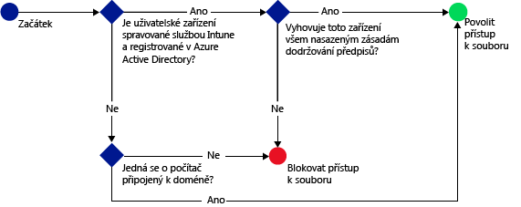

# Omezení přístupu ke službě SharePoint Online pomocí Microsoft Intune
Pro řízení přístupu k souborům umístěným ve službě SharePoint online použijte podmíněný přístup [!INCLUDE[wit_firstref](../includes/wit_firstref_md.md)].
Podmíněný přístup má dvě součásti:
- Zásady dodržování předpisů zařízení, které zařízení musí dodržovat, aby mohlo být považované za vyhovující.
- Zásady podmíněného přístupu, kde můžete určit podmínky, které zařízení musí splňovat pro přístup ke službě.
Další informace o tom, jak podmíněný přístup funguje, najdete v tématu ohledně [omezení přístupu k e-mailu, O365 a dalším službám](restrict-access-to-email-and-o365-services-with-microsoft-intune.md).

Zásady dodržování předpisů a podmíněného přístupu se nasadí pro uživatele. Jakékoli zařízení, které uživatel používá pro přístup ke službám, se kontroluje na dodržování předpisů se zásadami.

Když se uživatel na svém zařízení pokusí připojit k souboru pomocí podporované aplikace, jako je třeba OneDrive, dojde k následujícímu vyhodnocení:

**Dřív** než nakonfigurujete zásady podmíněného přístupu pro SharePoint Online, musíte:
- Mít předplatné **SharePointu Online** a uživatelé musí mít licenci SharePointu Online.
- Mít **předplatné Azure Active Directory Premium nebo Enterprise Mobility + Security** a uživatelé musí být licencovaní pro EMS nebo Azure AD. Další informace najdete na [stránce s cenami služby Enterprise Mobility](https://www.microsoft.com/en-us/cloud-platform/enterprise-mobility-pricing) nebo na [stránce s cenami služby Azure Active Directory](https://azure.microsoft.com/en-us/pricing/details/active-directory/).

  Pro připojení k požadovaným souborům zařízení:
-   Musí být **zaregistrované** ve službě [!INCLUDE[wit_nextref](../includes/wit_nextref_md.md)] nebo se musí jednat o počítač připojený k doméně.

-   **Zaregistrujte zařízení** v Azure Active Directory (k tomu automaticky dojde při registraci zařízení ve službě [!INCLUDE[wit_nextref](../includes/wit_nextref_md.md)]).

-   Musí splňovat veškeré nasazené zásady dodržování předpisů [!INCLUDE[wit_nextref](../includes/wit_nextref_md.md)].

Stav zařízení je uložený ve službě Azure Active Directory, která uděluje nebo blokuje přístup k souborům na základě podmínek, které zadáte.

Pokud není podmínka splněná, zobrazí se uživateli při přihlášení jedna z následujících zpráv:

-   Pokud zařízení není zaregistrované v [!INCLUDE[wit_nextref](../includes/wit_nextref_md.md)] nebo v Azure Active Directory, zobrazí se zpráva s pokyny pro instalaci aplikace Portál společnosti a registraci.

-   Pokud zařízení není kompatibilní, zobrazí se zpráva, která uživatele přesměruje na web Portál společnosti [!INCLUDE[wit_nextref](../includes/wit_nextref_md.md)] , kde najde informace o problému a jeho řešení.

**Podmíněný přístup se nevztahuje na externí sdílení**. Informace o tom, jak zabránit externímu sdílení ve vašem tenantovi nebo kolekci webů, najdete v tématu [Správa externích sdílení pro prostředí SharePointu Online](https://support.office.com/en-us/article/Manage-external-sharing-for-your-SharePoint-Online-environment-C8A462EB-0723-4B0B-8D0A-70FEAFE4BE85?ui=en-US&rs=en-US&ad=US).

>[!NOTE]
>Pokud povolíte podmíněný přístup pro SharePoint Online, doporučujeme zakázat doménu v seznamu, jak je popsáno v tématu [Remove-SPOTenantSyncClientRestriction](https://technet.microsoft.com/en-us/library/dn917451.aspx).  

## Podpora mobilních zařízení
- iOS 8.0 a novější
- Android 4.0 nebo novější, Samsung Knox Standard 4.0 nebo novější
- Windows Phone 8.1 nebo novější

Můžete omezit přístup k SharePoint Online při přístupu z prohlížeče v zařízení s **iOS** a **Androidem**.  Přístup bude povolen pouze z podporovaných prohlížečů ve vyhovujících zařízeních:
* Safari (iOS)
* Chrome (Android)
* Managed Browser (iOS a Android 5.0 nebo novější)

**Nepodporované prohlížeče budou zablokovány**.

## Podpora počítačů
- Windows 8.1 nebo novější (při registraci v Intune)
- Windows 7.0, Windows 8.1 nebo Windows 10 (při připojení k doméně)
> [!NOTE]
>Pokud chcete použít podmíněný přístup u počítačů s Windows 10, musíte je aktualizovat na verzi Windows 10 Anniversary Update.

  - Pro počítače připojené k doméně musíte nastavit [automatickou registraci](https://azure.microsoft.com/en-us/documentation/articles/active-directory-conditional-access-automatic-device-registration/) v Azure Active Directory.
Pro zákazníky Intune a Office 365 je služba AAD DRS aktivovaná automaticky. Zákazníci, kteří už mají nasazenou službu AD FS Device Registration Service, registrovaná zařízení ve svojí místní službě Active Directory neuvidí.

  - Pokud je zásada nastavená tak, aby vyžadovala připojení k doméně, a počítač k doméně připojený není, zobrazí se zpráva, aby uživatel kontaktoval správce IT.

  - Pokud je zásada nastavená tak, aby vyžadovala připojení k doméně nebo splňování předpisů, a počítač ani jeden z těchto požadavků nesplňuje, zobrazí se zpráva s pokyny, jak nainstalovat aplikaci Portál společnosti a provést registraci.
  >[!NOTE]
  >Podmíněný přístup není podporován na počítačích, ve kterých běží klient Intune pro počítače.

-    [Musí být povolené moderní ověřování Office 365](https://support.office.com/en-US/article/Using-Office-365-modern-authentication-with-Office-clients-776c0036-66fd-41cb-8928-5495c0f9168a) a musí být dostupné nejnovější aktualizace Office.

    Moderní ověřování poskytuje klientům Office 2013 Windows přihlašování založené na ADAL (Active Directory Authentication Library) a umožňuje lepší zabezpečení, jako je **vícefaktorové ověřování** a **ověřování prostřednictvím certifikátu**.

## Konfigurace podmíněného přístupu pro SharePoint Online

### Krok 1: Konfigurace skupin zabezpečení služby Active Directory
Než začnete, nakonfigurujte pro skupiny zabezpečení služby Azure Active Directory zásadu podmíněného přístupu. Tyto skupiny můžete nakonfigurovat v **Centru pro správu Office 365**nebo na **Portálu účtů Intune**. Tyto skupiny se použijí k cílení nebo vyloučení uživatelů ze zásady. Pokud je uživatel cílem zásady, musí každé jím používané zařízení splňovat zásady, aby měl přístup k prostředkům.

V rámci zásad SharePointu Online můžete zadat dva typy skupin:

-   **Cílové skupiny** – Skupiny uživatelů, na které se má zásada aplikovat.

-   **Vyloučené skupiny** – Skupiny uživatelů, kteří jsou ze zásady vyloučeni.

Pokud je uživatel v obou skupinách, bude ze zásad vyloučený.

### Krok 2: Konfigurace a nasazení zásad dodržování předpisů
Pokud jste to ještě neudělali, vytvořte a nasaďte zásady dodržování předpisů pro uživatele, na které bude zásada SharePointu Online cílit.

> [!NOTE]
> Zásady dodržování předpisů se nasadí do skupin [!INCLUDE[wit_nextref](../includes/wit_nextref_md.md)] a zásady podmíněného přístupu cílí na skupiny zabezpečení služby Azure Active Directory.

Podrobnosti o konfiguraci zásad dodržování předpisů najdete v tématu věnovaném [vytvoření zásad dodržování předpisů](create-a-device-compliance-policy-in-microsoft-intune.md).

> [!IMPORTANT]
> Pokud jste zásady dodržování předpisů nenasadili, budou se zařízení považovat za vyhovující.

Až budete připravení, pokračujte **Krokem 3**.

### Krok 3: Konfigurace zásad SharePointu Online
V dalším kroku nakonfigurujte zásadu, která bude vyžadovat, aby měla k SharePointu Online přístup jenom spravovaná zařízení, která jsou v souladu s předpisy. Tato zásada bude uložená v Azure Active Directory.

#### 

>[!NOTE]
> Zásady podmíněného přístupu můžete vytvořit i v konzole pro správu Azure AD. Přes konzolu pro správu Azure AD můžete vytvářet i zásady podmíněného přístupu pro zařízení Intune (v Azure AD označované jako **zásady podmíněného přístupu založené na zařízení**), kromě jiných zásad podmíněného přístupu, jako je například vícefaktorové ověřování.  Taky můžete nastavit zásady podmíněného přístupu pro podnikové aplikace třetích stran, jako je například Salesforce nebo Box, které služba Azure AD podporuje. Další informace najdete v tématu [Jak ve službě Azure Active Directory nastavit zásady podmíněného přístupu založené na zařízení a získat tak kontrolu přístupu do aplikací napojených na službu Azure Active Directory](https://azure.microsoft.com/en-us/documentation/articles/active-directory-conditional-access-policy-connected-applications/).

1.  V [konzole pro správu Microsoft Intune](https://manage.microsoft.com) zvolte **Zásady** > **Podmíněný přístup** > **Zásady pro SharePoint Online**.

2.  Vyberte **Zapnout zásady podmíněného přístupu pro SharePoint Online**.

3.  V části **Přístup k aplikaci** můžete použít zásady podmíněného přístupu na:

    -   **Všechny platformy**

        To vyžaduje, aby každé zařízení používané pro přístup k **SharePointu Online** bylo registrované v Intune a dodržovalo tyto zásady.  Všechny klientské aplikace používající **moderní ověřování** podléhají zásadám podmíněného přístupu. Pokud Intune příslušnou platformu aktuálně nepodporuje, přístup k **SharePointu Online** je zablokovaný.

        Výběr volby **Všechny platformy** způsobí, že Azure Active Directory uplatní tyto zásady na všechny požadavky na ověření bez ohledu na platformu, která je ohlášena klientskou aplikací.  Pro všechny platformy bude vyžadována registrace a shoda s výjimkou následujících bodů:
        *   Zařízení s Windows budou muset být zaregistrovaná a vyhovující, doména bude muset být spojena s místním Active Directory nebo obojí
        * Nepodporované platformy jako Mac.  Aplikace používající moderní ověřování pocházející z těchto platforem však budou i nadále zablokovány.

    -   **Specifické platformy**

         Zásady podmíněného přístupu se použijí na každou klientskou aplikaci, která na určených platformách zařízení používá moderní ověřování.

     Počítače s Windows musí buď připojené k doméně, nebo zaregistrované v [!INCLUDE[wit_nextref](../includes/wit_nextref_md.md)] a v souladu s předpisy. Můžete nastavit následující požadavky:

     -   **Zařízení musí být přidané do domény nebo vyhovovat předpisům.** Tuto možnost vyberte, pokud chcete, aby počítače byly buď připojené k doméně, nebo splňovaly zásady nastavené v [!INCLUDE[wit_nextref](../includes/wit_nextref_md.md)]. Pokud počítač některý z těchto požadavků nesplňuje, zobrazí se uživateli výzva k registraci zařízení ve službě [!INCLUDE[wit_nextref](../includes/wit_nextref_md.md)].

     -   **Zařízení musí být přidané do domény.** Tuto možnost vyberte, pokud chcete, aby počítače musely být pro přístup k Exchangi Online připojené k doméně. Pokud počítač není připojený k doméně, je přístup k e-mailu blokovaný a uživatel je vyzván, aby se obrátil na správce IT.

     -   **Zařízení musí splňovat předpisy.** Tuto možnost vyberte, pokud chcete, aby počítače musely být zaregistrované v [!INCLUDE[wit_nextref](../includes/wit_nextref_md.md)] a splňovat předpisy. Pokud počítač není zaregistrovaný, zobrazí se zpráva s pokyny, jak registraci provést.

4.   V části **Přístup z prohlížeče** pro SharePoint Online a OneDrive pro firmy můžete zvolit povolení přístupu k Exchange Online pouze prostřednictvím podporovaných prohlížečích: Safari (iOS) a Chrome (Android). Přístup z jiných prohlížečů bude blokován.  Omezení platformy, která jste vybrali pro přístup z aplikace pro OneDrive, budou použita i zde.

  V zařízeních s **Androidem** musí uživatelé povolit přístup pro prohlížeč.  Při tomto postupu musí koncový uživatel povolit možnost „Povolit přístup z prohlížeče“ v zaregistrovaném zařízení následujícím způsobem:
  1.    Spusťte **aplikaci Portál společnosti**.
  2.    Přejděte na stránku **Nastavení** stránku prostřednictvím tlačítka se třemi tečkami (...) nebo hardwarového tlačítka nabídky.
  3.    Stiskněte tlačítko **Povolit přístup z prohlížeče**.
  4.  V prohlížeči Chrome se odhlaste z Office 365 a znovu spusťte Chrome.

  Na platformách **iOS a Android**: Kvůli identifikaci zařízení použitého pro přístup ke službě vydá Azure Active Directory pro příslušné zařízení certifikát TLS (Transport Layer Security).  Zařízení zobrazí certifikát s výzvou pro koncového uživatele k výběru certifikát, jak je vidět na následujících snímcích obrazovky. Předtím, než bude moci pokračovat v používání prohlížeče, musí koncový uživatel vybrat certifikát.

  **iOS**

  

  **Androidemem**

  
5.  V části **Cílové skupiny** zvolte **Upravit** a vyberte skupiny zabezpečení Azure Active Directory, na které se zásady vztahují. Můžete cílit na všechny uživatele nebo vybrané skupiny uživatelů.

6.  V případě potřeby v části **Vyloučené skupiny** zvolte **Upravit** a vyberte skupiny zabezpečení Azure Active Directory, na které se tyto zásady nevztahují.

6.  Po dokončení vyberte **Uložit**.

Zásady podmíněného přístupu není potřeba nasazovat, projeví se okamžitě.

### Krok 4: Sledování dodržování předpisů a zásad podmíněného přístupu
V pracovním prostoru **Skupiny** se můžete podívat na stav svých zařízení.

Vyberte libovolnou skupinu mobilních zařízení a pak na kartě **Zařízení** vyberte jeden z následujících **filtrů**:

-   **Zařízení nezaregistrovaná v AAD:** Tato zařízení jsou na SharePointu Online blokovaná.

-   **Zařízení nevyhovující předpisům:** Tato zařízení jsou na SharePointu Online blokovaná.

-   **Zařízení zaregistrovaná v AAD a vyhovující předpisům:** Tato zařízení mají přístup k SharePointu Online.

### Viz taky
[Omezení přístupu k e-mailu a službám O365 pomocí Microsoft Intune](restrict-access-to-email-and-o365-services-with-microsoft-intune.md)

<!--HONumber=Nov16_HO4-->

