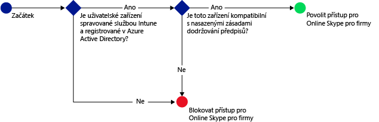
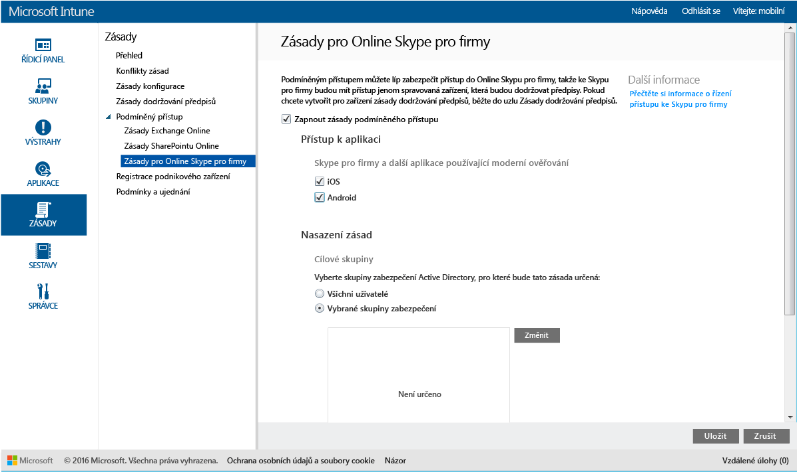

# Omezení přístupu ke službě Online Skype pro firmy pomocí Microsoft Intune
Použijte zásady podmíněného přístupu ke službě **Online Skype pro firmy** k ovládání přístupu ke službě Online Skype pro firmy.
Podmíněný přístup má dvě součásti:
- Zásady dodržování předpisů zařízení, které zařízení musí dodržovat, aby mohlo být považované za vyhovující.
- Zásady podmíněného přístupu, kde můžete určit podmínky, které zařízení musí splňovat pro přístup ke službě.
Další informace o tom, jak podmíněný přístup funguje, najdete v článku o [omezení přístupu k e-mailu a službám O365](restrict-access-to-email-and-o365-services-with-microsoft-intune.md).

Když se cílový uživatel na svém zařízení pokusí použít službu Online Skype pro firmy Skype for Business Online, dojde k následujícímu vyhodnocení:

**Dřív** než nakonfigurujete zásady podmíněného přístupu pro Online Skype pro firmy, musíte:
- Mít **předplatné Online Skype pro firmy ** a přiřadit licenci Online Skype pro firmy uživatelům.
- Mít předplatné **Enterprise Mobility Suite** nebo **Azure Active Directory Premium**.
-   [Povolit moderní ověřování](https://docs.microsoft.com/en-us/intune/deploy-use/restrict-access-to-skype-for-business-online-with-microsoft-intune) pro Online Skype pro firmy.
-  Všichni koncoví uživatelé musí používat **Online Skype pro firmy**. Pokud máte nasazení s Online Skypem pro firmy i místním Skypem pro firmy, zásady podmíněného přístupu se na koncové uživatele nepoužijí.

    Zařízení, které potřebuje přístup k Online Skype pro firmy, musí splňovat následující kritéria:

-   Musí mít systém **Android** nebo **iOS**.

-   Musí být **zaregistrované** ve službě [!INCLUDE[wit_nextref](../includes/wit_nextref_md.md)].

-   Musí **splňovat** veškeré nasazené zásady dodržování předpisů [!INCLUDE[wit_nextref](../includes/wit_nextref_md.md)].

Stav zařízení je uložený ve službě Azure Active Directory, která uděluje nebo blokuje přístup na základě podmínek, které zadáte.

Pokud není podmínka splněná, zobrazí se uživateli při přihlášení jedna z následujících zpráv:

-   Pokud není zařízení zaregistrované v [!INCLUDE[wit_nextref](../includes/wit_nextref_md.md)] nebo v Azure Active Directory, zobrazí se zpráva s pokyny pro instalaci aplikace portálu společnosti a registraci.

-   Pokud zařízení není kompatibilní, zobrazí se zpráva, která uživatele přesměruje na web Portál společnosti služby [!INCLUDE[wit_nextref](../includes/wit_nextref_md.md)] nebo na aplikaci Portál společnosti, kde může najít informace o problému a jeho řešení.

## Konfigurace podmíněného přístupu pro Online Skype pro firmy

### Krok 1: Konfigurace skupin zabezpečení služby Active Directory
Než začnete, nakonfigurujte pro skupiny zabezpečení služby Azure Active Directory zásadu podmíněného přístupu. Tyto skupiny můžete nakonfigurovat v **Centru pro správu Office 365**. Tyto skupiny se použijí k cílení nebo vyloučení uživatelů ze zásady. Pokud je uživatel cílem zásady, musí každé jím používané zařízení splňovat zásady, aby měl přístup k prostředkům.

Můžete určit dva typy skupin, které se použijí pro zásady Skype pro firmy:

-   **Cílové skupiny** – Skupiny uživatelů, na které se má zásada aplikovat.

-   **Vyloučené skupiny** – Skupiny uživatelů, kteří jsou ze zásady vyloučeni.

Pokud je uživatel v obou skupinách, bude ze zásad vyloučený.

### Krok 2: Konfigurace a nasazení zásad dodržování předpisů
[Vytvořte](create-a-device-compliance-policy-in-microsoft-intune.md) a [nasaďte](deploy-and-monitor-a-device-compliance-policy-in-microsoft-intune.md) zásady dodržování přepisů na všechna zařízení, která budou zásadami ovlivněná. To jsou všechna zařízení, která uživatelé používají v **cílových skupinách**.

> [!NOTE]
> Zásady dodržování předpisů se nasadí do skupin [!INCLUDE[wit_nextref](../includes/wit_nextref_md.md)] a zásady podmíněného přístupu cílí na skupiny zabezpečení služby Azure Active Directory.

> [!IMPORTANT]
> Pokud jste zásady dodržování předpisů nenasadili, budou se zařízení považovat za vyhovující.

Až budete připravení, pokračujte **Krokem 3**.

### Krok 3: Konfigurace zásad pro Online Skype pro firmy
V dalším kroku nakonfigurujte zásadu, která bude vyžadovat, aby měla k Online Skype pro firmy přístup jenom spravovaná zařízení, která jsou v souladu s předpisy. Tato zásada bude uložená v Azure Active Directory.

####
1.  V [konzole pro správu Microsoft Intune](https://manage.microsoft.com) klikněte na **Zásady** > **Podmíněný přístup** > **Zásady pro Online Skype pro firmy**.

2.  Vyberte možnost **Zapnout zásady podmíněného přístupu**.

3.  V části **Přístup k aplikaci** můžete použít zásady podmíněného přístupu na:

    -   **iOS**

    -   **Android**

4.  V části **Cílové skupiny**klikněte na **Upravit** a vyberte skupiny zabezpečení Active Directory, na které se zásady vztahují. Můžete cílit na všechny uživatele nebo vybranou skupinu uživatelů.

5.  V případě potřeby v části **Vyloučené skupiny**klikněte na **Upravit** a vyberte skupiny zabezpečení Azure Active Directory, na které se tyto zásady nevztahují.

6.  Po dokončení klikněte na **Uložit**.

Nyní máte nakonfigurovaný podmíněný přístup pro Online Skype pro firmy Zásady podmíněného přístupu není potřeba nasazovat, projeví se okamžitě.

## Sledování dodržování předpisů a zásad podmíněného přístupu
V pracovním prostoru **Skupiny** se můžete podívat na stav podmíněného přístupu svých zařízení.

Vyberte libovolnou skupinu mobilních zařízení a pak na kartě **Zařízení** vyberte jeden z následujících **filtrů**:

* **Zařízení nezaregistrovaná v AAD:** Tato zařízení jsou blokovaná z Online Skype pro firmy.

* **Zařízení nedodržující předpisy:** Tato zařízení jsou blokovaná z Online Skype pro firmy.

* **Zařízení zaregistrovaná v AAD a vyhovující předpisům:** Tato zařízení mají přístup k Online Skype pro firmy.

<!--HONumber=Jul16_HO5-->

