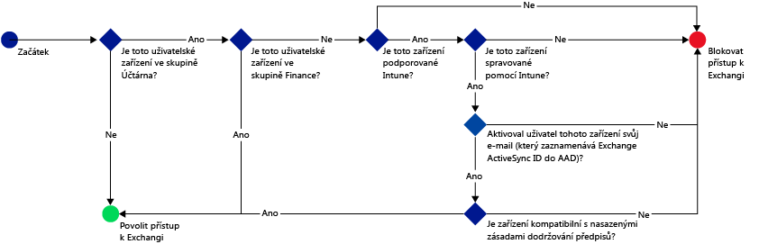
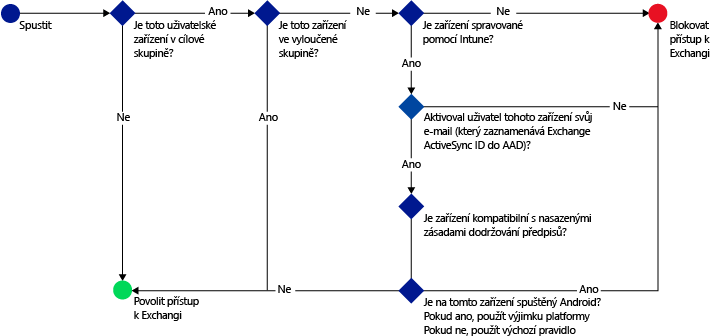

# Omezení přístupu k e-mailu a pomocí Microsoft Intune: Ukázkové scénáře

## Blokování používání nekompatibilních zařízení pro přístup k Exchangi Online uživateli
### Požadavky na scénář
- Je třeba blokovat přístup k Exchangi Online pro všechny uživatele ve skupině zabezpečení Active Directory **Účetní oddělení**, pokud jejich zařízení nedodržují předpisy v nasazených zásadách dodržování předpisů.
- Pokud je v této skupině uživatel se zařízením, které [!INCLUDE[wit_nextref](../includes/wit_nextref_md.md)] nepodporuje, musí se mu na tomto zařízení zablokovat přístup k Exchangi Online.
- Je třeba vyloučit ze zásad všechny uživatele ve skupině zabezpečení Active Directory **Finanční oddělení**, i když jsou i ve skupině zabezpečení **Účetní oddělení** .

Pokud toho chcete dosáhnout, nakonfigurujte zásady podmíněného přístupu k Exchangi Online s následujícím nastavením:

-   Vyberte možnost **Zapnout zásady podmíněného přístupu**.

- Vyberte platformy, kterým má být povolený přístup z aplikací s moderním ověřováním.
- Pro aplikace Exchange ActiveSync vyberte **Blokovat nekompatibilní zařízení na platformách podporovaných Microsoft Intune** a **Blokovat všechna ostatní zařízení na platformách nepodporovaných Microsoft Intune.**
-   V části **Cílová skupina** v nabídce **Vybrané skupiny zabezpečení** vyberte skupinu uživatelů **Účetní oddělení**.

-   V části **Vyloučená skupina** v nabídce **Vybrané skupiny zabezpečení** vyberte skupinu uživatelů **Finanční oddělení**.

Následující postup se používá k určení zařízení, která můžou k Exchangi Online přistupovat:

## Veškerá zařízení s iOS, která přistupují k místnímu Exchangi, musí spravovat Intune
### Požadavky na scénář
- Přístup k místnímu Exchangi by měla mít pouze zařízení se systémem iOS.
- Před použitím pro přístup k Exchangi musí být zařízení také registrovaná v Intune a splňovat pravidla zásad dodržování předpisů.

Pokud toho chcete dosáhnout, nakonfigurujte následující zásady podmíněného přístupu k místnímu Exchangi s následujícím nastavením:

-   Vyberte možnost **Blokovat e-mailovým aplikacím přístup k místnímu systému Exchange, pokud zařízení není kompatibilní nebo není zaregistrované v Microsoft Intune**. Výběrem této možnosti se povolí zásady podmíněného přístupu, které vyžadují, aby před přístupem k Exchangi byla všechna zařízení zaregistrovaná v Microsoft Intune a splňovala pravidla zásad dodržování předpisů.

-   Pro upřesňující nastavení protokolu Exchange Active Sync vytvořte následující položky:

  -   Výjimka platformy umožňující zařízením s iOS přistupovat k systému Exchange.   

  -   Výchozí pravidlo, které určuje, že když se na zařízení nevztahuje pravidlo výjimky platformy, jeho přístup k Exchangi by měl být blokovaný. Toto pravidlo zajišťuje, že zařízením s jiným systémem než iOS bude blokovaný přístup k Exchangi.

Následující postup se používá k určení zařízení, která můžou k systému Exchange přistupovat:

## Žádná zařízení s Androidem nemůžou přistupovat k místnímu Exchangi
### Požadavky na scénář
- Všechna zařízení s Androidem by měla mít blokovaný přístup k Exchangi.
- Všechna ostatní podporovaná zařízení mohou přistupovat k Exchangi, pokud jsou spravovaná službou [!INCLUDE[wit_nextref](../includes/wit_nextref_md.md)].

Pokud toho chcete dosáhnout, nakonfigurujte zásady podmíněného přístupu k místnímu Exchangi s následujícím nastavením:

-   Vyberte možnost **Blokovat e-mailovým aplikacím přístup k místnímu systému Exchange, pokud zařízení není kompatibilní nebo není zaregistrované v Microsoft Intune**. Výběrem této možnosti bude vyžadovaná registrace všech zařízení v Intune a splnění pravidel zásad dodržování předpisů.

- Pro upřesňující nastavení protokolu Exchange Active Sync vytvořte následující položky:
  -   Výjimka platformy blokující přístup k Exchangi pro zařízení s Androidem. Toto pravidlo zajišťuje, že zařízení s Androidem nelze používat pro přístup k Exchangi.

  -   Výchozí pravidlo, které určuje, že pokud se na zařízení nevztahují ostatní pravidla, mělo by mít povolený přístup k Exchangi. Toto výchozí pravidlo zajišťuje, že zařízení s jinými platformami než Android, ale podporovanými Microsoft Intune, mohou být použitá pro přístup k Exchangi. Musí být ale zaregistrovaná v Intune a splňovat pravidla zásad dodržování předpisů.

Následující postup se používá k určení zařízení, která můžou k systému Exchange přistupovat:

<!--HONumber=Oct16_HO4-->

