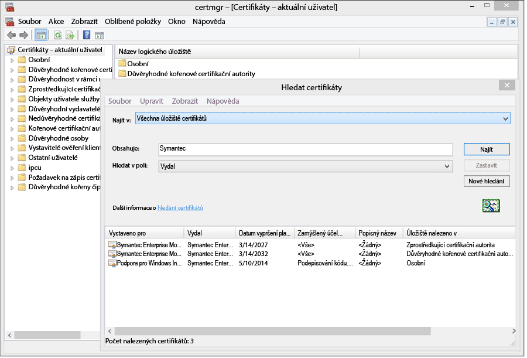
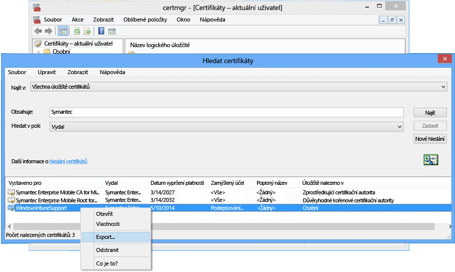

# Nastavení správy pro zařízení Windows Phone 8.0

Windows Phone 8.0 vyžaduje k instalaci aplikace Portál společnosti Intune a k povolení správy zařízení certifikát Symantec. Certifikát je také nutný k podepsání obchodních aplikací. Následující téma se týká jenom systému Windows Phone 8.0. Informace o správě systému Windows Phone 8.1 nebo novějšího, včetně systému Windows 10 Mobile, najdete v tématu [Nastavení registrace Windows Phone](set-up-windows-phone-management-with-microsoft-intune.md).

> [!IMPORTANT]
> Od září 2016 už pro systémy Windows 8.0 a Windows Phone 8.0 nebude dostupná ke stažení aplikace Portál společnosti.

-   **Windows Phone 8** – Je nutný certifikát.
-   **Windows Phone 8.1 a Windows 10 Mobile** vyžadují certifikáty pouze v následujících případech:

    -   Při nasazování aplikace Portál společnosti pomocí Intune

    -   Při nasazování obchodních (neboli zkušebně načtených) aplikací


  > [!IMPORTANT]
  > Certifikát od Symantecu použitý ke správě určitých mobilních zařízení s Windows a Windows Phone [se musí pravidelně obnovovat](renew-a-symantec-code-signing-certificate.md).

Nastavení požadavků pro správu mobilních zařízení Windows Phone závisí na tom, jak budete zařízení spravovat.  Nastavení dvou záznamů CNAME v registraci DNS vaší společnosti usnadňuje uživatelům registraci zařízení. Pokud vaši uživatelé budou stahovat aplikaci Portál společnosti ze Storu, pak po konfiguraci nastavení DNS bude třeba jen nastavit firemní portál a informovat uživatele o tom, jak se zaregistrovat.  U Windows Phone 8.0 nebo Windows Phone 8.1, kde nasadíte Portál společnosti, budete pro podepsání kódu aplikace potřebovat certifikát Symantec.

## Konfigurace požadavků nastavení pro povolení správy pro systém Windows Phone
1.  **Nastavení Intune** Pokud jste to ještě neudělali, připravte se na správu mobilních zařízení [nastavením autority pro správu mobilních zařízení](get-ready-to-enroll-devices-in-microsoft-intune.md#set-mobile-device-management-authority) na **Microsoft Intune** a nastavením MDM.

2.  **Nastavení aliasu DNS pro adresu serveru registrace (volitelně)** (optional)

    Alias DNS (typ záznamu CNAME) uživatelům usnadňuje registraci zařízení tím, že se při registraci automaticky vyplní název serveru.

    1.  V [konzole pro správu Intune](http://manage.microsoft.com) klikněte na **Správa** &gt; **Správa mobilních zařízení** &gt; **Windows Phone**.

    2.  Zadejte adresu URL ověřené domény webu společnosti do pole **Zadejte název ověřené domény** a klikněte na **Test automatického zjištění**.

    3.  Vytvořte záznamy o prostředcích DNS **CNAME** pro doménu vaší společnosti. Záznamy o prostředcích CNAME musí obsahovat tyto informace:

        |Název hostitele|Odkazuje na|Hodnota TTL|
        |-------------|-------------|-------|
        |enterpriseenrollment.doména_společnosti.com|enterpriseenrollment-s.manage.microsoft.com |1 hodina|
        |enterpriseregistration.doména_společnosti.com|enterpriseregistration.windows.net|1 hodina|
        Pokud je třeba web vaší společnosti contoso.com, vytvořili byste záznam CNAME ve službě DNS, který přesměruje adresu EnterpriseEnrollment.contoso.com na manage.microsoft.com. Pokud existuje víc než jedna ověřená doména, vytvořte záznam CNAME pro každou doménu.

        -   `enterpriseenrollment-s.manage.microsoft.com` – Podporuje přesměrování na služby Intune s rozpoznáním domény z doménového názvu e-mailu.

        -   `enterpriseregistration.windows.net` – Podporuje připojení pracovního místa pro mobilní zařízení. Mimoto podporuje i podmíněný přístup pro Windows 8.1.

    

3.  **Správa certifikátů pro podporu podepisování aplikací** [Vyžaduje se pro Windows Phone 8.0 a Windows Phone 8.1, které nemají přístup k Windows Phone Storu nebo potřebují obchodní aplikace.]

    Aby šlo podporovat aplikaci Portál společnosti pro Windows Phone 8.0 a nasazovat firemní aplikace na Windows Phone 8.1, musíte získat certifikát **Symantec Enterprise Mobile Code Signing Certificate**. Nejde použít certifikát vydaný vlastní certifikační autoritou, protože pro zařízení Windows Phone je důvěryhodný jen certifikát Symantec. Tento certifikát se vyžaduje, aby se dalo:

    -   Podepsat aplikaci Portál společnosti pro nasazení do [!INCLUDE[winphone8_client_1](../includes/winphone8_client_1_md.md)] za účelem registrace a správy telefonu.

    -   Podepsat firemní aplikace tak, aby je [!INCLUDE[wit_nextref](../includes/wit_nextref_md.md)] mohl nasadit do telefonů Windows Phone.

    Následující postup vám pomůže získat požadované certifikáty a podepsat aplikace firemního portálu. Budete potřebovat účet Centrum vývojářů pro Windows Phone a pak budete muset zakoupit certifikát Symantec.

    1.  **Připojte se k centru vývojářů pro Windows Phone.** Až se budete přihlašovat k zakoupení firemního účtu, připojte se k [Centru vývojářů pro Windows Phone](http://go.microsoft.com/fwlink/?LinkId=268442) pomocí informací o firemním účtu. Certifikát pro podepisování kódu obdržíte až po schválení žádosti vedoucím pracovníkem společnosti.

    2.  **Získejte pro společnost certifikát Symantec.** Pomocí ID společnosti Symantec zakupte certifikát na [webu společnosti Symantec](http://go.microsoft.com/fwlink/?LinkId=268441). Po zakoupení certifikátu obdrží schvalovatel, kterého jste uvedli v účtu Windows Phone Dev Center, e-mail požadující schválení žádosti o certifikát. Další informace o požadavku na certifikát Symantec najdete v tématu [Proč Windows Phone vyžaduje certifikát Symantec?](https://technet.microsoft.com/en-us/library/dn764959.aspx#BKMK_Symantec) Nejčastější dotazy k registraci zařízení Windows

    3.  **Importujte certifikáty.** Jakmile se žádost schválí, obdržíte e-mail s pokyny k importování certifikátů. Postupujte podle pokynů v e-mailu pro import certifikátů.

    4.  **Ověřte importované certifikáty.** Abyste se přesvědčili, že se certifikáty importovaly správně, přejděte do modulu snap-in **Certifikáty**, klikněte pravým tlačítkem na **Certifikáty** a vyberte **Hledat certifikáty**. Do pole **Obsahuje** zadejte „Symantec“ a klikněte na **Najít**. Importované certifikáty by se měly zobrazit ve výsledcích.

        

    5.  **Exportujte podpisový certifikát.** Jakmile ověříte, že jsou certifikáty dostupné, můžete exportovat soubor .pfx a podepsat portál společnosti. Vyberte certifikát Symantec se **zamýšleným účelem** „podepisování kódu”. Klikněte pravým tlačítkem na certifikát pro podpis kódu a vyberte **Exportovat**.

        

        V **Průvodci exportem certifikátu**vyberte **Ano, exportovat soukromý klíč** a klikněte na **Další**. Vyberte **Formát Personal Information Exchange – PKCS č. 12 (.PFX)** a zaškrtněte políčko **Zahrnout všechny certifikáty na cestě k certifikátu, pokud je to možné**. Dokončete průvodce. Další informace naleznete v tématu [Exportování certifikátu se soukromým klíčem](http://go.microsoft.com/fwlink/?LinkID=203031).

    6.  **Stažení a podepsání aplikace Portál společnosti**

        Podpora pro registraci zařízení s Windows Phone vyžaduje podepsanou a na Intune nahranou aplikaci Portál společnosti Windows Phone 8.0.

        1.  **Stáhněte Portál společnosti.** Stáhněte [Portál společnosti Intune pro Windows Phone](http://go.microsoft.com/fwlink/?LinkId=268440) ze služby Stažení softwaru. Výchozí umístění instalace je `C:\Program Files (x86)\Microsoft Corporation\Windows Intune Company Portal for Windows Phone`.

        2.  **Stáhněte sadu Windows Phone 8.0 SDK.** Stáhněte sadu [Windows Phone SDK](http://go.microsoft.com/fwlink/?LinkId=615570).

        3.  **Opatřete aplikaci Portál společnosti podpisem kódu.** Pomocí aplikace XAPSignTool stažené společně se sadou SDK podepište portál společnosti souborem .pfx, který jste vytvořili z certifikátu Symantec. Další informace najdete v tématu [Podepsání firemní aplikace pomocí XapSignTool](http://go.microsoft.com/fwlink/?LinkID=280195).

    7.  **Odešlete aplikaci Portál společnosti do Intune.** Nahráním podepsaného souboru aplikace firemního portálu a svého certifikátu pro podpis kódu zpřístupníte aplikaci vašim koncovým uživatelům.

        1.  V [konzole pro správu Intune](http://manage.microsoft.com) klikněte na **Správa** &gt; **Windows Phone**.

        2.  Klikněte na **Nahrát podepsaný soubor aplikace** a přihlaste se svým ID správce pro Intune.

        3.  Na stránce **Instalace softwaru** přejděte v části **Zadejte umístění instalačních souborů softwaru** na umístění aplikace Portál společnosti (.xap pro Windows Phone 8.0 nebo .appx pro Windows Phone 8.1) s podepsaným kódem.

            Pokud hodnotíte Intune a nahráváte soubor aplikace s podepsaným kódem ve zkušební verzi účtu Intune, zrušte zaškrtnutí políčka **Použijte soubor aplikace z portálu společnosti podepsaný ukázkovým certifikátem pro podepisování kódu od společnosti Symantec**.

        4.  Přidejte soubor certifikátu (.pfx), který jste exportovali do **certifikátu pro podpis kódu** a vytvořte pro tento certifikát heslo.

        5.  Na stránce **Popis softwaru** vyplňte příslušná pole. Nezapomeňte, že uživatelé při zobrazení podrobností o aplikaci na firemním portálu uvidí tyto informace na svých zařízeních.

        6.  Dokončete průvodce. Uživatelé, kteří si zaregistrovali zařízení Windows Phone 8.0, teď získají během registrace na svá zařízení aplikaci firemního portálu. Uživatelé Windows Phone 8.1 můžou nainstalovat aplikaci Portál společnosti z Windows Storu.  Pokud se zařízení s Windows Phone 8.1 na Windows Phone Storu blokují nebo pokud chcete nasadit aplikaci Portál společnosti přes Intune, musíte si stáhnout a podepsat aplikaci Portál společnosti Windows Phone 8.1 (SSP.appx).

4.  **Sdělte uživatelům, jak získat přístup k prostředkům společnosti pomocí Portálu společnosti.** Uživatelé budou potřebovat vědět, jak mají registrovat svá zařízení a co mají očekávat po začlenění do správy. [Co říct koncovým uživatelům o používání služby Microsoft Intune](what-to-tell-your-end-users-about-using-microsoft-intune.md)

## Nasazení aplikace Portál společnosti Windows Phone 8.1.
Aplikaci Portál společnosti můžete místo instalace z Windows Phone Store nasadit do zařízení Windows Phone 8.1 v Intune. Stále bude třeba podle postupu nahoře povolit registraci zařízení Windows Phone pomocí certifikátu společnosti Symantec. Pak je nutné stáhnout aplikaci Portál společnosti Windows Phone 8.1 a podepsat ji certifikátem společnosti Symantec.  To je nutné pouze v případě, že uživatelé nebudou používat Store společnosti a chcete nasadit firemní portál na zařízení Windows Phone 8.1.


1.  **Stažení firemního portálu**

    Stáhněte si [aplikaci Portál společnosti Microsoft Intune pro Windows Phone 8.1](http://go.microsoft.com/fwlink/?LinkId=615799) z webu Stažení softwaru a spusťte samorozbalovací soubor (.exe). Tento soubor obsahuje dva soubory:

    -   CompanyPortal.appx – instalační aplikace Portálu společnosti pro Windows Phone 8.1

    -   WinPhoneCompanyPortal.ps1 – Powershellový skript, který můžete použít k podepsání aplikace Portál společnosti, aby se dala nasadit na zařízení s Windows Phone 8.1

2.  **Stažení sady Windows Phone SDK** Stáhněte si sadu [Windows Phone SDK 8.0](http://go.microsoft.com/fwlink/?LinkId=615570) (http://go.microsoft.com/fwlink/?LinkId=268439) a nainstalujte ji na svůj počítač. Potřebujete ji k vygenerování tokenu pro registraci aplikace.

3.  **Generování souboru AETX** Pomocí programu AETGenerator.exe, který je součástí sady Windows Phone SDK 8.0, vygenerujte soubor tokenu pro registraci aplikace (.aetx) ze souboru Symantec PFX. Pokyny, jak vytvořit soubor AETX, najdete v tématu [Jak vygenerovat token pro registraci aplikace pro Windows Phone](https://msdn.microsoft.com/library/windows/apps/jj735576.aspx).

4.  **Stažení sady Windows SDK pro Windows 8.1** Stáhněte a nainstalujte sadu [Windows Phone SDK](http://go.microsoft.com/fwlink/?LinkId=613525) (http://go.microsoft.com/fwlink/?LinkId=613525). Všimněte si, že powershellový skript dodaný spolu s aplikací Portál společnosti používá výchozí umístění instalace `${env:ProgramFiles(x86)}\Windows Kits\8.1`. Pokud máte instalaci jinde, musíte její umístění zahrnout jako parametr rutiny.

5.  **Opatření aplikace podpisem kódu pomocí prostředí PowerShell** Jako správce otevřete na hostitelském počítači, na kterém je nainstalovaná sada Windows SDK a certifikát Symantec Enterprise Mobile Code Signing Certificate, prostředí **Windows PowerShell**, přejděte na soubor Sign-WinPhoneCompanyPortal.ps1 a spusťte skript.

    **Příklad 1**

    ```
    .\Sign-WinPhoneCompanyPortal.ps1 -InputAppx 'C:\temp\CompanyPortal.appx' -OutputAppx 'C:\temp\CompanyPortalEnterpriseSigned.appx' -PfxFilePath 'C:\signing\cert.pfx' -PfxPassword '1234' -AetxPath 'C:\signing\cert.aetx'
    ```
    Tento příklad podepíše CompanyPortal.appx ve složce C:\temp\ a vytvoří soubor CompanyPortalEnterpriseSigned.appx. Použije heslo PFX 1234 a přečte ID vydavatele ze souboru PFX. Kromě toho přečte i ID organizace ze souboru cert.aetx.

    **Příklad 2**

    ```
    .\Sign-WinPhoneCompanyPortal.ps1 -InputAppx 'C:\temp\CompanyPortal.appx' -OutputAppx 'C:\temp\CompanyPortalEnterpriseSigned.appx' -PfxFilePath 'C:\signing\cert.pfx' -PfxPassword '1234' -PublisherId 'OID.0.9.2342.19200300.100.1.1=1000000001, CN="Test, Inc.", OU=Test 1' -EnterpriseId 1000000001
    ```
    Tento příklad podepíše CompanyPortal.appx ve složce C:\temp\ a vytvoří soubor CompanyPortalEnterpriseSigned.appx. Použije heslo PFX 1234 a zadané ID vydavatele.

    **Parametry:**

    -   `-InputAppx` – Místní cesta k souboru CompanyPortal.appx v jednoduchých uvozovkách Například 'C:\temp\CompanyPortal.appx'.

    -   `-OutputAppx` – Místní cesta a název souboru podepsané aplikace Portál společnosti v jednoduchých uvozovkách Například 'C:\temp\CompanyPortalEnterpriseSigned.appx'.

    -   `-PfxFilePath` – Místní cesta a název souboru pro exportovaný soubor PFX certifikátu Symantec. Například 'C:\signing\cert.pfx'.

    -   `-PfxPassword` – Heslo použité k podepsání souboru PFX v jednoduchých uvozovkách. Například '1234'.

    -   `-AetxPath` – Místní cesta k souboru .aetx, který se používá k přečtení ID organizace, pokud se nedefinuje argument EnterpriseId. Zadat se musí buď tento argument, nebo EnterpriseId. Například 'C:\signing\cert.aetx'.

    -   `-PublisherId` – ID vydavatele dané organizace. Pokud chybí, použije se pole Subject certifikátu Symantec Enterprise Mobile Code Signing Certificate. Například OID.0.9.2342.19200300.100.1.1=1000000001, CN="Test, Inc.", OU=Test 1

    -   `-SdkPath` – Cesta ke kořenové složce sady Windows SDK pro Windows 8.1 Tento argument je volitelný a jeho výchozí hodnota je ${env:ProgramFiles(x86)}\Windows Kits\8.1.

    -   `-EnterpriseId` – ID organizace Musí se zadat buď tento argument, nebo AetxPath. Pokud se tento argument nezadá, ID organizace se přečte ze souboru AETX. Například 1000000001.

6.  Nasazení aplikace Portál společnosti Windows Phone 8.1 (SSP.appx)

    > [!IMPORTANT]
    > Soubor ssp.xap i firemní portál z Windows Store se dají nainstalovat zároveň, což může uživatele mást. Pokud chcete, aby všichni uživatelé používali ssp.xap, vytvořte blokovanou aplikaci pro verzi firemního portálu z Windows Store. Pokud chcete, aby všechna zařízení Windows Phone 8.1 používala jen verzi firemního portálu z Windows Store, máte tři možnosti:
    >
    > -   Pokud nebude zkušebně načítat aplikace a nepotřebujete podporovat Windows Phone 8.0, nenahrávejte podepsaný soubor ssp.xap.
    > -   Pokud potřebujete zkušebně načtené aplikace a neregistrují se žádná zařízení Windows Phone 8, změňte automaticky vytvořené nasazení souboru ssp.xap z „dostupný“ na „odinstalovat“.
    > -   Pokud musíte nainstalovat zkušebně načtené aplikace a zařízení Windows Phone 8.0 musí zaregistrovat a přijmout soubor ssp.xap, vytvořte nové nasazení softwaru ze souboru ssp.xap a nasaďte je akcí **odinstalace** . Zařízení Windows Phone 8.0 nepodporují vynucené instalace nebo odinstalace aplikací, takže budou nasazení ignorovat. Zařízení Windows Phone 8.1 podporují akci odinstalace a odeberou soubor ssp.xap.


<!--HONumber=Jul16_HO3-->


