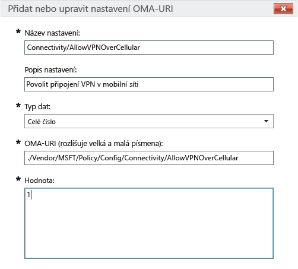

# Nastavení zásad Intune pro zařízení s Windows 10 v Microsoft Intune

Informace v tomto tématu vám pomůžou pochopit nastavení zásad Intune, které lze použít ke správě zařízení s Windows 10. Po přečtení tématu a postupů na stránce [Správa nastavení a funkcí v zařízeních pomocí zásad Microsoft Intune](manage-settings-and-features-on-your-devices-with-microsoft-intune-policies.md) budete umět konfigurovat předdefinované a vlastní nastavení na zaregistrovaných počítačích s Windows 10 a zařízeních s Windows 10 Mobile. Zásady nejde použít pro počítače [s klientským softwarem Intune pro počítače](/intune/get-started/windows-pc-management-capabilities-in-microsoft-intune).

Můžete si vybrat ze dvou typů zásad:

- **Vlastní zásady**: **Vlastní zásady** Microsoft Intune pro Windows 10 a Windows 10 Mobile použijte, pokud chcete nasadit nastavení OMA-URI (Open Mobile Alliance Uniform Resource Identifier), s jehož pomocí se dají ovládat funkce na zařízeních. Řada nastavení je ve Windows 10 přístupná prostřednictvím [poskytovatele konfiguračních služeb pro zásady](https://technet.microsoft.com/itpro/windows/manage/how-it-pros-can-use-configuration-service-providers).
- **Obecné zásady konfigurace**: Tento typ zásad použijte, pokud chcete nastavení vybrat z předdefinovaného seznamu dodávaného s Microsoft Intune.

## Nastavení vlastních zásad

Při nastavování vlastních zásad zadejte následující údaje.

### Obecné

Zadejte název a volitelně i popis zásady, který vám pomůže při její identifikaci v konzole Intune.

### Nastavení OMA-URI

Ke každému nastavení OMA-URI, které chcete přidat, zadejte následující informace. Informace o použitelném nastavení se dočtete v části tohoto tématu [Nastavení Windows 10 URI](/intune/deploy-use/windows-10-policy-settings-in-microsoft-intune#Windows-10-URI-settings):

- **Název nastavení**: Zadejte jedinečný název nastavení OMA-URI, který vám pomůže ho rozpoznat v seznamu nastavení.
- **Popis nastavení**: Volitelně zadejte popis nastavení.
- **Datový typ**: Zvolte z následujících datových typů:
    - **Řetězec**
    - **Řetězec (XML)**
    - **Datum a čas**
    - **Celé číslo**
    - **Číslo s plovoucí desetinnou čárkou**
    - **Logická hodnota**
- **OMA-URI (rozlišuje velká a malá písmena)**: Uveďte, který OMA-URI chcete nastavit.
- **Hodnota**: Zadejte hodnotu, která má být k uvedenému OMA-URI přidružena.

### Příklad
Na následujícím snímku obrazovky je nastavení **Connectivity/AllowVPNOverCellular** povolené. To umožňuje zařízení s Windows 10 spustit připojení VPN přes mobilní síť.

> 

## - Nastavení Windows 10 URI
V této části se dočtete o nastaveních OMA-URI, která můžete nakonfigurovat prostřednictvím **vlastních zásad pro Windows 10**.

### Zásady

|Název a URI zásady|Podrobnosti|
|---------------|------------|-----------|
|**Povolit automatickou aktualizaci** ./Vendor/MSFT/Policy/Config/Update/AllowAutoUpdate|Jen pro počítače **Datový typ:** Celé číslo **Hodnoty:** **0** - **5** (výchozí: **1**)|
|**Den plánované instalace** ./Vendor/MSFT/Policy/Config/Update/ScheduledInstallDay|Jen pro mobilní zařízení **Datový typ:** Celé číslo **Hodnoty:** **0** – Každý den (výchozí) **1** – Neděle **2** – Pondělí **3** – Úterý **4** – Středa **5** – Čtvrtek **6** – Pátek **7** – Sobota|
|**Čas plánované instalace** ./Vendor/MSFT/Policy/Config/Update/ScheduledInstallTime|Pro počítače i mobilní zařízení **Datový typ:** Celé číslo **Hodnoty:**  **0**-**23** hodin (**0** je půlnoc) (výchozí: **3**)|
|**DeviceLock/AllowIdleReturnWithoutPassword** ./Vendor/MSFT/Policy/Config/DeviceLock/AllowIdleReturnWithoutPassword|Jen pro mobilní zařízení **Datový typ:** Celé číslo **Hodnoty:** **0** – Uživatel nemůže nastavovat časovač období odkladu hesla a hodnota je nastavená na „pokaždé“. **1** – Uživatel může nastavovat časovač období odkladu hesla (výchozí).|
|**WiFi/AllowWiFi** ./Vendor/MSFT/Policy/Config/WiFi/AllowWiFi|Jen pro mobilní zařízení **Datový typ:** Celé číslo **Hodnoty:** **0** – Nepovolit **použití připojení Wi-Fi** **1** – **Povolit použití připojení Wi-Fi** (výchozí)|
|**WiFi/AllowInternetSharing** ./Vendor/MSFT/Policy/Config/WiFi/AllowInternetSharing|Pro počítače i mobilní zařízení **Datový typ:** Celé číslo **Hodnoty: ** **0** – Nepovolit sdílení internetu   **1** – Povolit sdílení internetu (výchozí)|
|**WiFi/AllowAutoConnectToWiFiSenseHotspots** ./Vendor/MSFT/Policy/Config/WiFi/AllowAutoConnectToWiFiSenseHotspots|Pro počítače i mobilní zařízení **Datový typ:** Celé číslo **Hodnoty: ** **0** – Nepovoluje se  **1** – Povoluje se (výchozí)|
|**WiFi/AllowManualWiFiConfiguration** ./Vendor/MSFT/Policy/Config/WiFi/AllowManualWiFiConfiguration|Jen pro mobilní zařízení **Datový typ:** Celé číslo **Hodnoty:** **0** – Povolit jenom připojení Wi-Fi, která nakonfigurujete pomocí správy mobilních zařízení **1** – Povoluje se přidávání nových identifikátorů SSID sítí k těm, které už vytvořila správa mobilních zařízení (výchozí)|
|**System/AllowLocation** ./Vendor/MSFT/Policy/Config/System/AllowLocation|Pro počítače i mobilní zařízení **Datový typ:** Celé číslo **Hodnoty: ** **0** – Nepovoluje se  **1** – Povoluje se (výchozí)|
|**System/AllowTelemetry** ./Vendor/MSFT/Policy/Config/System/AllowTelemetry|Pro počítače i mobilní zařízení **Datový typ:** Celé číslo **Hodnoty:** **0** – Nepovoluje se (nastavení jenom v Enterprise) **1** – Omezená **2** – Úplná (výchozí) **3** – Úplná plus diagnostické informace|
|**System/AllowExperimentation** ./Vendor/MSFT/Policy/Config/System/AllowExperimentation|Pro počítače i mobilní zařízení **Datový typ:** Celé číslo **Hodnoty:** **0** – Nepovoluje se **1** – Pouze nastavení (výchozí) **2** – Nastavení a experimentování|
|**Security/AntiTheftMode** ./Vendor/MSFT/Policy/Config/Security/AntiTheftMode|Jen pro mobilní zařízení **Datový typ:** Celé číslo **Hodnoty:** **0** – Nepovolit režim Anti Theft **1** – Předvolba uživatele (výchozí)|
|**Connectivity/AllowUSBConnection** ./Vendor/MSFT/Policy/Config/Connectivity/AllowUSBConnection|Jen pro mobilní zařízení **Datový typ:** Celé číslo **Hodnoty: ** **0** – Nepovoluje se  **1** – Povoluje se (výchozí)|
|**System/AllowUserToResetPhone** ./Vendor/MSFT/Policy/Config/System/AllowUserToResetPhone|Jen pro mobilní zařízení **Datový typ:** Celé číslo **Hodnoty: ** **0** – Nepovoluje se **1** – Povoluje se (výchozí)|
|**Connectivity/AllowCellularDataRoaming** ./Vendor/MSFT/Policy/Config/Connectivity/AllowCellularDataRoaming|Pro počítače i mobilní zařízení **Datový typ:** Celé číslo **Hodnoty: ** **0** – Nepovoluje se  **1** – Povoluje se (výchozí)|
|**Connectivity/AllowVPNOverCellular** ./Vendor/MSFT/Policy/Config/Connectivity/AllowVPNOverCellular|Pro počítače i mobilní zařízení **Datový typ:** Celé číslo **Hodnoty:** **0** – VPN přes mobilní síť se nepovoluje. **1** – VPN může použít jakékoli připojení, včetně mobilního.|
|**Connectivity/AllowVPNRoamingOverCellular** ./Vendor/MSFT/Policy/Config/Connectivity/AllowVPNRoamingOverCellular|Jen pro mobilní zařízení **Datový typ:** Celé číslo **Hodnoty: ** **0** – Nepovoluje se  **1** – Povoluje se (výchozí)|
|**Connectivity/AllowVPNRoamingOverCellular** ./Vendor/MSFT/Policy/Config/Connectivity/AllowVPNRoamingOverCellular|Jen pro mobilní zařízení **Datový typ:** Celé číslo **Hodnoty: ** **0** – Nepovoluje se  **1** – Povoluje se (výchozí)|
|**Connectivity/AllowBluetooth** ./Vendor/MSFT/Policy/Config/Connectivity/AllowBluetooth|Pro počítače i mobilní zařízení **Datový typ:** Celé číslo **Hodnoty:** **0** – Nepovolit uživateli zapnout Bluetooth. **1** – Vyhrazeno. Uživatel může zapnout a konfigurovat Bluetooth (nepodporované ve Windows Phone 8.1 pro MDM, EAS, Windows 10 desktop a Windows 10 Mobile). **2** – Povoleno. Uživatel může zapnout a nakonfigurovat Bluetooth (výchozí).|
|**Experience/AllowScreenCapture** ./Vendor/MSFT/Policy/Config/Experience/AllowScreenCapture|Jen pro mobilní zařízení **Datový typ:** Celé číslo **Hodnoty: ** **0** – Nepovoluje se  **1** – Povoluje se (výchozí)|
|**Experience/AllowTaskSwitcher** ./Vendor/MSFT/Policy/Config/Experience/AllowTaskSwitcher|Jen pro mobilní zařízení **Datový typ:** Celé číslo **Hodnoty: ** **0** – Nepovoluje se  **1** – Povoluje se (výchozí)|
|**Experience/AllowVoiceRecording** ./Vendor/MSFT/Policy/Config/Experience/AllowVoiceRecording|Jen pro mobilní zařízení **Datový typ:** Celé číslo **Hodnoty: ** **0** – Nepovoluje se  **1** – Povoluje se (výchozí)|
|**Experience/AllowSyncMySettings** ./Vendor/MSFT/Policy/Config/Experience/AllowSyncMySettings|Jen pro mobilní zařízení **Datový typ:** Celé číslo **Hodnoty: ** **0** – Nepovolit roaming  **1** – Povolit roaming (výchozí)|
|**Experience/AllowManualMDMUnenrollment** ./Vendor/MSFT/Policy/Config/Experience/AllowManualMDMUnenrollment|Pro počítače i mobilní zařízení **Datový typ:** Celé číslo **Hodnoty: ** **0** – Nepovoluje se  **1** – Povoluje se (výchozí)|
|**Accounts/AllowMicrosoftAccountConnection** ./Vendor/MSFT/Policy/Config/Accounts/AllowMicrosoftAccountConnection|Pro počítače i mobilní zařízení **Datový typ:** Celé číslo **Hodnoty:**  **0** – Nepovoluje se  **1** – Povoluje se (výchozí)|
|**Accounts/AllowAddingNonMicrosoftAccountsManually** ./Vendor/MSFT/Policy/Config/Accounts/AllowAddingNonMicrosoftAccountsManually|Pro počítače i mobilní zařízení **Datový typ:** Celé číslo **Hodnoty:**  **0** – Nepovoluje se  **1** – Povoluje se (výchozí)|
|**Security/AllowManualRootCertificateInstallation** ./Vendor/MSFT/Policy/Config/Security/AllowManualRootCertificateInstallation|Jen pro mobilní zařízení **Datový typ:** Celé číslo **Hodnoty: ** **0** – Nepovoluje se  **1** – Povoluje se (výchozí)|
|**Security/AllowAddProvisioningPackages** ./Vendor/MSFT/Policy/Config/Security/AllowAddProvisioningPackages|Pro počítače i mobilní zařízení **Datový typ:** Celé číslo **Hodnoty: ** **0** – Nepovoluje se  **1** – Povoluje se (výchozí)|
|**Search/DisableBackoff** ./Vendor/MSFT/Policy/Config/Search/DisableBackoff|Pro počítače i mobilní zařízení **Datový typ:** Celé číslo **Hodnoty:**  **0** (výchozí)  **1**|
|**Search/PreventRemoteQueries** ./Vendor/MSFT/Policy/Config/Search/PreventRemoteQueries|Pro počítače i mobilní zařízení **Datový typ:** Celé číslo **Hodnoty:**  **0**  **1** (výchozí)|
|**Search/AllowUsingDiacritics** ./Vendor/MSFT/Policy/Config/Search/AllowUsingDiacritics|Pro počítače i mobilní zařízení **Datový typ:** Celé číslo **Hodnoty:**  **0** (výchozí)  **1**|
|**Search/AlwaysUseAutoLangDetection** ./Vendor/MSFT/Policy/Config/Search/AlwaysUseAutoLangDetection|Pro počítače i mobilní zařízení **Datový typ:** Celé číslo **Hodnoty:**  **0** (výchozí)  **1**|
|**Search/DisableRemovableDriveIndexing** ./Vendor/MSFT/Policy/Config/Search/DisableRemovableDriveIndexing|Pro počítače i mobilní zařízení **Datový typ:** Celé číslo **Hodnoty: ** **0** (výchozí)  **1**|
|**Search/PreventIndexingLowDiskSpaceMB** ./Vendor/MSFT/Policy/Config/Search/PreventIndexingLowDiskSpaceMB|Pro počítače i mobilní zařízení **Datový typ:** Celé číslo **Hodnoty:**  **0**  **1** (výchozí)|
|**Search/AllowIndexingEncryptedStoresOrItems** ./Vendor/MSFT/Policy/Config/Search/AllowIndexingEncryptedStoresOrItems|Pro počítače i mobilní zařízení **Datový typ:** Celé číslo **Hodnoty:**  **0** (výchozí)  **1**|
|**Security/AllowRemoveProvisioningPackage** ./Vendor/MSFT/Policy/Config/Security/AllowRemoveProvisioningPackage|Pro počítače i mobilní zařízení **Datový typ:** Celé číslo **Hodnoty: ** **0** – Nepovoluje se  **1** – Povoluje se (výchozí)|
|**Security/RequireProvisioningPackageSignature** ./Vendor/MSFT/Policy/Config/Security/RequireProvisioningPackageSignature|Pro počítače i mobilní zařízení **Datový typ:** Celé číslo **Hodnoty: ** **0** (výchozí)  **1**|
|**AboveLock/AllowActionCenterNotifications** ./Vendor/MSFT/Policy/Config/AboveLock/AllowActionCenterNotifications|Pro počítače i mobilní zařízení **Datový typ:** Celé číslo **Hodnoty: ** **0** – Nepovoluje se  **1** – Povoluje se (výchozí)|
|**TextInput/AllowIMENetworkAccess** ./Vendor/MSFT/Policy/Config/TextInput/AllowIMENetworkAccess|Jen pro počítače **Datový typ:** Celé číslo **Hodnoty:** **0** – Nepovolit Slovník Open Extended Dictionary je vypnutý. Uživatel nemůže: – Přidat nový slovník Open Extended Dictionary – Přidat nový soubor konfigurace integrace vyhledávání – Používat funkci kandidáta cloudu – odesílat uživatelem registrované slovo. **1** – Povolit Slovník Open Extended Dictionary se může přidat a používat jako výchozí. Také funkce integrace vyhledávání se dá používat ve výchozím nastavení. Uživatel může: – Používat funkci kandidáta cloudu|
|**TextInput/AllowIMELogging** ./Vendor/MSFT/Policy/Config/TextInput/AllowIMELogging|Jen pro počítače **Datový typ:** Celé číslo **Hodnoty:** **0** – Protokolování neúspěšných převodů je vypnuté. **1** – Protokolování neúspěšných převodů je zapnuté. (výchozí)|
|**TextInput/AllowJapaneseNonPublishingStandardGlyph** ./Vendor/MSFT/Policy/Config/TextInput/AllowJapaneseNonPublishingStandardGlyph|Jen pro počítače **Datový typ:** Celé číslo **Hodnoty: ** **0** – Nepovoluje se  **1** – Povoluje se (výchozí)|
|**TextInput/AllowJapaneseIVSCharacters** ./Vendor/MSFT/Policy/Config/TextInput/AllowJapaneseIVSCharacters|Jen pro počítače **Datový typ:** Celé číslo **Hodnoty: ** **0** – Nepovoluje se  **1** – Povoluje se (výchozí)|
|**TextInput/AllowJapaneseUserDictionary** ./Vendor/MSFT/Policy/Config/TextInput/AllowJapaneseUserDictionary|Jen pro počítače **Datový typ:** Celé číslo **Hodnoty: ** **0** – Nepovoluje se  **1** – Povoluje se (výchozí)|
|**TextInput/AllowJapaneseIMESurrogatePairCharacters** ./Vendor/MSFT/Policy/Config/TextInput/AllowJapaneseIMESurrogatePairCharacters|Jen pro počítače **Datový typ:** Celé číslo **Hodnoty: ** **0** – Nepovoluje se  **1** – Povoluje se (výchozí)|
|**TextInput/ExcludeJapaneseIMEExceptShiftJIS** ./Vendor/MSFT/Policy/Config/TextInput/ExcludeJapaneseIMEExceptShiftJIS|Jen pro počítače **Datový typ:** Celé číslo **Hodnoty:** **0** – Nefiltrují se žádné znaky (výchozí). **1** – Filtruje se všechno kromě znaků Shift JIS.|
|**TextInput/ExcludeJapaneseIMEExceptJIS0208** ./Vendor/MSFT/Policy/Config/TextInput/ExcludeJapaneseIMEExceptJIS0208|Jen pro počítače **Datový typ:** Celé číslo **Hodnoty:** **0** – Nefiltrují se žádné znaky (výchozí). **1** – Filtruje se všechno kromě znaků JIS0208.|
|**TextInput/ExcludeJapaneseIMEExceptJIS0208andEUDC** ./Vendor/MSFT/Policy/Config/TextInput/ExcludeJapaneseIMEExceptJIS0208andEUDC|Jen pro počítače **Datový typ:** Celé číslo **Hodnoty:** **0** – Nefiltrují se žádné znaky (výchozí). **1** – Filtruje se všechno kromě znaků JIS0208 nebo EUDC.|
|**TextInput/AllowInputPanel** ./Vendor/MSFT/Policy/Config/TextInput/AllowInputPanel|Jen pro počítače **Datový typ:** Celé číslo **Hodnoty: ** **0** – Nepovoluje se  **1** – Povoluje se (výchozí)|
|**Bluetooth/AllowDiscoverableMode** ./Vendor/MSFT/Policy/Config/Bluetooth/AllowDiscoverableMode|Pro počítače i mobilní zařízení **Datový typ:** Celé číslo **Hodnoty: ** **0** – Nepovoluje se  **1** – Povoluje se (výchozí)|
|**Bluetooth/AllowAdvertising** ./Vendor/MSFT/Policy/Config/Bluetooth/AllowAdvertising|Pro počítače i mobilní zařízení **Datový typ:** Celé číslo **Hodnoty: ** **0** – Nepovoluje se  **1** – Povoluje se (výchozí)|
|**Settings/AllowDataSense** ./Vendor/MSFT/Policy/Config/Settings/AllowDataSense|Pro počítače i mobilní zařízení **Datový typ:** Celé číslo **Hodnoty: ** **0** – Nepovoluje se  **1** – Povoluje se (výchozí)|
|**Settings/AllowVPN** ./Vendor/MSFT/Policy/Config/Settings/AllowVPN|Pro počítače i mobilní zařízení **Datový typ:** Celé číslo **Hodnoty: ** **0** – Nepovoluje se  **1** – Povoluje se (výchozí)|
|**Settings/AllowWorkplace** ./Vendor/MSFT/Policy/Config/Settings/AllowWorkplace|Jen pro počítače **Datový typ:** Celé číslo **Hodnoty: ** **0** – Nepovoluje se  **1** – Povoluje se (výchozí)|
|**Settings/AllowDateTime** ./Vendor/MSFT/Policy/Config/Settings/AllowDateTime|Pro počítače i mobilní zařízení **Datový typ:** Celé číslo **Hodnoty: ** **0** – Nepovoluje se  **1** – Povoluje se (výchozí)|
|**Settings/AllowLanguage** ./Vendor/MSFT/Policy/Config/Settings/AllowLanguage|Jen pro počítače **Datový typ:** Celé číslo **Hodnoty: ** **0** – Nepovoluje se  **1** – Povoluje se (výchozí)|
|**Settings/AllowRegion** ./Vendor/MSFT/Policy/Config/Settings/AllowRegion|Jen pro počítače **Datový typ:** Celé číslo **Hodnoty: ** **0** – Nepovoluje se  **1** – Povoluje se (výchozí)|
|**Settings/AllowSignInOptions** ./Vendor/MSFT/Policy/Config/Settings/AllowSignInOptions|Jen pro počítače **Datový typ:** Celé číslo **Hodnoty: ** **0** – Nepovoluje se  **1** – Povoluje se (výchozí)|
|**Settings/AllowYourAccount** ./Vendor/MSFT/Policy/Config/Settings/AllowYourAccount|Pro počítače i mobilní zařízení **Datový typ:** Celé číslo **Hodnoty: ** **0** – Nepovoluje se  **1** – Povoluje se (výchozí)|
|**Settings/AllowPowerSleep** ./Vendor/MSFT/Policy/Config/Settings/AllowPowerSleep|Jen pro počítače **Datový typ:** Celé číslo **Hodnoty: ** **0** – Nepovoluje se  **1** – Povoluje se (výchozí)|
|**Settings/AllowAutoPlay** ./Vendor/MSFT/Policy/Config/Settings/AllowAutoPlay|Jen pro počítače **Datový typ:** Celé číslo **Hodnoty: ** **0** – Nepovoluje se  **1** – Povoluje se (výchozí)|
|**Experience/AllowCortana** ./Vendor/MSFT/Policy/Config/Experience/AllowCortana|Pro počítače i mobilní zařízení **Datový typ:** Celé číslo **Hodnoty: ** **0** – Nepovoluje se  **1** – Povoluje se (výchozí)|
|**Search/SafeSearchPermissions** ./Vendor/MSFT/Policy/Config/Search/SafeSearchPermissions|Jen pro mobilní zařízení **Datový typ:** Celé číslo **Hodnoty:** **0** – Striktní, největší filtrování obsahu pro dospělé **1** – Střední, střední filtrování obsahu pro dospělé (platné výsledky vyhledávání se nebudou filtrovat) (výchozí)|
|**Experience/AllowCopyPaste** ./Vendor/MSFT/Policy/Config/Experience/AllowCopyPaste|Jen pro počítače **Datový typ:** Celé číslo **Hodnoty: ** **0** – Nepovoluje se  **1** – Povoluje se (výchozí)|
|**Force Start Size** ./Vendor/MSFT/Policy/Config/Start/ForceStartSize|Jen pro mobilní zařízení **Datový typ:** Celé číslo **Hodnoty:** **0** – Povolit změnu velikosti uživatelem (výchozí) **1** – Vynutit režim v okně **2** – Vynutit celoobrazovkový režim|
|**Update/RequireDeferUpgrade** ./Vendor/MSFT/Policy/Config/Update/RequireDeferUpgrade|Pro počítače i mobilní zařízení **Datový typ:** Celé číslo **Hodnoty:** **0** – Neodkládat upgrade (zůstat v CB (Current Branch)) (výchozí) **1** – Povolit odložení aktualizací a upgradů (zařízení postupuje podle pravidel CBB (Current Branch for Business)) Podrobnosti najdete v tématech: [Úvod do údržby Windows 10](https://technet.microsoft.com/library/mt598226.aspx) [Plán pro nasazení Windows 10](https://technet.microsoft.com/library/mt574241.aspx)|
|**Update/DeferUpdatePeriod** ./Vendor/MSFT/Policy/Config/Update/DeferUpdatePeriod|Pro počítače i mobilní zařízení **Popis:** Zásada umožňující odložení aktualizací softwaru až o čtyři týdny **Datový typ:** Celé číslo **Hodnoty:**  **0** – Použít aktualizace okamžitě (výchozí) **1**-**4** – Počet týdnů odložení aktualizací softwaru Podrobnosti najdete v tématech: [Úvod do údržby Windows 10](https://technet.microsoft.com/library/mt598226.aspx) [Plán pro nasazení Windows 10](https://technet.microsoft.com/library/mt574241.aspx)|
|**Update/DeferUpgradePeriod** ./Vendor/MSFT/Policy/Config/Update/DeferUpgradePeriod|Pro počítače i mobilní zařízení **Popis:** Zásada umožňující odložení upgradu funkcí až o osm měsíců **Datový typ:** Celé číslo **Hodnoty:** **0** – Použít aktualizace okamžitě (výchozí) **1**-**8** – Počet měsíců odložení upgradu funkcí Podrobnosti najdete v tématech: [Úvod do údržby Windows 10](https://technet.microsoft.com/library/mt598226.aspx) [Plán pro nasazení Windows 10](https://technet.microsoft.com/library/mt574241.aspx)|
|**Update/PauseDeferrals** ./Vendor/MSFT/Policy/Config/Update/PauseDeferrals|Pro počítače i mobilní zařízení **Popis:** Umožňuje zařízení zastavit přijímání aktualizací a upgradů po dobu až pět týdnů. **Datový typ:** Celé číslo **Hodnoty:** **0** – Použít aktualizace okamžitě (výchozí) **1** – Pozastavit aktualizace a upgrady (platnost po pěti týdnech vyprší)|

### Windows Defender

|Název a URI zásady|Podrobnosti|
|---------------|-----------|
|**AllowRealtimeMonitoring** ./Vendor/MSFT/Policy/Config/Defender/AllowRealtimeMonitoring|Jen pro počítače **Datový typ:** Celé číslo **Hodnoty: ** **0** – Nepovoluje se  **1** – Povoluje se (výchozí)|
|**AllowBehaviorMonitoring** ./Vendor/MSFT/Policy/Config/Defender/AllowBehaviorMonitoring|Jen pro počítače **Datový typ:** Celé číslo **Hodnoty: ** **0** – Nepovoluje se  **1** – Povoluje se (výchozí)|
|**AllowIntrusionPreventionSystem** ./Vendor/MSFT/Policy/Config/Defender/AllowIntrusionPreventionSystem|Jen pro počítače **Datový typ:** Celé číslo **Hodnoty: ** **0** – Nepovoluje se  **1** – Povoluje se (výchozí)|
|**AllowIOAVProtection** ./Vendor/MSFT/Policy/Config/Defender/AllowIOAVProtection|Jen pro počítače **Datový typ:** Celé číslo **Hodnoty:**  **0** – Nepovoluje se  **1** – Povoluje se (výchozí)|
|**AllowScriptScanning** ./Vendor/MSFT/Policy/Config/Defender/AllowScriptScanning|Jen pro počítače **Datový typ:** Celé číslo **Hodnoty: ** **0** – Nepovoluje se  **1** – Povoluje se (výchozí)|
|**AllowOnAccessProtection** ./Vendor/MSFT/Policy/Config/Defender/AllowOnAccessProtection|Jen pro počítače **Datový typ:** Celé číslo **Hodnoty: ** **0** – Nepovoluje se  **1** – Povoluje se (výchozí)|
|**RealTimeScanDirection** ./Vendor/MSFT/Policy/Config/Defender/RealTimeScanDirection|Jen pro počítače **Datový typ:** Celé číslo **Hodnoty:** **0** – Monitorovat všechny soubory (výchozí) **1** – Monitorovat příchozí soubory **2** – Monitorovat odchozí soubory|
|**DaysToRetainCleanedMalware** ./Vendor/MSFT/Policy/Config/Defender/DaysToRetainCleanedMalware|Jen pro počítače **Datový typ:** Celé číslo **Hodnoty:** **0** - **90** – Představuje dobu, po kterou se bude uchovávat malware. **0** – Uchová malware ve složce karantény navždy, automaticky se neodstraní (výchozí).|
|**AllowUserUIAccess** ./Vendor/MSFT/Policy/Config/Defender/AllowUserUIAccess|Jen pro počítače **Datový typ:** Celé číslo **Hodnoty: ** **0** – Nepovoluje se  **1** – Povoluje se (výchozí)|
|**ScanParameter** ./Vendor/MSFT/Policy/Config/Defender/ScanParameter|Jen pro počítače **Datový typ:** Celé číslo **Hodnoty:** **1** – Rychlé prohledání (výchozí) **2** – Úplné prohledání|
|**ScheduleScanDay** ./Vendor/MSFT/Policy/Config/Defender/ScheduleScanDay|Jen pro počítače **Datový typ:** Celé číslo **Hodnoty:** **0** – Každý den (výchozí) **1** – Pondělí **2** – Úterý **3** – Středa **4** – Čtvrtek **5** – Pátek **6** – Sobota **7** – Neděle **8** – Prohledání není naplánované|
|**ScheduleScanTime** ./Vendor/MSFT/Policy/Config/Defender/ScheduleScanTime|Jen pro počítače **Datový typ:** Celé číslo **Hodnoty:** **0** – 12:00 **60** – 1:00 **120** – 2:00 (výchozí) **180** – 3:00 **240** – 4:00 **300** – 5:00 **360** – 6:00 **420** – 7:00 **480** – 8:00 **540** – 9:00 **600** – 10:00 **660** – 11:00 **720** – 12:00 **780** – 13:00 **840** – 14:00 **900** – 15:00 **960** – 16:00 **1020** – 17:00 **1080** – 18:00 **1140** – 19:00 **1200** – 20:00 **1260** – 21:00 **1320** – 22:00 **1381** – Časové období údržby|
|**ScheduleQuickScanTime** ./Vendor/MSFT/Policy/Config/Defender/ScheduleQuickScanTime|Jen pro počítače **Datový typ:** Celé číslo **Hodnoty:** **0** – 12:00 **60** – 1:00 **120** – 2:00 (výchozí) **180** – 3:00 **240** – 4:00 **300** – 5:00 **360** – 6:00 **420** – 7:00 **480** – 8:00 **540** – 9:00 **600** – 10:00 **660** – 11:00 **720** – 12:00 **780** – 13:00 **840** – 14:00 **900** – 15:00 **960** – 16:00 **1020** – 17:00 **1080** – 18:00 **1140** – 19:00 **1200** – 20:00 **1260** – 21:00 **1320** – 22:00 **1380** – 23:00|
|**AVGCPULoadFactor** ./Vendor/MSFT/Policy/Config/Defender/AVGCPULoadFactor|Jen pro počítače **Datový typ:** Celé číslo **Hodnoty: ** **0** - **100** (výchozí: **50**)|
|**AllowArchiveScanning** ./Vendor/MSFT/Policy/Config/Defender/AllowArchiveScanning|Jen pro počítače **Datový typ:** Celé číslo **Hodnoty: ** **0** – Nepovoluje se  **1** – Povoluje se (výchozí)|
|**AllowEmailScanning** ./Vendor/MSFT/Policy/Config/Defender/AllowEmailScanning|Jen pro počítače **Datový typ:** Celé číslo **Hodnoty: ** **0** – Nepovoluje se (výchozí)  **1** – Povoluje se|
|**AllowFullScanRemovableDriveScanning** ./Vendor/MSFT/Policy/Config/Defender/AllowFullScanRemovableDriveScanning|Jen pro počítače **Datový typ:** Celé číslo **Hodnoty: ** **0** – Nepovoluje se (výchozí)  **1** – Povoluje se|
|**AllowFullScanOnMappedNetworkDrives** ./Vendor/MSFT/Policy/Config/Defender/AllowFullScanOnMappedNetworkDrives|Jen pro počítače **Datový typ:** Celé číslo **Hodnoty: ** **0** – Nepovoluje se  **1** – Povoluje se (výchozí)|
|**AllowScanningNetworkFiles** ./Vendor/MSFT/Policy/Config/Defender/AllowScanningNetworkFiles|Jen pro počítače **Datový typ:** Celé číslo **Hodnoty: ** **0** – Nepovoluje se  **1** – Povoluje se (výchozí) – poběží i v případě, že je zapnutý protokol RTP|
|**SignatureUpdateInterval** ./Vendor/MSFT/Policy/Config/Defender/SignatureUpdateInterval|Jen pro počítače **Datový typ:** Celé číslo **Hodnoty:** **0** – Nekontrolovat signatury v intervalu **1** – Kontrolovat signatury každou hodinu **2** – Kontrolovat každé dvě hodiny  **24** – Kontrolovat každý den **8** – Kontrolovat každých osm hodin (výchozí)|
|**AllowCloudProtection** ./Vendor/MSFT/Policy/Config/Defender/AllowCloudProtection|Jen pro počítače **Datový typ:** Celé číslo **Hodnoty: ** **0** – Nepovoluje se  **1** – Povoluje se (výchozí)|
|**SubmitSamplesConsent** ./Vendor/MSFT/Policy/Config/Defender/SubmitSamplesConsent|Jen pro počítače **Datový typ:** Celé číslo **Hodnoty:** **0** – Vždycky se zeptat (výchozí) **1** – Posílat bezpečné vzorky automaticky **2** – Nikdy neposílat **3** – Posílat všechny vzorky automaticky|
|**ExcludedExtensions** ./Vendor/MSFT/Policy/Config/Defender/ExcludedExtensions|Jen pro počítače **Datový typ:** Řetězec **Hodnoty:** *&lt;Seznam rozšíření oddělených středníkem&gt;* Příklad: **obj;lib** **Výchozí –** Nevylučují se žádné přípony.|
|**ExcludedPaths** ./Vendor/MSFT/Policy/Config/Defender/ExcludedPaths|Jen pro počítače **Datový typ:** Řetězec **Hodnoty:** *&lt;Seznam cest oddělených středníkem&gt;* Příklad: **c:\test;c:\test1.exe** **Výchozí –** Nevylučují se žádné cesty.|
|**ExcludedProcesses** ./Vendor/MSFT/Policy/Config/Defender/ExcludedProcesses|Jen pro počítače **Datový typ:** Řetězec **Hodnoty:** *&lt;Seznam cest oddělených středníkem&gt;* Příklad: **c:\test.exe;c:\test1.exe** **Výchozí –** Nevylučují se žádné procesy.|

### Prohlížeč Edge

|Název a URI zásady|Podrobnosti|
|---------------|------------|-----------|
|**Povolit prohlížeč** ./Vendor/MSFT/Policy/Config/Browser/AllowBrowser|Jen pro mobilní zařízení **Datový typ:** Celé číslo **Hodnoty: ** **0** – Procházení vypnuto  **1** – Procházení zapnuto (výchozí)|
|**AllowSearchSuggestionsinAddressBar** ./Vendor/MSFT/Policy/Config/Browser/AllowSearchSuggestionsinAddressBar|Pro počítače i mobilní zařízení **Datový typ:** Celé číslo **Hodnoty: ** **0** – Nezobrazovat návrhy  **1** – Zobrazovat návrhy (výchozí)|
|**SendIntranetTraffictoInternetExplorer** ./Vendor/MSFT/Policy/Config/Browser/SendIntranetTraffictoInternetExplorer|Jen pro počítače **Datový typ:** Celé číslo **Hodnoty:** **0** – Zakázáno (otevřít intranetové servery v prohlížeči Microsoft Edge – výchozí) **1** – Povoleno (otevřít intranetové servery v Internet Exploreru)|
|**Povolit Do Not Track** ./Vendor/MSFT/Policy/Config/Browser/AllowDoNotTrack|Pro počítače i mobilní zařízení **Datový typ:** Celé číslo **Hodnoty: ** **0** – Zakázáno (DNT se neodešle – výchozí)  **1** – Povoleno (odeslat DNT)|
|**Konfigurovat SmartScreen** ./Vendor/MSFT/Policy/Config/Browser/AllowSmartScreen|Pro počítače i mobilní zařízení **Datový typ:** Celé číslo **Hodnoty: ** **0** – Nepovolit  **1** – Povolit (výchozí)|
|**Povolit automaticky otevíraná okna** ./Vendor/MSFT/Policy/Config/Browser/AllowPopups|Jen pro počítače **Datový typ:** Celé číslo **Hodnoty: ** **0** – Blokovat automaticky otevíraná okna (výchozí)  **1** – Povolit automaticky otevíraná okna|
|**Povolit soubory cookie** ./Vendor/MSFT/Policy/Config/Browser/AllowCookies|Pro počítače i mobilní zařízení **Datový typ:** Celé číslo **Hodnoty:** **0** – Povolit soubory cookie ze všech webů (výchozí) **1** – Blokovat jenom soubory cookie třetích stran **2** – Blokovat všechny soubory cookie|
|**Povolit uložení hesla** ./Vendor/MSFT/Policy/Config/Browser/AllowPasswordManager|Pro počítače i mobilní zařízení **Datový typ:** Celé číslo **Hodnoty:** **0** – Správce hesel je zakázaný.  **1** – Správce hesel je povolený (výchozí).|
|**Povolit automatické vyplňování** ./Vendor/MSFT/Policy/Config/Browser/AllowAutofill|Jen pro počítače **Datový typ:** Celé číslo **Hodnoty**:  **0** – Zakázáno (výchozí)  **1** – Povoleno|
|**Konfigurovat seznam webů podnikového režimu** ./Vendor/MSFT/Policy/Config/Browser/EnterpriseModeSiteList|Jen pro počítače **Datový typ:** Řetězec **Hodnoty:** **0** – Není nakonfigurováno **1** – Použít seznam webů podnikového režimu prohlížeče IE, pokud je nakonfigurovaný (výchozí) **2** – Určit umístění seznamu webů podnikového režimu|

## Obecná nastavení zásad konfigurace

Ke konfiguraci nastavení pro zaregistrovaná zařízení se systémem Windows 10 Desktop a Windows 10 Mobile použijte **obecné zásady konfigurace** Microsoft Intune pro Windows 10.

### Heslo

|Název nastavení|Další informace (kde jsou potřeba)|
|----------------|----------------------|
|**Vyžadovat heslo k odemknutí zařízení**|-|
|**Vyžadovaný typ hesla**|Určuje, jestli musí být heslo složené z čísel a písmen, nebo jen z čísel.|
|**Vyžadovaný typ hesla** - **Minimální počet znakových sad**| Určuje, kolik znakových sad (malá písmena, velká písmena, číslice a symboly) musí heslo obsahovat.|
|**Minimální délka hesla**|Platí jen pro Windows 10 Mobile.|
|**Počet povolených opakovaných neúspěšných přihlášení, než se zařízení vymaže**|Pro zařízení s Windows 10: Pokud má zařízení povolený nástroj BitLocker, přejde do režimu obnovení nástroje BitLocker v případě, že se nepovede určený počet pokusů o přihlášení. Pokud zařízení nemá povolený nástroj BitLocker, toto nastavení se na něho nevztahuje. Pro zařízení s Windows 10: Jakmile se nepovede určený počet pokusů o přihlášení, zařízení bude vymazáno.|
|**Počet minut nečinnosti před vypnutím displeje**|Určuje dobu, kterou musí být zařízení v nečinnosti, než se uzamkne jeho obrazovka.|
|**Vypršení platnosti hesla (dny)**|Toto nastavení určuje dobu, po jejímž uplynutí je třeba změnit heslo k zařízení.|
|**Pamatovat si historii hesel**|Určuje, jestli se má uživateli zabránit ve vytváření hesel, která používal dříve.|
|**Pamatovat si historii hesel** - **Zabránit opětovnému použití předchozích hesel**|Určuje počet dříve použitých hesel, která si zařízení pamatuje.|
|**Po návratu zařízení ze stavu nečinnosti vyžadovat heslo**|Určuje, že uživatel musí zadat heslo k odemknutí zařízení (jenom Windows 10 Mobile).|

### Šifrování

|Název nastavení|Další informace (kde jsou potřeba)|
|----------------|----------------------|
|**Vyžadovat šifrování u mobilního zařízení**|Povoluje šifrování na cílových zařízeních. (jenom Windows 10 Mobile)|

### Systému

|Název nastavení|Další informace (kde jsou potřeba)|
|----------------|----------------------|
|**Povolit snímek obrazovky**|Umožňuje uživateli zachytit obrazovku zařízení v podobě obrázku (jenom Windows 10 mobile).|
|**Povolit manuální zrušení zápisu**|Umožňuje uživateli ze zařízení ručně odstranit pracovní účet.|
|**Umožnit ruční instalaci kořenového certifikátu**|Platí pro Windows 10 Mobile.|
|**Povolit odesílání diagnostických dat a dat o použití do Microsoftu**|Možné hodnoty:  **Ne:** Microsoftu se neodešlou žádná data. **Základní:** Microsoftu se odešle omezené množství dat. **Rozšířené:** Microsoftu se odešlou rozšířená data pro diagnostiku. **Úplné (doporučeno):** Odešle stejná data jako možnost **Rozšířené** a k tomu navíc údaje o stavu zařízení.|

### Účet a synchronizace

|Název nastavení|Další informace (kde jsou potřeba)|
|----------------|----------------------|---------------------|
|**Povolit účet Microsoft**|Umožňuje uživateli přidružit k zařízení účet Microsoft.|
|**Povolit ruční přidávání jiných účtů, než jsou účty Microsoft**|Umožní uživateli přidat do zařízení e-mailové účty, které nejsou přidružené k účtu Microsoft.|
|**Povolit synchronizaci nastavení u účtů Microsoft**|Povolí synchronizaci nastavení zařízení a aplikací přidružených k účtu Microsoft mezi zařízeními.|

### Microsoft Edge

|Název nastavení|Další informace (kde jsou potřeba)|
|----------------|----------------------|
|**Povolit webový prohlížeč**|Umožňuje na zařízení používat webový prohlížeč Edge. (jenom Windows 10 Mobile)|
|**Povolit návrhy vyhledávání v panelu Adresa**|Umožňuje, aby vám vyhledávací web při psaní hledaného textu navrhoval weby.|
|**Povolit odesílání intranetového provozu do Internet Exploreru**|Umožňuje uživatelům otevírat intranetové weby v Internet Exploreru. (jenom Windows 10 Desktop)|
|**Povolit Do Not Track**|Nakonfiguruje prohlížeč Microsoft tak, aby se webům, které uživatelé navštíví, odesílaly hlavičky DNT (Do Not Track).|
|**Povolit filtr SmartScreen**||
|**Povolit aktivní skriptování**|Umožňuje, aby se v prohlížeči Edge mohly spustit skripty, třeba JavaScript.|
|**Povolit automaticky otevíraná okna**|Platí jen pro Windows 10 Desktop|
|**Povolit soubory cookie**||
|**Povolit automatické vyplňování**|Umožňuje uživatelům změnit nastavení automatického dokončování v prohlížeči. (jenom Windows 10 Desktop)|
|**Povolit správce hesel**|Umožňuje v Edgi povolit nebo zakázat funkci správce hesel.|
|**Umístění webů podnikového režimu**|Určuje, kde najít seznam webů, které se otevřou v podnikovém režimu. Uživatelé nemohou tento seznam upravovat. (jenom Windows 10 Desktop)|

### Aplikace

|Název nastavení|Další informace (kde jsou potřeba)|
|----------------|----------------------|---------------------|
|**Povolit obchod s aplikacemi**|Platí jen pro Windows 10 Mobile.|

### Mobilní služby

|Název nastavení|Další informace (kde jsou potřeba)|
|----------------|----------------------|---------------------|
|**Povolit datový roaming**|Povoluje roaming mezi sítěmi při přístupu k datům.|
|**Povolit VPN v mobilní síti**|Určuje, jestli zařízení může při připojení k mobilní síti získat přístup k připojením VPN.|
|**Povolit VPN v mobilní síti v roamingu**|Určuje, jestli zařízení může při roamingu v mobilní síti získat přístup k připojením VPN.|

### Hardware

|Název nastavení|Další informace (kde jsou potřeba)|
|----------------|----------------------|
|**Povolit fotoaparát**|-|
|**Povolit vyměnitelné úložiště**|Určuje, jestli je možné se zařízením použít zařízení externího úložiště, jako jsou SD karty.|
|**Povolit Wi-Fi**|Platí jen pro Windows 10 Mobile.|
|**Povolit sdílení internetu**|Povoluje používat sdílení internetového připojení na zařízení.|
|**Povolit ruční konfiguraci připojení Wi-Fi**|Určuje, jestli může uživatel nakonfigurovat svoje vlastní Wi-Fi připojení, nebo jestli může použít jenom připojení nakonfigurovaná v rámci profilu Wi-Fi sítě. (jenom Windows 10 Mobile)|
|**Povolit automatické připojení k bezplatným Wi-Fi hotspotům**|Umožňuje zařízení automaticky se připojovat k volným Wi-Fi hotspotům a automaticky pro připojení přijímat jakékoli podmínky a ujednání.|
|**Povolit zeměpisnou polohu**|Určuje, jestli zařízení může používat informace služeb určování polohy.|
|**Povolit komunikaci NFC**|Umožňuje zařízení využívat jeho funkce NFC.|
|**Povolit Bluetooth**|-|
|**Povolit zjistitelný režim Bluetooth**|Umožňuje nastavit, aby bylo toto zařízení zjistitelné jinými zařízeními podporujícími technologii Bluetooth.|
|**Povolit reklamu přes Bluetooth**|Umožňuje zařízení přijímat reklamu přes Bluetooth.|
|**Povolit obnovení továrního nastavení telefonu**|Určuje, jestli uživatel může na svém zařízení obnovit tovární nastavení.|
|**Povolit připojení USB**|Určuje, jestli má zařízení přístup k zařízením externího úložiště prostřednictvím připojení USB.|
|**Povolit režim AntiTheft**|Umožňuje nakonfigurovat, jestli má být povolený režim Windows AntiTheft.|

### Funkce:

|Název nastavení|Další informace (kde jsou potřeba)|
|----------------|----------------------|---------------------|
|**Povolit kopírování a vkládání**|Platí jen pro Windows 10 Mobile.|
|**Povolit záznam hlasu**|Platí jen pro Windows 10 Mobile.|
|**Povolit Cortanu**|Povolí nebo zakáže hlasového asistenta Cortany.|
|**Povolit oznámení centra akcí**|Povolí nebo zakáže oznámení Centra akcí na zamykací obrazovce zařízení. (jenom Windows 10 Mobile)|

### Windows Defender

Všechna nastavení jsou jenom pro Windows 10 Desktop.

|Název nastavení|Další informace (kde jsou potřeba)|
|----------------|----------------------|---------------------|
|**Povolit monitorování v reálném čase**|Umožňuje v reálném čase zjišťovat výskyt malwaru, spywaru a dalšího nežádoucího softwaru.|
|**Povolit monitorování chování**|Umožňuje programu Defender zjišťovat výskyt určitých známých vzorců podezřelých aktivit na zařízeních.|
|**Povolit systém kontroly sítě**|Systém kontroly sítě (NIS) pomáhá chránit zařízení před zneužitím prostřednictvím sítě, a to pomocí signatur známých chyb zabezpečení z konzoly Microsoft Endpoint Protection Center. Tímto způsobem dokáže detekovat a blokovat nebezpečný přenos dat.|
|**Kontrolovat všechny stahované soubory**|Určuje, jestli má Defender kontrolovat všechny soubory stahované z internetu.|
|**Povolit kontrolu skriptů**|Umožňuje programu Defender kontrolovat skripty, které se používají v Internet Exploreru.|
|**Monitorovat aktivitu souborů a programů**|Umožňuje programu Defender monitorovat aktivitu souborů a programů v zařízení.|
|**Kolik dnů sledovat rozpoznaný malware**|Umožňuje programu Defender dál sledovat rozpoznaný malware po vámi určený počet dní, aby bylo možné ručně zkontrolovat dříve zasažená zařízení. Pokud nastavíte počet dnů **0**, malware zůstane ve složce karantény a automaticky se neodebere. |
|**Umožnit přístup k uživatelskému rozhraní klienta**|Určuje, jestli se bude uživatelům zobrazovat uživatelské rozhraní Windows Defenderu. Pokud toto nastavení změníte, projeví se při příštím restartování počítače uživatele.|
|**Naplánovat každodenní rychlou kontrolu**|Umožňuje vám naplánovat rychlou kontrolu, ke které dochází denně v době, kterou vyberete.|
|**Naplánovat úplnou kontrolu**|Umožňuje naplánovat úplnou nebo rychlou systémovou kontrolu, která probíhá pravidelně v den a čas, který vyberete.|
|**Omezit využití procesoru při prověřování**|Umožňuje nastavit maximální procento využití procesoru, které je možné využívat k provádění kontrol (od **1** do **100**).|
|**Prohledat archivní soubory**|Umožňuje Defenderu zkontrolovat soubory archivu, jako jsou soubory Zip nebo Cab.|
|**Kontrolovat e-mailové zprávy**|Umožňuje programu Defender kontrolovat e-mailové zprávy při jejich doručení na zařízení.|
|**Kontrolovat vyměnitelné jednotky**|Umožňuje programu Defender kontrolovat vyměnitelné jednotky, jako jsou USB flash disky.|
|**Kontrolovat namapované síťové jednotky**|Umožňuje Defenderu kontrolovat soubory na namapované síťové jednotce. Pokud jsou soubory na disku jen pro čtení, nebude z nich Defender schopen odebrat žádný malware, který v nich najde.|
|**Kontrolovat soubory otevřené ze síťových sdílených složek**|Umožňuje Defenderu zkontrolovat soubory na sdílených síťových jednotkách (například na těch, ke kterým se získává přístup pomocí cesty UNC). Pokud jsou soubory na disku jen pro čtení, nebude z nich Defender schopen odebrat žádný malware, který v nich najde.|
|**Interval aktualizace signatur**|Určuje interval, ve kterém má Defender zjišťovat dostupnost nových souborů signatur.|
|**Povolit cloudovou ochranu**|Umožňuje službě Microsoft Active Protection Service povolit nebo blokovat příjem informací o činnosti malwaru ze zařízení, která spravujete. Tyto informace slouží k budoucímu vylepšování služby.|
|**Dotázat se uživatelů na odesílání vzorků**|Určuje, jestli se mají do Microsoftu automaticky odesílat soubory, které by mohly vyžadovat další analýzu, aby bylo určeno, zda jsou škodlivé.|
|**Detekce potenciálně nežádoucích aplikací**|Chrání zaregistrovaná stolní zařízení s Windows před spuštěním softwaru, který Windows Defender klasifikuje jako potenciálně nežádoucí. Můžete nastavit ochranu před spuštěním těchto aplikací nebo pomocí režimu auditu upozornit, když se potenciálně nežádoucí aplikace nainstaluje.|
|**Soubory a složky, které mají být vyloučeny z kontroly a ochrany v reálném čase**|Umožňuje do seznamu vyloučení přidat soubory a složky, například **C:\Cesta** nebo **%ProgramFiles%\Cesta\název_souboru.exe**. Tyto soubory a složky nejsou zahrnuté do kontrol probíhajících v reálném čase ani do plánovaných kontrol.|
|**Vyloučit přípony souborů při použití prověřování nebo ochrany v reálném čase**|Umožňuje do seznamu vyloučení přidat přípony souborů, například **jpg** nebo **txt**. Soubory s těmito příponami nejsou zahrnuté do kontrol probíhajících v reálném čase ani do plánovaných kontrol.|
|**Vyloučit procesy při použití prověřování nebo ochrany v reálném čase**|Umožňuje do seznamu vyloučení přidat procesy typu **.exe**, **.com** nebo **.scr**. Tyto procesy nejsou zahrnuté do kontrol probíhajících v reálném čase ani do plánovaných kontrol.|

### Updates

|Název nastavení|Další informace (kde jsou potřeba)|
|----------------|---------------|
|**Povolit automatické aktualizace**|Povolí automatické aktualizace. Nakonfigurováním jednoho z následujících nastavení můžete řídit chování aktualizací: **Upozornění na stahování** **Automaticky nainstalovat v době údržby** **Automaticky nainstalovat a restartovat v době údržby** **Automaticky nainstalovat a restartovat v plánovaném čase**: Pokud je vybraná tato možnost, můžete také nakonfigurovat nastavení **Potlačit oznámení pro koncového uživatele** a **Definujte den instalace pro plánované aktualizace**. (jenom Windows 10 Desktop)|
|**Povolit předběžné verze funkcí**|Umožňuje Microsoftu do zařízení nasadit předběžné funkce a nastavení do zařízení s Windows 10. Můžete vybrat, že se povolí jenom nastavení, nebo že se nainstalují všechny předběžné funkce a nastavení.|

### Související témata
[Správa nastavení a funkcí v zařízeních pomocí zásad Microsoft Intune](manage-settings-and-features-on-your-devices-with-microsoft-intune-policies.md)

<!--HONumber=Nov16_HO4-->

