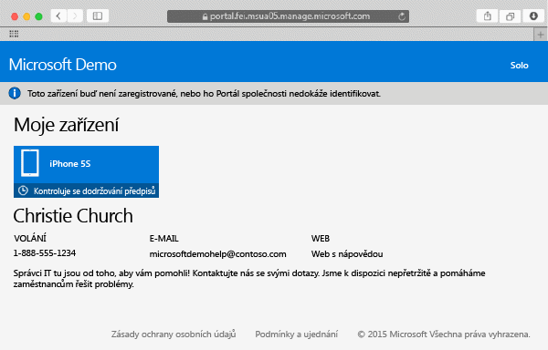

# Registrace zařízení se systémem Mac OS X v Intune

Po registraci zařízení s Mac OS X v Intune budete moct získat přístup k podnikové síti, pracovním e-mailům a souborům a také instalovat podnikové aplikace. Další informace o tom, co se stane, když zaregistrujete své zařízení, najdete v tématu [Co se stane, když nainstaluji aplikaci Portál společnosti a zaregistruji zařízení do služby Intune](what-happens-if-you-install-the-company-portal-app-and-enroll-your-device-in-intune-ios.md).

Pokud se snažíte zaregistrovat zařízení s iOS, přečtěte si téma [Registrace zařízení s iOS v Intune](enroll-your-device-in-intune-ios.md).

Postup registrace zařízení se systémem Mac OS X:

1.  V prohlížeči Safari otevřete [web Portál společnosti](https://portal.manage.microsoft.com) a klepněte na panel oznámení.

2.  Klepněte na text **Toto zařízení buď není zaregistrované, nebo ho Portál společnosti nedokáže identifikovat**.

     

3.  Klepnutím na **Instalovat** zahajte registraci svého zařízení.

     

4.  V dialogovém okně **Instalovat profil správy** klepněte na **Instalovat**. Pokud se zobrazí dialogové okno s výzvou k zadání přihlašovacích údajů, zadejte svoje uživatelské jméno a heslo a potom klepněte na **Pokračovat** &gt; **Instalovat**.

     

    Po dokončení registrace se zobrazí stránka profilu správy s informací, že proběhlo ověření vašeho profilu.

     

Potřebujete ještě další pomoc? Obraťte se na správce IT. Jeho kontaktní údaje najdete na [webu Portál společnosti](http://portal.manage.microsoft.com).

### Související témata
[Using your iOS or Mac OS X device with Intune](using-your-ios-or-mac-os-x-device-with-intune.md)

<!--HONumber=Jun16_HO4-->

