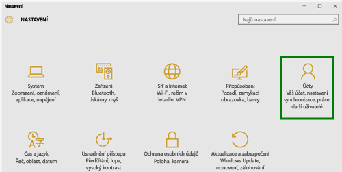
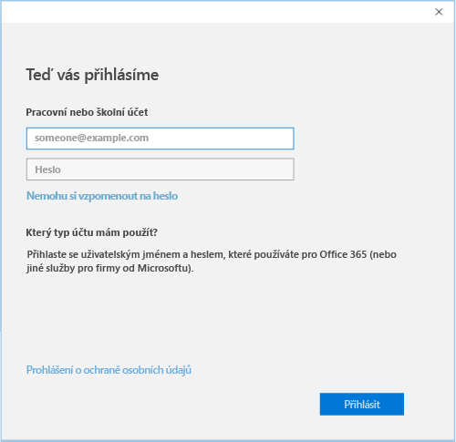

# Registrace zařízení s Windows 10 v Intune

1.  Otevřete aplikaci **Nastavení** Windows – přejděte na **nabídku Start** a vyberte tlačítko **Nastavení**. Můžete také pomocí panelu hledání vyhledat „nastavení“.

2. Vyberte **Účty**.

    

3. Vyberte **Váš účet**.

    

4. Vyberte **Přidat pracovní nebo školní účet**.

    

5. Přihlaste se pomocí přihlašovacích údajů svého pracovního nebo školního účtu.

    

Stále nemáte přístup k pracovním nebo školním e-mailům, souborům nebo jiným datům? Zkuste přístup opravit pomocí [řešení potíží s vaším účtem](troubleshoot-your-windows-10-device-windows.md#troubleshooting-steps-to-follow-if-you-see-your-account). Pokud ani to nepomůže, budete muset o pomoc požádat správce IT.

Snadný způsob, jak získat pomoc od správce IT, je prostřednictvím kontaktních údajů, které jsou k dispozici v aplikaci Portál společnosti. Ta vám také umožní vyhledat a stáhnout doporučené a požadované aplikace pro každodenní práci. Možná už aplikaci Portál společnosti v zařízení nainstalovanou máte. Snadno to zjistíte, když zkusíte najít aplikaci __Portál společnosti__ v seznamu __Všech aplikací__.

Pokud aplikaci Portál společnosti v seznamu nenajdete, nainstalujte ji podle následujícího postupu.

1. Vyberte **Spustit** > **Store**.

2. Vyberte **Hledat** a napište **portál společnosti**.

3. V seznamu výsledků vyberte **Portál společnosti** > **Instalovat**.

4. Vyberte buď **Instalovat**, nebo **Zdarma**. Mezi těmito dvěma možnostmi pro vás není žádný rozdíl. Co se vám zobrazí, závisí na tom, jak vaše organizace nastavila aplikaci Portál společnosti.

