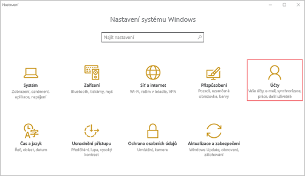
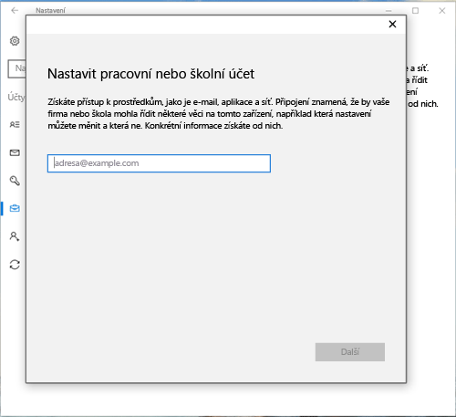

# Registrace zařízení s Windows 10 Mobile nebo Windows 10 Desktop v Intune

Pokud vaše společnost nebo škola používá Microsoft Intune, můžete svá zařízení zaregistrovat, a získat tak přístup k e-mailům, souborům a dalším prostředkům společnosti. Registrace zařízení umožňuje vaší organizaci zabezpečit podniková data. Další informace o registraci najdete v tématu [Co se stane, když nainstaluji aplikaci Portál společnosti a zaregistruji zařízení v Intune](what-happens-if-you-install-the-company-portal-app-and-enroll-your-device-in-intune-windows.md) a v tématu [Co má a nemá správce IT oprávnění vidět na vašem zařízení](what-can-your-it-administrator-see-when-you-enroll-your-device-in-intune-windows.md).

Registrace zařízení s Windows 10 Mobile nebo Windows 10 Desktop:

1.  Ve Windows přejděte do **Nastavení** a klepněte na **Účty**.

    

2.  Podívejte se na další dvě obrazovky a najděte tu, která vypadá stejně jako to, co vidíte ve svém zařízení. Použijte postup odpovídající této obrazovce.

    Pokud se zobrazí tato obrazovka, použijte pokyny v tématu [Postup, pokud se zobrazí Přístup do práce nebo do školy](#steps-to-follow-if-you-see-access-work-or-school).

    

    Pokud se zobrazí tato obrazovka, použijte postup v tématu [Postup, pokud se zobrazí Váš účet](#steps-to-follow-if-you-see-your-account).

    

## Postup, pokud se zobrazí Přístup do práce nebo do školy

1.  Klepněte na **Přístup do práce nebo do školy**.

    

2.  Zadejte svou pracovní nebo školní e-mailovou adresu a klepněte na **Další**.

    

3. Přihlaste se k Intune ze svého pracovního nebo školního účtu.

    

    Zobrazí se zpráva, že organizace nebo škola registruje vaše zařízení.

4. Když se zobrazí stránka **Všechno máte nastavené**, klepněte na **Zavřít**. Máte hotovo.

  

5. Pokud chcete zkontrolovat, zda je připojení skutečně v pořádku, vraťte se k **Nastavení**, kde by měl být nyní uvedený váš pracovní nebo školní účet.

    

Pokud jste použili výše uvedené kroky, ale pořád nemáte přístup ke svému pracovnímu e-mailovému účtu nebo souborům, použijte kroky v části [Postup řešení potíží, pokud se zobrazí Přístup do práce nebo do školy](troubleshoot-your-windows-10-device-windows.md#troubleshooting-steps-to-follow-if-you-see-access-work-or-school).

## Postup, pokud se zobrazí Váš účet

1.  Ve Windows přejděte do **Nastavení** a klepněte na **Účty**.

    

2.  Klepněte na **Váš účet**.

    

3.  Klepněte na **Přidat pracovní nebo školní účet**.

    

4.  Přihlaste se pomocí přihlašovacích údajů svého pracovního nebo školního účtu.

    

Pokud jste použili výše uvedené kroky, ale pořád nemáte přístup ke své pracovní nebo školní e-mailové adrese, souborům nebo dalším datům, použijte pokyny v části [Postup řešení potíží, pokud se zobrazí váš účet](troubleshoot-your-windows-10-device-windows.md#troubleshooting-steps-to-follow-if-you-see-your-account).

Doporučujeme také nainstalovat aplikaci Portál společnosti, která vám umožní snadno identifikovat a instalovat podnikové aplikace, které jsou relevantní pro vás i vaši roli. V závislosti na tom, jak vaše společnost službu Intune nakonfigurovala, může být aplikace Portál společnosti už nainstalovaná jako součást procesu registrace.

Pokud chcete zjistit, jestli aplikaci máte, hledejte v seznamu aplikací aplikaci **Portál společnosti**. Pokud aplikaci Portál společnosti v seznamu nenajdete, nainstalujte ji podle následujícího postupu.

1.  Klepněte na **Start** &gt; **Store**.

2.  Klepněte na **Hledat** a napište **portál společnosti**.

3.  V seznamu výsledků klepněte na **Portál společnosti** &gt; **Instalovat**.

4.  Klepněte buď na **Instalovat**, nebo na **Zdarma**. Zobrazovaná možnost závisí na tom, jak vaše společnost aplikaci nakonfigurovala.

Potřebujete ještě další pomoc? Obraťte se na správce IT. Jeho kontaktní údaje najdete na [webu Portál společnosti](http://portal.manage.microsoft.com).

<!--HONumber=Sep16_HO3-->

