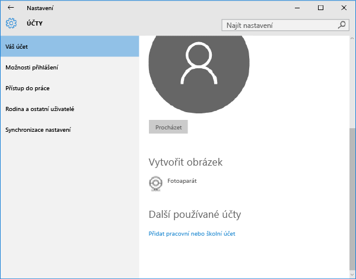

# Registrace zařízení s Windows 10 Mobile nebo Windows 10 Desktop v Intune

Pokud vaše společnost nebo škola používá Microsoft Intune, můžete svá zařízení zaregistrovat, a získat tak přístup k e-mailům, souborům a dalším prostředkům společnosti. Registrace zařízení umožňuje vaší organizaci zabezpečit podniková data. Další informace o registraci najdete v tématu [Co se stane, když nainstaluji aplikaci Portál společnosti a zaregistruji zařízení v Intune](what-happens-if-you-install-the-company-portal-app-and-enroll-your-device-in-intune-windows.md) a v tématu [Co má a nemá správce IT oprávnění vidět na vašem zařízení](what-can-your-it-administrator-see-when-you-enroll-your-device-in-intune-windows.md).

Registrace zařízení s Windows 10 Mobile nebo Windows 10 Desktop:

1.  Ve Windows přejděte do **Nastavení** a klepněte na **Účty**.

    

2.  Klepněte na **Váš účet**.

    

3.  Klepněte na **Přidat pracovní nebo školní účet**.

    

4.  Přihlaste se pomocí přihlašovacích údajů svého pracovního nebo školního účtu.

    

Pokud jste použili tento postup, ale pořád nemáte přístup k pracovnímu nebo školnímu e-mailu, souborům a dalším datům, přejděte zpátky k položce **Účty** a klepněte na **Přístup do práce**.

-   Pokud vidíte svůj pracovní nebo školní účet, gratulujeme. Jste připojení.

-   Pokud svůj pracovní nebo školní účet nevidíte, klepněte na **Připojit** a přihlaste se pomocí přihlašovacích údajů svého pracovního nebo školního účtu.

Doporučujeme také nainstalovat aplikaci Portál společnosti, která vám umožní snadno identifikovat a instalovat podnikové aplikace, které jsou relevantní pro vás i vaši roli. V závislosti na tom, jak vaše společnost službu Intune nakonfigurovala, už aplikace Portál společnosti může být nainstalovaná jako součást procesu registrace. Pokud chcete zjistit, jestli aplikaci máte, hledejte v seznamu aplikací aplikaci **Portál společnosti**. Pokud aplikaci Portál společnosti v seznamu nenajdete, nainstalujte ji podle následujícího postupu.

1.  Klepněte na **Start** &gt; **Store**.

2.  Klepněte na **Hledat** a napište **portál společnosti**.

3.  V seznamu výsledků klepněte na **Portál společnosti** &gt; **Instalovat**.

4.  Klepněte buď na **Instalovat**, nebo na **Zdarma**. To, která z možností se zobrazuje, závisí na tom, jak vaše společnost aplikaci nakonfigurovala.

Potřebujete ještě další pomoc? Obraťte se na správce IT. Jeho kontaktní údaje najdete na [webu Portál společnosti](http://portal.manage.microsoft.com).

### Související témata
[Registrace zařízení se systémem Windows do Intune](enroll-your-device-in-intune-windows.md) 
[Použití zařízení Windows s Intune](using-your-windows-device-with-intune.md)

<!--HONumber=Jun16_HO4-->

