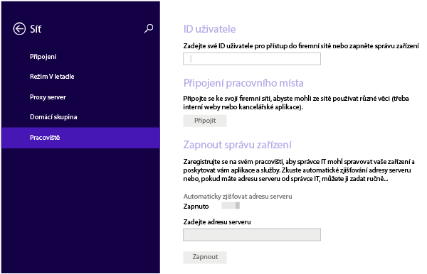
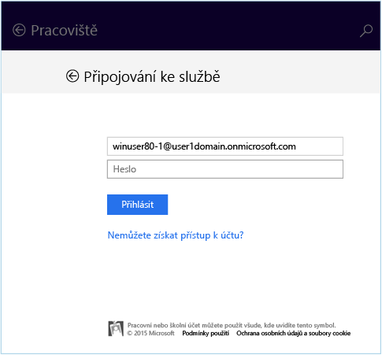
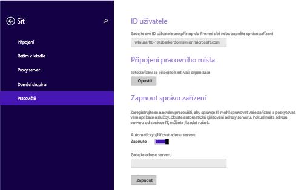
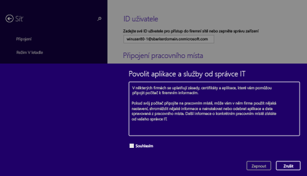

---
# required metadata

title: Registrace zařízení s Windows 8.1 nebo Windows RT 8.1 v Intune | Microsoft Intune
description:
keywords:
author: Staciebarker
manager: jeffgilb
ms.date: 04/28/2016
ms.topic: article
ms.prod:
ms.service: microsoft-intune
ms.technology:
ms.assetid: 28984f26-1070-4f7a-877c-669a59375c0c

# optional metadata

#ROBOTS:
#audience:
#ms.devlang:
ms.reviewer: priyar
ms.suite: ems
#ms.tgt_pltfrm:
#ms.custom:

---

# Registrace zařízení s Windows 8.1 nebo Windows RT 8.1 v Intune

Pokud vaše společnost nebo škola používá Microsoft Intune, můžete svá zařízení zaregistrovat, a získat tak přístup k e-mailům, souborům a dalším prostředkům společnosti. Registrace zařízení umožňuje vaší organizaci zabezpečit podniková data. Další informace o registraci najdete v tématu [Co se stane, když nainstaluji aplikaci Portál společnosti a zaregistruji zařízení v Intune](what-happens-if-you-install-the-company-portal-app-and-enroll-your-device-in-intune-windows.md) a v tématu [Co má a nemá správce IT oprávnění vidět na vašem zařízení](what-can-your-it-administrator-see-when-you-enroll-your-device-in-intune-windows.md).

Registrace zařízení s Windows 8.1 nebo Windows RT 8.1:

1.  V zařízení klepněte na **Nastavení** &gt; **Nastavení počítače** &gt; **Síť** &gt; **Pracoviště**.

    

2.  Zadejte e-mailovou adresu svého pracovního nebo školního účtu pro dané ID uživatele, pokud je to potřeba, a klepněte na **Připojit se**.

    Pokud není potřeba zadat ID uživatele, použije se e-mailová adresa, kterou jste zadali při přihlašování k tomuto zařízení.

3.  Zadejte heslo pracovního nebo školního e-mailového účtu.

    

4.  V části **Zapnout správu zařízení** klepněte na **Zapnout**.

    

5.  V dialogovém okně **Povolit aplikace a služby od správce IT** zaškrtněte políčko **Souhlasím** a potom klepněte na **Zapnout**.

    

    Po úspěšné registraci uvidíte následující obrazovku.

    

Doporučujeme také nainstalovat aplikaci Portál společnosti, která vám umožní snadno identifikovat a instalovat podnikové aplikace, které jsou relevantní pro vás i vaši roli. V závislosti na tom, jak vaše společnost službu Intune nakonfigurovala, už aplikace Portál společnosti může být nainstalovaná jako součást procesu registrace. Pokud chcete zjistit, jestli aplikaci máte, hledejte v seznamu aplikací aplikaci **Portál společnosti**. Pokud aplikaci Portál společnosti v seznamu nenajdete, nainstalujte ji podle následujícího postupu.

1.  Klepněte na **Start** &gt; **Store**.

2.  Klepněte na **Hledat** a napište **portál společnosti**.

3.  V seznamu výsledků klepněte na **Portál společnosti**.

4.  Klepněte buď na **Instalovat**, nebo na **Zdarma**. To, která z možností se zobrazuje, závisí na tom, jak vaše společnost aplikaci nakonfigurovala.

Potřebujete ještě další pomoc? Obraťte se na správce IT. Jeho kontaktní údaje najdete na [webu Portál společnosti](http://portal.manage.microsoft.com).

### Související témata
[Registrace zařízení se systémem Windows do Intune](enroll-your-device-in-intune-windows.md) 
[Použití zařízení Windows s Intune](using-your-windows-device-with-intune.md)

<!--HONumber=Jun16_HO2-->

