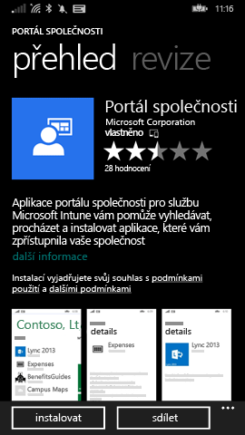
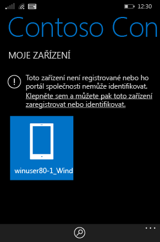
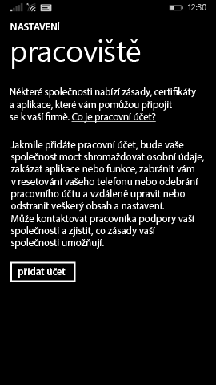

# Registrace zařízení s Windows Phone 8.1 v Intune

Pokud vaše společnost nebo škola používá Microsoft Intune, můžete svá zařízení zaregistrovat, a získat tak přístup k e-mailům, souborům a dalším prostředkům společnosti. Registrace zařízení umožňuje vaší organizaci zabezpečit podniková data. Další informace o registraci najdete v tématu [Co se stane, když nainstaluji aplikaci Portál společnosti a zaregistruji zařízení v Intune](what-happens-if-you-install-the-company-portal-app-and-enroll-your-device-in-intune-windows.md) a v tématu [Co má a nemá správce IT oprávnění vidět na vašem zařízení](what-can-your-it-administrator-see-when-you-enroll-your-device-in-intune-windows.md).

Pokud chcete své zařízení s Phone 8.1 zaregistrovat v Intune, postupujte podle pokynů, které se vztahují na vaši společnost nebo školu:

-   [Pokud vám vaše společnost umožňuje používat Portál společnosti z Windows Storu](#if-your-company-lets-you-use-the-company-portal-from-the-windows-store)

-   [Pokud nemáte oprávnění k přístupu do Windows Storu z Windows Phonu nebo pokud ještě nemáte účet Microsoft](#if-you-are-not-allowed-to-access-the-windows-store-from-your-windows-phone-or-if-you-do-not-have-a-microsoft-account)

## Pokud vám vaše společnost umožňuje používat Portál společnosti z Windows Storu
Nainstalujte si do zařízení aplikaci Portál společnosti:

1.  Klepněte na **Start** &gt; **Store**.

2.  Klepněte na **Hledat** a napište **portál společnosti**.

3.  V seznamu výsledků klepněte na **Portál společnosti**.

    

4.  Klepněte na **Portál společnosti** &gt; **Instalovat**.

    

Zaregistrujte své zařízení:

1.  V zařízení otevřete aplikaci **Portál společnosti Microsoft Intune**.

2.  Zadejte svoje přihlašovací údaje. V odpovídajících případech můžete být vyzváni, abyste přijali podmínky a ujednání vaší společnosti.

3.  Potažením prstem přejděte na **Moje zařízení**.

4.  Klepněte na **Klepněte sem a můžete pak toto zařízení zaregistrovat nebo identifikovat**.

    

5.  Klepněte na **Zaregistrovat toto zařízení**.

    

6.  Klepněte na **Přidat účet**.

    

7.  Zadejte další požadované informace a pak klepnutím na **Přihlásit se** dokončete registraci. Teď byste měli vidět účet pracoviště na stránce **Nastavení** &gt; **Pracoviště**.

    

## Pokud nemáte oprávnění k přístupu do Windows Storu z Windows Phonu nebo pokud ještě nemáte účet Microsoft

1.  Klepněte na **Nastavení** &gt; **Pracoviště**.

2.  Klikněte na **Přidat účet** a potom se přihlaste pomocí svého pracovního účtu.

3.  Zadejte další požadované informace a potom klepnutím na **Přihlásit se** dokončete registraci.

4.  Pokud se zobrazí výzva k instalaci aplikace společnosti nebo centra, zaškrtněte odpovídající políčko a potom klepněte na **Hotovo**.

Pokud váš správce IT nakonfiguroval aplikaci Portál společnosti tak, aby se nainstalovala při registraci, zobrazí se vám aplikace Portál společnosti v seznamu aplikací.

Potřebujete ještě další pomoc? Obraťte se na správce IT. Jeho kontaktní údaje najdete na [webu Portál společnosti](http://portal.manage.microsoft.com).

<!--HONumber=Aug16_HO5-->

