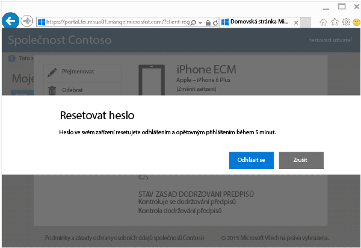
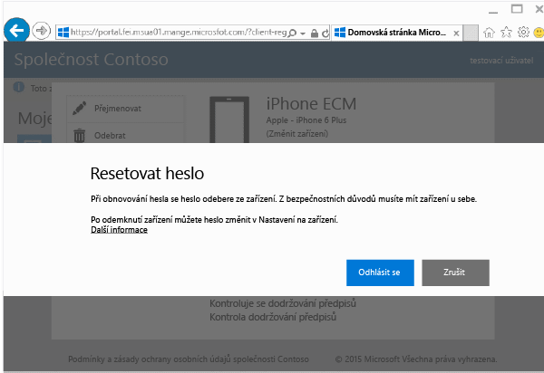

# Resetování hesla zařízení z webu Portál společnosti

Pokud ztratíte kód PIN nebo heslo zařízení, které jste zaregistrovali v Intune, můžete použít [web Portál společnosti](http://portal.manage.microsoft.com) k jeho resetování. Web Portál společnosti je webová stránka, kterou můžete použít ke správě počítačů a zařízení, které jste registrovali v Intune, a k provádění většiny úloh, které můžete provádět pomocí aplikace Portál společnosti.

> [!NOTE]
> V závislosti na tom, jak váš správce nakonfiguroval Intune, se na webu Portál společnosti nemusí tlačítko Resetovat heslo zobrazit. Restování hesla není podporované u zařízení s Windows 8.1 a Windows RT.

Resetování hesla:

1.  Otevřete [web Portál společnosti](http://portal.manage.microsoft.com) a klepněte na zařízení, jehož heslo chcete resetovat.

2.  Klepněte na **Resetovat heslo**.

    

3.  Klepněte na **Odhlásit se** a potom se znovu přihlaste s pracovními nebo školními přihlašovacími údaji. Musíte se znovu přihlásit do pěti minut.

    

4.  Klepněte na **Resetovat heslo**.

    

    V tabulce najdete, jak resetování hesla funguje ve vašem zařízení.

    |Platforma|Support|
    |------------|-----------|
    |Android|Vytvoří nové dočasné alfanumerické heslo.|
    |iOS|Odebere heslo ze zařízení a nevytvoří nové dočasné heslo. Pokud používáte Touch ID, musíte ho v zařízení znovu nainstalovat, protože se při resetování hesla odebere.|
    |Windows 10 (pouze mobilní zařízení)|Vytvoří nové dočasné alfanumerické heslo. Windows Hello je podporované.|
    |Windows Phone 8.1|Vytvoří nové dočasné číselné heslo.|
    Po odemčení zařízení můžete nastavit nové heslo pomocí nabídky **Nastavení** vašeho zařízení.

5.  Odemkněte zařízení a nastavte nové heslo nebo změňte dočasné heslo pomocí nabídky **Nastavení** vašeho zařízení.

    Pokud chcete zobrazit potvrzení, že bylo heslo úspěšně resetované, klikněte na příznak oznámení v pravé horní části webu Portál společnosti.

Potřebujete ještě další pomoc? Obraťte se na správce IT. Jeho kontaktní údaje najdete na [webu Portál společnosti](http://portal.manage.microsoft.com).

<!--HONumber=Aug16_HO5-->

