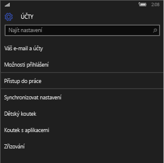
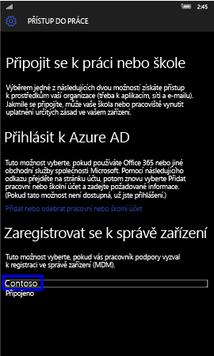
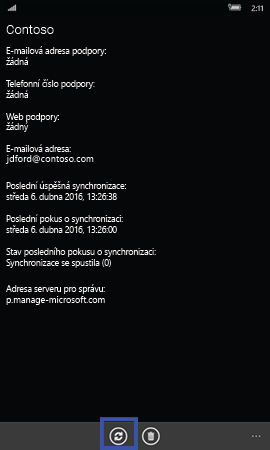
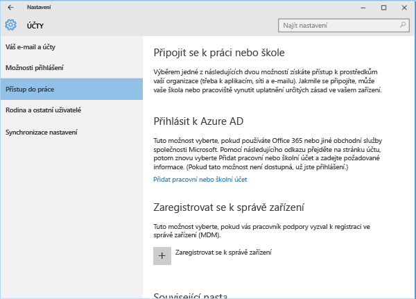
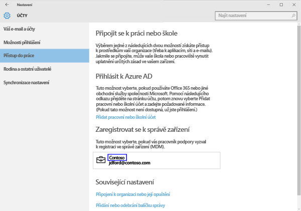
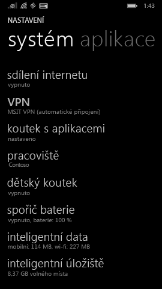
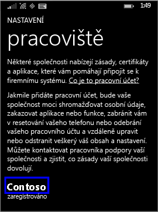

---
# required metadata

title: Ruční synchronizace zařízení | Microsoft Intune
description:
keywords:
author: Staciebarker
manager: jeffgilb
ms.date: 04/28/2016
ms.topic: article
ms.prod:
ms.service: microsoft-intune
ms.technology:
ms.assetid: 443c6de7-5187-4dc4-b844-6085a0c659bd

# optional metadata

#ROBOTS:
#audience:
#ms.devlang:
ms.reviewer: jeffgilb
ms.suite: ems
#ms.tgt_pltfrm:
#ms.custom:

---

# Ruční synchronizace zařízení
Pokud instalace aplikací trvá příliš dlouho, použijte následující pokyny k ruční synchronizaci zařízení s Windows, která vám může pomoci instalaci zrychlit. Použijte postup odpovídající typu vašeho zařízení:

* [Windows 10 Mobile](#windows-10-mobile)
* [Windows 10 Desktop](#windows-10-desktop)
* [Windows Phone 8.1](#windows-phone-8-1)

## Windows 10 Mobile
Chcete-li ručně synchronizovat mobilní zařízení s Windows 10 pro urychlení pomalé instalace aplikací:

1. Přejděte na **Všechny aplikace** > **Nastavení** > **Účty**..

    
    
2. Klepněte na **Přístup do práce**..

    
    
3. V části **Zaregistrovat ke správě zařízení**, klepněte na název společnosti, viz následující příklad.

    
    
4. Klepněte na ikonu **Synchronizovat**.

    
    
    V horní části obrazovky se zobrazí zpráva „Probíhá synchronizace účtu“. Tlačítko Synchronizovat je zobrazeno šedě, dokud neskončí synchronizace vašeho zařízení.

## Stolní počítač s Windows 10
Chcete-li provést ruční synchronizaci stolního počítače s Windows 10 pro urychlení pomalé instalace aplikací:

1. Vyberte tlačítko **Start**, viz následující příklad, a pak vyberte **Nastavení**..

    
    
2. Na stránce **Nastavení** vyberte **Účty**..
 
    
    
3. Na stránce **Účty** vyberte **Přístup do práce**..
    
    
    
4. V části **Zaregistrovat ke správě zařízení** klikněte na název vaší společnosti, viz modře zvýrazněný příklad níže.
    
    
   
5. Vyberte tlačítko **Synchronizovat**.
    
    
   
   Tlačítko se změní na šedé, dokud neskončí synchronizace.

## Windows Phone 8.1
Chcete-li provést ruční synchronizaci mobilního zařízení s Windows 8.1 pro urychlení pomalé instalace aplikací:

1. Přejděte na **Všechny aplikace** > **Nastavení** > **Pracoviště**..

    
    
2. Klepněte na název vaší společnosti, viz modře zvýrazněný příklad níže.

    
   
3. Klepněte na ikonu **Synchronizovat**.

    
    
   V horní části obrazovky se až do skončení synchronizace zařízení zobrazí zpráva „Probíhá synchronizace účtu“.

### Související témata
[Použití zařízení Windows s Intune](using-your-windows-device-with-intune.md)

<!--HONumber=May16_HO1-->

