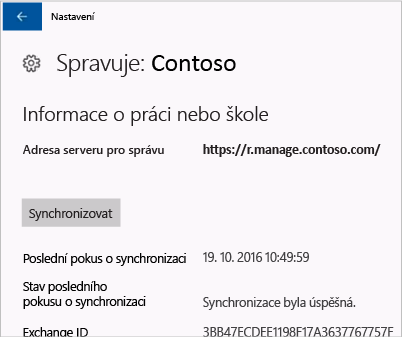

# Ruční synchronizace zařízení s Windows

Někdy může instalace aplikace na zařízení s Windows trvat déle, než byste předpokládali. V takovém případě můžete zkusit provést ruční synchronizaci zařízení s Windows. Synchronizace může instalaci urychlit.

> [!Note]
> Pokud jste v síti s nižší rychlostí nebo s vyšším počtem zařízení, která stahují obsah ve stejnou dobu, může instalace aplikací chvíli trvat.

Synchronizovat ručně se dají verze Windows uvedené dále. Pokud vaše zařízení používá jinou verzi Windows, nebude bohužel možné ruční synchronizaci spustit.

* [Synchronizace stolního počítače s Windows 10](#windows-10-desktop)
* [Synchronizace Windows 10 Mobile](#windows-10-mobile)
* [Synchronizace Windows Phone 8.1](#windows-phone-81)

## Stolní počítač s Windows 10
Je více verzí Windows 10, a proto existují dvě sady postupů. Pokud chcete zjistit, jaké kroky použít, podívejte se na snímky obrazovky a postupujte podle pokynů, které odpovídají tomu, co vidíte na svém zařízení.

1. Zvolte tlačítko **Start** a pak zvolte **Nastavení**.

    

2. Na stránce **Nastavení** zvolte **Účty**.

    

3. Podívejte se na další dvě obrazovky a najděte tu, která vypadá stejně jako to, co vidíte ve svém zařízení. Použijte postup odpovídající této obrazovce.

    Pokud se zobrazí tato obrazovka s informací „Přístup do práce nebo do školy“, postupujte podle pokynů v části [Postup, pokud se zobrazí Přístup do práce nebo do školy](#steps-to-follow-if-you-see-access-work-or-school).

    

    Pokud se zobrazí tato obrazovka s informací „Přístup do práce“, postupujte podle pokynů v části [Postup, pokud se zobrazí Přístup do práce](#steps-to-follow-if-you-see-your-account).

    

### Postup, pokud se zobrazí Přístup do práce nebo do školy

1. Na stránce **Účty** zvolte **Přístup do práce nebo do školy**.

    

2. Zvolte svůj pracovní nebo školní účet. V závislosti na nastavení provedeném správcem IT se mohou zobrazit dva účty, které se podobají účtům v následujícím příkladu. Jeden účet má u sebe aktovku a druhý logo Microsoftu.

    - Pokud vidíte účet s aktovkou, vyberte ho a podívejte se, že je pod ním tlačítko **Informace**.
    - Pokud vidíte jen účet s logem Microsoftu, vyberte ho a podívejte se, že je pod ním tlačítko **Informace**.

    

3. Zvolte tlačítko **Informace**. Otevře se dialogové okno, které vypadá podobně jako v následujícím příkladu.

    

4. Zvolte tlačítko **Synchronizovat**. Zařízení se bude synchronizovat s Intune.

### Postup, pokud se zobrazí Přístup do práce

1. Na stránce **Účty** zvolte **Přístup do práce**.

    

2. V části **Zaregistrovat se ve správě zařízení** zvolte název své firmy.

    

3. Zvolte tlačítko **Synchronizovat**.

    

   Tlačítko bude zašedlé, dokud synchronizace neskončí.

   ## Windows 10 Mobile
   Chcete-li ručně synchronizovat mobilní zařízení s Windows 10 pro urychlení pomalé instalace aplikací:

   1. Přejděte na **Všechny aplikace** > **Nastavení** > **Účty**.

       

   2. Zvolte **Přístup do práce**.

       

   3. V části **Zaregistrovat se ve správě zařízení** zvolte název své firmy.

       

   4. Zvolte ikonu **Synchronizovat**.

       

       V horní části obrazovky se zobrazí zpráva, že „probíhá synchronizace účtu“. Tlačítko **Synchronizovat** je zašedlé, dokud neskončí synchronizace vašeho zařízení.

## Windows Phone 8.1
Chcete-li provést ruční synchronizaci mobilního zařízení s Windows 8.1 pro urychlení pomalé instalace aplikací:

1. Přejděte na **Všechny aplikace** > **Nastavení** > **Pracoviště**.

    

2. Zvolte název své firmy.

    

3. Zvolte ikonu **Synchronizovat**.

    

   V horní části obrazovky bude až do skončení synchronizace zařízení zobrazená zpráva, že „probíhá synchronizace účtu“.

Potřebujete ještě další pomoc? Obraťte se na správce IT. Kontaktní údaje najdete na [webu Portál společnosti](http://portal.manage.microsoft.com).

