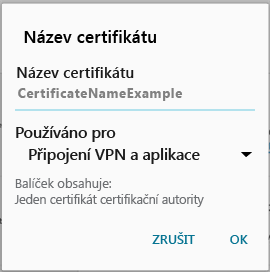

# Zařízení nemá požadovaný certifikát

## Ve vašem zařízení chybí certifikát, který je obvykle nainstalovaný v telefonu
Pokud zařízení s Androidem není zaregistrované v Intune a chybí mu certifikát, který je obvykle nainstalovaný v telefonu, nebudete se k aplikaci Portál společnosti pro Android moct přihlásit. Při pokusu o přihlášení se zobrazí tato zpráva:

Pokud chcete problém vyřešit a získat požadovaný certifikát:

1.  V prohlížeči přejděte na tuto [stránku certifikátu Digicert](https://www.digicert.com/digicert-root-certificates.htm).

2.  Vyhledejte certifikát Baltimore CyberTrust Root (https://www.digicert.com/CACerts/BaltimoreCyberTrustRoot.crt) a stáhněte ho.

3.  Přetažením dolů otevřete oznámení a v jejich seznamu klepněte na **BaltimoreCyberTrustRoot.crt**.

4.  V dialogovém okně **Název certifikátu** přijměte výchozí název certifikátu.

5. Ujistěte se, že **Použití přihlašovacích údajů** je nastavené na **Použito pro VPN a aplikace**, a potom klepněte na **OK**.

    

6. Zavřete webový prohlížeč a aplikaci Portál společnosti.

7. Aplikaci Portál společnosti znovu otevřete. Teď už by mělo být možné se k aplikaci Portál společnosti přihlásit. Pokud potřebujete pomoc, obraťte se na správce IT.

## Ve vašem zařízení chybí certifikát, který vyžaduje správce IT
Pokud zařízení s Androidem není zaregistrované v Intune a chybí mu certifikát, který vyžaduje správce IT, nebudete se k aplikaci Portál společnosti pro Android moct přihlásit. Při pokusu o přihlášení se zobrazí tato zpráva:

>[!NOTE]
> Pokud se vám už zobrazila zpráva typu Chybějící certifikát a použili jste postup popsaný v části [Ve vašem zařízení chybí certifikát, který je obvykle nainstalovaný v telefonu](#your-device-is-missing-a-certificate-that-usually-comes-installed-on-your-phone), nic se neděje. Je to jiná zpráva a také jiný certifikát. Proto pokračujte a k získání chybějícího certifikátu použijte postup v této části.

Pokud chcete tyto potíže vyřešit a získat požadovaný certifikát, musíte udělat dva hlavní kroky:

- Určit chybějící certifikát pomocí pracovního nebo školního počítače.
- Pomocí vašeho zařízení stáhnout chybějící certifikát z internetu.

### Určení chybějícího certifikátu pomocí pracovního nebo školního počítače

1. Na počítači otevřete aplikaci Internet Explorer. Pokud nemáte počítač, který byste k těmto účelům mohli využít, obraťte se na správce IT. Kontaktní informace na svého správce IT najdete na [webu Portál společnosti](http://portal.manage.microsoft.com).

2. Přejděte na [web Portál společnosti](http://portal.manage.microsoft.com) a přihlaste se pomocí pracovních nebo školních přihlašovacích údajů.

3. Na adresním řádku prohlížeče vyberte úplně vpravo symbol, který vypadá jako visací zámek, jak je vidět na následujícím snímku obrazovky.

    

    Pokud se symbol visacího zámku nezobrazuje, přestaňte a kontaktujte správce IT. Zámek znamená, že jste úspěšně přihlášení. Proto byste neměli pokračovat, dokud tento symbol neuvidíte.

4. Vyberte **Zobrazit certifikáty**.

    

5. V dialogovém okně **Certifikáty** vyberte kartu **Cesta k certifikátu** a potom určete certifikát, který potřebujete získat z internetu. Název certifikátu, který potřebujete, se zobrazí na stejné pozici jako název zvýrazněný na předchozím snímku obrazovky s příkladem.

### Stažení a instalace chybějícího certifikátu na mobilním zařízení s Androidem

1. Pomocí vyhledávacího webu jako Bing nebo Google vyhledejte název chybějícího certifikátu, který jste určili v předchozí části. Název certifikátu může mít různé přípony, třeba .crt nebo .pem.

2. Stáhněte si kořenový certifikát z webu.

3. Po stažení certifikátu si přetažením dolů z horní části zařízení otevřete oznámení a potom v seznamu oznámení klepněte na název požadovaného certifikátu.

4. V dialogovém okně **Název certifikátu** zobrazeném na následujícím snímku obrazovky přijměte výchozí název certifikátu.

5. Ujistěte se, že **Použití přihlašovacích údajů** je nastavené na **Použito pro VPN a aplikace**, a potom klepněte na **OK**.

    

6. Zavřete aplikaci Portál společnosti.

7. Aplikaci Portál společnosti znovu otevřete. Teď už by mělo být možné se k aplikaci Portál společnosti přihlásit. Pokud potřebujete pomoc, obraťte se na správce IT.

Pokud se vám stejná zpráva typu Chybějící certifikát už zobrazila a už jste použili popsaný postup, pravděpodobně je ještě další certifikát, s jehož instalací vám musí pomoct správce IT. Obraťte se na správce IT a poskytněte mu tento odkaz na [problémy s certifikáty Androidu](/intune/troubleshoot/troubleshoot-device-enrollment-in-intune#android-certificate-issues), který obsahuje kroky k vyřešení problému.

<!--HONumber=Oct16_HO2-->

