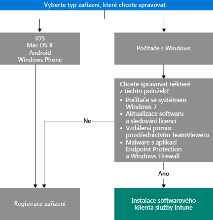

# Volba způsobu správy zařízení

Abyste mohli využívat mnoho funkcí, které služba Intune nabízí (například nasazení aplikaci nebo ovládání nastavení zařízení), musí být vaše zařízení *spravované*. Způsob správy zařízení záleží na tom, jaké možnosti služby Intune chcete používat.
Toto téma vám pomůže rozhodnout, která metoda nejlépe odpovídá vašim potřebám.

Pokud chcete spravovat zařízení se systémem iOS, Mac OS X, Android nebo Windows Phone, musíte je *zaregistrovat*.

U správy počítačů se systémem Windows máte dvě možnosti:

1. Zaregistrovat zařízení, **nebo**
2. nainstalovat *klientský software Intune*.

## Rozhodněte, kterou metodu použít
Použijte tento postup rozhodování k určení, jak budou vaše zařízení spravována.

Pokud chcete získat co nejvíce funkcí, zaregistrujte počítače s Windows. Klientský software Intune ale může vašim potřebám lépe odpovídat, pokud budou splněny tyto podmínky:

- Počítač používá systém Windows 7
- Chcete spravovat aktualizace softwaru systému Windows a využití licencí
- Ke správě malwaru chcete používat Endpoint Protection a bránu Windows Firewall
- Chcete uživatelům poskytovat vzdálenou pomoc přes software TeamViewer

Podrobné informace o možnostech, jaké vám každá z těchto metod propůjčuje, najdete v tématu [Možnosti správy mobilních zařízení](mobile-device-management-capabilities-in-microsoft-intune.md) a [Možnosti klientského softwaru Intune PC](windows-pc-management-capabilities-in-microsoft-intune.md).
Informace o zařízení a počítačích, které Intune podporuje, najdete v části [Podporovaná mobilní zařízení a počítače](/intune/get-started/supported-mobile-devices-and-computers)

## Správa Exchange ActiveSync
Kromě registrace zařízení nebo instalace klientského softwaru Intune můžete zařízení spravovat i přes [protokol Exchange ActiveSync](/intune/deploy-use/mobile-device-management-with-exchange-activesync-and-microsoft-intune). Tato metoda vyžaduje instalaci konektoru On-Premises Connector nebo použití integrovaného konektoru Service to Service Connector pro připojení k Exchange Serveru.
Toto je sice třetí možnost správy zařízení, ale ve srovnání s jinými metodami poskytuje jen omezené možnosti.

## Další kroky

- [Volba způsobu registrace mobilních zařízení](/intune/get-started/choose-how-to-enroll-devices1)
- [Správa počítačů s Windows pomocí klientského počítačového softwaru Intune](/intune/deploy-use/manage-windows-pcs-with-microsoft-intune)

- [Správa mobilních zařízení pomocí protokolu Exchange ActiveSync a služby Microsoft Intune](/intune/deploy-use/mobile-device-management-with-exchange-activesync-and-microsoft-intune).

<!--HONumber=Aug16_HO5-->

