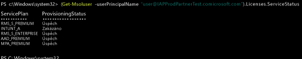

# Správa licencí Intune
Než se uživatel může přihlásit ke službě Intune a používat ji nebo registrovat své zařízení ke správě, musíte mu nejdřív přiřadit licenci k vašemu předplatnému Intune prostřednictvím [portálu služeb Office 365](http://go.microsoft.com/fwlink/p/?LinkId=698854).

Organizace, které používají Microsoft Enterprise Mobility + Security (EMS), můžou mít uživatele, kteří v balíčku EMS vyžadují jenom služby Azure Active Directory Premium nebo Intune. Pomocí [rutin PowerShellu pro Azure Active Directory](https://msdn.microsoft.com/library/jj151815.aspx) můžete přiřadit jednu službu nebo podmnožinu služeb. Další informace najdete v tématu [Správa licencí Intune pomocí PowerShellu](start-with-a-paid-subscription-to-microsoft-intune-step-4-posh.md).

## Přiřazování licencí služby Intune
Když jsou uživatelské účty synchronizované z místní služby Active Directory nebo ručně přidané do předplatného cloudových služeb prostřednictvím [portálu služeb Office 365](http://go.microsoft.com/fwlink/p/?LinkId=698854), není jim automaticky přiřazená licence Intune. Místo toho musí správce klienta Intune později uživatelský účet upravit a licenci uživateli přiřadit ručně z portálu Office služeb 365.

Pokud vaše předplatné sdílí Azure AD s jinými cloudovými službami přidruženými k vašemu předplatnému, máte také přístup k uživatelům přidaným do těchto služeb. Tito uživatelé nebudou mít licenci k [!INCLUDE[wit_nextref](../includes/wit_nextref_md.md)], dokud jim tyto licence jednotlivě nepřiřadíte.

> [!TIP]
> Pokud je možnost přiřadit licenci k [!INCLUDE[wit_nextref](../includes/wit_nextref_md.md)] nebo ji odvolat neaktivní, může vaše předplatné zahrnovat možnosti multilicencí, třeba možnosti dostupné v případě používání sady [Enterprise Mobility Suite](https://www.microsoft.com/en-us/server-cloud/enterprise-mobility/overview.aspx). Informace o tom, jak přiřadit nebo odvolat licenci najdete v dokumentaci k vašim možnostem licencování.

## Přiřazení uživatelské licence pro Intune

[Portál služeb Office 365](http://go.microsoft.com/fwlink/p/?LinkId=698854) můžete použít k ručnímu přidání cloudových uživatelů a přiřazení licencí účtům cloudových uživatelů i účtům, které se synchronizovaly z místní služby Active Directory do Azure AD.

1.  Přihlaste se na [portál služeb Office 365](http://go.microsoft.com/fwlink/p/?LinkId=698854) pomocí svých přihlašovacích údajů správce klienta a potom vyberte **Lidé** > **Všichni uživatelé**.

2.  Vyberte uživatelský účet, kterému chcete přiřadit uživatelskou licenci pro Intune, a potom vyberte **Microsoft Intune** (samostatně) nebo **Enterprise Mobility Suite**.

3.  Uživatelský účet má teď potřebná oprávnění k používání služby a registraci zařízení pro správu.

> [!NOTE] Jakmile uživatelé zaregistrují zařízení, zobrazí se v konzole. 

### Použití PowerShellu k selektivní správě uživatelských licencí pro EMS
Organizace, které používají Microsoft Enterprise Mobility + Security (dříve Enterprise Mobility Suite), můžou mít uživatele, kteří v balíčku EMS vyžadují jenom služby Azure Active Directory Premium nebo Intune. Pomocí [rutin PowerShellu pro Azure Active Directory](https://msdn.microsoft.com/library/jj151815.aspx) můžete přiřadit jednu službu nebo podmnožinu služeb.

Pokud chcete selektivně přiřadit uživatelské licence pro služby EMS, otevřete PowerShell jako správce v počítači, kde je instalovaný [modul Azure Active Directory pro Windows PowerShell](https://msdn.microsoft.com/library/jj151815.aspx#bkmk_installmodule). PowerShell můžete nainstalovat na místní počítač nebo na server služby AD FS.

Musíte vytvořit novou definici SKU licence, která se vztahuje jenom na požadované plány služeb. To provedete tak, že zakážete plány, které nechcete použít. Můžete třeba vytvořit definici SKU licence, která nepřiřazuje licenci pro Intune. Pokud chcete zobrazit seznam dostupných služeb, zadejte:

    (Get-MsolAccountSku | Where {$_.SkuPartNumber -eq "EMS"}).ServiceStatus

Spuštěním následujícího příkazu můžete vyloučit plán služby Intune. Stejnou metodu můžete použít k rozšíření na celou skupinu zabezpečení nebo můžete použít podrobnější filtry.

**Příklad 1** Vytvořte nového uživatele na příkazovém řádku a přiřaďte mu licenci EMS bez povolení části licence pro Intune:

    Connect-MsolService

    New-MsolUser -DisplayName “Test User” -FirstName FName -LastName LName -UserPrincipalName user@<TenantName>.onmicrosoft.com –Department DName -UsageLocation US

    $CustomEMS = New-MsolLicenseOptions -AccountSkuId "<TenantName>:EMS" -DisabledPlans INTUNE_A
    Set-MsolUserLicense -UserPrincipalName user@<TenantName>.onmicrosoft.com -AddLicenses <TenantName>:EMS -LicenseOptions $CustomEMS

Ověřte pomocí:

    (Get-MsolUser -UserPrincipalName "user@<TenantName>.onmicrosoft.com").Licenses.ServiceStatus

**Příklad 2** Zakažte část licence EMS pro Intune uživateli, který má licenci už přiřazenou:

    Connect-MsolService

    Set-MsolUserLicense -UserPrincipalName user@<TenantName>.onmicrosoft.com -RemoveLicenses IAPProdPartnerTest:EMS

    $CustomEMS = New-MsolLicenseOptions -AccountSkuId "<TenantName>:EMS" -DisabledPlans INTUNE_A
    Set-MsolUserLicense -UserPrincipalName user@<TenantName>.onmicrosoft.com -AddLicenses <TenantName>:EMS -LicenseOptions $CustomEMS

Ověřte pomocí:

    (Get-MsolUser -UserPrincipalName "user@<TenantName>.onmicrosoft.com" .Licenses.ServiceStatus

### Další kroky
Gratulujeme! Právě jste dokončili krok 4 *úvodní příručky Intune*.
>[!div class="step-by-step"]

>[&larr; **Synchronizace uživatelů do Intune**](.\start-with-a-paid-subscription-to-microsoft-intune-step-2.md)     [**Organizace uživatelů a zařízení** &rarr;](.\start-with-a-paid-subscription-to-microsoft-intune-step-5.md)  

<!--HONumber=Aug16_HO5-->

