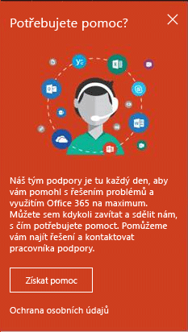

# Jak správci získají podporu pro Microsoft Intune

[!INCLUDE[classic-portal](../includes/classic-portal.md)]

Microsoft poskytuje pro Microsoft Intune globální technickou a předprodejní podporu a podporu k fakturaci a správě předplatného. Podpora je k dispozici online i po telefonu pro placené i zkušební předplatné. Online technická podpora je k dispozici v angličtině a japonštině. V dalších jazycích je k dispozici podpora po telefonu a online podpora k fakturaci.

Podpora pro Intune a pro Intune při použití s nástrojem Configuration Manager je bezplatná. Zákazníkům se smlouvou Premier Support účtujeme poplatky za dotazy k postupům (například jak nakonfigurovat funkci Intune).

## Získání pomoci bez otevření lístku podpory

Než budete vytvářet lístek podpory, zkuste najít odpovědi v následujících zdrojích informací.

### Fóra Microsoft TechNet o Intune

Zeptejte se technických odborníků Microsoftu nebo s nimi zahajte diskusi. Odpovědi a vysvětlení nabízíme na [fóru Microsoft TechNet o Intune](https://social.technet.microsoft.com/Forums/home), které umožňuje i vyhledávání.

    

### Web pro zasílání názorů na produkt Microsoft Intune UserVoice

Máte nápad, jak by Microsoft mohl Intune ještě více vylepšit? Svoje nápady můžete přidávat na webu pro zasílání názorů na Microsoft Intune [UserVoice](https://microsoftintune.uservoice.com/forums/291681-ideas). Také můžete hlasovat o nápadech, které k produktu UserVoice přidali ostatní. 

    

## Vytvoření lístku služby online

1.  Přihlaste se k [Centru pro správu Office 365](https://portal.office.com) pomocí svých přihlašovacích údajů Intune.
    >[!NOTE]
    >
    >Zákazníci se smlouvou Premier Support můžou otevřít lístek podpory služby Intune na [stránce podpory Premier](https://support.microsoft.com/en-us/premier/contacts).

2.  Zvolte dlaždici **Správce**.
3.  Pokud chcete otevřít lístek, zvolte na levé straně v části **Podpora** možnost **Podpora**.

    

    >[!NOTE]
    >  Zákazníkům, kteří mají nebo měli účet O365 s maximálně 100 licencemi, se zobrazí následující zpráva. Pokud se vám tato zpráva zobrazí, přečtěte si informace v části [Jiné metody vytvoření lístku podpory](#create-a-support-ticket-with-alternate-methods).

    > 

    -   V případě problémů s fakturací, licencemi nebo účtem vyberte možnost **Informace o fakturaci a produktech**.

    -   V případě všech ostatních problémů s Intune vyberte možnost **Správa mobilních zařízení**.

    > [!NOTE]
    > Možná budete muset zvolit **Další** pod seznamem, aby se zobrazily všechny kategorie.

3.  Podle pokynů otevřete požadavek.

### Jiné metody vytvoření lístku podpory

Pokud vaše stránka podpory vypadá takto, postupujte podle následujících pokynů:

1. Zvolte **Potřebuji nápovědu**.
2. Do textového pole zadejte popis problému a pak zvolte **Získat nápovědu**.

    

3. Podívejte se na navrhované online materiály a zdroje informací nebo zvolte možnost **Zavoláme vám** a pracovníci podpory společnosti Microsoft vás budou kontaktovat.

## Získání telefonické podpory
V tématu [Kontaktujte odbornou telefonickou pomoc pro Microsoft Intune](contact-assisted-phone-support-for-microsoft-intune.md) najdete seznam telefonních čísel podpory podle zemí a oblastí, pracovní dobu podpory a podporované jazyky pro každou oblast.

## Sledování žádostí o služby
1.  Přihlaste se k [Centru pro správu Office 365](https://portal.office.com) pomocí svých přihlašovacích údajů Intune.
2.  Zvolte dlaždici **Správce**.
3.  Na levé straně v části **Podpora** zvolte možnost **Žádosti o služby**. Potom můžete zkontrolovat své požadavky.

Naše prvotní reakce na žádosti o služby závisí na závažnosti problému. U nejzávažnějších problémů je naše první reakce pro zákazníky se smlouvou Professional do dvou hodin. Pro zákazníky se smlouvou Premier Support se reakce liší podle smlouvy o podpoře. Jedná se o tyto případy:

- Jedna nebo více služeb jsou nedostupné nebo nepoužitelné.
- Produkce, provoz nebo termíny nasazení jsou vážně ohrožené, případně hrozí vážný dopad na produkci nebo ziskovost.
- Je zasaženo víc uživatelů nebo služeb.

U středně závažných problémů je naše první reakce pro zákazníky se smlouvou Professional do čtyř hodin. Pro zákazníky se smlouvou Premier Support se reakce liší podle smlouvy o podpoře.  Jedná se o tyto případy:

- Služba je použitelná, ale nepracuje tak dobře, jak je obvyklé.
- Situace má střední dopad na chod firmy a jde ji vyřešit během provozní doby.
- Je částečně zasažený jeden uživatel, zákazník nebo služba.

U ostatních typů problémů je naše první reakce pro zákazníky se smlouvou Professional do osmi hodin. Pro zákazníky se smlouvou Premier Support se reakce liší podle smlouvy o podpoře.  Jedná se o tyto případy:

- Situace má minimální dopad na chod firmy.
- Problém je důležitý, ale pro zákazníka nemá okamžitý významný dopad na služby nebo produktivitu.
- U jednoho uživatele dochází k částečnému narušení služby, ale existuje přijatelné alternativní řešení.

> [!NOTE]
> **Pokud používáte Microsoft System Center Configuration Manager** nebo **Microsoft System Center Endpoint Protection:** Technickou podporu pro Configuration Manager nebo Endpoint Protection získáte od svého partnera, případně přejděte do [Centra řešení Microsoft System Center Configuration Manager a System Center Endpoint Protection](http://www.microsoft.com/en-us/server-cloud/products/system-center-2012-r2/resources.aspx), kde najdete řadu materiálů pro svépomocné řešení. Nabízí také možnost otevření žádosti o podporu online nebo po telefonu.
>
> Technická podpora pro System Center Configuration Manager nebo System Center Endpoint Protection vyžaduje buď platbu nebo se odečte od stávajících licenčních smluv nebo smluv Premier Support.

## Vyřešení problémů bez otevření lístku podpory

Je možné, že budete problém schopni vyřešit, aniž by bylo potřeba otevírat lístek podpory.

Informace o samoobslužné pomoci v Intune najdete v tématu [Obecné tipy pro odstraňování potíží v Microsoft Intune](general-troubleshooting-tips-for-microsoft-intune.md) nebo v některém z témat o odstraňování potíží pro specifické problémy. Řešení také můžete zkusit najít ve [fóru služby Intune](https://social.technet.microsoft.com/Forums/en-US/home?forum=microsoftintuneprod), případně tam můžete zadat svůj dotaz.

## Získání podpory pro zákazníky s multilicencemi
Pokud jste už zakoupili licence od Microsoftu v rámci multilicenčního programu, využijte následující možnosti podpory:

-   Podporu související s licencemi a vyhledáním klíčů najdete na webu [Volume Licensing Service Center](http://go.microsoft.com/fwlink/p/?LinkID=282016).

-   Pokud máte dotazy k fakturaci, využijte [podporu pro fakturaci a správu předplatného](http://support.microsoft.com/oas/default.aspx?prid=15371).

-   Obecné informace o multilicenčních programech najdete na webu [Licencování](http://go.microsoft.com/fwlink/p/?LinkID=282015).

<!--HONumber=Jan17_HO4-->

