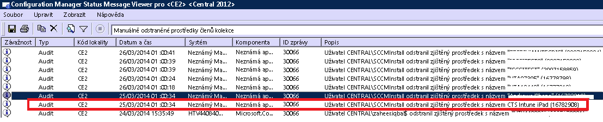

# Řešení potíží s registrací do služby Intune

Tady najdete některé problémy s registrací zařízení a způsoby, jak je vyřešit.

> [!NOTE]
> Uživatelé spravovaných zařízení můžou pro vaši potřebu shromažďovat protokoly registrace a diagnostiky. Pokyny pro uživatele ke shromažďování protokolů najdete tady:
>- [Odeslání protokolů s diagnostickými daty ze zařízení s Androidem správci IT pomocí kabelu USB](/intune/enduser/send-diagnostic-data-logs-to-your-it-administrator-using-a-usb-cable-android)
>- [Odeslání protokolů s diagnostickými daty ze zařízení s Androidem správci IT e-mailem](/intune/enduser/send-diagnostic-data-logs-to-your-it-administrator-using-email-android)
>- [Odeslání chyb registrace zařízení s Androidem správci IT](/intune/enduser/send-enrollment-errors-to-your-it-administrator-android)
>- [Odeslání chyb registrace zařízení s iOS správci IT](/intune/enduser/send-errors-to-your-it-admin-ios)

Pokud tyto informace váš problém nevyřeší, přečtěte si téma [Jak získat podporu pro Microsoft Intune](how-to-get-support-for-microsoft-intune.md), ve kterém najdete další způsoby, jak získat nápovědu.

## Obecné problémy s registrací
K těmto problémům může docházet na všech platformách zařízení.

### Dosažení limitu zařízení
**Problém:** Při registraci se uživateli na zařízení zobrazí chyba, na zařízení se systémem iOS třeba chyba **Portál společnosti není dočasně k dispozici**, a protokol DMPdownloader.log v Configuration Manageru obsahuje chybu **DeviceCapReached**.

**Řešení:** Návrh řešení neumožňuje uživatelům registrovat víc než 5 zařízení.

#### Kontrola počtu zaregistrovaných a povolených zařízení

1.  Na portálu správy služby Intune zkontrolujte, jestli nemá uživatel víc než 5 přiřazených zařízení.

2.  Na portálu správy služby Intune v části Správce\Správa mobilních zařízení\Pravidla registrace zkontrolujte, jestli je u položky Limit pro registraci zařízení nastavená hodnota 5.

Uživatelé mobilních zařízení můžou zařízení odstraňovat na této adrese URL: [https://byodtestservice.azurewebsites.net/](https://byodtestservice.azurewebsites.net/).

Správci můžou zařízení odstraňovat na portálu služby Azure Active Directory.

#### Odstranění zařízení na portálu služby Azure Active Directory

1.  Přejděte na adresu [http://aka.ms/accessaad](http://aka.ms/accessaad) nebo zvolte **Správce** &gt; **Azure AD** na webu [https://portal.office.com](https://portal.office.com).

2.  Použijte odkaz v levé části stránky a přihlaste se pod svým ID organizace.

3.  Pokud nemáte předplatné Azure, vytvořte ho. Pokud máte placený účet, neměli byste potřebovat platební kartu ani zadání platby (zvolte odkaz pro předplatné **Zdarma zaregistrovat službu Azure Active Directory**).

4.  Vyberte možnost **Active Directory** a potom vyberte svoji organizaci.

5.  Vyberte kartu **Uživatelé** .

6.  Vyberte uživatele, jehož zařízení chcete odstranit.

7.  Zvolte **Zařízení**.

8.  Odeberte zařízení podle potřeby, třeba zařízení, která už se nepoužívají, nebo zařízení s nesprávnými definicemi.

> [!NOTE]

> Limitu registrace zařízení se můžete vyhnout použitím správce registrace zařízení, jak je popsáno v tématu [Registrace firemních zařízení pomocí správce registrace zařízení v Microsoft Intune](/intune/deploy-use/enroll-corporate-owned-devices-with-the-device-enrollment-manager-in-microsoft-intune).
>
> Pokud se pro přihlašovací jméno uživatele, jehož účet přidáte do skupiny správců registrace zařízení, vynucuje zásada podmíněného přístupu, nebude možné dokončit registraci.

### Portál společnosti není dočasně k dispozici
**Problém:** Uživateli se na zařízení se zobrazí chyba **Portál společnosti není dočasně k dispozici**.

#### Řešení potíží s chybou Portál společnosti není dočasně k dispozici

1.  Odeberte ze zařízení aplikaci Portál společnosti Intune.

2.  Otevřete v zařízení prohlížeč, přejděte na adresu [https://portal.manage.microsoft.com](https://portal.manage.microsoft.com)a pokuste se přihlásit uživatele.

3.  Pokud se uživateli nepodaří přihlásit, požádejte ho, ať vyzkouší jinou síť.

4.  Pokud to nepomůže, zkontrolujte, jestli správně proběhla synchronizace přihlašovacích údajů uživatele se službou Azure Active Directory.

5.  Pokud se uživatel úspěšně přihlásí, zařízení se systémem iOS zobrazí výzvu k instalaci aplikace Portál společnosti Intune a k registraci. V zařízení se systémem Android budete muset aplikaci Portál společnosti Intune nainstalovat ručně. Potom se můžete znovu zkusit přihlásit.

### Není definována autorita MDM
**Problém:** Zobrazí se chyba **Není definována autorita MDM**.

#### Řešení potíží s chybou Není definována autorita MDM

1.  Zkontrolujte, jestli je nastavená správná autorita pro správu mobilních zařízení (MDM) pro verzi služby Intune, kterou používáte, tedy pro Intune, O365 MDM, nebo System Center Configuration Manager se službou Intune. V případě služby Intune se autorita MDM nastavuje v části **Správce** &gt; **Správa mobilních zařízení**. V případě využívání nástroje Configuration Manager s Intune se nastavuje při konfiguraci konektoru Intune a v O365 jde o nastavení **Mobilní zařízení**.

    > [!NOTE] Jakmile jednou nastavíte autoritu MDM, můžete ji změnit jedině tak, že se obrátíte na podporu, jak je popsáno v tématu [Jak získat podporu pro Microsoft Intune](how-to-get-support-for-microsoft-intune.md).

2.  Ověřte správnou synchronizaci přihlašovacích údajů uživatele se službou Azure Active Directory tím, že zkontrolujete, jestli hlavní název uživatele (UPN) odpovídá údajům služby Active Directory na portálu účtů.
    Pokud hlavní název uživatele neodpovídá údajům služby Active Directory:

    1.  Vypněte na místním serveru službu DirSync.

    2.  Odstraňte neodpovídajícího uživatele ze seznamu uživatelů na **portálu účtů Intune** .

    3.  Počkejte zhruba hodinu, aby měla služba Azure dost času odebrat nesprávná data.

    4.  Znovu zapněte službu DirSync a zkontrolujte, jestli je teď uživatel správně synchronizovaný.

3.  Pokud používáte nástroj System Center Configuration Manager se službou Intune, zkontrolujte, jestli má uživatel platné ID uživatele cloudu:

    1.  Otevřete nástroj SQL Management Studio.

    2.  Připojte se k příslušné databázi.

    3.  Otevřete složku databází a vyberte a otevřete složku **CM_název_db**, kde název_db odpovídá názvu databáze zákazníka.

    4.  Nahoře zvolte **Nový dotaz** a spusťte tyto dotazy:

        -   Zobrazení všech uživatelů: `select * from [CM_ DBName].[dbo].[User_DISC]`

        -   Pokud chcete zobrazit konkrétní uživatele, použijte tento dotaz, kde %testuser1% představuje adresu jmeno_uzivatele@domena.com pro uživatele, kterého chcete vyhledat: `select * from [CM_ DBName].[dbo].[User_DISC] where User_Principal_Name0 like '%testuser1%'`

        Po napsání dotazu zvolte **!Execute**.
        Když se vrátí výsledky, vyhledejte ID uživatele cloudu.  Pokud se žádné ID nenajde, nemá daný uživatel licenci pro používání služby Intune.

### Pokud název společnosti obsahuje speciální znaky, není možné vytvořit zásadu ani registrovat zařízení
**Problém:** Nemůžete vytvořit zásadu nebo zaregistrovat zařízení.

**Řešení:** V [Centru pro správu Office 365](https://portal.office.com/) odeberte zvláštní znaky z názvu společnosti a uložte informace o společnosti.

### Pokud máte více ověřených domén, není možné se přihlásit nebo zaregistrovat zařízení
**Problém:** Pokud do AD FS přidáte druhou ověřenou doménu, nemusí být uživatelé s příponou hlavního názvu uživatele (UPN) druhé domény schopni se přihlásit na portály nebo zaregistrovat zařízení. 

**Řešení:** Zákazníci, kteří mají předplatné Microsoft Office 365, využívají jednotné přihlašování (SSO) prostřednictvím služby AD FS 2.0 a mají pro přípony UPN uživatelů v rámci organizace více domén nejvyšší úrovně (například @contoso.com nebo @fabrikam.com), musí pro každou příponu nasadit samostatnou instanci federační služby AD FS 2.0.  K dispozici je nyní [kumulativní aktualizace pro službu AD FS 2.0](http://support.microsoft.com/kb/2607496), která ve spojení s přepínačem **SupportMultipleDomain** umožňuje zajistit, aby AD FS server tento scénář podporoval bez vyžadování dalších serverů služby AD FS 2.0. Další informace najdete na [tomto blogu](https://blogs.technet.microsoft.com/abizerh/2013/02/05/supportmultipledomain-switch-when-managing-sso-to-office-365/).

## Problémy na zařízeních s Androidem
### Neúspěch instalace profilu
**Problém:** Na zařízení s Androidem se zobrazí chybová zpráva **Instalace profilu se nezdařila**.

### Postup řešení potíží při neúspěšné instalaci profilu

1.  Zkontrolujte, jestli má uživatel přiřazenou příslušnou licenci pro verzi služby Intune, kterou používáte.

2.  Zkontrolujte, jestli už není zařízení zaregistrované pomocí jiného poskytovatele správy mobilních zařízení (MDM) a jestli už v něm není nainstalovaný profil správy.

4.  Potvrďte, že Chrome pro Android je výchozím prohlížečem a že jsou povolené soubory cookie.
## Problémy na zařízeních s iOS
### Neúspěch instalace profilu
**Problém:** V zařízení s iOS se zobrazí chyba **Instalace profilu se nezdařila**.

### Postup řešení potíží při neúspěšné instalaci profilu

1.  Zkontrolujte, jestli má uživatel přiřazenou příslušnou licenci pro verzi služby Intune, kterou používáte.

2.  Zkontrolujte, jestli už není zařízení zaregistrované pomocí jiného poskytovatele správy mobilních zařízení (MDM) a jestli už v něm není nainstalovaný profil správy.

3.  Přejděte na adresu [https://portal.manage.microsoft.com](https://portal.manage.microsoft.com) a po zobrazení výzvy se pokuste profil nainstalovat.

4.  Potvrďte nastavení výchozích prohlížečů Safari (pro iOS) a povolení souborů cookie.

### Zaregistrovaná zařízení s iOS se při používání nástroje System Center Configuration Manager se službou Intune nezobrazí v konzole
**Problém:** Uživatel registruje zařízení s iOS, to se ale nezobrazí v konzole pro správu nástroje Configuration Manager. Zařízení neindikuje, že je zaregistrované. Možné příčiny:

- Je možné, že jste konektor služby Intune zaregistrovali na jednom účtu a potom jste ho zaregistrovali na jiném účtu. 
- Mohli jste si stáhnout certifikát MDM z jednoho účtu a použít ho na jiný účet.

**Řešení:** Proveďte tyto kroky:

1. Zakažte iOS v rámci konektoru služby Windows Intune. 
    1. Pravým tlačítkem klikněte na předplatné služby Intune a vyberte **Vlastnosti**.
    1. Na kartě iOS zrušte zaškrtnutí políčka Povolit registraci zařízení se systémem iOS.

1. V SQL spusťte následující kroky pro databázi CAS DB.
  
    1. update SC_ClientComponent_Property set Value2 = '' where Name like '%APNS%' 
    1. delete from MDMPolicy where PolicyType = 7 
    1. delete from MDMPolicyAssignment where PolicyType = 7
    1. update SC_ClientComponent_Property set Value2 = '' where Name like '%APNS%' 
    1. delete from MDMPolicy where PolicyType = 11 
    1. delete from MDMPolicyAssignment where PolicyType = 11 
    1. DELETE Drs_Signals
1. Restartujte službu SMS Executive nebo restartujte CM Server. 

1. Získejte nový certifikát APN a nahrajte ho: klikněte pravým tlačítkem na předplatné služby Intune v levém podokně nástroje Configuration Manager. Vyberte **Vytvořit žádost o certifikát APNs** a postupujte podle pokynů.
## Problémy při použití nástroje System Center Configuration Manager se službou Intune
### Mobilní zařízení zmizí 
**Problém:** Po úspěšné registraci mobilního zařízení do Configuration Manageru dané zařízení zmizí z kolekce mobilních zařízení, ale pořád má profil pro správu a je uvedené v bráně CSS.

**Řešení:** K této situaci může dojít, protože máte vlastní proces, který odebírá zařízení nepřipojená k doméně, nebo protože uživatel vyřadil zařízení z předplatného. Pokud chcete ověřit a zkontrolovat, který proces nebo uživatelský účet odebral zařízení z konzoly nástroje Configuration Manager, postupujte podle následujících kroků.

#### Zjištění způsobu odebrání zařízení

1.  V konzole pro správu nástroje Configuration Manager vyberte **Monitorování** &gt; ** Stav systému** &gt; **Dotazy stavových zpráv**.

2.  Klikněte pravým tlačítkem na **Manuálně odstraněné prostředky členů kolekce** a vyberte **Zobrazit zprávy**.

3.  Vyberte příslušný čas/datum nebo období posledních 12 hodin.

4.  Najděte příslušné zařízení a podívejte se, jak došlo k jeho odebrání. Následující příklad ukazuje, že zařízení odebral účet SCCMInstall prostřednictvím neznámé aplikace.

    

5.  Zkontrolujte, jestli nemá Configuration Manager naplánovanou úlohu, skript nebo jiný proces, který by mohl automaticky odstraňovat zařízení nepřipojená k doméně, mobilní zařízení nebo související zařízení.

### Další chyby registrace zařízení s iOS
Seznam chyb registrace iOS je uvedený v dokumentaci pro uživatele zařízení v části [Při pokusu o registraci zařízení v Intune se zobrazí chyby](/intune/enduser/using-your-ios-or-mac-os-x-device-with-intune).

## Potíže s počítačem

### Počítač už je zaregistrovaný – chyba hr 0x8007064c
**Problém:** Registrace selže s chybou **Počítač už je zaregistrovaný**. V protokolu registrace se zobrazuje chyba **hr 0x8007064c**.
  
Důvodem může být to, že již byl počítač zaregistrován dříve nebo je na něm klonovaná image počítače, který už je zaregistrovaný. Na počítači se stále nachází certifikát předchozího účtu.

**Řešení:** 

1. V nabídce **Start** zvolte **Spustit** -> **MMC**. 
1. **Soubor** -> **Přidat/odebrat modul snap-in**.
1. Poklikejte na **Certifikáty**, zvolte **Účet počítače**, **Další**, vyberte **Místní počítač**.
1. Poklikejte na **Certifikáty (místní počítač)**, zvolte **Osobní/Certifikáty**. 
1. Vyhledejte certifikát Intune, který vystavila certifikační autorita Sc_Online_Issuing. Pokud existuje, odstraňte ho.
1. Pokud existuje tento klíč registru: ** HKEY_LOCAL_MACHINE\SOFTWARE\Microsoft\OnlineManagement regkey**, odstraňte ho a s ním i všechny podklíče.
1. Pokuste se o opětovnou registraci. 
1. Pokud ani tak počítač není možné zaregistrovat, vyhledejte a odstraňte tento klíč, pokud existuje: **KEY_CLASSES_ROOT\Installer\Products\6985F0077D3EEB44AB6849B5D7913E95**. 
1. Pokuste se o opětovnou registraci. 

    > [!IMPORTANT]
    > Tato část, metoda nebo úloha obsahují kroky, které vám pomohou s úpravou registru. Pokud ale budete měnit registr a uděláte tam něco špatně, můžete mít velké problémy s počítačem. Proto je důležité, abyste pečlivě postupovali podle těchto kroků. Než začnete registr měnit, pro jistotu si ho zazálohujte. Pak budete moct v případě problémů registr obnovit.
    > Další informace o tom, jak zálohovat a obnovovat registr, najdete v tématu [Postup zálohování a obnovení registru v systému Windows](https://support.microsoft.com/en-us/kb/322756).

## Obecné kódy chyb registrace

|Kód chyby|Možný problém|Navržené řešení|
|--------------|--------------------|----------------------------------------|
|0x80CF0437 |Na hodinách klientského počítače není nastavený správný čas.|Zkontrolujte, jestli jsou na klientském počítači správně nastavené hodiny a časové pásmo.
|
|0x80240438, 0x80CF0438, 0x80CF402C|Nedá se připojit ke službě Intune. Zkontrolujte nastavení proxy serveru klienta.|Ověřte, že Intune konfiguraci proxy serveru na klientském počítači podporuje a že má klientský počítač přístup na internet.|
|0x80240438, 0x80CF0438|Není nakonfigurované nastavení proxy serveru v Internet Exploreru a v místním systému.|Nedá se připojit ke službě Intune. Zkontrolujte nastavení proxy serveru klienta a ověřte, že Intune konfiguraci proxy serveru na klientském počítači podporuje a že má klientský počítač přístup na internet.|
|0x80043001, 0x80CF3001, 0x80043004, 0x80CF3004|Registrační balíček je zastaralý.|Z pracovního prostoru Správa si stáhněte aktuální balíček klientského softwaru a nainstalujte ho.|
|0x80043002, 0x80CF3002|Účet je v režimu údržby.|Když je účet v režimu údržby, nemůžete registrovat nové klientské počítače. Pokud si chcete prohlédnout nastavení svého účtu, přihlaste se k němu.|
|0x80043003, 0x80CF3003|Účet je odstraněný.|Ověřte, že je váš účet a předplatné Intune pořád aktivní. Pokud si chcete prohlédnout nastavení svého účtu, přihlaste se k němu.|
|0x80043005, 0x80CF3005|Klientský počítač byl vyřazen z provozu.|Pár hodin počkejte, odeberte z počítače všechny starší verze klientského softwaru s pak zkuste nainstalovat klientský software znova.|
|0x80043006, 0x80CF3006|Bylo dosaženo maximálního počtu licencí povolených pro účet.|Abyste mohli ve službě zaregistrovat víc klientských počítačů, musí si vaše organizace koupit další licence.|
|0x80043007, 0x80CF3007|Ve složce s instalačním programem se nenašel soubor certifikátu.|Než začnete s instalací, extrahujte všechny soubory. Žádné extrahované soubory nepřejmenovávejte ani nepřemísťujte: všechny soubory musí být ve stejné složce, jinak se instalace nepovede.|
|0x8024D015, 0x00240005, 0x80070BC2, 0x80070BC9, 0x80CFD015|Software nejde nainstalovat, protože se čeká na restartování klientského počítače.|Restartujte počítač a pak zkuste nainstalovat klientský software znova.|
|0x80070032|Na klientském počítači se nenašel nejmíň jeden softwarový produkt, který je podmínkou pro instalaci klientského softwaru.|Ujistěte se, že jsou na klientském počítači nainstalované všechny požadované aktualizace, a pak zkuste nainstalovat klientský software znova.|
|0x80043008, 0x80CF3008|Nepodařilo se spustit službu Microsoft Online Management Updates.|Kontaktujte podporu podle pokynů v tématu [Jak získat podporu pro Microsoft Intune](how-to-get-support-for-microsoft-intune.md).|
|0x80043009, 0x80CF3009|Klientský počítač je ve službě už zaregistrovaný.|Abyste mohli klientský počítač ve službě zaregistrovat znovu, musíte ho nejdřív vyřadit.|
|0x8004300B, 0x80CF300B|Instalační balíček klientského softwaru nejde spustit, protože verze Windows, která běží na klientovi, není podporovaná.|Intune nepodporuje verzi Windows, která běží na klientském počítači.|
|0xAB2|Instalační služba systému Windows nemohla získat přístup k modulu VBScript runtime pro vlastní akci.|Tato chyba je způsobená nějakou vlastní akcí založenou na dynamických knihovnách DLL (Dynamic-Link Library). Při odstraňování problémů s knihovnou DLL budete nejspíš muset použít nástroje popsané v [článku 198038 znalostní báze podpory Microsoftu: Užitečné nástroje při problémech s balíčky a nasazením](https://support.microsoft.com/en-us/kb/198038).|
|0x80cf0440|Připojení ke koncovému bodu služby bylo ukončeno.|Zkušební nebo placený účet je pozastaven. Vytvořte nový zkušební nebo placený účet a pak opakujte pokus o registraci.|

### Další kroky
Pokud vám tyto informace o řešení potíží nepomohly, obraťte se na podporu společnosti Microsoft podle pokynů v tématu [Jak získat podporu pro Microsoft Intune](how-to-get-support-for-microsoft-intune.md).

<!--HONumber=Jun16_HO2-->

