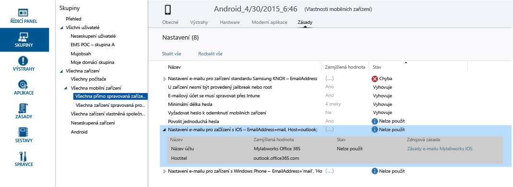

# Řešení potíží se zásadami v Microsoft Intune

Tady jsou některé problémy, které může způsobit vaše konfigurace zásad služby Microsoft Intune, a jejich doporučená řešení.

Pokud tyto informace váš problém nevyřeší, přečtěte si téma [Jak získat podporu pro Microsoft Intune](how-to-get-support-for-microsoft-intune.md), ve kterém najdete další způsoby, jak získat nápovědu.

## Používají se v zařízení zásady?
**Problém:** Není jasné, jestli se v určitém zařízení používá určitá zásada, nebo jestli se zařízení chová v rozporu s touto zásadou.

Zkontrolujte informace o zásadách dostupné pro jednotlivá zařízení, abyste zjistili, jak určitá zásada ovlivňuje konkrétní zařízení.

V konzole pro správu služby Intune má každé zařízení v části **Vlastnosti zařízení**vlastní kartu zásad. Pokud ne, u zařízení možná ještě probíhá registrace nebo se v něm nepoužívají žádné zásady. Každá zásada má **určenou hodnotu** a **Stav**. Určená hodnota označuje to, čeho chcete dosáhnout při přiřazování zásady. Stav označuje to, čeho skutečně dosáhnete, když jsou společně zvažovány všechny zásady, které u zařízení použijete, a všechna omezení a požadavky na hardware a operační systém. Možné stavy:

-   **Vyhovuje**: Zařízení přijalo zásady a hlásí službě, že vyhovuje danému nastavení.

-   **Nepoužívá se**: Nastavení zásad se nedá použít. Například nastavení e-mailu pro zařízení se systémem iOS se nedají použít pro zařízení se systémem Android.

-   **Čeká na vyřízení**: Došlo k odeslání zásady do zařízení a to ještě nenahlásilo službě svůj stav. Na vyřízení může čekat třeba šifrování v systému Android, které vyžaduje, aby šifrování povolil uživatel.

Na tomto snímku obrazovky vidíte dva jasné příklady:

-   Možnost **Povolit jednoduchá hesla** je nastavená na **Ano**, jak ukazuje sloupec **Určená hodnota**, ale její **Stav** je **Nepoužívá se**. Důvodem je, že se na zařízeních s Androidem nepodporují jednoduchá hesla.

-   Podobně pak u tohoto zařízení není použitá rozšířená položka zásad **Nastavení e-mailu pro zařízení iOS**, protože to je zařízení s Androidem.

> [!NOTE] Mějte na paměti, že když použijete dvě zásady s různými úrovněmi omezení na stejné zařízení nebo uživatele, v praxi se uplatní víc omezující zásada.

## Obnovení zásad a intervaly aktualizace
Upozorňujeme, že zásady se pravidelně obnovují a aktualizují. Obecně platí, že zásady by se měly na zařízeních zaregistrovat do 15 minut od provedení změny. Tady jsou další podrobnosti o pravidelných intervalech obnovení zásad:

-   **Zařízení s Windows zaregistrovaná pro MDM**: Zásady se aktualizují každých 8 hodin pro zařízení s Windows 8.1 a Windows 10 a každých 24 hodin pro zařízení s Windows RT.

-   **Windows Phone**: Zásada se aktualizuje každých 8 hodin. To se dá vynutit obnovením na portálu společnosti v části **Nastavení**.

-   **iOS**: Zásada se aktualizuje jednou denně v náhodném časovém intervalu. Tuto akci je možné vynutit také otevřením portálu společnosti, výběrem zařízení a zvolením **Synchronizace**.

-   **Android**: Zásada se aktualizuje jednou denně v náhodném časovém intervalu. Tuto akci je možné vynutit také otevřením portálu společnosti, výběrem zařízení a zvolením **Synchronizace**.

## Chyby související se zásadami Microsoft Intune v souboru policyplatform.log
U zařízení s Windows nespravovaných pomocí MDM můžou být chyby zásad v souboru policyplatform.log výsledkem jiného než výchozího nastavení nástroje Řízení uživatelských účtů v systému Windows (UAC) v zařízení. Některá nevýchozí nastavení UAC můžou ovlivnit zpracování zásad a instalace klientů Microsoft Intune.

### Řešení potíží s UAC

1.  Vyřaďte počítač, jak je popsané v tématu [Vyřazení zařízení ze správy službou Microsoft Intune](/intune/deploy-use/retire-devices-from-microsoft-intune-management).

2.  Počkejte 20 minut, než se odebere klientský software.

    > [!NOTE] Nepokoušejte se klienta odebrat pomocí panelu Programy a funkce.

3.  V nabídce Start zadejte **UAC**. Otevře se nastavení nástroje Řízení uživatelských účtů.

4.  Nastavte posuvník oznámení na výchozí nastavení.

## Chyba 0x87D1FDE8 v zařízení KNOX
**Problém**: Po vytvoření a nasazení e-mailového profilu Exchange Active Sync pro platformu Samsung KNOX do různých zařízení se systémem Android hlásí zařízení chybu **0x87D1FDE8** nebo **Náprava se nezdařila** na kartě vlastností &gt; zásad.

Zkontrolujte konfiguraci svého profilu EAS pro zařízení Samsung KNOX a zdroj zásad. Už není dostupná podpora možnosti synchronizace poznámek Samsung a ve vašem profilu by tato možnost neměla být vybraná. Dopřejte zařízením dostatek času na zpracování zásady, a to až 24 hodin.

## Výstraha: Uložení pravidel přístupu do systému Exchange se nezdařilo
**Problém**: V konzole pro správu se objeví výstraha **Uložení pravidel přístupu do systému Exchange se nezdařilo**  .

Pokud jste vytvořili zásady v pracovním prostoru Zásady pro místní Exchange v konzole pro správu, ale používáte služby O365, služba Intune nebude nakonfigurované nastavení zásad vynucovat. Poznamenejte si zdroj zásad uvedený ve výstraze.  V pracovním prostoru Zásady pro místní Exchange odstraňte zastaralá pravidla, protože se jedná o globální pravidla Exchange v rámci Intune pro místní Exchange a nevztahují se na služby O365. Pak vytvořte nové zásady pro služby O365.

## CHYBA: Nelze získat hodnotu z počítače, 0x80041013
K této chybě může dojít, pokud se místní systém nesynchronizuje delší dobu než pět minut. Pokud není čas v místním počítači synchronizovaný, zabezpečené transakce se nepodaří, protože budou mít neplatná časová razítka.

Pokud chcete tento problém vyřešit, nastavte místní čas počítače co nejblíž internetovému času nebo času nastavenému na řadičích domény v síti.

## Nelze změnit zásady zabezpečení pro různá zařízení MDM
Zařízení se systémy Windows Phone a Windows RT neumožňují snížení zásad zabezpečení nastavených prostřednictvím MDM nebo EAS, jakmile je nastavíte. Nastavíte třeba **Minimální počet znaků hesla** na hodnotu 8 a tu se pak pokusíte snížit na 4. V zařízení se už ale používá více omezující zásada.

Pokud chcete zásadu změnit na méně zabezpečenou hodnotu, v závislosti na platformě zařízení může být potřeba resetovat zásady zabezpečení.
Třeba v systému Windows RT potáhněte na ploše prstem zprava. Otevře se panel **Ovládací tlačítka** a v něm zvolte **Nastavení** &gt; **Ovládací panely**.  Vyberte aplet **Uživatelské účty** .
V navigační nabídce vlevo najdete dole odkaz **Resetovat zásady zabezpečení** . Zvolte jej a potom zvolte tlačítko **Resetovat zásady** .
Jiná zařízení MDM, třeba zařízení se systémy Android, Windows Phone 8.1 (a novějšími) a iOS, může být potřeba vyřadit a znovu zaregistrovat do služby, abyste mohli použít méně omezující zásadu.

## Zařízení se systémem Android nevynucují změny zásad zabezpečení bez přijetí koncovým uživatelem
Zařízení MDM se systémem Android na rozdíl od ostatních platforem nepovolují službě vynucovat v zařízení počáteční změny zásad. Důvodem jsou funkce systému Android, ne služba Intune. Zařízení se systémem Android zobrazí koncovému uživateli okno s upozorněním na výzvu týkající se dané změny zásad (třeba heslo, šifrování atd.).  Koncový uživatel musí na výzvu odpovědět, a až ji přijme, měla by se zásada použít.

## Pokud název společnosti obsahuje speciální znaky, není možné vytvořit zásadu ani registrovat klienty
**Problém:** Nemůžete vytvořit zásadu nebo zaregistrovat klienty.

**Řešení:** V [Centru pro správu Office 365](https://portal.office.com/) odeberte zvláštní znaky z názvu společnosti a uložte informace o společnosti.

### Další kroky
Pokud vám tyto informace o řešení potíží nepomohly, obraťte se na podporu společnosti Microsoft podle pokynů v tématu [Jak získat podporu pro Microsoft Intune](how-to-get-support-for-microsoft-intune.md).

<!--HONumber=Jun16_HO3-->

