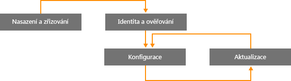
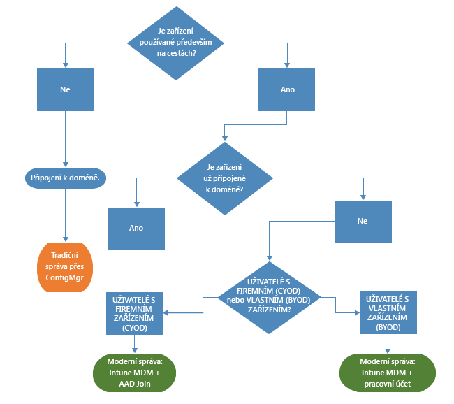

# Cesta k moderní správě Windows s Microsoft Intune

Zaměstnanci stále častěji používají osobní zařízení k práci a pracují mimo kancelář, a proto se mění i to, jak organizace přistupují ke správě zařízení. Zatímco určité části některých organizací můžou požadovat hlubokou podrobnou kontrolu nad zařízeními, jiné organizace přijímají scénáře s nižší úrovní správy, které vychází vstříc dnešním pracovníkům.

Windows 10 pokračuje v tradici dodávat nejlépe spravovaný operační systém pro organizace. Ve Windows je důkladná podpora správy a zabezpečení díky technologiím, jako jsou Zásady skupiny, Active Directory nebo System Center Configuration Manager. Také je zde výrazný promobilní a procloudový přístup, který přináší jednoduchou a moderní správu pomocí cloudových řešení správy zařízení, jako je například Microsoft Enterprise Mobility Suite (EMS). Budoucí inovace Windows, které dodáváme prostřednictvím platformy Windows jako služba, jsou doplněny rychle se rozvíjejícími cloudovými službami, jako jsou Microsoft Intune, Azure Active Directory, Azure Rights Management, Office 365 nebo Windows Store pro firmy.

Příležitosti, jak profitovat prostřednictvím inovace a úspor, dodávají IT organizacím větší flexibilitu. V tomto dokumentu najdete pokyny ke strategiím nasazení a správy Windows 10. Taky vám dá nahlédnout, jak Microsoft strategicky uvažuje o nástrojích pro správu zařízení. Při rozmýšlení základů správy a jejich použití u různých zařízení berte v úvahu následující čtyři fáze životního cyklu zařízení:

## Nasazení a zřizování

Na rozdíl od tradičního nasazení operačního systému, které vyžaduje komplexní IT operace, otevírá moderní správa zařízení dveře k lehčí a nekonvenční správě. IT chce mít možnost snadnou transformovat nová zařízení na plně konfigurovaná a plně spravovaná zařízení bez nutnosti složité přeinstalace.  Dynamické zřizování je snazší než kdy dřív díky cloudovým službám, jako je Microsoft Intune. Taky můžete vytvářet samostatné balíčky pro zřizování vytvořené pomocí nástroje Windows Imaging and Configuration Designer (ICD). Samozřejmě stále podporujeme tradiční techniky s použitím imagí, takže organizace můžou nasazovat vlastní image pomocí nástroje System Center Configuration Manager.

## Identita a ověřování

Windows 10 a služby typu Azure Active Directory otevírají dveře novým možnostem cloudové identity, ověřování a správy. Scénáře jako BYOD (Přineste si vlastní zařízení) a CYOD (Vyberte si vlastní zařízení) umožňují podnikům přehodnotit způsoby přístupu uživatelů k podnikovým prostředkům a aplikacím. Správa uživatelů a zařízení spadá do dvou hlavních kategorií:

- Podniková (CYOD) nebo osobní (BYOD) zařízení, která mobilní uživatelé používají pro aplikace typu SaaS (Software jako služba), například Office 365.

  S Windows 10 si můžou zaměstnanci pořizovat zařízení sami. U podnikových zařízení lze snadno nastavit přístup k podnikové síti pomocí připojení k Azure AD. Podobně nové a zjednodušené prostředí BYOD uživatelům umožňuje přidat pracovní účet do svého systému Windows a získat přístup k pracovním prostředkům ze svých osobních zařízení. Kombinace připojení k Azure AD a automatické registrace do Intune MDM přivede zařízení do podnikově spravovaného stavu v [jednom snadném kroku](https://blogs.technet.microsoft.com/ad/2015/08/14/windows-10-azure-ad-and-microsoft-intune-automatic-mdm-enrollment-powered-by-the-cloud/) – to všechno z cloudu. Připojení k Azure AD je také vynikající řešení pro dočasné zaměstnance, partnery nebo zaměstnance na částečný úvazek. Tyto účty můžete udržovat odděleně od místní domény služby AD a přitom jim poskytovat přístup k potřebným podnikovým prostředkům.
- Počítače a tablety připojené k doméně používající tradiční aplikace a prostředky, které vyžadují ověřování nebo přistupují k vysoce citlivým nebo tajným místním (na pracovišti) prostředkům

  Zařízení s Windows 10, která se připojí k místní doméně služby Active Directory, se automaticky zaregistrují do služby Azure AD, takže jejich uživatelé budou moct využívat dalších výhod prostředí Windows 10 – jednotné přihlašování k cloudu a místním prostředkům odkudkoli, podnikový roaming nastavení, Microsoft Passport for Work nebo Windows Hello. Počítače a tablety připojené k doméně byste měli nadále spravovat pomocí klienta System Center Configuration Manager nebo Zásad skupiny.

Zkontrolujte role ve vaší organizaci. Identifikujte uživatele a zařízení, která vyžadují připojení k doméně, a zvažte přepnutí ostatních na službu Azure AD. Další informace najdete v [tomto článku](https://azure.microsoft.com/en-us/documentation/articles/active-directory-azureadjoin-windows10-devices/) o tom, jak Windows 10 a Azure AD optimalizují přístup k pracovním prostředkům pro všechna možná zařízení a scénáře.

Zde vidíte, jak může vypadat zobecněný rozhodovací strom. V některých případech samozřejmě existují výjimky.

## Nastavení a konfigurace

Požadavky na konfiguraci můžou být definovány potřebnou úrovní správy, spravovanými daty a zařízeními i oborovými požadavky. Zaměstnancům často vadí striktní zásady, které IT oddělení aplikuje na jejich osobní zařízení, ale stále chtějí přístup k podnikovému e-mailu a dokumentům. Ve Windows 10 je zajištěna konzistentní sada konfigurací pro počítače, tablety a telefony prostřednictvím běžné vrstvy MDM. Přístup MDM volá po nastaveních, která splní záměry správce, aniž by se konfigurovalo přesně každé jednotlivé nastavení. Zásady skupiny oproti nabízí podrobná nastavení, která správce individuálně řídí. Jednou z výhod MDM je to, že umožňuje správcům aplikovat širší nastavení ochrany osobních údajů, zabezpečení a správy aplikací prostřednictvím jednodušších a efektivnějších nástrojů. Proto je MDM nejlepší volbou pro zařízení, která jsou neustále v pohybu.

Mnoho organizací stále potřebuje spravovat počítače připojené k doméně na velmi podrobné úrovni, například 1500 konfigurovatelných nastavení zásad skupiny v Internet Exploreru nebo velmi specifická pravidla brány Windows Firewall. V těchto případech pro ně zůstává optimální volbou správa prostřednictvím Zásad skupiny a nástroje System Center Configuration Manager. Zásady skupiny jsou nejlepší způsob, jak podrobně konfigurovat počítače a tablety s Windows připojené k doméně, které se připojují k podnikové síti pomocí nástrojů systému Windows. Microsoft nadále přidává nastavení zásad skupiny s každou novou verzí Windows. Pro podrobnou konfiguraci s robustním nasazením softwaru, aktualizacemi Windows a nasazením operačního systému zůstává doporučeným řešením nástroj Configuration Manager.

## Aktualizace zařízení s Windows

Se systémem Windows jako služba nemusí už IT organizace provádět komplexní procesy s imagemi (mazání a nahrávání) pokaždé, když vyjde nová verze Windows. Zařízení na aktuální větvi (Current Branch) i aktuální větvi pro firmy (Current Branch for Business) dostávají nejnovější funkce a aktualizace kvality pomocí jednoduchých (a často automatických) aktualizačních procesů. MDM s Intune poskytují nástroje, které umožňují aplikovat aktualizace Windows na klientské počítače ve společnosti. Nástroj Configuration Manager poskytuje bohaté možnosti správy a sledování těchto aktualizací, včetně oken údržby a pravidel automatického nasazení.

## Souhrn

Pokud přemýšlíte o tom, že by se vaše organizace mohla vydat cestou moderní správy zařízení, zvažte kroky, jak začít.

1. **Existují investice, které můžete provést ještě dnes.** Jaké komponenty tradiční správy zařízení potřebujete zachovat a které můžete modernizovat? Ať už podniknete kroky k minimalizaci práci s imagemi, přehodnotíte správu nastavení nebo znovu posoudíte procesy ověřování a kontroly dodržování předpisů, užitek může se dostavit okamžitě.

2. **Zhodnoťte různé případy použití ve vašem prostředí.** Máte skupiny zařízení, které můžou mít užitek z jednodušší a lehčí správy? Přirozenými kandidáty pro cloudovou správu jsou například vlastní zařízení uživatelů (BYOD). Uživatelé nebo zařízení zpracovávající více hlídaná data můžou vyžadovat místní doménu služby AD pro ověřování. Nástroje Configuration Manager a EMS poskytují flexibilitu pro fázovou implementaci scénářů moderní správy a zároveň cílí na různá zařízení tak, aby to co nejvíce vyhovovalo potřebám vaší firmy. Volba je na vás.

## Co dělat dále

- **Posuďte potřeby správy ve vašem prostředí.** Vašim potřebám nemusí vyhovovat jeden mustr, do kterého se musí vejít všichni – záleží na lidech, jejich mobilitě, zařízeních a datech, ke kterým mají mít přístup.
- **Zamyslete se nad požadavky.** Windows 10, Configuration Manager a sada Enterprise Mobility Suite vám dávají flexibilitu pro práci s imagemi, ověřováním, nastavením a nástroji správy pro všechny možné scénáře.
- **Postupujte po menších krůčcích.** Přesun směrem k moderní správě zařízení nemusí být jednorázová transformace přes noc.
- **Optimalizujte své existující investice.** Na cestě od tradiční místní správy k moderní cloudové správě využijte flexibilní hybridní architektury nástrojů Configuration Manager a Intune. V modelu cloudové identity a MDM neustále přibývají nové možnosti a v Microsoftu uděláme vše pro to, abychom vám odstranili všechny překážky na cestě od tradiční správy k moderní.

<!--HONumber=Oct16_HO4-->

