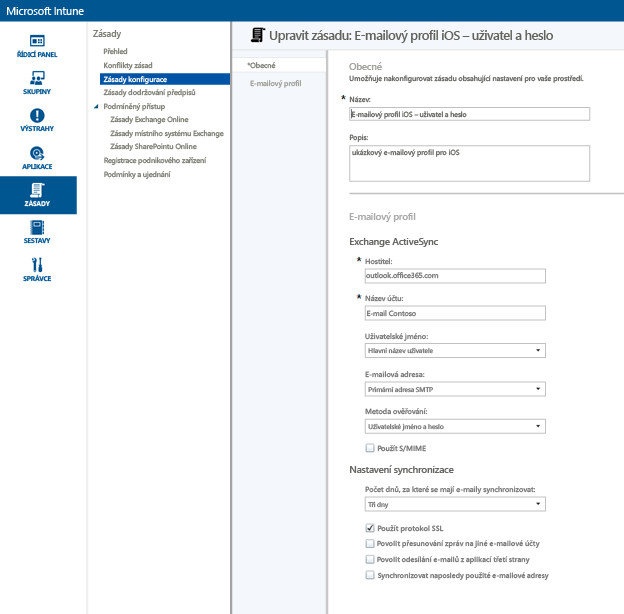
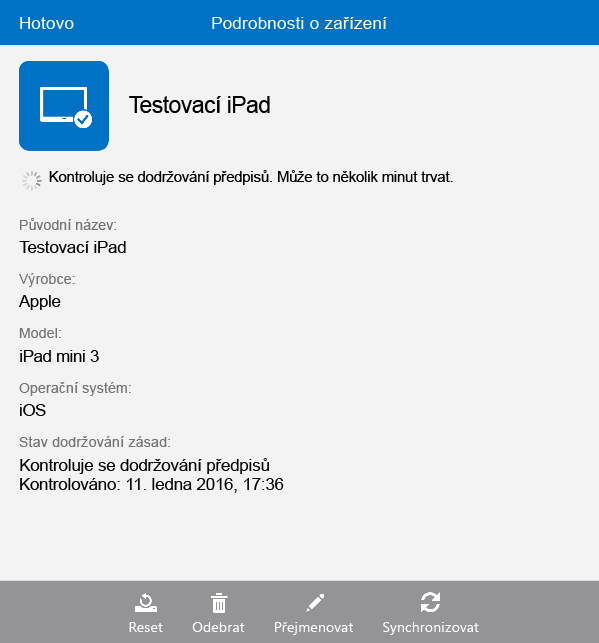

# Nastavení přístupu k e-mailu pro zařízení s iOS v Microsoft Intune
Když jsou zařízení zaregistrovaná v Intune, můžete je nakonfigurovat tak, aby měli uživatelé přístup k firemnímu e-mailu. Jeden ze způsobů, jak to provést pro určité typy zařízení, spočívá ve vytvoření a nasazení **e-mailového profilu**. E-mailové profily jsou druh zásady služby Intune, která vytvoří a připojí zařízení uživatele k vaší firemní e-mailové službě.
Použitím e-mailového profilu se zautomatizuje přístup k e-mailu pro zaregistrovaná zařízení, takže nemusíte zařízení nastavovat ručně. E-mailový profil také pomáhá zajistit, že všichni koncoví uživatelé nastavují přístup stejný způsobem a pomocí stejného základního nastavení.

## Cíle tohoto návodu

- Vytvoření a nasazení e-mailového profilu pro zařízení s iOS
- Ověření úspěšného použití zásady e-mailového profilu

## Předpoklady nezbytné před zahájením tohoto návodu

- Exchange Server, buď místní nebo hostovaný v Azure v rámci vašeho předplatného Office/E3.
- Název hostitele vašeho firemního serveru Exchange. Jedná se o plně kvalifikovaný název domény (FQDN), třeba **contosodemo55.onmicrosoft.com**.
- Skupina uživatelů, na kterou e-mailový profil nasadíte. Pokud jste dokončili postup [Spuštění zkušební verze Microsoft Intune a nasazení zásady kódu PIN pro iOS](start-a-microsoft-intune-trial-and-deploy-ios-pin-policy.md), můžete použít skupinu **GroupDemo**, kterou jste během něj vytvořili.
- Zaregistrovaná zařízení s iOS, do kterých profil nasadíte. Zase platí, že pokud jste dokončili postup [Spuštění zkušební verze Microsoft Intune a nasazení zásady kódu PIN pro iOS](start-a-microsoft-intune-trial-and-deploy-ios-pin-policy.md), už budete mít nějaká zařízení s iOS zaregistrovaná.

## Kroky pro vytvoření a nasazení e-mailového profilu pro zařízení s iOS

V tomto návodu použijeme hostovaný server Exchange, která se dodává se zkušební verzí předplatného.
1. V konzole Intune klikněte na **Zásady** a potom na **Přidat zásadu**.

2. V dialogovém okně **Vytvořit novou zásadu** rozbalte položku **iOS**, vyberte **E-mailový profil** a potom klikněte na **Vytvořit zásadu**.  

3. Na stránce pro vytvoření zásady zadejte název zásady, třeba **E-mailový profil iOS – heslo uživatele**, a popis. Můžete mít víc e-mailových profilů pro různé typy zařízení a různé metody ověřování, takže je dobré zadat takový název, abyste z něj poznali, k čemu profil slouží.
4. Zadejte název hostitele serveru Exchange. Vzhledem k tomu, že používáme server Exchange hostovaný ve službě Azure, jako název hostitele jednoduše zadáme: **outlook.office365.com**

5. Zadejte název účtu, který se bude zobrazovat uživatelům zařízení, aby jim pomohl e-mailovou službu identifikovat. Příklad: **E-mail Contoso**
6. Vzhledem k tomu, že k ověření uživatele do služby Exchange používáme uživatelské jméno a heslo, nechte nastavení uživatelského jména a hesla tak, jak je.
7. Upravte nastavení synchronizace, aby vyhovovalo vašim požadavkům. Prozatím použijte výchozí hodnoty, pokud tedy nechcete některou změnit.  
8. Klikněte na **Uložit zásadu**.
9. Zobrazí se dialog dotazem, jestli chcete zásadu hned nasadit. Klikněte na **Ano**.

10. V zobrazeném okně vyberte skupinu uživatelů, do které chcete e-mailový profil nasadit, klikněte na **Přidat** a potom klikněte na **OK**.  
  
Po kliknutí na **OK** se zásada začne šířit do zaregistrovaných zařízení. To potrvá minutu nebo dvě.

## Kroky pro ověření úspěšného použití profilu

Pokud si chcete ověřit, jestli se profil opravdu použil, budete potřebovat přístup k některému ze zařízení, na která jste e-mailový profil nasadili.
1. Na zařízení s iOS otevřete aplikaci Mail.
Aplikace zobrazí výzvu k zadání uživatelského jména a hesla uživatele.  

2. Zadejte uživatelské jméno a heslo pro e-mailový účet uživatele v systému Exchange a potom klepněte na **OK**.
 Aplikace Mail otevře účet systému Exchange a zahájí se synchronizace e-mailů se zařízením.

3. Zkontrolujte nastavení účtu v aplikaci Mail, abyste měli jistotu, že je název účtu stejný jako ten, který jste zadali v e-mailovém profilu (třeba **E-mail Contoso**), a jestli je nastavení synchronizace správné.

  
  Pokud se zdá, že nedošlo k automatickému použití e-mailového profilu ve vašem zařízení, můžete zásadu v zařízení použít ručně pomocí aplikace Portál společnosti.
1. Otevřete aplikaci Portál společnosti.
2. Klepněte na **Moje zařízení**.
3. Klepněte na název vašeho zařízení.

4. Klepněte na **Synchronizace** > **Zkontrolovat dodržování předpisů**.
 Po chvilce se začne e-mailový profil uplatňovat v zařízení. Potom můžete provést kroky pro ověření, abyste se ujistili, že se profil použil správně.

## Viz také
[Příručka pro testování Intune](get-started-with-a-30-day-trial-of-microsoft-intune.md)

<!--HONumber=Jul16_HO4-->

