# Spuštění zkušební verze Microsoft Intune a nasazení zásady PIN kódu pro iOS
Tyto podrobné pokyny vám pomůžou nastavit zkušební verzi Intune a nakonfigurovat zásadu PIN kódu pro zařízení s iOS. Seznam dalších běžných úloh zkušebního používání Intune, které můžete vyzkoušet, najdete v tématu [Běžné úlohy hodnocení služby Microsoft Intune](common-microsoft-intune-evaluation-tasks.md).

## Kontrola požadavků pro tento scénář

-   Počítač s Windows s aplikací Internet Explorer k provádění úloh správy

-   Zařízení se systémem iOS 7.1 nebo novějším ke zkušebnímu ověření zásad uživatele

-   Telefon, abyste mohli provést ověření při zkušebním přihlášení

## Vytvoření bezplatného zkušebního účtu Intune
> [!NOTE]
> Pokud už máte předplatné Intune, tuto část přeskočte a přejděte k další části.

1.  Na počítači s Windows klikněte pravým tlačítkem myši na **Internet Explorer** (IE) a vyberte **Procházení se službou InPrivate**.

    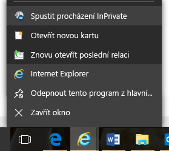

2.  Přejděte na stránku [Registrační portál Intune](https://portal.office.com/Signup/Signup.aspx?OfferId=40BE278A-DFD1-470a-9EF7-9F2596EA7FF9&dl=INTUNE_A&ali=1), zadejte požadované informace a klikněte na **Další**.

    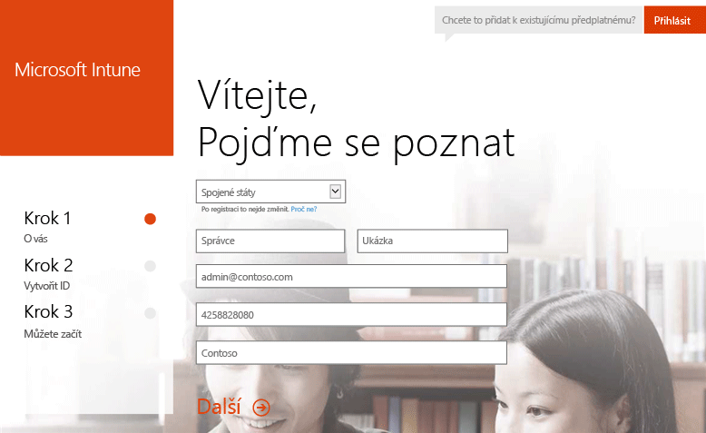

3.  Zadejte uživatelské ID a heslo účtu správce a klikněte na **Další**. Pomocí tohoto ID se budete přihlašovat k portálu Intune, abyste mohli provádět úlohy správy.

    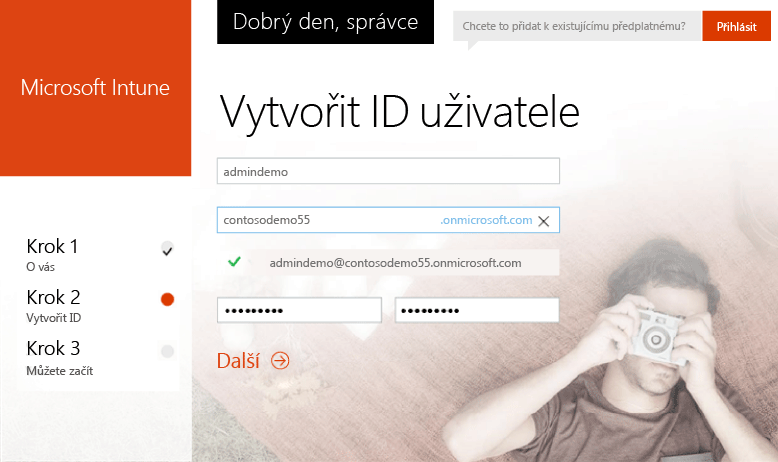

4.  Zadejte svoje číslo mobilního telefonu a kliknutím na **Poslat mi SMS** proveďte jeho ověření.

    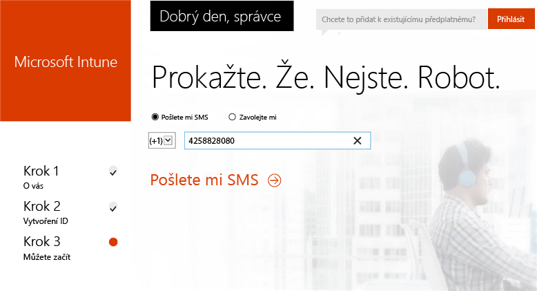

5.  Uložte si informace uvedené na obrazovce a potom klikněte na **Teď se můžete pustit do práce…**

    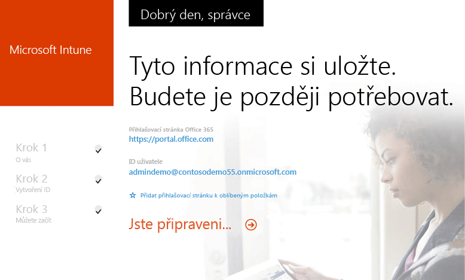

## Vytvoření zkušebního uživatele

1.  Na počítači s Windows klikněte na tlačítko **Start** a přejdete na stránku správy uživatelů.

    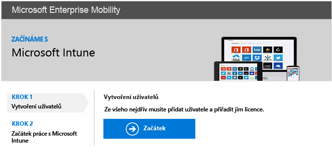

2.  Kliknutím na tlačítko **+** přidejte uživatele.

    

3.  Na stránce **Vytvořit nový uživatelský účet**:

    1.  Zadejte informace o zkušebním uživateli.

    2.  Vyberte možnost **Zadejte heslo**.

    3.  Zrušte zaškrtnutí políčka **Při příštím přihlášení musí tento uživatel heslo změnit**.

    4.  Klikněte na **Vytvořit**.

    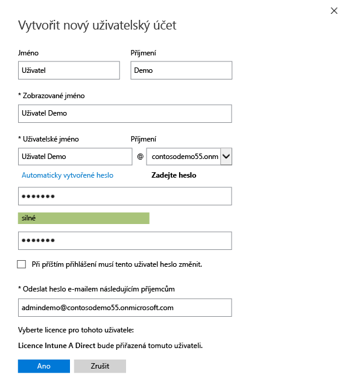

4.  Na stránce pro potvrzení vytvoření uživatele klikněte na **Zavřít**.

    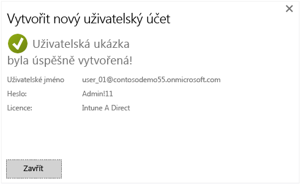

5.  Klikněte na **Aktualizovat**, aby se zobrazil uživatel, kterého jste vytvořili.

    

## Konfigurace zásady systému iOS pro PIN kód pro testovacího uživatele

1.  Na počítači s Windows nastavte Intune jako autoritu pro správu mobilních zařízení (MDM):

    1.  Přejděte na stránku [konzoly pro správu Intune](http://manage.microsoft.com/), přihlaste se pomocí účtu správce a klikněte na **Zahájení správy mobilních zařízení**. Otevře se stránka autority pro správu mobilních zařízení.

        

    2.  Klikněte na odkaz **Nastavit autoritu správy mobilních zařízení**.

        

2.  Povolte registraci zařízení s iOS. Tento proces vytvoří důvěryhodný certifikát mezi službou APNs (Apple Push Notification Service) a vaším předplatným Intune.

    1.  Klikněte na **Povolit platformu iOS a Mac OS X**.

        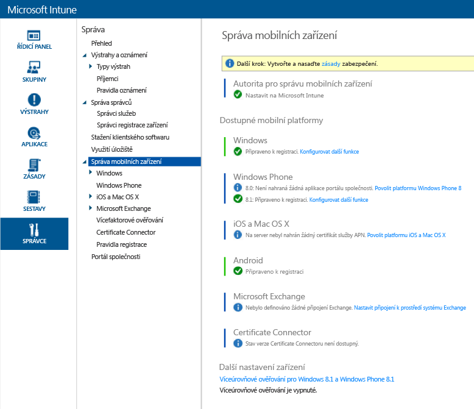

    2.  Klikněte na **Stáhnout žádost certifikátu služby APNs**.

        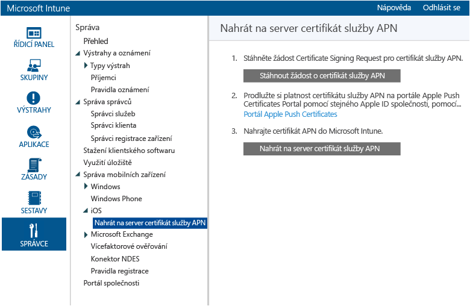

    3.  Zadejte název souboru a umístění žádosti o podepsání certifikátu a potom klikněte na **Uložit**. Tento soubor obsahuje veřejný klíč, který odpovídá soukromému klíči uchovávaném vaším předplatným Intune.

        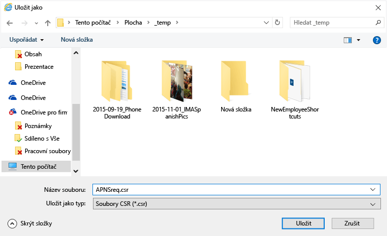

    4.  Klikněte na **Portál Apple Push Certificates Portal**. Otevře se nová karta.

        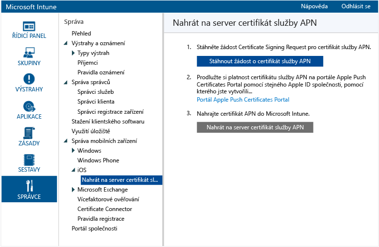

    5.  Zadejte svoje Apple ID a heslo a klikněte na **Přihlásit**. Může se jednat o ID, které používáte na svém zařízení s iOS při získávání aplikací z iOS App Storu.

        

    6.  Klikněte na **Vytvořit certifikát**.

        

    7.  Přečtěte si podmínky použití společnosti Apple, zaškrtněte příslušné políčko a klikněte na **Přijmout**.

        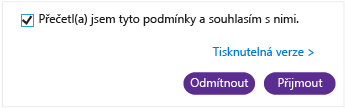

    8.  Klikněte na **Procházet**.

        

    9. Vyberte soubor žádosti o podepsání certifikátu, který jste předtím uložili, a klikněte na **Otevřít**.

        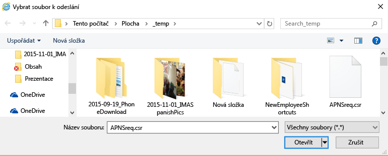

    10. Klikněte na tlačítko **Odeslat**.

        

    11. Po zobrazení výzvy ke stažení souboru JSON klikněte na **Uložit jako**.

        

    12. Zadejte umístění souboru JSON a klikněte na **Uložit**.

        

        Pokud se stránka po pár sekundách automaticky nepřesměruje, klikněte na **Storno**.

        

    13. Pokud chcete načíst nově vytvořený soubor certifikátu, klikněte na **Stáhnout**.

        

    14. Po zobrazení výzvy ke stažení souboru PEM klikněte na **Uložit jako**.

        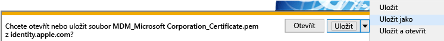

    15. Zadejte umístění souboru PEM a klikněte na **Uložit**.

        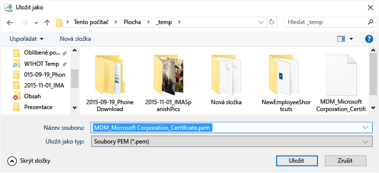

    16. Vraťte se na kartu konzoly pro správu Intune a klikněte na **Nahrát na server certifikát služby APN**.

        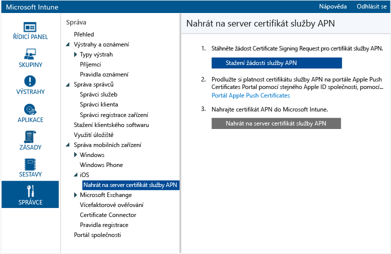

    17. Zadejte svoje Apple ID a klikněte na **Procházet**.

        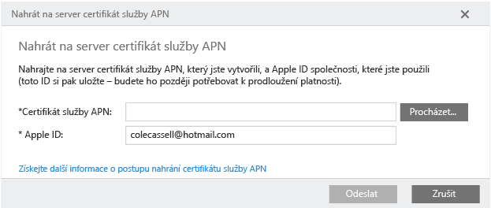

    18. Vyberte soubor PEM, který jste právě uložili, a klikněte na **Otevřít**.

        

    19. Instalaci dokončíte kliknutím na **Nahrát**.

        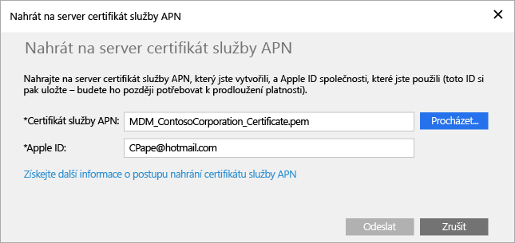

        Certifikát služby APNs je nakonfigurovaný.

        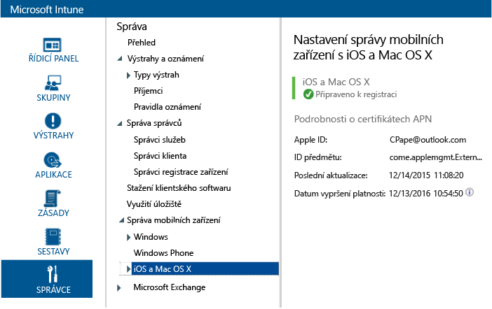

3.  Vytvořte zkušební skupinu uživatelů pro cílové zásady:

    1.  V levém podokně klikněte na **Skupiny**.

        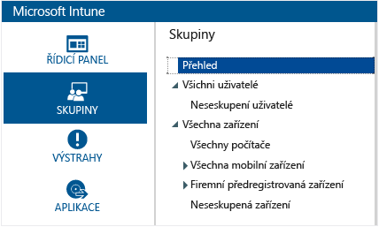

    2.  Úplně vpravo klikněte na **Vytvořit skupinu**.

        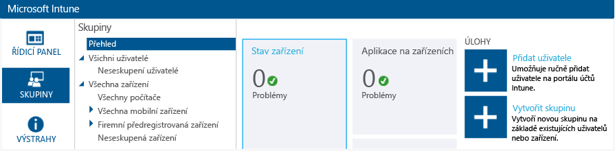

    3.  Zadejte název skupiny, vyberte nadřazenou skupinu **Všichni uživatelé** a klikněte na **Další**.

        

    4.  V poli **Začít členství ve skupině s** vyberte možnost **Všichni uživatelé v nadřazené skupině** a klikněte na **Dokončit**.

        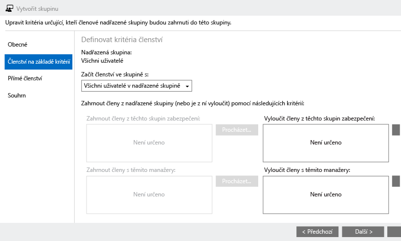

4.  Vytvořte zásadu PIN kódu PIN pro iOS a zaměřte ji na zkušební skupinu uživatelů:

    1.  V levém podokně klikněte na **Zásada**.

        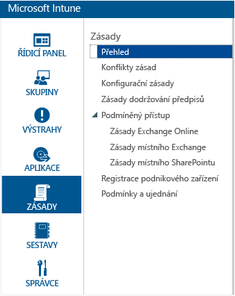

    2.  Úplně vpravo klikněte na **Přidat zásadu**.

        

    3.  Rozbalte uzel iOS, vyberte řádek **Všeobecná konfigurace** a klikněte na **Vytvořit zásadu**.

        

    4.  Zadejte název zásady, zapněte možnost **Vyžadovat heslo k odemknutí mobilních zařízení** a u položky **Minimální délka hesla** nastavte hodnotu **4**.

        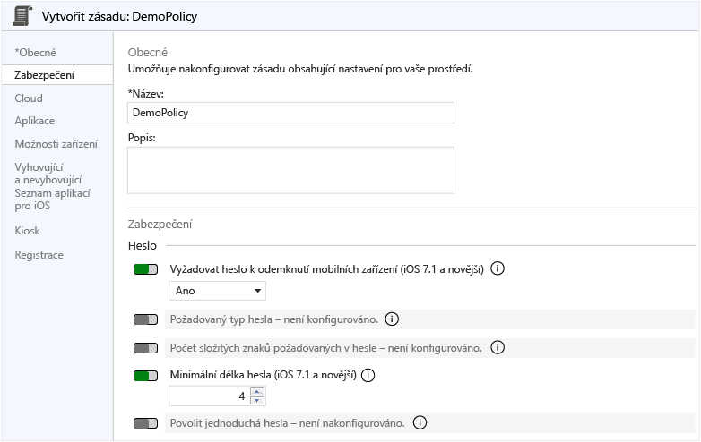

    5.  Nasaďte zásadu kliknutím na **Ano**.

        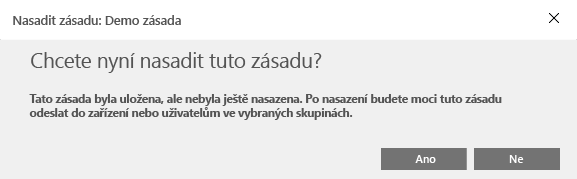

    6.  Klikněte na skupinu uživatelů, kterou jste předtím vytvořili, klikněte na **Přidat** a potom klikněte na **OK**.

        

        Teď máte zásadu PIN kódu pro iOS, která se zaměřuje na zkušební skupinu uživatelů.

        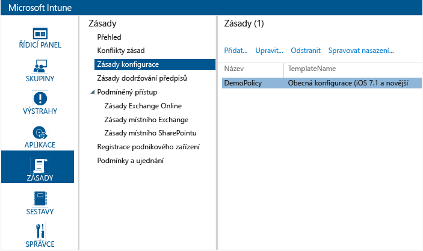

## Kontrola vynucování zásady na zařízení s iOS

1.  Na iPadu spusťte iOS App Store, nainstalujte bezplatnou aplikaci **Portál společnosti Microsoft Intune** a otevřete ji.

    

2.  Zadejte název účtu zkušebního uživatele a heslo a klepněte na **Přihlásit**.

    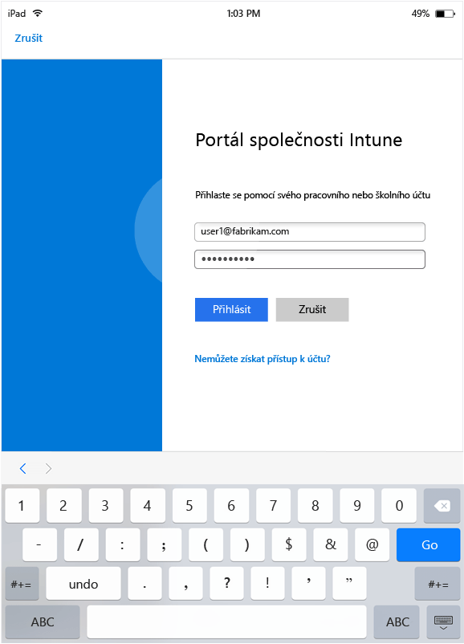

3.  Klepnutím na **Zaregistrovat** spusťte registraci zařízení v Intune.

    

4.  Na obrazovce **Instalace profilu** klepněte na **Instalovat**.

    

5.  V dialogovém okně **Instalace profilu** klepněte na **Instalovat**.

    

6.  Na obrazovce **Upozornění** klepněte na **Instalovat**.

    

7.  V dialogovém okně **Vzdálená správa** klepněte na **Důvěřovat**.

    

8.  Po dokončení instalace profilu pro správu klepněte na **Hotovo**. Registrace je hotová.

    

9. Po dokončení registrace klepněte na **OK** a potom aplikaci Portál společnosti zavřete.

    

10. Po zobrazení výzvy ke konfiguraci hesla klepněte na **Pokračovat**.

    

11. Zadejte svoje heslo, klepněte na **Pokračovat**, znovu zadejte heslo a klepněte na **Uložit**.

    

12. Stisknutím tlačítka napájení zamkněte iPad a potom ho posunutím prstem odemkněte. Zjistíte, že k odemknutí zařízení teď musíte zadat heslo.

### Související témata
[Příručka pro testování Intune](get-started-with-a-30-day-trial-of-microsoft-intune.md)

<!--HONumber=Jun16_HO4-->

