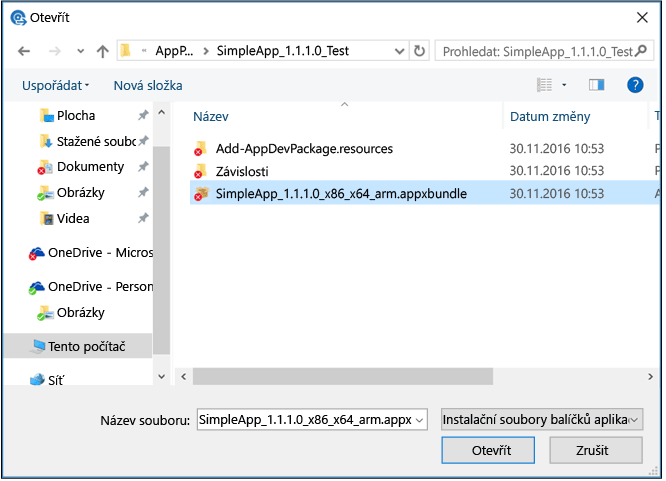

# Přidávání aplikací s Microsoft Intune

[!INCLUDE[classic-portal](../includes/classic-portal.md)]

Před zahájením nasazování aplikací s Microsoft Intune se seznamte s koncepty představenými v tomto tématu. Tyto koncepty vám pomůžou porozumět tomu, které aplikace můžete nasadit na kterou platformu. Taky vám pomůžou pochopit požadavky, které musí být před nasazením aplikací splněné.

## Typy aplikací, které můžete nasadit

### Instalační program softwaru

|Typ aplikace|Podrobnosti|
|----------------|-------|
|**Instalační služba systému Windows (&#42;.exe, &#42;.msi)**|Tento typ aplikace musí podporovat tichou instalaci bez vstupu uživatele. Dokumentace k aplikaci by měla zahrnovat příslušné možnosti příkazového řádku k tiché instalaci aplikace (například **/q**). Seznam běžných možností příkazového řádku můžete najít v tématu [Command-Line Switches for the Microsoft Windows Installer Tool](https://support.microsoft.com/en-us/kb/227091) (Přepínače příkazového řádku pro nástroj Instalační služba systému Microsoft Windows).  Jakékoli další soubory a složky, které vyžaduje instalační program aplikace, musí být dostupné z umístění, které určíte pro instalační soubory aplikace.  Instalační služba systému Windows (.msi) a oprava instalační služby systému Windows (.msp) nevyžadují ve většině případů pro Intune instalaci žádných argumentů příkazového řádku. Podívejte se do dokumentace aplikace.  Pokud se vyžadují argumenty příkazového řádku, musí být zadané jako název=dvojice hodnot (například TRANSFORMS=custom_transform.mst).  Tento typ aplikace se vztahuje jenom na počítače s klientským softwarem Intune.|
|**Balíček aplikace pro Android (&#42;.apk)**|Pokud chcete nasadit aplikace pro Android, budete potřebovat platný balíček .apk.|
|**Balíček aplikace pro iOS (&#42;.ipa)**|Pokud chcete nasadit aplikace systému iOS, budete potřebovat platný balíček .ipa.  Balíček .ipa musí být podepsaný společností Apple a datum vypršení platnosti v profilu zřizování musí být platné. Intune může distribuovat aplikace iOS s podnikovým certifikátem.  Nejsou podporované všechny aplikace certifikátu vývojáře Apple.  Vaše společnost musí mít zaregistrovaný iOS Developer Enterprise Program.  Ujistěte se, že brána firewall vaší organizace umožňuje přístup na weby zřizování a certifikace pro iOS.  S aplikací není nutné nasazovat soubor manifestu (.plist).|
|**Balíček aplikace pro Windows Phone (&#42;.xap, .appx, .appxbundle)**|Pokud chcete nasazovat aplikace, musíte mít podnikový certifikát podepisování mobilního kódu. Další informace najdete v tématu [Nastavení správy pro zařízení Windows Phone v Microsoft Intune](set-up-windows-phone-management-with-microsoft-intune.md).|
|**Balíček aplikace pro Windows (.appx, .appxbundle)**|Pokud chcete nasazovat aplikace, musíte mít podnikový certifikát podepisování mobilního kódu. Podrobnosti najdete v tématu [Nastavení správy pro zařízení Windows v Microsoft Intune](set-up-windows-device-management-with-microsoft-intune.md).|
|**Instalační služba systému Windows pomocí MDM (&#42;.msi)**|Tuto aplikaci můžete použít k vytvoření a nasazení aplikací založených na instalační službě systému Windows na zaregistrované počítače s Windows 10. Tyto počítače jsou spravované pomocí správy mobilních zařízení (MDM).  Můžete nahrát jenom jeden soubor s příponou .msi.  Kód produktu a verze produktu v souboru se používají ke zjišťování aplikací.  Použije se výchozí chování aplikace při restartování. Intune ho neřídí.  Balíčky MSI na uživatele se nainstalují pro jednoho uživatele.  Balíčky MSI na zařízení se nainstalují pro všechny uživatele v zařízení.  Balíčky MSI v duálním režimu se momentálně nainstalují jenom pro všechny uživatele v zařízení.  Aktualizace aplikací jsou podporované, když kód produktu MSI jednotlivých verzí je stejný. 
Všechny typy aplikací instalačního programu softwaru se odešlou do úložiště v cloudu.

### **Externí odkaz**
Externí odkaz použijte, když máte následující položky:
- Adresu URL, která umožňuje uživatelům stáhnout si aplikaci z App Storu.
- Odkaz na webovou aplikaci, která se spouští z webového prohlížeče.

Aplikace založené na externích odkazech nejsou uložené v cloudovém úložišti Intune.
### **Spravované aplikace pro iOS z obchodu s aplikacemi**
Spravované aplikace pro iOS můžete použít ke správě a nasazení bezplatných aplikací pro systém iOS z App Storu. Spravované aplikace pro iOS můžete použít taky k přidružení [zásad správy mobilních aplikací](configure-and-deploy-mobile-application-management-policies-in-the-microsoft-intune-console.md) k [aplikacím, které splňují předpisy](https://www.microsoft.com/en-us/server-cloud/products/microsoft-intune/partners.aspx), a zkontrolovat jejich stav v konzole pro správu.  Spravované aplikace pro iOS nejsou uložené v cloudovém úložišti Intune.

> [!TIP]
> Možnosti pro mobilní zařízení nejsou dostupné, dokud [nenastavíte autoritu pro MDM](prerequisites-for-enrollment.md) na Intune.

## Vydavatel softwaru Intune
Když přidáváte nebo odebíráte aplikace pomocí konzoly pro správu Intune, spouští se Vydavatel softwaru Microsoft Intune. Od vydavatele vyberte a nakonfigurujte typ instalačního programu softwaru, který bude provádět jednu z následujících akcí:

- Nahrávat aplikace (pro počítače nebo pro mobilní zařízení) k uložení do cloudového úložiště Intune.
- Odkazovat na online obchod s aplikacemi nebo webovou aplikaci.

Než začnete používat vydavatele softwaru, musíte nainstalovat plnou verzi rozhraní [Microsoft .NET Framework 4.0](https://www.microsoft.com/download/details.aspx?id=17851). Po instalaci může být nutný restart počítače, aby se vydavatel softwaru otevřel správně.

## Prostor v cloudovém úložišti
Všechny aplikace, které vytváříte pomocí instalace typu Instalační program softwaru (například obchodní aplikace), se zabalí a nahrají do cloudového úložiště Microsoft Intune. Zkušební předplatné Intune zahrnuje 2 gigabajty (GB) cloudového úložiště, které se používá k ukládání spravovaných aplikací a aktualizací. Úplné předplatné zahrnuje 20 GB úložného prostoru.

Objem využitého úložiště je dostupný v uzlu **Využití úložiště** pracovního prostoru **Správce**. Další úložiště pro Intune můžete zakoupit stejným způsobem jako u původního nákupu.  Pokud jste platili fakturou nebo platební kartou, navštivte [portál pro správu předplatných](https://portal.office.com/adminportal/home?switchtomodern=true#/subscriptions).  Jinak kontaktujte svého partnera nebo prodejního zástupce.

Požadavky na cloudové úložiště jsou následující:

-   Všechny instalační soubory musí být umístěné stejné složce.
-   Maximální velikost kteréhokoli nahraného souboru je 2 GB.

## Podpora aplikací pro Univerzální platformu Windows
Počítače s Windows 10 nevyžadují k instalaci obchodních aplikací klíč pro zkušební načtení. Kvůli povolení zkušebního načtení ale musí mít klíč registru **HKEY_LOCAL_MACHINE\Software\Policies\Microsoft\Windows\Appx\AllowAllTrustedApps** hodnotu **1**.

Pokud není tento klíč registru nakonfigurovaný, Intune při prvním nasazení aplikace do zařízení automaticky nastaví hodnotu **1**. Pokud nastavíte hodnotu **0**, Intune ji nemůže automaticky změnit a instalace obchodních aplikací se nezdaří.

Obchodní aplikace pro Univerzální platformu Windows musí být podepsané certifikátem pro podpis kódu, který musí být důvěryhodný pro všechna zařízení, ve kterých chcete aplikaci nasadit. Můžete použít certifikát z interní infrastruktury PKI nebo certifikát z veřejného kořenového certifikátu od jiného výrobce nainstalovaný v zařízení.

V zařízeních se systémem Windows 10 Mobile můžete k podepisování univerzálních aplikací **.appx** používat jiný certifikát pro podepisování kódu než certifikát Symantec. U aplikací **.xap** a balíčků **.appx** sestavených pro systém Windows Phone 8.1, které chcete nainstalovat do zařízení se systémem Windows 10 Mobile, musíte použít certifikát pro podepisování kódu Symantec.

### Závislosti pro aplikace pro UPW

Když do Intune přidáte balíček appxbundle Windows 10 UPW, musíte také zajistit, aby se nahrály všechny závislosti pro aplikaci.
Zkontrolujte, jestli složka **Závislosti**, která se vytvořila při vytvoření aplikace, je ve stejné složce jako samotný soubor .appxbundle.
Když pak aplikaci nahrajete do Intune, nahrají se také všechny soubory ve složce **Závislosti**. Následující snímek obrazovky to znázorňuje:

## Další kroky

Před nasazením aplikací je musíte přidat do konzoly Intune. Můžete přidávat aplikace pro [registrovaná zařízení](add-apps-for-mobile-devices-in-microsoft-intune.md) nebo pro [počítače s Windows spravované klientským softwarem Intune](add-apps-for-windows-pcs-in-microsoft-intune.md).

