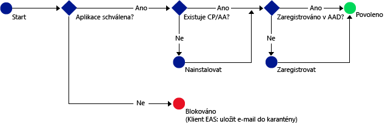

# Povolení přístupu ke službám Office 365 jenom mobilním aplikacím, které podporují zásady Intune MAM
[Zásady správy mobilních aplikací (MAM) Intune](protect-apps-and-data-with-microsoft-intune.md) pomáhají chránit vaše firemní data na zařízeních, která jsou zaregistrovaná ke správě v Intune. Zásady MAM můžete použít také u **zařízení vlastněných zaměstnanci, která nejsou zaregistrovaná ke správě v Intune**.  V takovém případě potřebujete mít pořád jistotu, že jsou vaše firemní data a prostředky chráněné, i když tato zařízení nespravujete. Pomocí podmíněného přístupu MAM můžete vytvořit zásadu, která umožňuje přístup ke službám O365 (jako je Exchange Online) jenom mobilním aplikacím, které podporují zásady Intune MAM.

Když například povolíte přístup k Exchangi Online jenom **aplikaci Microsoft Outlook**, můžete **integrovaným poštovním aplikacím v iOS a Androidu**, jejichž data nejsou chráněná zásadami Intune MAM, zablokovat příjem e-mailů z **Exchange Online**.

Následující diagram znázorňuje tok používaný v rámci zásad podmíněného přístupu MAM k určení toho, kdy povolit nebo blokovat přístup: .

Popis zkratek použitých v diagramech:
* **CP**: Aplikace Portál společnosti
* **AA**: Aplikace Azure Authenticator
* **AAD**: Azure Active Directory
* **EAS**: Exchange Active Sync

## Požadavky
**Předtím**, než můžete zásadu podmíněného přístupu MAM nakonfigurovat, musíte mít **Enterprise Mobility + Security nebo předplatné Azure Active Directory Premium**, přičemž uživatelé musí mít licence na EMS nebo Azure AD. Další informace najdete na [stránce s cenami služby Enterprise Mobility](https://www.microsoft.com/en-us/cloud-platform/enterprise-mobility-pricing) nebo na [stránce s cenami služby Azure Active Directory](https://azure.microsoft.com/en-us/pricing/details/active-directory/).

## Podporované aplikace
**Exchange Online**: **Microsoft Outlook** pro Android a iOS

Další informace týkající se uživatelského prostředí aplikace, která používá zásady podmíněného přístupu MAM, najdete v části [Co očekávat při používání aplikace s podmíněným přístupem MAM](use-apps-with-mam-ca.md).

## Další kroky
[Vytvoření zásad Exchange Online pro aplikace MAM](mam-ca-for-exchange-online.md)

[Blokování aplikací, které nepoužívají moderní ověřování](block-apps-with-no-modern-authentication.md)

### Viz taky

[Ochrana dat aplikací pomocí zásad MAM](protect-app-data-using-mobile-app-management-policies-with-microsoft-intune.md)

<!--HONumber=Oct16_HO4-->

