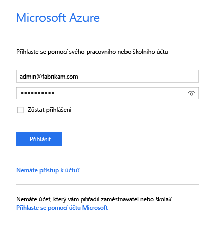
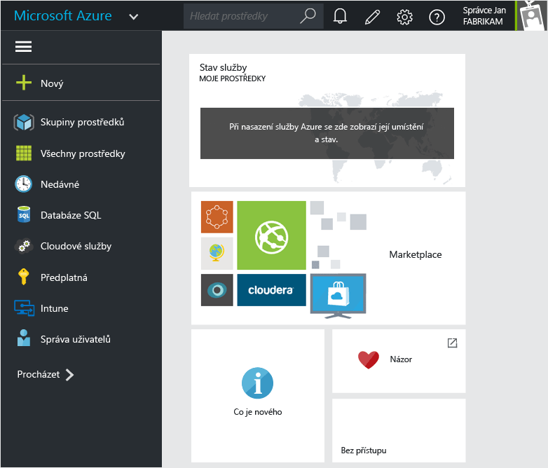
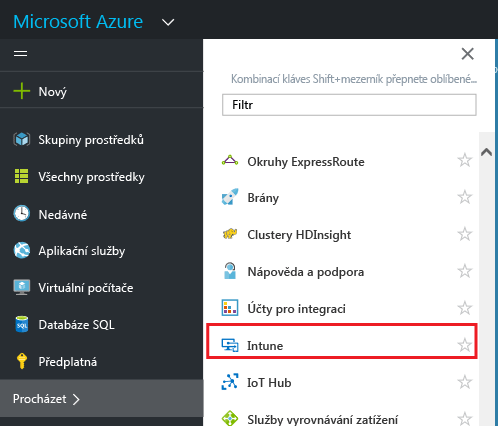
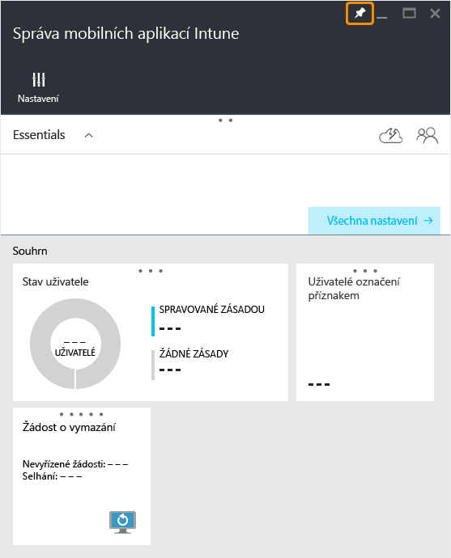
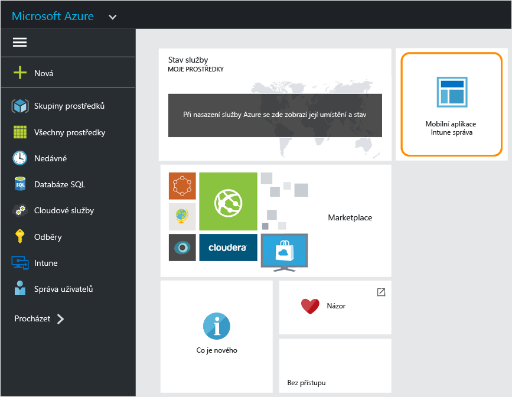

# Portál Azure Portal pro zásady MAM v Microsoft Intune

## Použití portálu Azure Portal
Portál Azure Portal umožňuje vytvářet a spravovat zásady správy mobilních aplikací (MAM).

Portál Azure Portal podporuje vytváření zásad MAM pro:
- Aplikace spuštěné v zařízeních, která **jsou zaregistrovaná a spravovaná v Intune**

- Aplikace spuštěné v zařízeních, která **nejsou zaregistrovaná** v žádném řešení MDM
- Aplikace spuštěné v zařízeních, která **jsou zaregistrovaná v řešení MDM třetí strany**.

>[!IMPORTANT]

> Pokud zařízení spravujete v konzole pro správu Intune, můžete k vytvoření zásady MAM, která podporuje aplikace pro zařízení zaregistrovaná v Intune, použít [konzolu pro správu Intune](configure-and-deploy-mobile-application-management-policies-in-the-microsoft-intune-console.md).

> V konzole pro správu Intune se nemusí zobrazovat všechna nastavení zásad MAM. Na portálu Azure Portal najdete novou konzolu pro správu, kterou je možné používat pro vytváření zásad MAM. Pokud k vytváření zásad MAM používáte konzolu pro správu Intune i portál Azure Portal, použije se u aplikací zásada z portálu Azure Portal, která bude také nasazena u uživatelů.

## Přihlášení na portál Azure Portal a přizpůsobení úvodní stránky

1.  Přejděte na [portál Azure Portal](https://portal.azure.com) a přihlaste se. Použijte přihlašovací údaje služby [!INCLUDE[wit_nextref](../includes/wit_nextref_md.md)].

    

2.  Po úspěšném přihlášení se zobrazí **Řídicí panel**. Stránku **Řídicí panel** jde přizpůsobit.

    

3.  V nabídce **Procházet** vyberte **Intune**.

4.  Zvolte **Intune** > **Správa mobilních aplikací Intune** > **Nastavení**.

    

    > [!TIP]

    > Chcete-li připnout okno na **Uvítací** stránku, použijte volbu **připnout** v okně. Kliknutím na ikonu připnutí **v okně správy mobilních aplikací Intune** toto okno připnete na **Uvítací** stránku.

    

    
## Další kroky
[Příprava před konfigurací zásad správy mobilních aplikací](get-ready-to-configure-mobile-app-management-policies-with-microsoft-intune.md)

<!--HONumber=Dec16_HO2-->

