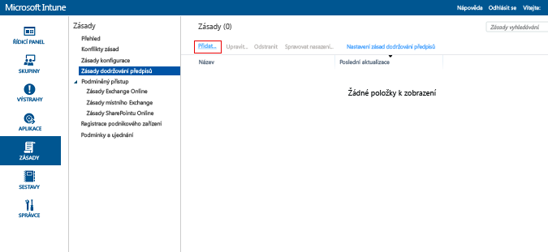
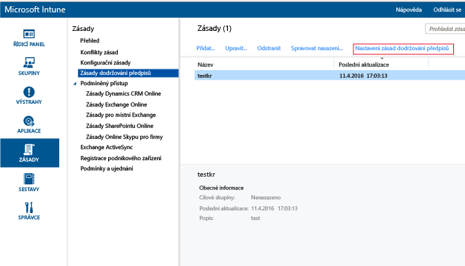

# Vytvoření zásady dodržování předpisů pro zařízení v Microsoft Intune

[!INCLUDE[classic-portal](../includes/classic-portal.md)]

Toto téma popisuje kroky, které můžete použít k vytvoření zásady dodržování předpisů, kterou musí zařízení splňovat, aby bylo považované za vyhovující.

##  Krok 1: Přidání nové zásady
  V [konzole pro správu Microsoft Intune](https://manage.microsoft.com) vyberte **Zásady** &gt; **Zásady dodržování předpisů** &gt; **Přidat**.

  

##  Krok 2: Konfigurace nastavení
Na stránce **Vytvořit zásadu** povolte požadovaná nastavení:
  -   Nastavení zabezpečení systému jako heslo a šifrování
  -   Nastavení stavu zařízení, jako jestli má zařízení jailbreak nebo jestli ho služba ověření stavu zařízení ve Windows nahlásila jako zařízení, které je v pořádku
  -   Nastavení vlastností zařízení jako minimální požadovaná verze operačního systému nebo maximální povolená verze operačního systému

##  Krok 3: Uložení zásady
Po dokončení klikněte na **Uložit zásadu**.

Máte možnost nasadit zásadu hned po uložení, nebo můžete zvolit pozdější nasazení. Nová zásada se zobrazí v uzlu **Zásady dodržování předpisů** pracovního prostoru **Zásady**.

##  Krok 4: Nastavení doby platnosti stavu dodržování předpisů
Pokud chcete určit čas, kdy zařízení má na registraci, než bude považované za nekompatibilní, přejděte na nastavení zásad dodržování předpisů a aktualizujte čas. Ve výchozím nastavení je to 30 dní.

## Nastavení podporovaných zásad
Následující tabulka uvádí nastavení zásad dodržování předpisů a platformy, na kterých jsou podporované.

-------------
|Nastavení|iOS|Android|Windows|
|-----|----|-----|-----|
|Vyžadovat heslo k odemknutí mobilních zařízení|iOS 6 nebo novější|Android 4.0 nebo novější  Zařízení, na kterém běží Samsung KNOX Standard 4.0 nebo novější|Windows Phone 8.1 nebo novější|
|Povolit jednoduchá hesla|iOS 6 nebo novější|Není podporované|Windows Phone 8.1 nebo novější|
|Minimální délka hesla|iOS 6 nebo novější| Android 4.0 nebo novější Zařízení, na kterém běží Samsung KNOX Standard 4.0 nebo novější| Windows Phone 8.1 nebo novější Windows 8.1|
|Vyžadovaný typ hesla|iOS 6 nebo novější|Není k dispozici|Windows Phone 8.1 nebo novější  Windows RT  Windows RT 8.1  Windows 8.1|
|Minimální počet znakových sad|iOS 6 nebo novější|Není k dispozici|Windows Phone 8.1 nebo novější  Windows RT  Windows RT 8.1  Windows 8.1|
|Kvalita hesla|Není k dispozici|Android 4.0 nebo novější  Zařízení, na kterém běží Samsung KNOX Standard 4.0 nebo novější|Není k dispozici|
|Počet minut nečinnosti před vyžadováním hesla|iOS 6 nebo novější|Android 4.0 nebo novější Zařízení, na kterém běží Samsung KNOX Standard 4.0 nebo novější|Windows Phone 8.1 nebo novější Windows RT a Windows RT 8.1 Windows 8.1|
|Vypršení platnosti hesla (dny)|iOS 6 nebo novější|Android 4.0 nebo novější Zařízení, na kterém běží Samsung KNOX Standard 4.0 nebo novější|Windows Phone 8.1 nebo novější Windows RT a Windows RT 8.1 Windows 8.1|
|Pamatovat si historii hesel|iOS 6 nebo novější|Android 4.0 nebo novější Zařízení, na kterém běží Samsung KNOX Standard 4.0 nebo novější|Windows Phone 8.1 nebo novější Windows RT a Windows RT 8.1 Windows 8.1|
|Zakázat opakované použití předchozích hesel|iOS 6 nebo novější|Android 4.0 nebo novější Zařízení, na kterém běží Samsung KNOX Standard 4.0 nebo novější|Windows Phone 8.1 nebo novější Windows RT a Windows RT 8.1 Windows 8.1|
|Po návratu zařízení ze stavu nečinnosti vyžadovat heslo| Není k dispozici| Není k dispozici|Windows 10 Mobile|
|Vyžadovat šifrování u mobilního zařízení|Nelze použít|Android 4.0 nebo novější Zařízení, na kterém běží Samsung KNOX Standard 4.0 nebo novější|Windows Phone 8.1 nebo novější  Windows 8.1|
|Vyžadování toho, aby byla zařízení hlášená jako v pořádku| Není k dispozici| Není k dispozici|Windows  Windows 10 Mobile|
|U zařízení nesmí být provedený jailbreak nebo root|iOS 6 nebo novější|Android 4.0 nebo novější Zařízení, na kterém běží Samsung KNOX Standard 4.0 nebo novější|Není k dispozici|
|E-mailový účet se musí spravovat přes Intune|iOS 6 nebo novější|Není k dispozici| Není k dispozici|
|Vyberte e-mailový profil, který se musí spravovat přes Intune|iOS 6 nebo novější|Není k dispozici| Není k dispozici|
|Minimální požadovaný operační systém|iOS 6 nebo novější|Android 4.0 nebo novější Zařízení, na kterém běží Samsung KNOX Standard 4.0 nebo novější| Windows Phone 8.1 nebo novější Windows 8.1|
|Maximální povolená verze operačního systému|iOS 6 nebo novější|Android 4.0 nebo novější Zařízení, na kterém běží Samsung KNOX Standard 4.0 nebo novější|Windows Phone 8.1 nebo novější Windows 8.1|

Další informace o nastavení dodržování předpisů podporovaném na jednotlivých platformách získáte výběrem jedné z následujících možností:
> [!div class="op_single_selector"]
- [Nastavení zásad dodržování předpisů pro zařízení s iOSem](ios-compliance-policy-settings-in-microsoft-intune.md)
- [Nastavení zásad dodržování předpisů pro zařízení s Androidem](android-compliance-policy-settings-in-microsoft-intune.md)
- [Nastavení zásad dodržování předpisů pro zařízení s Windows a Windows Phone](windows-compliance-policy-settings-in-microsoft-intune.md)

## Další kroky
[Nasazení a monitorování zásady dodržování předpisů](deploy-and-monitor-a-device-compliance-policy-in-microsoft-intune.md)

### Viz taky
[Úvod do zásad dodržování předpisů zařízení](introduction-to-device-compliance-policies-in-microsoft-intune.md)

