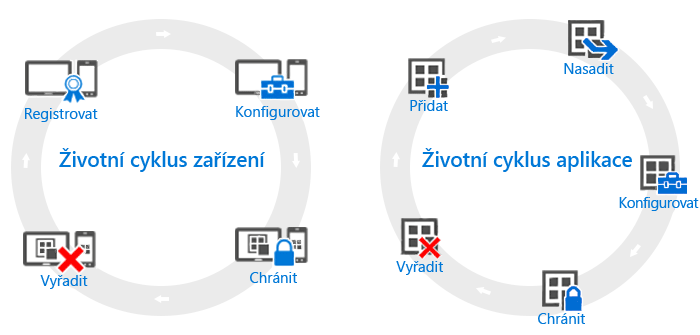

# Přehled životních cyklů zařízení a aplikací

Ačkoli se potřeby jednotlivých organizací mohou lišit, existují určité společné kroky, které musí průběžně provádět všechny organizace bez ohledu na své ostatní provozní potřeby. Ty mohou být seskupeny do dvou hlavních kategorií, označovaných jako **životní cykly**. Životní cyklus nasazení, kterým se budete řídit, závisí na scénáři, který se pokoušíte povolit. Můžete například potřebovat jenom životní cyklus zařízení, životní cyklus aplikace, nebo obojí.

Pro účely správy mají všechna zařízení životní cyklus. Začne při registraci zařízení a pokračuje až do jeho vyřazení. [Životní cyklus správy zařízení](overview-of-device-lifecycle-in-microsoft-intune.md) vás provede fázemi, jak zařízení zaregistrovat, jak ho konfigurovat a chránit a jak ho pak odebrat ze správy.

Podobně mají svůj vlastní [životní cyklus i aplikace](overview-of-app-lifecycle-in-microsoft-intune.md), se kterými pracujete. Ten obsahuje kroky od přidání aplikace do Intune až po její odebrání, když už není potřeba.

<!--HONumber=Nov16_HO5-->

