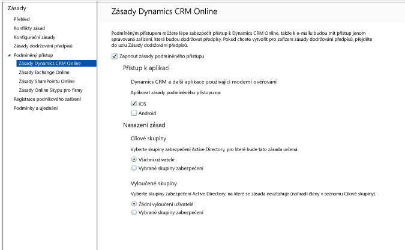

# Omezení přístupu k aplikaci Dynamics CRM Online v Intune
Přístup k Microsoft Dynamics CRM Online ze zařízení s iOSem a Androidem můžete řídit pomocí podmíněného přístupu v Microsoft Intune.  Podmíněný přístup Intune má dvě součásti:
* [Zásady dodržování předpisů zařízení](introduction-to-device-compliance-policies-in-microsoft-intune.md), které zařízení musí dodržovat, aby mohlo být považované za vyhovující.
* [Zásady podmíněného přístupu](restrict-access-to-email-and-o365-services-with-microsoft-intune.md), kde můžete určit podmínky, které zařízení musí splňovat pro přístup ke službě.

Další informace o tom, jak podmíněný přístup funguje, najdete v článku o [omezení přístupu k e-mailu, O365 a dalším službám](restrict-access-to-email-and-o365-services-with-microsoft-intune.md).

> [!IMPORTANT] K nasazení podmíněného přístupu potřebujete předplatné Intune a Azure Active Directory Premium. Uživatelé musí mít licenci na oba tyto produkty. **Předplatné Enterprise Mobility + Security (EMS)** obsahuje jak předplatné Intune, tak i předplatné Azure Active Directory Premium. Bližší informace najdete na [stránce s cenami Enterprise Mobility](https://www.microsoft.com/en-us/cloud-platform/enterprise-mobility-pricing). Pokud nemáte předplatné EMS, můžete získat předplatné pro Azure Active Directory Premium. Další informace najdete na [stránce s cenami služby Azure Active Directory](https://azure.microsoft.com/en-us/pricing/details/active-directory/).

Když se cílový uživatel na svém zařízení pokusí použít aplikaci Dynamics CRM, dojde k následujícímu vyhodnocení:

Zařízení, které potřebuje přístup k Dynamics CRM Online, musí splňovat následující kritéria:
* Musí mít systém **Android** nebo **iOS**.
* Musí být **zaregistrované** ve službě Intune.
* Musí **vyhovovat** všem nasazeným zásadám dodržování předpisů Intune.

Stav zařízení je uložený ve službě Azure Active Directory, která uděluje nebo blokuje přístup na základě podmínek, které zadáte.

Pokud není některá podmínka splněná, zobrazí se uživateli při přihlášení jedna z následujících zpráv:
* Pokud není zařízení zaregistrované v Intune nebo v Azure Active Directory, zobrazí se zpráva s pokyny pro instalaci aplikace Portál společnosti a pro registraci.
* Pokud zařízení není vyhovující, zobrazí se zpráva, která uživatele přesměruje na web Portál společnosti Microsoft Intune nebo na aplikaci Portál společnosti, kde může najít informace o problému a postup jeho řešení.

## Konfigurace podmíněného přístupu pro Dynamics CRM Online  
### Krok 1: Konfigurace skupin zabezpečení služby Active Directory

Než začnete, nakonfigurujte pro skupiny zabezpečení služby Azure Active Directory zásadu podmíněného přístupu. Tyto skupiny můžete nakonfigurovat v **Centru pro správu Office 365**. Tyto skupiny se použijí k zahrnutí nebo vyloučení uživatelů ze zásad. Pokud je uživatel cílem zásady, musí každé jím používané zařízení splňovat zásady, aby měl přístup k prostředkům.

Můžete určit dva typy skupin, které se použijí pro zásady Dynamics CRM:
* **Cílové skupiny**: Skupiny uživatelů, pro které zásady platí.
* **Vyloučené skupiny**: Skupiny uživatelů, kteří jsou ze zásad vyloučeni.

Pokud je uživatel v obou skupinách, bude ze zásad vyloučený.

### Krok 2: Konfigurace a nasazení zásad dodržování předpisů
[Vytvořte](create-a-device-compliance-policy-in-microsoft-intune.md) zásady dodržování přepisů a [nasaďte](deploy-and-monitor-a-device-compliance-policy-in-microsoft-intune.md) je pro všechna zařízení, na která se tyto zásady mají vztahovat. To jsou všechna zařízení, která používají uživatelé v cílových skupinách.

> [!NOTE]
> Zásady dodržování předpisů se nasazují do skupin Intune, zásady podmíněného přístupu cílí na skupiny zabezpečení služby Azure Active Directory.

> [!IMPORTANT]
> Pokud jste zásady dodržování předpisů nenasadili, budou se zařízení považovat za vyhovující.

Až budete připravení, pokračujte Krokem 3.
### Krok 3: Konfigurace zásad Dynamics CRM
V dalším kroku nakonfigurujte zásadu, která bude vyžadovat, aby k Dynamics CRM měla přístup jenom spravovaná a vyhovující zařízení. Tato zásada bude uložená v Azure Active Directory.

1.  V konzole pro správu Intune zvolte **Zásady > Podmíněný přístup > Online zásady pro Dynamics CRM**.

  

2.  Zvolte **Zapnout zásady podmíněného přístupu**.
3.  V části **Přístup k aplikaci** můžete použít zásady podmíněného přístupu na:
  * **iOS**
  * **Android**
4.  V části **Cílové skupiny** zvolte **Upravit** a vyberte skupiny zabezpečení Azure Active Directory, na které se zásady vztahují. Můžete cílit na všechny uživatele nebo vybranou skupinu uživatelů.
5.  V případě potřeby v části **Vyloučené skupiny** zvolte **Upravit** a vyberte skupiny zabezpečení Azure Active Directory, na které se tyto zásady nevztahují.
6.  Po dokončení vyberte **Uložit**.

Nyní máte nakonfigurovaný podmíněný přístup pro Dynamics CRM. Zásady podmíněného přístupu není potřeba nasazovat, projeví se okamžitě.
##  Sledování dodržování předpisů a zásad podmíněného přístupu

V pracovním prostoru **Skupiny** se můžete podívat na stav podmíněného přístupu svých zařízení.

Zvolte libovolnou skupinu mobilních zařízení a pak na kartě **Zařízení** zvolte jeden z následujících **filtrů**:
* **Zařízení nezaregistrovaná v AAD**: Tato zařízení jsou pro Dynamics CRM blokovaná.
* **Zařízení nevyhovující předpisům**: Tato zařízení jsou pro Dynamics CRM blokovaná.
* **Zařízení zaregistrovaná v AAD a vyhovující předpisům**: Tato zařízení mají přístup k Dynamics CRM.

##  Další kroky
* [Omezení přístupu k Exchangi Online](restrict-access-to-exchange-online-with-microsoft-intune.md)

* [Omezení přístupu k místnímu Exchangi](restrict-access-to-exchange-onpremises-with-microsoft-intune.md)
* [Omezení přístupu k SharePointu Online](restrict-access-to-sharepoint-online-with-microsoft-intune.md)

* [Omezení přístupu k Online Skypu pro firmy](restrict-access-to-skype-for-business-online-with-microsoft-intune.md)

<!--HONumber=Nov16_HO4-->

