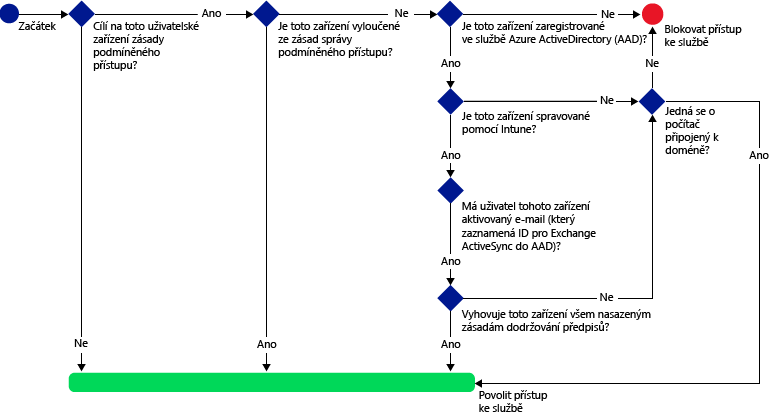
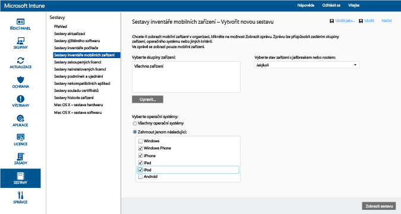
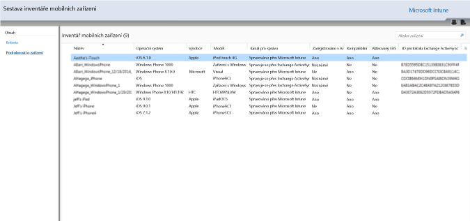
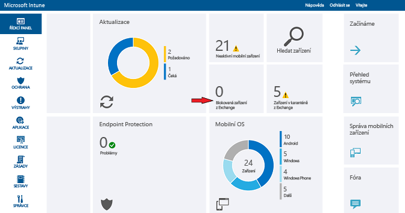

# Ochrana přístupu k e-mailu na Exchangi Online a v novém Exchangi Online Dedicated s Intune

[!INCLUDE[classic-portal](../includes/classic-portal.md)]

Pomocí Microsoft Intune můžete nakonfigurovat podmíněný přístup pro Exchange Online nebo Exchange Online Dedicated. Další informace o tom, jak podmíněný přístup funguje, najdete v článku [Ochrana přístupu k e-mailu, O365 a dalším službám](restrict-access-to-email-and-o365-services-with-microsoft-intune.md).

> [!NOTE]
>Pokud máte vyhrazené prostředí Exchange Online a potřebujete zjistit, jestli má novou, nebo starší verzi konfigurace, obraťte se na správce svého účtu.

## Před zahájením

Pokud chcete nakonfigurovat podmíněný přístup, musíte:

-   Mít **předplatné Office 365, které zahrnuje Exchange Online (třeba E3)**, a uživatelé musí mít licenci Exchange Online.

- Mít **předplatné Enterprise Mobility + Security (EMS)** nebo **předplatné Azure Active Directory (Azure AD) Premium** a uživatelé musí mít licenci pro EMS nebo Azure AD. Další informace najdete na [stránce s cenami služby Enterprise Mobility](https://www.microsoft.com/en-us/cloud-platform/enterprise-mobility-pricing) nebo na [stránce s cenami služby Azure Active Directory](https://azure.microsoft.com/en-us/pricing/details/active-directory/).

-  Zvážit nakonfigurování nepovinného **konektoru Intune Service to Service Connector**, který bude zajišťovat připojení [!INCLUDE[wit_nextref](../includes/wit_nextref_md.md)] k Exchangi Online a prostřednictvím konzoly [!INCLUDE[wit_nextref](../includes/wit_nextref_md.md)] vám pomůže se správou informací o zařízení. K používání zásad dodržování předpisů nebo zásad podmíněného přístupu tento konektor potřeba není, vyžaduje se ale ke spouštění sestav, které pomáhají hodnotit dopad podmíněného přístupu.
    -  Další informace o [konektoru Intune Service to Service Connector](intune-service-to-service-exchange-connector.md).

   > [!NOTE]
   > Pokud chcete používat podmíněný přístup pro Exchange Online i místní Exchange, konektor Intune Service to Service Connector nekonfigurujte.

### Požadavky na dodržování předpisů zařízení

Když nakonfigurujete zásady podmíněného přístupu a jejich cílem je určitý uživatel, může se tento uživatel připojit k e-mailu teprve tehdy, když jeho **zařízení** splňuje tyto požadavky:

-   Musí se jednat o počítač připojený k doméně nebo o zařízení **zaregistrované** ve službě [!INCLUDE[wit_nextref](../includes/wit_nextref_md.md)].

-  **Musí být zaregistrované v Azure Active Directory**. K tomu automaticky dojde při registraci zařízení ve službě [!INCLUDE[wit_nextref](../includes/wit_nextref_md.md)]. Kromě toho musí být ve službě Azure Active Directory zaregistrované ID protokolu Exchange ActiveSync klienta.

  Pro zákazníky s Intune a Office 365 se služba Azure Active Directory Device Registration aktivuje automaticky. Zákazníci, kteří už mají nasazenou službu ADFS Device Registration Service, registrovaná zařízení ve svojí místní službě Active Directory neuvidí.

-   Musí být **v souladu** se všemi zásadami dodržování předpisů [!INCLUDE[wit_nextref](../includes/wit_nextref_md.md)], které jsou nasazené na toto zařízení nebo připojené k místní doméně.

### Když zařízení nedodržuje předpisy

Pokud se nedodrží zásady podmíněného přístupu, zařízení se okamžitě umístí do karantény, uživatel dostane e-mail a při přihlášení se mu zobrazí následující oznámení o karanténě:

- Pokud není zařízení zaregistrované v [!INCLUDE[wit_nextref](../includes/wit_nextref_md.md)] nebo v Azure Active Directory, zobrazí se zpráva s pokyny k instalaci aplikace Portál společnosti, registraci zařízení a aktivaci e-mailu. Tento proces také přidruží ID protokolu Exchange ActiveSync zařízení k záznamu v Azure Active Directory.

-   Pokud není zařízení vyhodnoceno jako zařízení vyhovující pravidlům zásad dodržování předpisů, přesměruje se daný uživatel na web Portál společnosti služby [!INCLUDE[wit_nextref](../includes/wit_nextref_md.md)] nebo na aplikaci Portál společnosti, kde může najít informace o problému a jeho řešení.

### Jak podmíněný přístup funguje s Exchangem Online

Následující diagram znázorňuje postup, který zásady podmíněného přístupu používají pro Exchange Online.

## Podpora mobilních zařízení
Můžete chránit přístup k e-mailu na Exchangi Online z **Outlooku** a dalších **aplikací, které používají moderní ověřování**. Podporované systémy:

- Android 4.0 a novější, Samsung Knox Standard 4.0 a novější a Android for Work
- iOS 8.0 a novější

[!INCLUDE[wit_nextref](../includes/afw_rollout_disclaimer.md)]

**Moderní ověřování** integruje do klientů Microsoft Office přihlašování založené na knihovně ADAL (Active Directory Authentication Library).

-   Ověřování ADAL umožňuje klientům Office používat ověřování založené na prohlížeči (označuje se také jako pasivní ověřování). Aby bylo možné uživatele ověřit, uživatel se přesměruje na přihlašovací webovou stránku.
-   Tato nová metoda přihlašování umožňuje využívat lepší způsoby zabezpečení, jako jsou **vícefaktorové ověřování** a **ověřování na základě certifikátu**. Podrobnější informace najdete v článku [Jak funguje moderní ověřování](https://support.office.com/en-US/article/How-modern-authentication-works-for-Office-2013-and-Office-2016-client-apps-e4c45989-4b1a-462e-a81b-2a13191cf517). Můžete nastavit pravidla deklarací služby AD FS pro blokování jiných než moderních ověřovacích protokolů. Podrobné pokyny obsahuje [Scénář 3: Blokování veškerého přístupu k O365 kromě aplikací využívajících prohlížeč](https://technet.microsoft.com/library/dn592182.aspx).

Můžete chránit přístup k aplikaci **Outlook Web Access (OWA)** na Exchangi Online, když k ní uživatel přistupuje z prohlížeče na zařízeních s **iOSem** a **Androidem**. Přístup je povolený jenom z podporovaných prohlížečů na vyhovujících zařízeních:

* Safari (iOS)
* Chrome (Android)
* Intune Managed Browser (iOS, Android 5.0 a novější)

   > [!IMPORTANT]
   > **Nepodporované prohlížeče jsou zablokované**.

**Aplikaci OWA pro iOS a Android je možné upravit tak, aby nepoužívala moderní ověřování, a proto není podporovaná. Přístup z aplikace OWA je potřeba zablokovat pravidly deklarací identity ADFS.**

Přístup k e-mailu na Exchangi můžete chránit z integrovaného **e-mailového klienta Exchange ActiveSync** na následujících platformách:

- Android 4.0 nebo novější, Samsung Knox Standard 4.0 nebo novější

- iOS 8.0 a novější

- Windows Phone 8.1 nebo novější

## Podpora počítačů

Podmíněný přístup se dá nastavit pro počítače, které používají desktopové aplikace Office pro přístup k **Exchangi Online** a **SharePointu Online** a splňují následující požadavky:

-   V počítači musí být systém Windows 7.0, Windows 8.1 nebo Windows 10.

  >[!NOTE]
  > Pokud chcete použít podmíněný přístup u počítačů s Windows 10, musíte je aktualizovat na verzi Windows 10 Anniversary Update.

  Počítač musí být buď připojený k doméně, nebo musí splňovat pravidla zásad dodržování předpisů.

  Počítač splňuje požadavky tehdy, když je zaregistrovaný ve službě [!INCLUDE[wit_nextref](../includes/wit_nextref_md.md)] a je v souladu se zásadami.

  U počítačů připojených k doméně musíte podmíněný přístup nastavit tak, aby se [zařízení automaticky zaregistrovalo](https://azure.microsoft.com/documentation/articles/active-directory-conditional-access-automatic-device-registration/) do služby Azure Active Directory.

  >[!NOTE]
    >Podmíněný přístup není podporovaný na počítačích, ve kterých běží klient Intune pro počítače.

-   [Musí být povolené moderní ověřování Office 365](https://support.office.com/en-US/article/Using-Office-365-modern-authentication-with-Office-clients-776c0036-66fd-41cb-8928-5495c0f9168a) a musí být nainstalované všechny nejnovější aktualizace Office.

    Moderní ověřování integruje do klientů Office 2013/Windows přihlašování založené na knihovně ADAL (Active Directory Authentication Library). Umožňuje využívat lepší způsoby zabezpečení, jako jsou **vícefaktorové ověřování** a **ověřování na základě certifikátu**.

-   Nastaví se pravidla deklarací služby AD FS pro blokování jiných než moderních ověřovacích protokolů. Podrobné pokyny obsahuje [Scénář 3: Blokování veškerého přístupu k O365 kromě aplikací využívajících prohlížeč](https://technet.microsoft.com/library/dn592182.aspx).

## Konfigurace podmíněného přístupu
### Krok 1: Konfigurace a nasazení zásad dodržování předpisů
Ujistěte se, že jste pro skupiny uživatelů, které získají zásady podmíněného přístupu, [vytvořili](create-a-device-compliance-policy-in-microsoft-intune.md) a [nasadili](deploy-and-monitor-a-device-compliance-policy-in-microsoft-intune.md) zásady dodržování předpisů.

> [!IMPORTANT]
> Pokud jste zásady dodržování předpisů nenasadili, budou se zařízení považovat za zařízení v souladu s předpisy a bude jim povolen přístup k Exchangi.

### Krok 2: Vyhodnoťte efekt zásad podmíněného přístupu.
Pomocí **Sestav inventáře mobilních zařízení** můžete identifikovat zařízení, která mohou mít po nakonfigurování zásad podmíněného přístupu blokovaný přístup k Exchangi.

Pokud to budete chtít provést, nakonfigurujte připojení mezi [!INCLUDE[wit_nextref](../includes/wit_nextref_md.md)] a Exchangem pomocí [konektoru Service to Service služby Microsoft Intune](intune-service-to-service-exchange-connector.md).
1.  Přejděte na **Sestavy** > **Sestavy inventáře mobilních zařízení**.

2.  V parametrech sestavy vyberte skupinu [!INCLUDE[wit_nextref](../includes/wit_nextref_md.md)], kterou chcete vyhodnotit, a v případě potřeby platformy zařízení, na které se zásady budou vztahovat.
3.  Po dokončení výběru kritérií vyhovujících potřebám vaší organizace vyberte **Zobrazit sestavu**.
Prohlížeč sestav se otevře v novém okně.

Po spuštění sestavy zkontrolujte tyto čtyři sloupce, abyste zjistili, jestli bude uživatel blokovaný:

-   **Kanál pro správu**: Určuje, jestli se zařízení spravuje ve službě Intune, Exchange ActiveSync, nebo v obou.

-   **Registrováno v AAD**: Určuje, jestli je zařízení zaregistrované v Azure Active Directory (označuje se jako připojení k pracovišti).

-   **Vyhovující předpisům**: Určuje, jestli zařízení splňuje zásady dodržování předpisů, které jste nasadili.

-   **ID protokolu Exchange ActiveSync**: Zařízení s iOSem a Androidem musí mít k záznamu o registraci zařízení v Azure Active Directory přiřazené vlastní ID protokolu Exchange ActiveSync. K tomu dojde, když uživatel vybere odkaz **Aktivace e-mailu** v e-mailu s oznámením o umístění do karantény.

    > [!NOTE]
    > Zařízení Windows Phone v tomto sloupci vždycky zobrazí hodnotu.

Zařízením, která jsou součástí cílové skupiny, se bude blokovat přístup k Exchangi, pokud se hodnoty ve sloupcích nebudou shodovat s hodnotami uvedenými v této tabulce:

--------------------------
|Kanál pro správu|Zaregistrováno v AAD|Vyhovuje|ID protokolu Exchange ActiveSync|Výsledná akce|
|----------------------|------------------|-------------|--------------------------|--------------------|
|**Spravuje se v Microsoft Intune a Exchange ActiveSync**|Ano|Ano|Je zobrazená hodnota|Přístup k e-mailu je povolený|
|Jakákoli jiná hodnota|Ne|Ne|Není zobrazená žádná hodnota|Přístup k e-mailu je blokovaný|
----------------------
Obsah sestavy můžete vyexportovat a použít sloupec **E-mailová adresa** k informování uživatelů o tom, že budou blokovaní.

### Krok 3: Nakonfigurujte skupiny uživatelů pro zásady podmíněného přístupu.
Zásady podmíněného přístupu jsou cíleny na různé skupiny uživatelů, které jsou skupinami zabezpečení Azure Active Directory. Ze zásad podmíněného přístupu můžete také určité skupiny uživatelů vyloučit. Pokud na uživatele cílí zásady, musí každé jím používané zařízení zásady splňovat, aby měl přístup k e-mailu.

Tyto skupiny můžete nakonfigurovat v **Centru pro správu Office 365**nebo na **Portálu účtů Intune**.

V každé zásadě můžete určit dva typy skupin:

-   **Cílové skupiny**: Skupiny uživatelů, pro které zásady platí

-   **Vyloučené skupiny**: Skupiny uživatelů, které jsou ze zásad vyloučené (volitelné)

Pokud je uživatel v obou skupinách, bude ze zásad vyloučený.

Vyhodnocují se jenom skupiny, které jsou cílem zásad podmíněného přístupu.

### Krok 4: Konfigurace zásad podmíněného přístupu

>[!NOTE]
> Zásady podmíněného přístupu můžete vytvořit i v konzole pro správu Azure AD. Přes konzolu pro správu Azure AD můžete vytvářet i zásady podmíněného přístupu pro zařízení Intune (v Azure AD označované jako **zásady podmíněného přístupu založené na zařízení**), kromě jiných zásad podmíněného přístupu, jako je například vícefaktorové ověřování.

>Také můžete nastavit zásady podmíněného přístupu pro podnikové aplikace třetích stran, které Azure AD podporuje, například Salesforce nebo Box. Další informace najdete v tématu [Jak v Azure Active Directory nastavit zásady podmíněného přístupu založené na zařízení a získat tak kontrolu přístupu k aplikacím připojeným k Azure Active Directory](https://azure.microsoft.com/en-us/documentation/articles/active-directory-conditional-access-policy-connected-applications/).

1.  V [konzole pro správu Microsoft Intune](https://manage.microsoft.com) vyberte **Zásady** > **Podmíněný přístup** > **Zásady pro Exchange Online**.

2.  Na stránce **Zásady pro Exchange Online** zvolte možnost **Zapnout zásady podmíněného přístupu pro Exchange Online**.

    > [!NOTE]
    > Pokud jste zásady dodržování předpisů nenasadili, budou se zařízení považovat za vyhovující.
    >
    > Bez ohledu na stav dodržování předpisů se u všech uživatelů, na které jsou zásady zacílené, bude vyžadovat, aby svá zařízení zaregistrovali ve službě [!INCLUDE[wit_nextref](../includes/wit_nextref_md.md)].

3.  V části **Přístup k aplikaci** máte pro aplikace, které využívají moderní ověřování, dva způsoby volby platforem, pro které mají zásady platit. Podporovány jsou mimo jiné následující platformy: Android, iOS, Windows a Windows Phone.

    -   **Všechny platformy**

        Tato volba vyžaduje, aby každé zařízení používané k přístupu k **Exchangi Online** bylo zaregistrované v Intune a dodržovalo tyto zásady. Všechny klientské aplikace používající **moderní ověřování** podléhají zásadám podmíněného přístupu. Pokud Intune příslušnou platformu aktuálně nepodporuje, je přístup k **Exchangi Online** zablokovaný.

        Výběr volby **Všechny platformy** způsobí, že Azure Active Directory tyto zásady uplatní na všechny požadavky na ověření bez ohledu na platformu, která je ohlášena klientskou aplikací. Všechny platformy musí být zaregistrované a vyhovující, s těmito výjimkami:
        *    Zařízení s Windows, která musejí být zaregistrovaná a vyhovující, připojená k doméně s místním Active Directory nebo obojí
        * Nepodporované platformy jako Mac OS. Aplikace, které používají moderní ověřování a pocházejí z těchto platforem, však budou i nadále zablokované.

    -   **Specifické platformy**

         Zásady podmíněného přístupu platí pro každou klientskou aplikaci, která na určených platformách zařízení používá **moderní ověřování**.

4. V části **Outlook Web Access (OWA)** je možné povolit přístup k Exchangi Online pouze prostřednictvím podporovaných prohlížečů: Safari (iOS) a Chrome (Android). Přístup z jiných prohlížečů je blokovaný. Omezení platformy, která jste vybrali pro přístup k aplikaci pro Outlook, se použijí i zde.

  V zařízeních s **Androidem** musí uživatelé povolit přístup z prohlížeče. Uživatel proto musí na zaregistrovaném zařízení povolit možnost **Povolit přístup z prohlížeče** následujícím způsobem:
  1.    Otevřete **aplikaci Portál společnosti**.
  2.    Přejděte na stránku **Nastavení** prostřednictvím tlačítka se třemi tečkami (...) nebo hardwarového tlačítka nabídky.
  3.    Stiskněte tlačítko **Povolit přístup z prohlížeče**.
  4.    V prohlížeči Chrome se odhlaste z Office 365 a znovu spusťte Chrome.

  V platformách **iOS** a **Android** kvůli identifikaci zařízení použitého pro přístup ke službě vydá Azure Active Directory pro příslušné zařízení certifikát TLS (Transport Layer Security). Zařízení zobrazí certifikát s výzvou pro uživatele, aby vybral certifikát, jak je vidět na následujících snímcích obrazovky. Aby mohl uživatel dál používat prohlížeč, musí tento certifikát vybrat.

  **iOS**

  

  **Android**

  

5.  V části **Aplikace Exchange ActiveSync** se můžete rozhodnout blokovat zařízením, která nesplňují zásady dodržování předpisů, přístup na Exchange Online. Můžete také zvolit, jestli chcete povolit nebo blokovat přístup k e-mailu, pokud zařízení neběží na podporované platformě. Podporovány jsou mimo jiné následující platformy: Android, iOS, Windows a Windows Phone.

 Aplikace Exchange Active Sync na zařízeních s **Androidem for Work**:
 -  Na zařízeních s Androidem for Work se v **pracovním profilu** podporují jenom aplikace **Gmail** a **Nine Work**. Aby na zařízeních s Androidem for Work fungoval podmíněný přístup, je nutné nasadit e-mailový profil pro aplikaci Gmail nebo Nine Work a zároveň ji nasadit jako **požadovanou** instalaci.

6.  V části **Cílové skupiny** vyberte skupiny zabezpečení uživatelů Active Directory, na které se zásady vztahují. Můžete cílit na všechny uživatele nebo vybraný seznam skupin uživatelů.

    > [!NOTE]
    > U uživatelů, kteří jsou v **cílových skupinách**, nahrazují zásady Intune pravidla a zásady Exchange.
    >
    > Exchange bude vynucovat pravidla Exchange pro povolování, blokování a karanténu a zásady Exchange jenom v těchto případech:
    >
    > -   Uživatel nemá licenci na službu Intune.
    > -   Uživatel má licenci na službu Intune, ale nepatří do žádné skupiny zabezpečení, na kterou cílí zásady podmíněného přístupu.

6.  V části **Vyloučené skupiny**vyberte skupiny zabezpečení Active Directory uživatelů, kteří jsou z těchto zásad vyloučení. Pokud je uživatel v cílových skupinách i ve vyloučených skupinách, bude ze zásad vyloučený.

7.  Po dokončení vyberte **Uložit**.

-   Zásady podmíněného přístupu nemusíte nasazovat, projeví se okamžitě.

-   Jakmile uživatel vytvoří e-mailový účet, zařízení se okamžitě zablokuje.

-   Pokud blokovaný uživatel zařízení zaregistruje v [!INCLUDE[wit_nextref](../includes/wit_nextref_md.md)] a odstraní problémy, které způsobují, že zařízení nesplňuje zásady dodržování předpisů, odblokuje se přístup k e-mailu během dvou minut.

-   Pokud uživatel zruší registraci svého zařízení, e-mail se zablokuje zhruba po šesti hodinách.

Pokud se chcete podívat na nějaké **ukázkové scénáře konfigurace zásad podmíněného přístupu, kterými se dá přístup pro zařízení chránit**, prohlédněte si [Ukázkové scénáře ochrany přístupu k e-mailu](restrict-email-access-example-scenarios.md).

## Sledování dodržování předpisů a zásad podmíněného přístupu

#### Zobrazení zařízení, která jsou blokovaná systémem Exchange

Na řídicím panelu [!INCLUDE[wit_nextref](../includes/wit_nextref_md.md)] zvolte dlaždici **Zařízení blokovaná systémem Exchange** a zobrazte počet blokovaných zařízení a odkazy na další informace.

## Další kroky
- [Ochrana přístupu k SharePointu Online](restrict-access-to-sharepoint-online-with-microsoft-intune.md)

- [Ochrana přístupu k Online Skypu pro firmy](restrict-access-to-skype-for-business-online-with-microsoft-intune.md)

