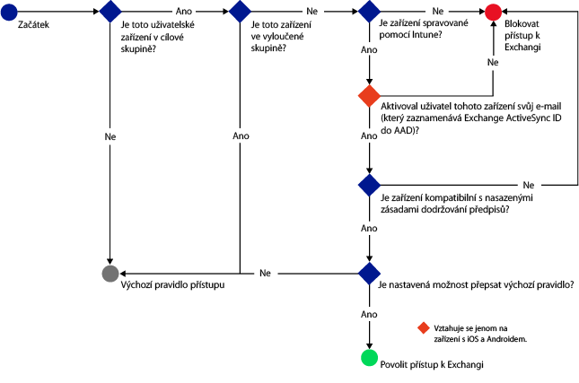
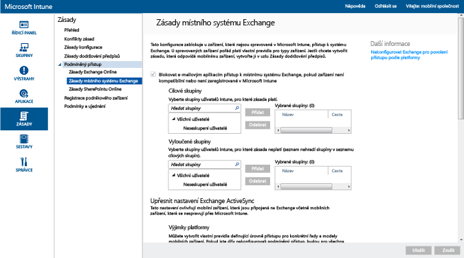

# Omezení přístupu k e-mailu v místním systému Exchange a starším vyhrazeném prostředí Exchange Online v Microsoft Intune

Pokud máte vyhrazené prostředí Exchange Online a potřebujete zjistit, jestli má novou, nebo starší verzi konfigurace, obraťte se na správce svého účtu.

Pokud chcete řídit přístup k e-mailům v místním Exchangi nebo ve starším vyhrazeném prostředí Exchange Online, nakonfigurujte v Intune podmíněný přístup k místnímu Exchangi.
Další informace o tom, jak podmíněný přístup funguje, najdete v článku o [omezení přístupu k e-mailu a službám O365]( restrict-access-to-email-and-o365-services-with-microsoft-intune.md).

**Před tím**, než nakonfigurujete podmíněný přístup, ověřte, jestli jsou splněné tyto podmínky:

-   Musíte mít **Exchange 2010 nebo novější**. Podporuje se pole serveru pro klientský přístup (CAS) serveru Exchange.

-   Musíte použít **místní konektor Exchange**, který připojí [!INCLUDE[wit_nextref](../includes/wit_nextref_md.md)] k místnímu Microsoft Exchangi. To vám umožní spravovat zařízení přes konzolu [!INCLUDE[wit_nextref](../includes/wit_nextref_md.md)]. Podrobnosti o konektoru najdete v článku o [místním konektoru Exchange služby Intune](intune-on-premises-exchange-connector.md).

    -   Místní konektor Exchange dostupný v konzole Intune je určený výhradně pro vašeho klienta Intune a nedá se použít s žádným jiným klientem. Také se ujistěte, že je konektor Exchange pro vašeho klienta nainstalovaný jenom **na jednom počítači**.

        Tento konektor by se měl stáhnout z konzoly správce Intune.  Podrobný postup při konfiguraci místního konektoru Exchange najdete v článku o [konfiguraci místního konektoru Exchange pro místní nebo hostovaný Exchange](intune-on-premises-exchange-connector.md).

    -   Konektor může být nainstalovaný na každém počítači, který má schopnost komunikovat se serverem Exchange.

    -   Tento konektor podporuje **prostředí Exchange CAS**. Z technického hlediska můžete konektor nainstalovat přímo na server Exchange CAS, ale nedoporučuje se to, protože to zvýší zátěž serveru.
    Při konfiguraci musíte konektor nastavit tak, aby komunikoval s jedním ze serverů Exchange CAS.

-   Protokol **Exchange ActiveSync** je potřeba nakonfigurovat s ověřováním na základě certifikátů nebo zadávání přihlašovacích údajů uživateli.

Pokud jsou pro určitého uživatele nakonfigurované zásady podmíněného přístupu, může se tento uživatel připojit k e-mailu teprve tehdy, když jeho **zařízení** splňuje tyto požadavky:

-  Musí být **zaregistrované** ve službě [!INCLUDE[wit_nextref](../includes/wit_nextref_md.md)] nebo v počítači připojeném k doméně.

-  **Musí být zaregistrované v Azure Active Directory**. Kromě toho musí být ve službě Azure Active Directory zaregistrované ID protokolu Exchange ActiveSync klienta.

  Pro zákazníky Intune a Office 365 je služba AAD DRS aktivovaná automaticky. Zákazníci, kteří už mají nasazenou službu AD FS Device Registration Service, registrovaná zařízení ve svojí místní službě Active Directory neuvidí. **To neplatí pro počítače s Windows ani zařízení Windows Phone**.

-   **Musí splňovat** veškeré zásady dodržování předpisů [!INCLUDE[wit_nextref](../includes/wit_nextref_md.md)] nasazené na toto zařízení.

Následující diagram znázorňuje postup, který zásady podmíněného přístupu pro prostředí místního Exchange používají k vyhodnocení toho, jestli se mají zařízení povolit, nebo blokovat.

 Pokud není splněná některá ze zásad, které jsou podmínkou přístupu, zobrazí se uživateli při přihlášení jedna z následujících zpráv:

- Pokud není zařízení zaregistrované v [!INCLUDE[wit_nextref](../includes/wit_nextref_md.md)] nebo v Azure Active Directory, zobrazí se zpráva s pokyny k instalaci aplikace Portál společnosti, registraci zařízení a aktivaci e-mailu. Tento proces také přidruží ID protokolu Exchange ActiveSync zařízení k záznamu zařízení v Azure Active Directory.

-   Pokud zařízení není kompatibilní, zobrazí se zpráva, která uživatele přesměruje na web Portál společnosti služby [!INCLUDE[wit_nextref](../includes/wit_nextref_md.md)] nebo na aplikaci Portál společnosti, kde může najít informace o problému a jeho řešení.

## Podpora mobilních zařízení
-   Windows Phone 8.1 nebo novější

-   Nativní e-mailová aplikace v systému iOS

-   Poštovní klienti EAS, například Gmail v Androidu 4 a novějším
- **Zařízení s Androidem for Work** se poštovními klienty EAS: Na zařízeních s Androidem for Work jsou v **pracovním profilu** podporované jenom aplikace **Gmail** a **Nine Work**. Aby v Androidu for Work fungoval podmíněný přístup, musíte nasadit e-mailový profil pro aplikaci Gmail nebo Nine Work a zároveň tyto aplikace nasadit jako požadovanou instalaci. 

[!INCLUDE[wit_nextref](../includes/afw_rollout_disclaimer.md)]

> [!NOTE]
> Aplikace Microsoft Outlook pro Android a iOS se nepodporuje.

## Podpora počítačů

Aplikace **Pošta** ve Windows 8.1 a novějších verzích (při registraci v [!INCLUDE[wit_nextref](../includes/wit_nextref_md.md)])

##  Konfigurace zásad podmíněného přístupu

1.  V [konzole pro správu Microsoft Intune](https://manage.microsoft.com) vyberte **Zásady** > **Podmíněný přístup** > **Zásady pro místní Exchange**.

2.  Nakonfigurujte zásady pomocí vámi požadovaných nastavení: 

  - **Blokovat e-mailovým aplikacím přístup k místnímu systému Exchange, pokud zařízení není kompatibilní nebo není zaregistrované v Microsoft Intune:** Pokud vyberete tuto možnost, zařízení, která nespravuje [!INCLUDE[wit_nextref](../includes/wit_nextref_md.md)] nebo která nejsou kompatibilní se zásadou dodržování předpisů, budou mít zablokovaný přístup ke službám Exchange.

  - **Přepis výchozího pravidla – vyhovujícím zařízením, která jsou zapsaná v Intune, vždy povolit přístup na Exchange:** Pokud zaškrtnete tuto možnost, zařízení zaregistrovaná v Intune a splňující předpisy budou moct získat přístup k Exchangi.  
  Toto pravidlo přepíše **Výchozí pravidlo**. To znamená, že i když nastavíte **Výchozí pravidlo** na umístění do karantény nebo blokování přístupu, zaregistrovaná zařízení splňující předpisy budou mít pořád povolený přístup k Exchangi.

  - **Cílové skupiny:** Vyberte skupiny uživatelů [!INCLUDE[wit_nextref](../includes/wit_nextref_md.md)], kteří musí zaregistrovat svá zařízení ve službě [!INCLUDE[wit_nextref](../includes/wit_nextref_md.md)] předtím, než získají přístup k Exchangi.

  - **Vyloučené skupiny:** Vyberte skupiny uživatelů [!INCLUDE[wit_nextref](../includes/wit_nextref_md.md)], které jsou ze zásad podmíněného přístupu vyloučené. Uživatelé v tomto seznamu budou vyloučení, i když jsou zároveň uvedení i v seznamu **Cílové skupiny**.

  - **Výjimky platforem:** Vyberte **Přidat pravidlo** a nakonfigurujte pravidlo, které bude definovat úrovně přístupu pro zadané řady a modely mobilních zařízení. Vzhledem k tomu, že tato zařízení můžou být jakéhokoli typu, můžete taky nakonfigurovat typy zařízení nepodporované službou [!INCLUDE[wit_nextref](../includes/wit_nextref_md.md)].

  - **Výchozí pravidlo:** U zařízení, pro které neplatí žádné z ostatních pravidel, můžete zvolit, aby mělo přístup k Exchangi, můžete ho blokovat nebo umístit do karantény. Pokud nastavíte pravidlo, kterým povolíte přístup pro zaregistrovaná zařízení splňující předpisy, automaticky se udělí přístup k e-mailům pro zařízení se systémy iOS, Windows a řešením Samsung KNOX. Koncový uživatel získá přístup k e-mailům a nemusí kvůli tomu provádět žádné kroky.  U zařízení se systémem Android, která nepoužívají řešení Samsung KNOX, dostanou koncoví uživatelé e-mail s informací o karanténě, který bude obsahovat návod k ověření registrace a dodržování předpisů. K e-mailům získají přístup až po tomto ověření. Pokud nastavíte pravidlo na blokování přístupu nebo umístění do karantény, všechna zařízení budou mít zablokovaný přístup k Exchangi bez ohledu na to, jestli jsou už zaregistrovaná ve službě Intune. Pokud nechcete, aby toto pravidlo platilo pro zaregistrovaná zařízení splňující předpisy, zaškrtněte možnost **Přepsat výchozí pravidlo**.
>[!TIP]
>Pokud chcete před udělením přístupu k e-mailům nejdřív zablokovat všechna zařízení, vyberte možnosti Blokovat přístup nebo Umístit do karantény. Výchozí pravidlo se použije pro všechny typy zařízení. To znamená, že se použije i pro typy zařízení, které jste nakonfigurovali jako výjimky platformy a které [!INCLUDE[wit_nextref](../includes/wit_nextref_md.md)] nepodporuje.

  - **Oznámení uživatele:** Kromě e-mailu s oznámením odeslaného z Exchange odešle Intune e-mail, který můžete konfigurovat a který obsahuje postup odblokování zařízení. Výchozí zprávu můžete upravit a přizpůsobit svým potřebám. Vzhledem k tomu, že se e-mail s oznámením Intune obsahující pokyny k nápravě doručuje do poštovní schránky Exchange uživatele, může uživatel v případě, že se jeho zařízení před obdržením této e-mailové zprávy zablokuje, použít pro přístup k Exchangi a zobrazení zprávy odblokované zařízení nebo jinou metodu. To platí hlavně v případě, že je **Výchozí pravidlo** nastavené na blokování nebo umístění do karantény.  V takovém případě bude muset koncový uživatel přejít na web App Store, stáhnout aplikaci Portál společnosti od Microsoftu a zaregistrovat své zařízení. To se vztahuje na zařízení se systémy iOS, Windows a řešením Samsung KNOX.  U zařízení Android, která nepoužívají řešení Samsung KNOX, budete muset odeslat e-mail o karanténě na alternativní e-mailový účet, který pak bude muset koncový uživatel zkopírovat do svého zablokovaného zařízení, aby se mohl dokončit proces registrace a dodržování předpisů.
  > [!NOTE]
  > Aby systém Exchange mohl e-mail s oznámením odeslat, musíte určit účet, který se má k odeslání e-mailu s oznámením použít.
  >
  > Podrobnosti najdete v článku o [konfiguraci místního konektoru Exchange pro místní nebo hostovaný Exchange](intune-on-premises-exchange-connector.md).

3.  Po dokončení vyberte **Uložit**.

-   Zásady podmíněného přístupu není potřeba nasazovat, projeví se okamžitě.

-   Jakmile uživatel nastaví profil Exchange ActiveSync, může trvat 1–3 hodiny, než se zařízení zablokuje (pokud ho nespravuje služba [!INCLUDE[wit_nextref](../includes/wit_nextref_md.md)]).

-   Pokud pak blokovaný uživatel zařízení zaregistruje do [!INCLUDE[wit_nextref](../includes/wit_nextref_md.md)] (a opraví nedodržování předpisů), odblokuje se přístup k e-mailu během 2 minut.

-   Pokud uživatel zruší registraci ve službě [!INCLUDE[wit_nextref](../includes/wit_nextref_md.md)], může trvat 1 až 3 hodiny, než se zařízení zablokuje.

**Pokud se chcete podívat na ukázkové scénáře konfigurace zásad podmíněného přístupu, kterými můžete omezit přístup zařízení, prohlédněte si [ukázkové scénáře omezení přístupu k e-mailům](restrict-email-access-example-scenarios.md).**

## Další kroky
[Omezení přístupu k SharePointu Online](restrict-access-to-sharepoint-online-with-microsoft-intune.md)

[Omezení přístupu k Online Skypu pro firmy](restrict-access-to-skype-for-business-online-with-microsoft-intune.md)

<!--HONumber=Dec16_HO2-->

