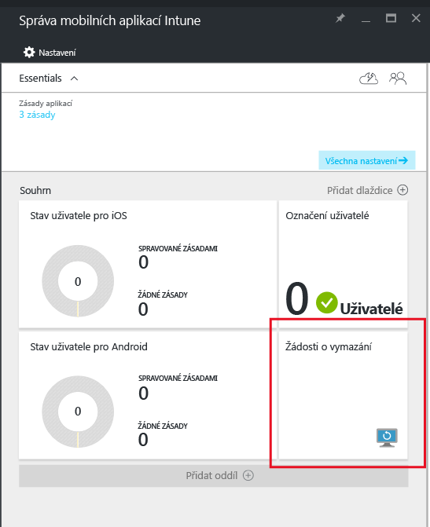
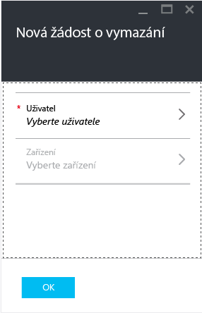
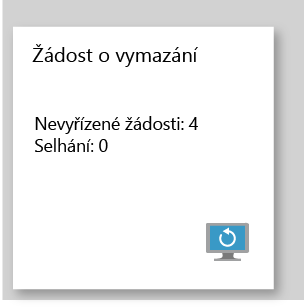

# Vymazání dat spravovaných aplikací společnosti s Microsoft Intune
V případě ztráty nebo odcizení zařízení nebo když zaměstnanec opouští společnost, je vhodné se ujistit, že byla ze zařízení odebraná firemní data. Nemusí ale být vhodné odebrat ze zařízení osobní data, zvlášť jestli je to zařízení, které vlastní zaměstnanec.

Pokud chcete selektivně odebrat data firemních aplikací, vytvořte žádost o vymazání pomocí kroků v tomto tématu. Po dokončení žádosti se při příštím spuštění aplikace na zařízení z aplikace odeberou firemní data.
>[!NOTE]
> Kontakty synchronizované přímo z aplikace do nativního adresáře se odeberou. Kontakty synchronizované z nativního adresáře do dalšího externího zdroje není možné vymazat. To se v současné době týká jenom aplikace Microsoft Outlook.

## Vytvoření žádosti o vymazání

1.  V okně **Správa mobilních aplikací Intune** vyberte dlaždici **Žádosti o vymazání**.

    

2.  Vyberte **Nová žádost o vymazání**. Otevře se snímek obrazovky okna **Nová žádost o vymazání**.

    

3.  Vyberte **Uživatel** k otevření okna **Uživatel** a vyberte uživatele, jehož data aplikací chcete vymazat.

4.  Vyberte **Zařízení**.  Otevře se okno **Zařízení** , ve kterém jsou uvedena všechny zařízení přidružená k vybranému uživateli.  Vyberte zařízení, které chcete vymazat.

5.  Teď jste zpátky v okně **Nová žádost o vymazání**. Pokud chcete vytvořit žádost o vymazání, vyberte **OK**. Služba vytvoří a sleduje samostatnou žádost o vymazání pro každou chráněnou aplikaci na zařízení.

## Monitorování žádostí o vymazání
Okno **Správa mobilních aplikací Intune** obsahuje souhrnnou sestavu o dlaždici **Žádost o vymazání** .  Zobrazí celkový stav a zahrnuje počet nevyřízených žádostí a selhání. Další podrobnosti získáte po provedení těchto kroků:

1.  V okně **Správa mobilních aplikací Intune** výběrem dlaždice **Žádost o vymazání** otevřete okno **Žádost o vymazání**.

2.  V okně **Žádost o vymazání** můžete zobrazit seznam žádostí seskupených podle uživatele. Protože systém vytvoří žádost o vymazání pro každou chráněnou aplikaci spuštěnou na zařízení, může být u uživatele více žádostí. Stav označuje, jestli je žádost o vymazání **nevyřízená**, **selhala** nebo byla **úspěšná**.

Aby k vymazání došlo, musí uživatel otevřít aplikaci. Po zadání požadavku může vymazání samotné trvat až 30 minut.

Vymazání v čekajícím stavu se zobrazují, dokud je ručně neodstraníte.  Pokud chcete požadavek na vymazání odstranit ručně, klikněte na něj pravým tlačítkem a zvolte odstranit.

### Související témata
[Ochrana dat aplikací pomocí zásad správy mobilních aplikací](protect-app-data-using-mobile-app-management-policies-with-microsoft-intune.md)

[Použití portálu Azure Portal](azure-portal-for-microsoft-intune-mam-policies.md)

<!--HONumber=Dec16_HO2-->

