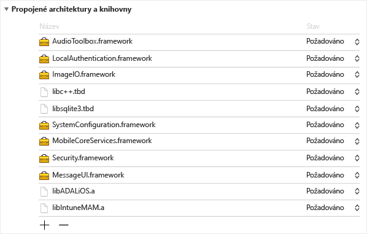
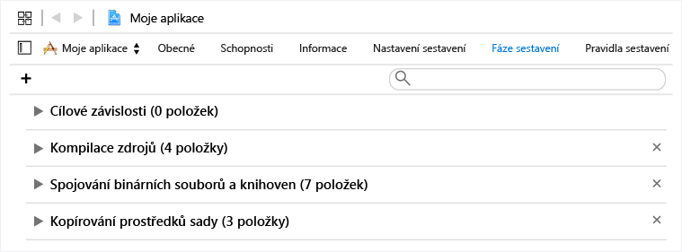
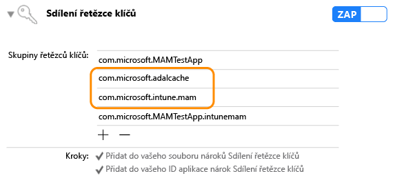

# Microsoft Intune App SDK pro iOS – Příručka pro vývojáře

> [!NOTE]
> Možná si budete chtít nejdřív přečíst příručku [Začínáme s Intune App SDK](intune-app-sdk-get-started.md), která vysvětluje postup přípravy integrace na jednotlivých podporovaných platformách.* 

Microsoft Intune App SDK pro iOS umožňuje začlenit správu mobilních aplikací (MAM) Intune do vaší aplikace pro iOS. Aplikace s podporou MAM je integrovaná se sadou Intune App SDK a umožňuje správcům IT nasadit zásady do mobilní aplikace, která je aktivně spravovaná službou Intune.


# Co je v sadě SDK 

Intune App SDK pro iOS zahrnuje statickou knihovnu, soubory prostředků, záhlaví API, seznam vlastností (plist) s nastavením pro ladění a nástroj konfigurátoru. Mobilní aplikace můžou pro vynucení většiny zásady jednoduše zahrnout soubory prostředků a staticky se propojit ke knihovnám. Pokročilé funkce Intune MAM se vynucují prostřednictvím rozhraní API.

Tato příručka se věnuje tomu, jak používat následující komponenty sady Intune App SDK pro iOS:

* **libIntuneMAM.a**: Statická knihovna Intune App SDK. Pokud vaše aplikace nepoužívá rozšíření, připojte tuhle knihovnu k projektu, abyste aplikaci mohli spravovat pomocí Intune. Pokyny najdete v části Použití sady SDK v mobilní aplikaci.

* **IntuneMAM.framework**: Model Intune App SDK. Pokud chcete aplikaci spravovat pomocí Intune, připojte tento model k projektu. Použijte ho místo statické knihovny v případě, že aplikace používá rozšíření, aby se v projektu nevytvořilo několik kopií statické knihovny.

* **IntuneMAMResources.bundle**: Sada prostředků obsahující prostředky, které SDK využívá. 

* **Hlavičky**: Zveřejňují rozhraní API sady Intune App SDK. Pokud použijete rozhraní API, musíte zahrnout soubor hlaviček, který toto rozhraní API obsahuje. Následující soubory hlaviček zahrnují volání funkcí API nutné k povolení funkcí Intune App SDK. 
    
    * IntuneMAMAsyncResult.h
    * IntuneMAMDataProtectionInfo.h
    * IntuneMAMDataProtectionManager.h
    * IntuneMAMFileProtectionInfo.h
    * IntuneMAMFileProtectionManager.h
    * IntuneMAMPolicyDelegate.h
    * IntuneMAMLogger.h 


# Jak Intune App SDK funguje

Cílem sady Intune App SDK pro iOS je doplnit do aplikací pro iOS možnosti správy s minimálními změnami kódu. Čím méně změn kódu, tím méně času na marketing, ale konzistence a stabilita mobilní aplikace zůstává zaručena. 

Aplikace musí být propojená se statickou knihovnou a musí zahrnovat sadu prostředků. Soubor MAMDebugSettings.plist je volitelný a může být v balíčku zahrnutý proto, aby simuloval použití zásad MAM v aplikaci, aniž by ji bylo nutné nasazovat pomocí Microsoft Intune. V ladicím buildu se navíc zásady v souboru MAMDebugSettings.plist můžou použít tak, že se soubor přenese do adresáře dokumentů aplikace pomocí sdílení souborů iTunes.

# Použití sady SDK v mobilní aplikaci 

Dokončením tohoto postupu povolíte Intune App SDK:

1. **Možnost 1**: Následujícím způsobem připojte knihovnu `libIntuneMAM.a`:

    Přetáhněte knihovnu `libIntuneMAM.a` do seznamu propojených modelů a knihoven cíle projektu.
     

    **Poznámka**: Pokud se aplikaci chystáte vydat v App Storu, použijte prosím verzi `libIntuneMAM.a` sestavenou pro prodej, ne ladicí verzi. Prodejní verze bude ve složce Release. Ladicí verze má podrobný výstup určený k tomu, aby se v Intune App SDK snadněji řešily potíže.
    
    **Možnost 2**: K projektu připojte `IntuneMAM.framework`. Přetáhněte `IntuneMAM.framework` do seznamu propojených modelů a knihoven cíle projektu.
    
    **Poznámka**: Pokud tento model použijete, nezapomeňte z univerzálního modelu před odesláním aplikace do App Storu odstranit architektury simulátoru. Viz také část Odeslání aplikace do App Storu.

2. Do projektu přidejte tyto modely iOS:
    * MessageUI.framework
    * Security.framework
    * MobileCoreServices.framework
    * SystemConfiguration.framework
    * libsqlite3.dylib
    * libc++.dylib
    * ImageIO.framework
    * LocalAuthentication.framework
    * AudioToolbox.framework

    **Poznámka**: Pokud je aplikace určena pro iOS 7, nastavte atribut Status modelu `LocalAuthentication.framework` na Volitelný. Bez nastaveného atributu Status se aplikace v iOS 7 nespustí.

    **Poznámka**: Xcode 7 přepnul rozšíření `.dylib` na `.tbd`.

3. Přidejte do projektu sadu prostředků `IntuneMAMResources.bundle`. Přetáhněte ji do části Kopírovat prostředky balíčku v rámci položky Fáze buildu.

 
4. Přidejte `-force_load {PATH_TO_LIB}/libIntuneMAM.a` do následujících nastavení a nahraďte přitom `{PATH_TO_LIB}` umístěním Intune App SDK:
    * nastavení konfigurace buildu `OTHER_LDFLAGS` v projektu 
    * nastavení Další příznaky linkeru uživatelského rozhraní<br>

    **Poznámka**: Pokud chcete zjistit cestu `PATH_TO_LIB`, vyberte soubor `libIntuneMAM.a` a v nabídce Soubor klikněte na Získat informace. Cestu (údaj Kde) zkopírujte z části Obecné v okně Informace.

5. Pokud vaše mobilní aplikace definuje v souboru Info.plist hlavní Nib nebo Storyboard, odeberte pole souboru Hlavní Storyboard nebo Hlavní Nib. Hodnoty Storyboard nebo Nib, které jste odebrali, přidejte do nového slovníku nazvaného IntuneMAMSettings s následujícími názvy klíčů:
    * MainStoryboardFile
    * MainStoryboardFile~ipad
    * MainNibFile
    * MainNibFile~ipad
    
   **Poznámka**: Pokud mobilní aplikace v souboru Info.plist nedefinuje hlavní Nib nebo Storyboard, tato nastavení se **nevyžadují**. 

    **Poznámka**: Soubor Info.plist můžete zobrazit v nezpracovaném formátu (abyste zjistili názvy klíčů) tak, že kliknete pravým tlačítkem kamkoli do těla dokumentu a změníte typ zobrazení na Zobrazit nezpracované klíče/hodnoty.

6. Povolte sdílení řetězce klíčů (pokud ještě není povolené) tak, že v každém cíli projektu kliknete na Možnosti a zapnete přepínač sdílení řetězce klíčů. Sdílení řetězce klíčů se vyžaduje pro přechod k dalšímu kroku.

    **Poznámka**: Profil zřizování musí podporovat nové hodnoty sdílení řetězce klíčů. Přístupové skupiny pro řetězce klíčů by měly podporovat zástupné znaky. Můžete to ověřit tak, že soubor .mobileprovision otevřete v textovém editoru, najdete text keychain-access-groups a ověříte, že máte zástupný znak, třeba: 
    ```
    <key>keychain-access-groups</key>
    <array>
    <string>YOURBUNDLESEEDID.*</string>
    </array>
    ```
7. Když povolíte sdílení řetězce klíčů, použijte následující postup a vytvořte samostatnou přístupovou skupinu, ve které se uloží data Intune App SDK. Přístupovou skupinu pro řetězce klíčů můžete vytvořit pomocí uživatelského rozhraní nebo pomocí souboru nároků:

    Vytvoření přístupové skupiny pro řetězce klíčů pomocí uživatelského rozhraní: 
    
    * Pokud mobilní aplikace nemá definované žádné přístupové skupiny pro řetězce klíčů, přidejte jako první skupinu ID sady aplikace.
    * Přidejte skupinu sdíleného řetězce klíčů `com.microsoft.intune.mam`. Tuto přístupovou skupinu používá Intune App SDK k ukládání dat.  
    * Do existujících přístupových skupin přidejte `com.microsoft.adalcache`. 

     

    Pokud k vytvoření přístupové skupiny pro řetězce klíčů místo běžného uživatelského rozhraní používáte soubor nároků, budete muset v souboru nároku před tuto přístupovou skupinu pro řetězce klíčů předřadit `$(AppIdentifierPrefix)` . Například:  
    * `$(AppIdentifierPrefix)com.microsoft.intune.mam` 
    * `$(AppIdentifierPrefix)com.microsoft.adalcache`

    **Poznámka**: Soubor nároků je soubor XML, který je pro vaši mobilní aplikaci jedinečný a používá se k určení speciálních povolení a možností aplikace pro iOS.

8. Pokud aplikace v souboru Info.plist definuje schémata URL, přidejte pro každé schéma URL další schéma s příponou `-intunemam`.

9. U mobilních aplikací vyvíjených pro iOS 9+ musíte všechny protokoly, které aplikace předává do `UIApplication canOpenURL`, zahrnout do pole `LSApplicationQueriesSchemes` v souboru Info.plist této aplikace. Pro každý protokol uvedený v seznamu se navíc musí přidat nový protokol s příponou `-intunemam`. Do pole musíte taky zahrnout `http-intunemam`, `https-intunemam`a `ms-outlook-intunemam` . 

10. Pokud má aplikace ve svých nárocích definované skupiny aplikací, přidejte tyto skupiny jako pole řetězců do slovníku IntuneMAMSettings pod klíč `AppGroupIdentitifiers`.

11. Připojte mobilní aplikaci ke knihovně Azure Directory Authentication Library (ADAL). Knihovna ADAL pro Objective C je [dostupná na Githubu](https://github.com/AzureAD/azure-activedirectory-library-for-objc).

    **Poznámka**: Sada Intune App SDK je testovaná s kódem větve zprostředkovatele ADAL ze dne 19. 6. 2015. Ověřte, že se připojujete k nejnovější/pracovní verzi knihovny ADAL.

12. Přidejte do projektu sadu prostředků `ADALiOSBundle.bundle`. Přetáhněte ji do části Kopírovat prostředky balíčku v rámci položky Fáze buildu.

13. Při připojování ke knihovně použijte parametr linkeru `-force_load PATH_TO_ADAL_LIBRARY` .

    Přidejte `-force_load {PATH_TO_LIB}/libADALiOS.a` do nastavení konfigurace buildu `OTHER_LDFLAGS` v projektu nebo do nastavení Další příznaky linkeru v uživatelském rozhraní. `PATH_TO_LIB` by měla být nahrazena umístěním binárních souborů ADAL. 

# Konfigurace nastavení Azure Directory Authentication Library (ADAL) v aplikaci 

Intune App SDK využívá ADAL ke svému ověřování a k podmíněnému spuštění. Knihovnu ADAL potřebuje taky kvůli registraci identity uživatele ve službě MAM, která slouží ke správě ve scénářích bez registrace zařízení. 

ADAL zpravidla vyžaduje, aby se aplikace registrovaly a získaly jedinečné ID označované jako ClientID a další identifikátory. Zaručí se tak zabezpečení tokenů udělených aplikaci. Intune App SDK využívá při kontaktování Azure Active Directory výchozí registrační hodnoty.  

Pokud aplikace využívá ADAL ve svém vlastním ověřovacím scénáři, musí používat své existující registrační hodnoty a přepsat výchozí hodnoty Intune App SDK. Zajistí tak, aby koncoví uživatelé nebyli k ověřování vyzýváni dvakrát (jednou sadou Intune App SDK a jednou vlastní aplikací). 

##Nejčastější dotazy k ADAL

**Jaké binární soubory ADAL mám používat?** 

Intune App SDK v současnosti využívá zprostředkovatelskou větev [ADAL na GitHubu](https://github.com/AzureAD/azure-activedirectory-library-for-objc), aby podporovala aplikace, které vyžadují podmíněný přístup (tedy aplikace, které závisí na aplikaci Microsoft Authenticator). Sada SDK je ale stále kompatibilní s hlavní větví ADAL. Používejte prosím větev, která je vhodná pro vaši aplikaci.

**Jak připojím binární soubory ADAL?**

Přidejte `-force_load {PATH_TO_LIB}/libADALiOS.a` do nastavení konfigurace buildu `OTHER_LDFLAGS` v projektu nebo do nastavení Další příznaky linkeru v uživatelském rozhraní. `PATH_TO_LIB` by měla být nahrazena umístěním binárních souborů ADAL. Kromě toho taky zkopírujte sadu ADAL do aplikace.  

Další podrobnosti najdete v pokynech [ADAL na Githubu](https://github.com/AzureAD/azure-activedirectory-library-for-objc).


**Jak se dá sdílet mezipaměť ADAL s dalšími aplikacemi, které jsou přihlášeny prostřednictvím stejného zřizujícího profilu?**

Pokud aplikace nemá definované žádné přístupové skupiny pro řetězce klíčů, přidejte jako první skupinu ID sady aplikace.
Přidáním přístupových skupin `com.microsoft.adalcache` a `com.microsoft.workplacejoin` do nároků řetězce klíčů povolte jednotné přihlašování ADAL. 

V případě, že výslovně nastavujete skupinu pro sdílený řetězec klíčů mezipaměti, ujistěte se, že je nastavena na `<app_id_prefix>.com.microsoft.adalcache`. Pokud ho nepřepíšete, knihovna ADAL tohle nastavení provede za vás. Pokud chcete `com.microsoft.adalcache` nahradit vlastní skupinou řetězce klíčů, uveďte ji prosím pomocí klíče `ADALCacheKeychainGroupOverride` v souboru Info.plist pod IntuneMAMSettings.

**Jak u sady Intune App SDK vynutit, aby používala nastavení ADAL, které už používá moje aplikace?** 

Pokud už aplikace používá ADAL, projděte si níže část o IntuneMAMSettings, kde najdete informace o importování těchto nastavení:  

* ADALClientId
* ADALRedirectUri
* ADALRedirectScheme
* ADALCacheKeychainGroupOverride

**Jak se přepíná mezi produkčním prostředím AAD a prostředím vnitřního testování?**

Prostředí AAD, které se má použít pro volání ADAL, můžete určit nastavením `AadAuthorityURI` v souboru `MAMPolicies.plist`. Pokud nepřepíšete výchozí nastavení, použije se předprodukční prostředí (PPE) AAD.
    
Testovat v rámci PPE můžete pomocí přepínače za kompilace nebo za běhu. 

Pokud chcete adresy URL a AAD služby MAM přepnout na prostředí za kompilace, nastavte logický parametr `UsePPE` v souboru MAMEnvironment.plist na true. (**Poznámka**: Nastavení nejde provést v Info.plist.) 

Na prostředí za běhu PPE přepnete nastavením parametru `com.microsoft.intune.mam.useppe` ve výchozím nastavení standardního uživatele na 1. To nahradí stávající nastavení `com.microsoft.intune.mam.AADAuthorityEnvironment`. 

**Jak přepíšu adresu URL autority AAD specifickou URL tenanta zadanou za běhu?** 

Vlastnost `aadAuthorityUriOverride` nastavte na instanci IntuneMAMPolicyManager.

**Poznámka**: Tohle by bylo potřeba ve scénáři MAM bez registrace zařízení, kdybyste chtěli sadě SDK povolit, aby znovu použila obnovovací token ADAL získaný aplikací.

**Poznámka**: SDK bude tuto URL autority dál používat k obnovení zásad a veškerým následným žádostem o registraci, pokud hodnotu nesmažete nebo nezměníte.  Proto je důležité hodnotu smazat, když se uživatel organizace z aplikace odhlásí, a obnovit ji, když se přihlásí nový uživatel organizace.


**Co dělat, když ADAL pro ověřování používá sama aplikace?**

Pokud už aplikace využívá ADAL pro ověřování, vyžaduje se následující postup. Pokud vaše aplikace nezávisí na knihovně ADAL, měli byste si projít část o registraci ve službě Intune v případech, kdy aplikace ADAL nepoužívá.

* Ve slovníku IntuneMAMSettings v souboru Info.plist projektu ke klíči s názvem `ADALClientId` zadejte ClientID, které se má použít pro volání ADAL. 

* Ve slovníku IntuneMAMSettings v souboru Info.plist projektu ke klíči s názvem `ADALRedirectUri` zadejte identifikátor URI přesměrování, který se má použít pro volání ADAL. Budete možná muset zadat taky `ADALRedirectScheme` . To záleží na formátu identifikátoru URI přesměrování vaší aplikace.


#Registrace aplikace ve službě MAM 

## Použití rozhraní API
Intune App SDK teď aplikacím pro iOS umožňuje přijímat z Intune zásady MAM, aniž by musely být v rámci Intune registrovány do MDM. Tuto funkci SDK podporuje prostřednictvím nových rozhraní API, která aplikacím umožňují zásady MAM přijímat. Pokud chcete nová rozhraní API používat, postupujte následovně:

1. Použijte nejnovější vydání Intune App SDK, které podporuje správu aplikací s registrací i bez registrace zařízení. Pokud aplikace používá starší verzi SDK bez této funkce, budete muset aktualizovat knihovnu Intune MAM a do složky hlaviček nahrát hlavičky z nejnovější verze SDK.

2. Do všech souborů, které budou volat rozhraní API, přidejte IntuneMAMEnrollment.h. 

3. Testovat v rámci PPE můžete pomocí přepínače za kompilace nebo za běhu. 

    Pokud chcete adresy URL a AAD služby MAM přepnout na prostředí za kompilace, nastavte logický parametr `UsePPE` v souboru MAMEnvironment.plist na true. (**Poznámka**: Nastavení nejde provést v Info.plist.) 

    Na prostředí za běhu PPE přepnete nastavením parametru `com.microsoft.intune.mam.useppe` ve výchozím nastavení standardního uživatele na 1. To nahradí stávající nastavení `com.microsoft.intune.mam.AADAuthorityEnvironment`. 


##Registrace účtů 

Aplikace může ze služby Intune přijímat zásady MAM, pokud je registrovaná jménem konkrétního uživatelského účtu.  Veškeré nově přihlášené uživatele musí v Intune App SDK registrovat sama aplikace.  Po ověření nového uživatelského účtu by aplikace měla zavolat metodu `registerAndEnrollAccount`, kterou najdete v Headers/IntuneMAMEnrollment.h: 

```
/** 


 *  This method will add the account to the list of registered accounts. 
 *  An enrollment request will immediately be started.
 *  @param identity The UPN of the account to be registered with the SDK 
 */ 

(void)registerAndEnrollAccount:(NSString *)identity; 

```
Po zavolání výše uvedené metody SDK uživatelský účet zaregistruje a pokusí se jeho jménem zaregistrovat aplikaci.  Pokud se registrace z jakéhokoli důvodu nepovede, SDK se o ni automaticky znovu pokusí za 24 hodin.  Za účelem ladění může aplikace prostřednictvím delegáta přijímat oznámení o výsledcích veškerých žádostí o registraci (viz podrobnosti níže).

Po zavolání tohoto rozhraní API může aplikace dál normálně fungovat.  Pokud se registrace povede, SDK uživateli oznámí, že je vyžadováno restartování aplikace.  V tu chvíli může uživatel aplikaci hned restartovat.


##Zrušení registrace účtů 


Než se uživatel z aplikace odhlásí, měla by aplikace zrušit jeho registraci v SDK.  Díky tomu: 

1. Nebudou probíhat opětovné pokusy o registraci tohoto uživatelského účtu. 
2. Pokud uživatel aplikaci úspěšně zaregistroval, registrace uživatele i aplikace se ve službě Intune MAM zruší a zásady MAM se odeberou.
3. Volitelné odstranění veškerých pracovních či školních dat můžete zajistit selektivním vymazáním. 

Před odhlášením uživatele by aplikace měla zavolat následující metodu, kterou najdete v Headers/IntuneMAMEnrollment.h: 

```
/*
 *  This method will remove the provided account from the list of 
 *  registered accounts.  Once removed, if the account has enrolled 
 *  the application, the account will be un-enrolled. 
 *  @note In the case where an un-enroll is required, this method will block 
 *  until the Intune MAM AAD token is acquired, then return.  This method must be called before  
 *  the user is removed from the application (so that required AAD tokens are not purged 
 *  before this method is called). 
 *  @param identity The UPN of the account to be removed. 
 *  @param doWipe   If YES, a selective wipe if the account is un-enrolled 
 */ 

(void)deRegisterAndUnenrollAccount:(NSString *)identity withWipe:(BOOL)doWipe; 
```

Metoda musí být volána před odstraněním tokenů AAD uživatelského účtu.  SDK uživatelův token aplikace potřebuje, aby mohla jeho jménem posílat službě Intune MAM určité požadavky. 

Pokud aplikace uživatelova pracovní či školní data odstraní sama, může být příznak `doWipe` nastaven na false.  V opačném případě může aplikace selektivní vymazání provést pomocí SDK, což má za následek zavolání delegáta aplikace pro selektivní vymazání. 

```
[[IntuneMAMEnrollmentManager instance] deRegisterAndUnenrollAccount:@”user@foo.com” withWipe:YES]; 
```


##Registrace bez předchozího přihlášení 

Aplikace, která uživatele nepřihlašuje pomocí Azure Active Directory, může od služby Intune taky přijmout zásady MAM, pokud zavolá níže uvedené rozhraní API, které nechá ověření vyřídit prostřednictvím SDK. Aplikace by tuhle možnost měly využít, když uživatele neověří pomocí AAD, ale přesto k ochraně svých dat potřebují získat zásady MAM – pokud se například k přihlašování do aplikace používá jiná ověřovací služba nebo pokud aplikace přihlašování vůbec nepodporuje. Aplikace to provede zavoláním metody `loginAndEnrollAccount`, kterou najdete v Headers/IntuneMAMEnrollment.h:

```
/** 
 *  Creates an enrollment request which is started immediately. 
 *  If no token can be retrieved for the identity, the user will be prompted 
 *  to enter their credentials, after which enrollment will be retried. 
 *  @param identity The UPN of the account to be logged in and enrolled. 
 */ 
 (void)loginAndEnrollAccount: (NSString *)identity; 

```
Pokud se nepodaří najít existující token, SDK po zavolání metody vyzve uživatele k zadání přihlašovacích údajů a potom se jeho jménem pokusí aplikaci zaregistrovat. V případě, že metodu zavoláte s nulovou identitou (nil), SDK provede registraci s existujícím uživatelem MAM, kterého najde v zařízení, nebo, pokud žádného nenajde, vyzve uživatele k zadání uživatelského jména. 

Pokud se registrace nepovede, aplikace by na základě podrobností selhání měla zvážit, jestli rozhraní API nezavolá za nějaký čas znovu. Aplikace může prostřednictvím delegáta přijímat oznámení o výsledcích veškerých žádostí o registraci (viz podrobnosti). 

Po zavolání tohoto rozhraní API může aplikace dál normálně fungovat.  Pokud se registrace povede, SDK uživateli oznámí, že je vyžadováno restartování aplikace, jak je popsáno výše v části o registrování účtů. 

##Informace o ladění 

Aplikace může přijmout oznámení o ladění v souvislosti s následujícími požadavky na službu Intune MAM: 

 - Žádosti o registraci 
 - Požadavky na aktualizaci zásad 
 - Žádosti o zrušení registrace 

Oznámení se zobrazují prostřednictvím metod delegáta, které najdete v Headers/IntuneMAMEnrollmentDelegate.h: 

```
/** 
 *  Called when an enrollment request operation is completed. 
 * @param status status object containing debug information 
 */ 
 
(void)enrollmentRequestWithStatus:(IntuneMAMEnrollmentStatus *)status; 

/** 
 *  Called when a MAM policy request operation is completed.
 *  @param status status object containing debug information 
 */ 
(void)policyRequestWithStatus:(IntuneMAMEnrollmentStatus *)status; 

/**
 *  Called when a un-enroll request operation is completed. 
 *  @Note: when a user is un-enrolled, the user is also de-registered with the SDK 
 *  @param status status object containing debug information 
 */ 

(void)unenrollRequestWithStatus:(IntuneMAMEnrollmentStatus *)status; 

```

Tyto metody delegáta vrací objekt ```IntuneMAMEnrollmentStatus```, který obsahuje následující informace: 

- Identitu účtu přidruženého k žádosti 
- Stavový kód označující výsledek žádosti 
- Chybový řetězec s popisem stavového kódu 
- Objekt NSError 

Tento objekt je definován v Headers/IntuneMAMEnrollmentStatus.h, kde jsou popsány také konkrétní stavové kódy, které se můžou vrátit. 

Je důležité mít na paměti, že tyto informace slouží k ladění a nemělo by na nich být postaveno fungování žádné aplikace.  Cílem je, aby aplikace mohla tyhle informace odesílat telemetrické službě kvůli ladění a monitorování. 


##Příklad kódu 

Níže vidíte ukázky implementace metod delegáta: 

```
- (void)enrollmentRequestWithStatus:(IntuneMAMEnrollmentStatus *)status 


{ 


    NSLog(@"enrollment result for identity %@ with status code %ld", status.identity, (unsigned long)status.statusCode); 


    NSLog(@"Debug Message: %@", status.errorString); 


} 


- (void)policyRequestWithStatus:(IntuneMAMEnrollmentStatus *)status 


{ 


    NSLog(@"policy check-in result for identity %@ with status code %ld", status.identity, (unsigned long)status.statusCode); 


    NSLog(@"Debug Message: %@", status.errorString); 


} 


- (void)unenrollRequestWithStatus:(IntuneMAMEnrollmentStatus *)status 


{ 


    NSLog(@"un-enroll result for identity %@ with status code %ld", status.identity, (unsigned long)status.statusCode); 


    NSLog(@"Debug Message: %@", status.errorString); 


} 

```


##Restartování aplikace 

Když aplikace poprvé obdrží zásady MAM, bude se muset restartovat, aby mohla použít požadované zavěšení.  K upozornění aplikace, že je potřeba restartování, slouží jedna z metod delegáta SDK v Headers/IntuneMAMPolicyDelegate.h. 
```
 - (BOOL) restartApplication 
```
Z hodnoty, kterou metoda vrátí, SDK pozná, jestli aplikace požadované restartování provede.   

 - Pokud se vrátí hodnota true, aplikace si bude za restartování zodpovídat sama.   
 - Pokud se vrátí hodnota false, aplikaci následně restartuje SDK.  SDK okamžitě zobrazí dialogové okno, které uživateli oznámí, že aplikaci je potřeba restartovat. 


# Konfigurace nastavení Intune App SDK

Ke konfiguraci Intune App SDK se používá slovník IntuneMAMSettings, který je obsažený v souboru Info.plist aplikace. Dál je uvedený seznam všech podporovaných nastavení. 

Některá z těchto nastavení jsou možná popsaná v předchozích částech a některá se nevztahují na všechny aplikace. 

Nastavení  | Typ  | Definice | Požadováno?
--       |  --   |   --       |  --
ADALClientId  | Řetězec  | Identifikátor klienta AAD aplikace. | Požadován, pokud aplikace používá ADAL.
ADALRedirectUri  | Řetězec  | Identifikátor URI aplikace pro přesměrování AAD. | Pokud aplikace používá ADAL, je požadován ADALRedirectUri nebo ADALRedirectScheme. 
ADALRedirectScheme  | Řetězec  | Schéma aplikace pro přesměrování AAD. Dá se použít místo ADALRedirectUri, pokud má aplikace identifikátor URI pro přesměrování ve formátu `scheme://bundle_id`. | Pokud aplikace používá ADAL, je požadován ADALRedirectUri nebo ADALRedirectScheme. 
ADALLogOverrideDisabled | Logická hodnota  | Určuje, jestli SDK bude všechny protokoly ADAL (včetně všech případných volání ADAL z aplikace) směrovat do vlastního souboru protokolu. Výchozí hodnota je NE. Pokud aplikace chce nastavit vlastní zpětné volání protokolu ADAL, nastaví se  ANO. | Volitelný parametr.
ADALCacheKeychainGroupOverride | Řetězec  | Určuje skupinu řetězce klíčů, které se má použít pro mezipaměť ADAL místo com.microsoft.adalcache. Všimněte si, že neobsahuje předponu app-id. Předpona se použije u zadaného řetězce za běhu. | Volitelný parametr.
AppGroupIdentifiers | Pole řetězců  | Pole skupin aplikací z části com.apple.security.application-groups nároků aplikace. | Vyžaduje se, když aplikace využívá skupiny aplikací.
ContainingAppBundleId | Řetězec | Určuje id sady rozšíření obsahující aplikaci. | Vyžaduje se rozšíření pro iOS.
DebugSettingsEnabled| Logická hodnota | Pokud je nastaveno na ANO, dají se uplatnit testovací zásady v rámci sady Nastavení. Publikované aplikace by **neměly** mít tohle nastavení povolené. | Volitelný parametr.
MainNibFile<br>MainNibFile~ipad  | Řetězec  | Toto nastavení by mělo obsahovat název souboru pro  hlavní nib aplikace.  | Vyžaduje se, pokud aplikace v souboru Info.plist definuje MainNibFile.
MainStoryboardFile<br>MainStoryboardFile~ipad  | Řetězec  | Toto nastavení by mělo obsahovat název souboru pro hlavní storyboard aplikace. | Vyžaduje se, pokud aplikace v souboru Info.plist definuje UIMainStoryboardFile.
MAMPolicyRequired| Logická hodnota| Určuje, jestli bude aplikaci zabráněno ve spuštění, pokud nebude mít zásady Intune MAM. Výchozí hodnota je NE. 
MAMPolicyWarnAbsent | Logická hodnota| Určuje, jestli aplikace při spuštění varuje uživatele v případě, že nebude mít zásady Intune MAM. Poznámka: Aplikace odeslané do Storu nemůžou mít tuto možnost nastavenou na ANO. | Volitelný parametr.
MultiIdentity | Logická hodnota| Určuje, jestli aplikace umožňuje rozlišovat více identit. | Volitelný parametr.
SplashIconFile <br>SplashIconFile~ipad | Řetězec  | Určuje soubor úvodní ikony Intune. Další podrobnosti najdete v tomto článku v části Soubory obrázků při spuštění. | Volitelný parametr.
SplashDuration | Číslo | Minimální doba v sekundách, po kterou se při spuštění aplikace zobrazí úvodní obrazovka Intune. Výchozí hodnota je 1,5. | Volitelný parametr.
BackgroundColor| Řetězec| Určuje barvu pozadí úvodní obrazovky a obrazovky se zadáváním kódu PIN. Zadat je možné šestnáctkový řetězec RGB ve formátu #XXXXXX, kde každé X může mít hodnotu 0–9 nebo A–F. Symbol křížku můžete vynechat.   | Volitelný parametr, výchozí hodnota je světle šedá.
ForegroundColor| Řetězec| Určuje barvu popředí úvodní obrazovky a obrazovky se zadáváním kódu PIN, například barvu textu. Zadat je možné šestnáctkový řetězec RGB ve formátu #XXXXXX, kde každé X může mít hodnotu 0–9 nebo A–F. Symbol křížku můžete vynechat.  | Volitelný parametr, výchozí hodnota je černá.
AccentColor | Řetězec| Určuje barvu motivu obrazovky se zadáváním kódu PIN, například barvu textu tlačítka a zvýraznění pole.  Zadat je možné šestnáctkový řetězec RGB ve formátu #XXXXXX, kde každé X může mít hodnotu 0–9 nebo A–F. Symbol křížku můžete vynechat.| Volitelný parametr, výchozí hodnota je systémová modrá.
MAMTelemetryDisabled| Logická hodnota| Určuje, jestli SDK nebude odesílat žádná telemetrická data do back-endu.| Volitelný parametr.
MAMTelemetryUsePPE | Logická hodnota | Určuje, jestli SDK odešle data do back-endu předprodukčního prostředí (PPE). Použijte při testování aplikací se zásadami Intune, aby se testovací telemetrická data nesmíchala se zákaznickými. | Volitelný parametr.

## Telemetrie 

Intune App SDK pro iOS ve výchozím nastavení protokoluje telemetrická data týkající se událostí použití, která se posílají Microsoft Intune. Data se protokolují pro tyto události použití: 

1. **Spuštění aplikace**: Pomáhá Microsoftu zjistit informace o používání aplikací s MAM podle typu správy (MAM s MDM, MAM bez registrace MDM atd.).

2. **Volání rozhraní API enrollApplication**: Pomáhá Microsoftu Intune zjistit procento úspěšnosti a různé další metriky výkonu volání `enrollApplication` ze strany klienta.

**Poznámka**: Pokud se rozhodnete neodesílat telemetrická data sady Intune App SDK z aplikace do Microsoft Intune, je třeba zakázat zachycování telemetrie sady Intune App SDK nastavením vlastnosti `MAMTelemetryDisabled` ve slovníku IntuneMAMSettings na hodnotu ANO.


## Použití sady SDK v rozšíření (volitelné) 

Při sestavování rozšíření použijte stejné pokyny jako pro sestavení mobilní aplikace, které jsou uvedené v části Použití sady SDK v mobilní aplikaci. Dál aktualizujte soubor Info.plist jednotlivých rozšíření tak, že do slovníku IntuneMAMSettings přidáte klíč `ContainingAppBundleId` s hodnotou obsahující ID sady aplikace.

## Použití sady SDK v modelu (volitelné)

Vzhledem k nejnovějším aktualizacím Intune App SDK už nemusíte mobilní aplikaci, která obsahuje vložené modely aplikace, kompilovat s konkrétními příznaky linkeru. 

## Soubory obrázků při spuštění (volitelné)

Když je aplikace s podporou MAM aktivně spravovaná službou Microsoft Intune, Intune App SDK zobrazí při spuštění aplikace úvodní obrazovku a informuje tak uživatele, že aplikace je spravovaná. Pokud chcete. můžete přidat soubory obrázků, které se zobrazí na úvodní stránce Spravuje vaše společnost. Pro obrázky použijte následující pokyny:

* Názvy souborů přidejte do slovníku IntuneMAMSettings v souboru Info.plist aplikace s názvy klíčů `SplashIconFile` a `SplashIconFile~ipad`. 

* Požadavky na obrázky a jejich velikost:

    * 180x180 pro iPhone 6s Plus a iPhone 6 Plus, 120x120 pro ostatní modely iPhonu a 152x152 pro iPad. 
    
    * Z názvů souborů odeberte příponu .png. 
    
    * Při připojování ke knihovně použijte parametr linkeru `@2x` a pro trojnásobnou verzi použijte příponu `@3x` . Pokud obrázky nemají správnou velikost, přizpůsobí se. Když nejsou zadané hodnoty SplashIconFile, Intune App SDK vybere jednu z ikon aplikace (60x60 pro všechny iPhony, 76x76 pro iPad).

**Poznámka**: Toto okno se aktivuje při spuštění, ale uživatel ho může trvale vynechat.


#Povolení více identit (volitelné)

Sada SDK ve výchozím nastavení uplatní zásady na aplikaci jako celek. Možnost používat více identit je funkce MAM, kterou můžete zapnout, pokud chcete zásady uplatňovat na úrovni jednotlivých identit.  K tomu je od aplikace potřeba větší účast než u ostatních funkcí MAM. 

Aplikace musí svou sadu SDK informovat, když chce změnit aktivní identitu. SDK zase oznámí aplikaci, kdy je změna identity nutná. V současné době je podporována jen jedna spravovaná identita. Jakmile uživatel zařízení nebo aplikaci zaregistruje, SDK tuto identitu použije a bude ji považovat za primární spravovanou. Ostatní uživatelé v aplikaci budou považováni za nespravované s nastavením zásad bez omezení. 

Pamatujte si, že identita je definována jednoduše jako řetězec. Identity rozlišují malá a velká písmena, ale žádosti odeslané sadě SDK je nemusí vrátit se stejnou velikostí písmen, s jakou byly nastaveny.


##Principy identit 
  
Identita je jednoduše uživatelské jméno účtu (například uzivatel@contoso.com). Vývojáři můžou identitu aplikace nastavit na následujících odlišných úrovních: 

* **Identita procesu**: stanoví identitu v rámci procesu a používá se hlavně pro aplikace s jedinou identitou. Tato identita ovlivňuje všechny operace, soubory a uživatelské rozhraní.
* **Identita uživatelského rozhraní**: určuje, jaké zásady se uplatní v případě operací uživatelského rozhraní v hlavním vlákně, jako je vyjmutí, kopírování, vložení, PIN, ověřování, sdílení dat atd. Identita uživatelského rozhraní nemá vliv na operace se soubory (šifrování, zálohování atd.). 
* **Identita vlákna**: má vliv na to, jaké zásady se použijí pro aktuální vlákno. To ovlivňuje všechny operace, soubory a uživatelské rozhraní.

Bez ohledu na to, jestli je uživatel spravován, je vhodné nastavení identit zodpovědností aplikace.

Každé vlákno má v každém okamžiku platnou identitu pro operace uživatelského rozhraní a pro operace se soubory. Jde o identitu, která rozhoduje o tom, jaké zásady (pokud vůbec) by se měly použít. Pokud identita chybí („žádná identita“) nebo uživatel není spravován, nepoužijí se žádné zásady. 
 
 

##Fronty vláken
 
Aplikace často expedují asynchronní a synchronní úlohy do front vláken. SDK zachycuje volání Grand Central Dispatch (GCD) a expedovaným úlohám přiřazuje aktuální identitu vlákna. Při spuštění úlohy sada SDK dočasně změní identitu vlákna na identitu přidruženou úloze, úlohu spustí a potom obnoví původní identitu vlákna. Jelikož je fronta `NSOperationQueue` postavena na GCD, operace `NSOperations` poběží v době přidání do `NSOperationQueue` na identitě vlákna. Operace `NSOperations` nebo funkce expedované přímo pomocí GCD jsou při běhu taky schopné změnit aktuální identitu vlákna. Tato identita přepíše identitu zděděnou od expedujícího vlákna. 

##Vlastník souboru
 
Sada SDK sleduje identitu místního vlastníka souboru a podle ní určuje, které zásady uplatnit. Vlastník souboru se určí, když je soubor vytvořen nebo když je otevřen v režimu zkrácení. Jako vlastník je nastavena platná identita pro operace se soubory náležící vláknu, které operaci provádí. Aplikace případně můžou identitu vlastníka souboru nastavit explicitně pomocí `IntuneMAMFilePolicyManager`. Pomocí `IntuneMAMFilePolicyManager` můžou aplikace načíst vlastníka souboru a nastavit identitu uživatelského rozhraní před zobrazením obsahu souboru.


##Sdílené datové soubory
 
Pokud aplikace vytvoří soubory obsahující data od spravovaných i nespravovaných uživatelů, zodpovídá pak za to, aby data spravovaných uživatelů byla zašifrovaná. Data se dají zašifrovat pomocí rozhraní API `protect` a `unprotect` náležící pod `IntuneMAMDataProtectionManager`. Metoda `protect` přijímá identitu spravovaného i nespravovaného uživatele. Pokud je uživatel spravován, data budou zašifrovaná. Pokud uživatel spravován není, hlavička přidaná k datům zašifruje identitu, ale data zašifrovaná nebudou.  Vlastník dat se dá načíst pomocí metody `protectionInfo`.

##Rozšíření pro sdílení
 
Pokud aplikace obsahuje rozšíření pro sdílení, vlastníka sdílené položky je možné načíst pomocí metody `protectionInfoForItemProvider` v `IntuneMAMDataProtectionManager`. Pokud je sdílenou položkou soubor, postará se o nastavení vlastníka souboru sada SDK. Pokud jsou sdílenou položkou data trvale připojená k souboru, zodpovídá za nastavení vlastníka souboru aplikace, a než data zobrazí v uživatelském rozhraní, zavolá rozhraní API `setUIPolicyIdentity` (popsáno níže).
 
#Povolení více identit
 
Aplikace mají ve výchozím nastavení jedinou identitu a SDK nastaví identitu procesu na registrovaného uživatele. Pokud chcete povolit podporu více identit, přidejte do slovníku IntuneMAMSettings v souboru Info.plist aplikace logické nastavení s názvem MultiIdentity a hodnotou ANO. Po povolení více identit se identita procesu, uživatelského rozhraní a vlákna nastaví na nulovou hodnotu. Za jejich patřičné nastavení zodpovídá aplikace.

 
##Přepínání identit
 
###Přepnutí identity iniciované aplikací
Aplikace s více identitami jsou při spuštění považovány za aplikace běžící pod neznámým, nespravovaným účtem. Podmíněné spuštění uživatelského rozhraní neproběhne a po aplikaci nebudou vyžadovány žádné zásady. Aplikace zodpovídá za to, že sadě SDK vždy oznámí, že by měla být změněna identita. K tomu nejčastěji dochází, kdykoli se aplikace chystá zobrazit data konkrétního uživatelského účtu.

Když se uživatel například pokusí na notebooku otevřít dokument, poštovní schránku nebo kartu. Aplikace musí SDK upozornit předtím, než se soubor, schránka nebo karta skutečně otevře. K tomu slouží rozhraní API `setUIPolicyIdentity` v `IntuneMAMPolicyManager`. Toto rozhraní API by se mělo zavolat bez ohledu na to, jestli jde o spravovaného uživatele. Pokud jde o spravovaného uživatele, SDK provede kontroly podmíněného spuštění (detekce jailbreaku, PIN, ověřování atd.). Výsledek přepnutí identity se do aplikace vrátí asynchronně prostřednictvím obslužné rutiny dokončení. Aplikace by měla s otevřením dokumentu, schránky, karty atd. počkat, dokud se nevrátí kód úspěšného výsledku. Pokud se přepnutí identity nepovede, aplikace by měla operaci zrušit. 

###Přepnutí identity iniciované sadou SDK
V některý případech SDK žádá aplikaci, aby se přepnula na konkrétní identitu. Kvůli tomuto požadavku je potřeba, aby aplikace s více identitami implementovali metodu `identitySwitchRequired` z `IntuneMAMPolicyDelegate`. Pokud je aplikace po zavolání této metody schopna přepnout na požadovanou identitu, měla by obslužné rutině dokončení předat `IntuneMAMAddIdentityResultSuccess`. Pokud identitu přepnout nemůže, měla by obslužné rutině dokončení předat `IntuneMAMAddIdentityResultFailed`. V reakci na toto volání aplikace nemusí zavolat `setUIPolicyIdentity`. Pokud SDK po aplikaci chce, aby se přepnula na nespravovaný uživatelský účet, předá se volání `identitySwitchRequired` prázdný řetězec. 
 
###Selektivní vymazání
Při selektivním vymazání aplikace volá sada SDK metodu `wipeDataForAccount` z `IntuneMAMPolicyDelegate`. Za odebrání zadaného uživatelského účtu a veškerých dat, která jsou s ním spojena, zodpovídá aplikace. SDK dokáže odebrat všechny soubory, které uživatel vlastní, a udělá to, pokud aplikace po zavolání `wipeDataForAccount` vrátí FALSE. Pamatujte si, že tahle metoda se volá z vlákna na pozadí a aplikace by neměla nic vracet, dokud nejsou odebrána všechna data uživatele (s výjimkou souborů, které zůstanou potom, co aplikace vrátí FALSE).

# Ladění Intune App SDK v Xcode

Před ručním testováním aplikace s podporou MAM pomocí Microsoft Intune můžete v Xcode použít soubor **Settings.bundle**. Můžete tak nastavit zásady testování a není potřeba připojení k Intune. Postup při povolení:

* Soubor Settings.bundle přidejte kliknutím pravým tlačítkem na složku nejvyšší úrovně ve vašem projektu. V nabídce vyberte Přidat -> Nový soubor. V části Prostředky vyberte šablonu Settings Bundle.

* Jenom u sestavení pro ladění zkopírujte MAMDebugSettings.plist do Settings.bundle.

* Do Root.plist (nachází se v Settings.bundle) přidejte vlastnost s parametry Type = Child Pane a FileName = MAMDebugSettings.

* V **Nastavení -> Název_aplikace** zapněte Povolit zásady testování.

* Spusťte aplikaci (v prostředí Xcode nebo mimo něj). 

* V **Nastavení -> Název_aplikace -> Povolit zásady testování** zapněte zásadu, třeba PIN.

* Spusťte aplikaci (v prostředí Xcode nebo mimo něj). Ověřte, že PIN funguje podle očekávání.

> [!NOTE]
> Teď můžete prostřednictvím možností **Nastavení -> Název_aplikace -> Povolit zásady testování** povolit a přepínat nastavení.

# Doporučené osvědčené postupy pro iOS

Dál jsou uvedené některé doporučené osvědčené postupy při vývoji pro iOS:

Systém souborů iOS rozlišuje malá a velká písmena. Ověřte, že u názvů souborů, jako je `libIntuneMAM.a` a `IntuneMAMResources.bundle`.

Pokud má Xcode potíže s vyhledáním `libIntuneMAM.a`, můžete je vyřešit tak, že cestu k této knihovně přidáte do cest hledání linkeru.


##Nejčastější dotazy 

 **Musí být všichni uživatelé mojí aplikace zaregistrovaní ve službě MAM?**

Ne.  V Intune App SDK by se měly registrovat jen pracovní a školní účty.  Za zjištění, jestli je účet používán jako pracovní nebo školní, zodpovídají aplikace.   
 
**A co uživatelé, kteří už se do aplikace přihlásili?  Musí se zaregistrovat?** 

Aplikace zodpovídá nejen za registraci uživatelů po jejich úspěšném ověření, ale i za registraci všech existujících účtů, které mohly existovat předtím, než aplikace získala funkce MAM bez MDM.   


Aplikace by k tomu měla použít metodu `registeredAccounts:`.  Tato metoda vrací slovník NSDictionary obsahující všechny účty zaregistrované ve službě Intune MAM.  Pokud v seznamu chybí některé existující účty, aplikace by je měla zjistit a zaregistrovat pomocí `registerAndEnrollAccount:`. 


 

**Jak často SDK opakuje pokusy o registraci?** 

Všechny předchozí registrace, které selhaly, zkouší SDK opakovat každých 24 hodin.  SDK to dělá proto, aby i uživatelé, jejichž organizace zapnula MAM až potom, co se do aplikace přihlásili, byli úspěšně zaregistrováni a obdrželi zásady. 

SDK s opakovanými pokusy přestane, jakmile rozpozná, že uživatel aplikaci úspěšně zaregistroval.  To je z toho důvodu, že aplikaci může vždy zaregistrovat jen jeden uživatel. Pokud se registrace uživatele zruší, opakované pokusy začnou znovu ve stejném 24hodinnovém intervalu. 


 
**Proč musí být registrace uživatele zrušena?** 

Sada SDK na pozadí pravidelně provádí tyto akce:

 - Pokud aplikace ještě není zaregistrovaná, SDK se každých 24 hodin pokusí zaregistrovat všechny registrované účty. 
 - Pokud aplikace je zaregistrovaná, SDK každých 8 hodin hledá aktualizace zásad MAM. 

Zrušení registrace uživatele sadu SDK upozorní, že uživatel už aplikaci nebude používat, a výše uvedené opakované události tak pro jeho účet není potřeba zajišťovat.  Pokud nutno, spustí se tím taky zrušení registrace aplikace a selektivní vymazání. 

**Mám příznak doWipe v metodě pro zrušení registrace nastavit na hodnotu true?** Tato metoda by se měla zavolat, než se uživatel z aplikace odhlásí.  Pokud se data uživatele odstraní z aplikace v rámci odhlášení, můžete `doWipe` nastavit na false.  Pokud ale aplikace data uživatele neodebírá, měl by být příznak nastaven na true, aby je mohla ručně odstranit sama sada SDK. 

**Existují i jiné způsoby, jak zrušit registraci aplikace?** Ano, správce IT může aplikaci odeslat příkaz k selektivnímu vymazání, který způsobí zrušení registrace i registrace uživatele a vymazání jeho dat.  SDK tento scénář provede automaticky a prostřednictvím metody delegáta potom odešle oznámení. 

#Odeslání aplikace do App Storu
Statické knihovny i modelové buildy Intune App SDK jsou univerzální binární soubory, takže obsahují kód všech architektur zařízení i simulátorů. Apple do App Storu aplikace, které obsahují kód simulátoru, nepřijímá. Když kompilujete buildy jen pro zařízení pomocí statické knihovny, linker kód simulátoru automaticky odstraní.

Pokud vaše aplikace používá **modelový build** Intune App SDK, je potřeba, abyste před jejím odesláním do App Storu odstranili architektury simulátoru z univerzálního modelu vy sami. S tím vám pomůžou následující pokyny:

1. Ujistěte se, že na ploše máte `IntuneMAM.framework`.
2. Spusťte následující příkazy:
    
    ```
    lipo ~/Desktop/IntuneMAM.framework/IntuneMAM -remove i386 -remove x86_64 -output ~/Desktop/IntuneMAM.device_only
    ```
    První příkaz odstraní architektury simulátoru ze souboru dylib modelu.
    ```
    cp ~/Desktop/IntuneMAM.device_only ~/Desktop/IntuneMAM.framework/IntuneMAM 
    ```
    Druhý příkaz zkopíruje soubor dylib jen pro zařízení zpět do adresáře modelu.


<!--HONumber=Sep16_HO4-->


