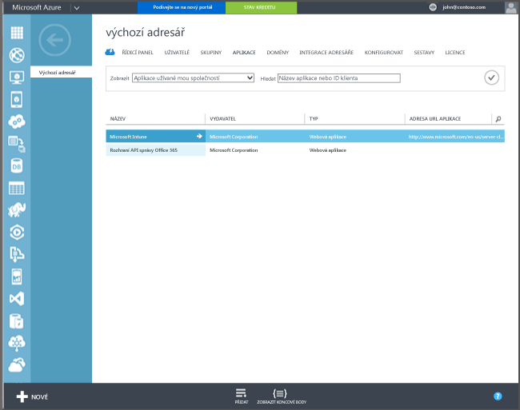

## Registrace Azure Active Directory

Automatický zápis umožňuje registraci i uživatelům počítačů se systémem Windows 10 nebo zařízení Windows 10 Mobile, které patří jiným společnostem nebo soukromníkům. Stačí v Intune zadat pracovní nebo školní účet a souhlasit se správou. Opravdu je to takhle jednoduché. Na pozadí se uživatelovo zařízení zaregistruje a připojí ke službě Azure Active Directory. Po registraci je zařízení spravováno přes Intune.

**Požadavky**
- Předplatné Azure Active Directory Premium ([zkušební předplatné](http://go.microsoft.com/fwlink/?LinkID=816845))
- Odběr služby Microsoft Intune

### Konfigurace automatického zápisu MDM

1. Na [portálu pro správu Azure](https://manage.windowsazure.com) (https://manage.windowsazure.com) přejděte na uzel **Služby Active Directory** a vyberte svůj adresář.

2. Klikněte na kartu **Aplikace**. V seznamu aplikací by se měla zobrazit položka **Microsoft Intune**.

    

3. Kliknutím na šipku u **Microsoft Intune** byste měli vyvolat stránku, která vám umožní nakonfigurovat službu Microsoft Intune.

4. Kliknutím na tlačítko **Konfigurovat** spusťte konfiguraci automatického zápisu MDM s Microsoft Intune.

5. Zadejte adresy URL pro Intune:

  - **Adresa URL registrace do MDM** – Použijte výchozí hodnotu.
  - **Adresa URL pro podmínky použití MDM** – Použijte výchozí hodnotu. Tato adresa URL zobrazí podmínky použití pro uživatele při registraci zařízení.
  - **Adresa URL pro stav souladu s MDM** – Použijte výchozí hodnotu. Pokud zařízení nesplňuje požadavky, zobrazí se u dané adresy URL zpráva **Přístup byl odepřen**. Adresa URL odkazuje na stránku, která uživatelům vysvětlí, proč jejich zařízení není kompatibilní se zásadami a jak této kompatibility znovu dosáhnout.

6.  Zadejte, která uživatelská zařízení by měla být spravována přes službu Microsoft Intune. Tato uživatelská zařízení se systémem Windows 10 budou automaticky zaregistrována pro správu přes službu Microsoft Intune.

  - **Všechny**
  - **Skupiny**
  - **Žádné**

7. Vyberte **Uložit**.

<!--HONumber=Oct16_HO2-->

